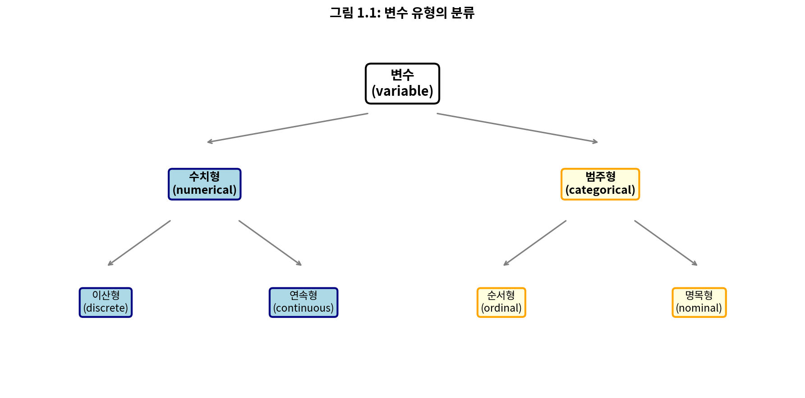
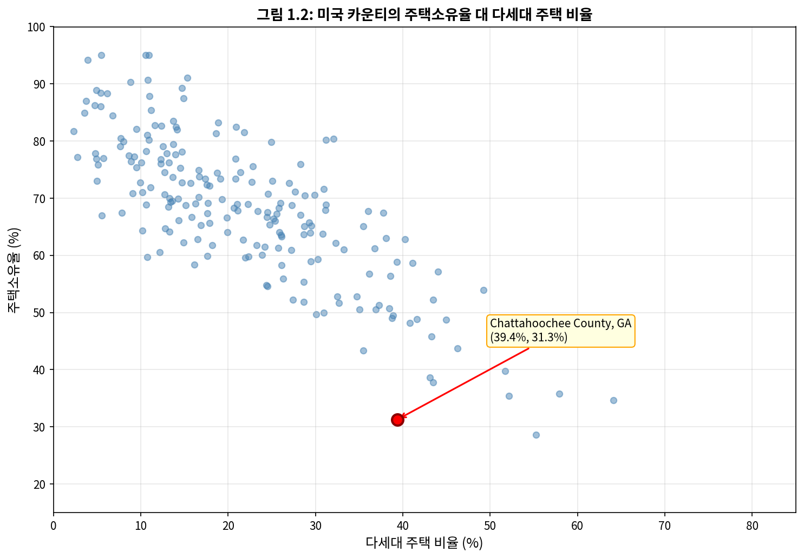
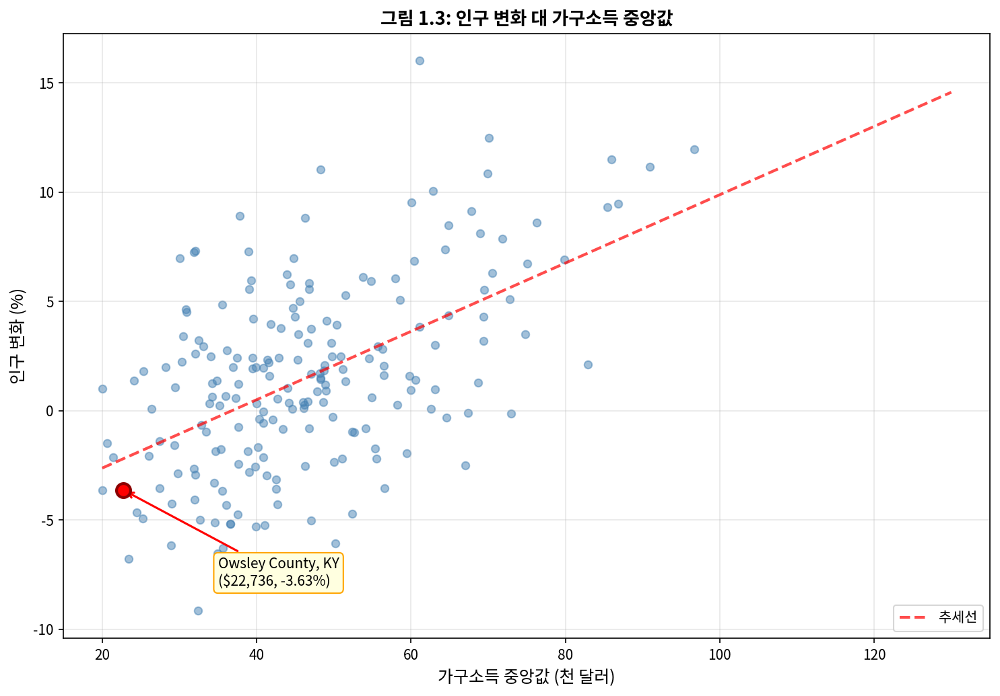

# 제1장 데이터와의 만남

과학자들은 엄밀한 방법론과 세심한 관찰을 통해 질문에 대한 답을 찾고자 한다. 현장 기록, 설문조사, 실험 등에서 수집된 이러한 관찰 결과는 통계적 연구의 근간을 형성하며, 이를 **데이터**(data)라고 부른다. **통계학**(statistics)은 데이터를 가장 효과적으로 수집, 분석하고 결론을 도출하는 방법을 연구하는 학문이다. 이 첫 번째 장에서는 데이터의 속성과 데이터 수집 방법에 초점을 맞춘다.

---

## 1.1 사례 연구: 뇌졸중 예방을 위한 스텐트 사용

이 절에서는 통계학의 고전적인 과제 중 하나인 의료 치료의 효능 평가를 소개한다. 이 절에서 다루는 용어들과 실제로 이 장의 많은 내용은 본문 후반부에서 다시 다룬다. 현재의 목표는 단순히 통계학이 실제로 어떤 역할을 할 수 있는지 감을 잡는 것이다.

뇌졸중 위험이 있는 환자를 치료하는 데 있어 스텐트의 효과를 연구하기 위해 실험이 설계되었다(Chimowitz et al. 2011). **스텐트**(stent)는 심장 질환 후 환자의 회복을 돕고 추가적인 심장 발작이나 사망의 위험을 줄이기 위해 좁아지거나 약해진 동맥 내부에 삽입하는 작은 그물망 튜브이다.

많은 의사들은 뇌졸중 위험이 있는 환자에게도 유사한 효과가 있기를 기대했다. 연구자들이 답하고자 하는 핵심 질문을 먼저 작성해 보자:

> 스텐트 사용이 뇌졸중 위험을 줄이는가?

이 질문을 던진 연구자들은 451명의 위험군 환자를 대상으로 실험을 수행했다. 각 자원 환자는 다음 두 그룹 중 하나에 무작위로 배정되었다:

- **치료군**(Treatment group): 치료군 환자들은 스텐트와 의학적 관리를 받았다. 의학적 관리에는 약물 치료, 위험 요인 관리, 생활 방식 개선 지원이 포함되었다.
- **대조군**(Control group): 대조군 환자들은 치료군과 동일한 의학적 관리를 받았지만, 스텐트를 받지 않았다.

연구자들은 224명의 환자를 치료군에, 227명을 대조군에 무작위로 배정했다. 이 연구에서 대조군은 치료군에서 스텐트의 의학적 영향을 측정할 수 있는 기준점을 제공한다.

연구자들은 두 시점에서 스텐트의 효과를 조사했다: 등록 후 30일과 등록 후 365일. 5명 환자의 결과가 표 1.1에 요약되어 있다. 환자 결과는 해당 기간 동안 환자가 뇌졸중을 겪었는지 여부를 나타내는 `뇌졸중` 또는 `이상 없음`으로 기록되었다.

`stent30` 데이터와 `stent365` 데이터는 **openintro** R 패키지에서 찾을 수 있다.

**표 1.1: 스텐트 연구의 5명 환자 결과**

| 환자 | 그룹 | 30일 | 365일 |
|:---:|:---:|:---:|:---:|
| 1 | 치료군 | 이상 없음 | 이상 없음 |
| 2 | 치료군 | 뇌졸중 | 뇌졸중 |
| 3 | 치료군 | 이상 없음 | 이상 없음 |
| 4 | 치료군 | 이상 없음 | 이상 없음 |
| 5 | 대조군 | 이상 없음 | 이상 없음 |

이러한 *개별* 관측치를 사용하여 **모든** 연구 환자에 대해 스텐트가 뇌졸중 발생에 미치는 영향에 관한 질문에 답하기는 어렵다. 이 질문은 *모든* 관측치에 대한 통계적 데이터 분석을 수행함으로써 더 잘 다룰 수 있다. 표 1.2는 원시 데이터를 더 유용한 방식으로 요약한다. 이 표에서 우리는 전체 연구에서 무슨 일이 일어났는지 빠르게 볼 수 있다.

**표 1.2: 스텐트 연구의 기술통계**

| 그룹 | 30일 뇌졸중 | 30일 이상 없음 | 365일 뇌졸중 | 365일 이상 없음 |
|:---:|:---:|:---:|:---:|:---:|
| 대조군 | 13 | 214 | 28 | 199 |
| 치료군 | 33 | 191 | 45 | 179 |
| 합계 | 46 | 405 | 73 | 378 |

---

### 📝 Guided Practice 1.1

치료군 224명 중 45명이 첫해 말까지 뇌졸중을 겪었다. 이 두 숫자를 사용하여 첫해 말까지 뇌졸중을 겪은 치료군 환자의 비율을 계산하라.

#### 상세 풀이

**문제 분석:**
- 치료군 전체 환자 수: 224명
- 첫해(365일) 말까지 뇌졸중을 겪은 환자 수: 45명

**풀이 과정:**

비율(proportion)은 특정 조건을 만족하는 개체 수를 전체 개체 수로 나눈 값이다.

$$\text{비율} = \frac{\text{뇌졸중을 겪은 환자 수}}{\text{전체 환자 수}} = \frac{45}{224} = 0.2009 \approx 0.20 = 20\%$$

**결론:** 치료군 환자 중 약 20%가 첫해 말까지 뇌졸중을 겪었다.

#### Python 코드

```python
# Guided Practice 1.1: 치료군 환자의 뇌졸중 비율 계산

treatment_total = 224  # 치료군 전체 환자 수
treatment_stroke = 45  # 뇌졸중을 겪은 환자 수

proportion = treatment_stroke / treatment_total

print(f"치료군 전체 환자 수: {treatment_total}명")
print(f"뇌졸중을 겪은 환자 수: {treatment_stroke}명")
print(f"비율 = {treatment_stroke}/{treatment_total} = {proportion:.4f}")
print(f"백분율: {proportion * 100:.2f}%")
```

---

### 🔍 새로운 시각 1.1: 비율과 백분율의 직관적 이해

비율(proportion)은 통계학에서 가장 기본적이면서도 강력한 개념 중 하나이다. 비율을 이해하는 여러 가지 방법이 있다:

**1. 파이 조각으로 생각하기:** 전체 파이(224명)에서 뇌졸중을 겪은 환자(45명)가 차지하는 조각을 상상해 보자. 이 조각은 전체의 약 1/5, 즉 20%를 차지한다.

**2. 100명 기준으로 스케일링하기:** 224명 중 45명을 100명 기준으로 환산하면 약 20명이 뇌졸중을 겪는다는 의미이다.

**3. 실생활 비유:** 이것은 마치 100원짜리 동전 224개가 있을 때, 그 중 45개를 꺼내는 것과 같다. 꺼낸 동전은 전체의 약 20%에 해당한다.

---

우리는 표에서 요약 통계를 계산하여 두 그룹 간 스텐트 치료의 영향이 어떻게 다른지 더 잘 이해할 수 있다. **요약 통계**(summary statistic)는 표본의 데이터를 요약하는 단일 숫자이다. 예를 들어, 1년 후 연구의 주요 결과는 두 가지 요약 통계로 설명될 수 있다:

- 치료군(스텐트)에서 뇌졸중을 겪은 비율: 45/224 = 0.20 = 20%
- 대조군에서 뇌졸중을 겪은 비율: 28/227 = 0.12 = 12%

이 두 요약 통계는 그룹 간 차이를 찾는 데 유용하며, 우리는 놀라운 결과와 마주하게 된다: 치료군에서 추가로 8%의 환자가 뇌졸중을 겪었다! 이것은 두 가지 이유로 중요하다. 첫째, 이것은 스텐트가 뇌졸중 비율을 *줄일* 것이라는 의사들의 기대와 반대된다. 둘째, 이것은 통계적 질문으로 이어진다: 데이터가 그룹 간 "실제" 차이를 보여주는가?

이 두 번째 질문은 미묘하다. 동전을 100번 던진다고 가정하자. 어떤 동전 던지기에서든 앞면이 나올 확률이 50%이지만, 우리는 정확히 50번의 앞면을 관찰하지 못할 것이다. 이러한 유형의 변동은 거의 모든 유형의 데이터 생성 과정의 일부이다. 스텐트 연구에서 8%의 차이가 이러한 자연적 변동 때문일 수 있다. 그러나 관찰된 차이가 클수록(특정 표본 크기에 대해), 그 차이가 우연 때문이라고 믿기 어렵다.

아직 이 질문을 완전히 다룰 통계적 도구는 없지만, 발표된 분석의 결론은 이해할 수 있다: 이 뇌졸중 환자 연구에서 스텐트에 의한 해로움의 강력한 증거가 있었다.

**주의할 점:** 이 연구의 결과를 모든 환자와 모든 스텐트에 일반화하지 마라. 이 연구는 이 연구에 자원하여 참여한 매우 특정한 특성을 가진 환자들을 대상으로 했으며, 이들이 모든 뇌졸중 환자를 대표하지 않을 수 있다. 또한, 스텐트에는 많은 종류가 있으며, 이 연구는 자가 확장 Wingspan 스텐트(Boston Scientific)만을 고려했다. 그러나 이 연구는 우리에게 중요한 교훈을 남긴다: 우리는 놀라운 결과에 대해 눈을 열어두어야 한다.

---

### 🔍 새로운 시각 1.2: 기대와 다른 연구 결과 - 과학적 겸손의 중요성

이 스텐트 연구는 과학적 연구의 중요한 측면을 보여준다: 때때로 연구 결과는 우리의 직관이나 기대와 완전히 반대일 수 있다.

**왜 이런 일이 발생하는가?**

1. **선택 편향**(Selection Bias): 연구에 참여한 환자들은 특별히 심각한 상태였을 수 있다.
2. **시술 위험**(Procedural Risk): 스텐트 삽입 자체가 단기적으로 뇌졸중 위험을 높일 수 있다.
3. **교란 변수**(Confounding Variables): 측정되지 않은 다른 요인들이 결과에 영향을 미쳤을 수 있다.

**과학적 방법의 강점:** 이 연구는 무작위 대조 시험(RCT)이었기 때문에, 결과가 기대와 달랐어도 신뢰할 수 있다. 의사들의 직관보다 증거를 신뢰하는 것이 과학적 방법의 핵심이다.

---

## 1.2 데이터 기초

데이터의 효과적인 표현과 설명은 대부분의 분석에서 첫 번째 단계이다. 이 절에서는 데이터를 조직화하는 하나의 구조와 이 책 전반에 걸쳐 사용될 몇 가지 용어를 소개한다.

### 1.2.1 관측치, 변수, 데이터 행렬

표 1.3은 P2P(개인 간) 대출 회사인 Lending Club을 통해 제공된 50개의 무작위 표본 대출에 대한 데이터셋의 6개 행을 보여준다. 이 데이터셋은 `loan50`으로 지칭된다.

`loan50` 데이터는 **openintro** R 패키지에서 찾을 수 있다.

표의 각 행은 하나의 대출을 나타낸다. 행의 공식적인 이름은 **케이스**(case) 또는 **관측치**(observation) 또는 **관측 단위**(unit of observation)이다. 열은 각 대출의 특성을 나타내며, 각 열은 **변수**(variable)라고 한다.

**표 1.3: loan50 데이터셋의 6개 관측치**

| | loan_amount | interest_rate | term | grade | state | total_income | homeownership |
|:---:|:---:|:---:|:---:|:---:|:---:|:---:|:---:|
| 1 | 22,000 | 10.90 | 60 | B | NJ | 59,000 | rent |
| 2 | 6,000 | 9.92 | 36 | B | CA | 60,000 | rent |
| 3 | 25,000 | 26.30 | 36 | E | SC | 75,000 | mortgage |
| 4 | 6,000 | 9.92 | 36 | B | CA | 75,000 | rent |
| 5 | 25,000 | 9.43 | 60 | B | OH | 254,000 | mortgage |
| 6 | 6,400 | 9.92 | 36 | B | IN | 67,000 | mortgage |

**표 1.4: loan50 데이터셋의 변수 설명**

| 변수 | 설명 |
|:---|:---|
| loan_amount | 받은 대출 금액 (미국 달러) |
| interest_rate | 대출 이자율 (연간 백분율) |
| term | 대출 기간 (항상 정수 개월로 설정) |
| grade | 대출 등급 (A부터 G까지, 대출의 품질과 상환 가능성을 나타냄) |
| state | 대출자가 거주하는 미국 주 |
| total_income | 부수입을 포함한 대출자의 총 소득 (미국 달러) |
| homeownership | 주택 소유 여부 (소유, 담보대출 있는 소유, 또는 임대) |

---

### 📝 Guided Practice 1.2

표 1.3에서 첫 번째 대출의 등급은 무엇인가? 그리고 그 첫 번째 대출에 대한 대출자의 주택 소유 상태는 무엇인가?

#### 상세 풀이

표 1.3의 첫 번째 행(관측치 1)에서:
- **등급(grade):** B
- **주택 소유 상태(homeownership):** rent (임대)

#### Python 코드

```python
import pandas as pd

loan50_sample = pd.DataFrame({
    'loan_amount': [22000, 6000, 25000, 6000, 25000, 6400],
    'interest_rate': [10.90, 9.92, 26.30, 9.92, 9.43, 9.92],
    'term': [60, 36, 36, 36, 60, 36],
    'grade': ['B', 'B', 'E', 'B', 'B', 'B'],
    'state': ['NJ', 'CA', 'SC', 'CA', 'OH', 'IN'],
    'total_income': [59000, 60000, 75000, 75000, 254000, 67000],
    'homeownership': ['rent', 'rent', 'mortgage', 'rent', 'mortgage', 'mortgage']
}, index=[1, 2, 3, 4, 5, 6])

first_loan = loan50_sample.loc[1]
print(f"첫 번째 대출 등급: {first_loan['grade']}")
print(f"주택 소유 상태: {first_loan['homeownership']}")
```

---

표 1.3의 데이터는 **데이터 프레임**(data frame)을 나타내며, 이는 데이터를 조직화하는 편리하고 일반적인 방법이다. 각 행이 고유한 케이스(관측 단위)이고, 각 열이 변수이며, 각 셀이 단일 값인 데이터 프레임을 일반적으로 **정돈 데이터**(tidy data)라고 한다(Wickham 2014).

데이터를 기록할 때, 다른 구조를 사용할 매우 좋은 이유가 없는 한 정돈 데이터 프레임을 사용하라. 이 구조를 사용하면 새로운 케이스를 행으로 추가하거나 새로운 변수를 새 열로 추가할 수 있으며, 시각화, 요약 및 기타 통계 분석이 용이해진다.

---

### 📝 Guided Practice 1.3

과목의 과제, 퀴즈, 시험 성적은 종종 데이터 프레임 형태의 성적표에 기록된다. 데이터 프레임을 사용하여 과목의 성적 데이터를 어떻게 조직화할 수 있는가? 관측 단위와 변수를 설명하라.

#### 상세 풀이

정돈 데이터의 원칙에 따르면:
- 각 **행**은 하나의 **관측치**(케이스)를 나타내야 한다
- 각 **열**은 하나의 **변수**를 나타내야 한다

**설계:**
- **관측 단위(행):** 각 학생
- **변수(열):** 학생 이름, 학번, 각 과제/퀴즈/시험 점수

#### Python 코드

```python
import pandas as pd

gradebook = pd.DataFrame({
    '학생이름': ['김철수', '이영희', '박민수'],
    '학번': ['2024001', '2024002', '2024003'],
    '과제1': [85, 92, 78],
    '퀴즈1': [78, 95, 82],
    '중간고사': [82, 91, 75],
    '기말고사': [88, 94, 80]
})
print(gradebook)
```

---

### 🔍 새로운 시각 1.3: 정돈 데이터(Tidy Data)의 힘

Hadley Wickham이 2014년에 소개한 "정돈 데이터"(tidy data) 개념은 데이터 과학의 근본적인 원칙이 되었다. 정돈 데이터의 세 가지 규칙:

1. **각 변수는 자신만의 열을 가진다**
2. **각 관측치는 자신만의 행을 가진다**
3. **각 값은 자신만의 셀을 가진다**

**왜 정돈 데이터가 중요한가?**
- **일관성:** 데이터가 항상 같은 방식으로 구조화되면, 도구들도 일관되게 작동한다.
- **효율성:** 대부분의 R과 Python 라이브러리는 정돈 데이터를 가정하고 설계되었다.
- **명확성:** 데이터의 구조가 분석 질문과 직접적으로 매핑된다.

---

### 1.2.2 변수의 유형

`county` 데이터셋의 `unemployment_rate`, `pop2017`, `state`, `median_edu` 변수를 살펴보자. 이 변수들 각각은 본질적으로 다른 세 변수와 다르지만, 일부는 특정 특성을 공유한다.

먼저 `unemployment_rate`를 고려하자. 이 변수는 넓은 범위의 수치 값을 가질 수 있고, 그 값들로 더하기, 빼기, 평균 계산을 하는 것이 의미가 있기 때문에 **수치형**(numerical) 변수라고 한다.

`pop2017` 변수도 수치형이지만, `unemployment_rate`와는 약간 다르다. 인구 수 변수는 음이 아닌 정수(0, 1, 2, ...)만 취할 수 있다. 이러한 이유로 인구 변수는 **이산형**(discrete)이라고 한다. 반면에, 실업률 변수는 **연속형**(continuous)이라고 한다.

`state` 변수는 워싱턴 D.C.를 포함하여 최대 51개의 값을 가질 수 있다. 응답 자체가 범주이기 때문에 `state`는 **범주형**(categorical) 변수라고 하며, 가능한 값들(주)은 변수의 **수준**(level)이라고 한다.

마지막으로 `median_edu` 변수를 고려하자. 이 변수는 카운티 거주자의 중위 교육 수준을 설명하며 `below_hs`, `hs_diploma`, `some_college`, 또는 `bachelors` 값을 취한다. 이 변수는 범주형 변수이지만 수준에 자연스러운 순서가 있다. 이러한 속성을 가진 변수를 **순서형**(ordinal) 변수라고 하며, 이러한 특별한 순서가 없는 일반적인 범주형 변수는 **명목형**(nominal) 변수라고 한다.



**그림 1.1:** 변수 유형은 수치형(이산형 또는 연속형)과 범주형(순서형 또는 명목형)으로 나뉜다.

---

### 예제 1.1

통계학 과목 학생들에 대한 데이터가 수집되었다. 각 학생에 대해 세 가지 변수가 기록되었다: 형제자매 수, 학생 키, 그리고 학생이 이전에 통계학 과목을 수강했는지 여부. 각 변수를 연속형 수치, 이산형 수치, 또는 범주형으로 분류하라.

#### 상세 풀이

| 변수 | 유형 | 이유 |
|:---|:---|:---|
| 형제자매 수 | 이산형 수치 | 0, 1, 2, 3... 정수만 가능, 평균 계산 가능 |
| 학생 키 | 연속형 수치 | 실수 값 가능 (165.3cm 등), 평균 계산 가능 |
| 통계학 수강 여부 | 범주형 (명목형) | "예" 또는 "아니오" 두 범주 |

#### Python 코드

```python
import pandas as pd
import numpy as np

np.random.seed(42)
student_data = pd.DataFrame({
    '형제자매수': np.random.randint(0, 5, 10),  # 이산형 수치
    '키_cm': np.round(np.random.normal(170, 10, 10), 1),  # 연속형 수치
    '통계학_수강여부': np.random.choice(['예', '아니오'], 10)  # 범주형
})

print("변수 유형 분석:")
print(f"형제자매수: 이산형 수치 (정수값: {student_data['형제자매수'].unique()})")
print(f"키_cm: 연속형 수치 (범위: {student_data['키_cm'].min()}-{student_data['키_cm'].max()})")
print(f"통계학_수강여부: 범주형 (범주: {student_data['통계학_수강여부'].unique()})")
```

---

### 🔍 새로운 시각 1.4: 변수 유형 파악의 실용적 중요성

변수 유형을 올바르게 파악하는 것은 단순한 분류 이상의 의미를 갖는다. 변수 유형에 따라:

**1. 사용할 수 있는 통계량이 달라진다**
- 수치형: 평균, 중앙값, 분산, 표준편차
- 범주형: 최빈값, 빈도, 비율

**2. 사용할 수 있는 시각화가 달라진다**
- 수치형: 히스토그램, 박스플롯, 산점도
- 범주형: 막대그래프, 파이차트

**3. 사용할 수 있는 통계적 검정이 달라진다**
- 두 수치형 변수: 상관관계, 회귀분석
- 두 범주형 변수: 카이제곱 검정
- 수치형 + 범주형: t-검정, ANOVA

---

### 📝 Guided Practice 1.5

한 실험이 편두통 치료에서 새로운 약물의 효과를 평가하고 있다. `group` 변수는 각 환자의 실험 그룹을 나타낸다: 치료군 또는 대조군. `num_migraines` 변수는 환자가 3개월 동안 경험한 편두통 횟수를 나타낸다. 각 변수를 수치형 또는 범주형으로 분류하라.

#### 상세 풀이

| 변수 | 유형 | 이유 |
|:---|:---|:---|
| group | 범주형 | "치료군" 또는 "대조군" 두 범주 |
| num_migraines | 수치형 (이산형) | 0, 1, 2, 3... 횟수는 정수, 평균 계산 가능 |

---

### 1.2.3 변수 간의 관계

많은 분석은 연구자가 두 개 이상의 변수 간의 관계를 찾고자 하는 것에서 동기를 얻는다. **산점도**(scatterplot)는 두 수치형 변수 간의 관계를 연구하는 데 사용되는 그래프의 한 유형이다.

그림 1.2는 `homeownership`과 `multi_unit`(다세대 구조에 있는 주택 단위의 비율) 변수 간의 관계를 보여준다. 산점도는 두 변수 간의 관계를 암시한다: 다세대 구조에 있는 주택 단위 비율이 높은 카운티는 주택 소유율이 낮은 경향이 있다.



**그림 1.2:** 미국 카운티의 주택소유율 대 다세대 구조에 있는 주택 단위 비율의 산점도. 강조된 점은 다세대 비율 39.4%와 주택소유율 31.3%인 조지아주 Chattahoochee 카운티를 나타낸다.

다세대 주택과 주택소유율은 그래프에서 식별 가능한 패턴을 보여주기 때문에 **연관**(associated)되어 있다고 한다. 두 변수가 서로 어떤 연결을 보일 때, 이들을 **연관된 변수**(associated variables)라고 한다.

---

### 예제 1.2

이 예제는 2010년에서 2017년까지의 인구 변화 백분율과 카운티의 가구소득 중앙값 간의 관계를 검토하며, 이는 그림 1.3의 산점도로 시각화되어 있다. 이 변수들은 연관되어 있는가?

#### 상세 풀이

그림 1.3을 살펴보면:
1. 점들이 왼쪽 아래에서 오른쪽 위로 향하는 패턴을 보인다
2. 가구소득 중앙값이 높은 카운티일수록 인구 성장률이 높은 경향이 있다
3. 이것은 **양의 연관**(positive association)을 나타낸다

**결론:** 카운티의 가구소득 중앙값이 높을수록 더 높은 인구 성장이 관찰된다. 변수들 사이에 관계가 있으므로 연관되어 있다.



**그림 1.3:** 인구 변화 대 가구소득 중앙값을 보여주는 산점도. 켄터키주 Owsley 카운티가 강조되어 있으며, 2010년에서 2017년까지 인구의 3.63%를 잃었고 가구소득 중앙값은 $22,736이다.

---

그림 1.2에서 하향 추세가 있기 때문에 이 변수들은 **음의 연관**(negatively associated)이 있다고 한다. **양의 연관**(positive association)은 그림 1.3의 관계에서 나타나며, 가구소득 중앙값이 높은 카운티는 인구 성장률이 높은 경향이 있다.

두 변수가 연관되어 있지 않으면 **독립적**(independent)이라고 한다.

**연관 또는 독립, 둘 중 하나:** 한 쌍의 변수는 어떤 방식으로든 관련이 있거나(연관) 그렇지 않다(독립). 어떤 변수 쌍도 연관이면서 동시에 독립일 수는 없다.

---

### 🔍 새로운 시각 1.5: 상관관계의 강도와 방향

두 변수 간의 관계를 이해할 때, 세 가지 핵심 측면을 고려해야 한다:

**1. 방향(Direction)**
- **양의 연관:** 한 변수가 증가하면 다른 변수도 증가 (↗)
- **음의 연관:** 한 변수가 증가하면 다른 변수는 감소 (↘)

**2. 강도(Strength)**
- **강한 연관:** 점들이 명확한 패턴을 따라 밀집
- **약한 연관:** 점들이 넓게 흩어져 있지만 전체적인 추세 존재

**3. 형태(Form)**
- **선형:** 직선 패턴
- **비선형:** 곡선 패턴

**주의:** 산점도에서 보이는 연관관계가 반드시 **인과관계**(causation)를 의미하지는 않는다!

---

### 1.2.4 설명 변수와 반응 변수

두 변수 간의 관계에 대한 질문을 할 때, 우리는 때때로 한 변수의 변화가 다른 변수의 변화를 야기하는지도 결정하고자 한다.

> 카운티의 가구소득 중앙값이 증가하면, 이것이 인구 증가를 유발하는가?

이 질문에서 *가구소득 중앙값*은 **설명 변수**(explanatory variable)이고, *인구 변화*는 **반응 변수**(response variable)이다.

**설명 변수와 반응 변수:** 한 변수가 다른 변수에 인과적으로 영향을 미칠 수 있다고 의심할 때, 첫 번째 변수를 설명 변수로, 두 번째를 반응 변수로 명명한다.

$$\text{설명 변수} \rightarrow \text{영향을 미칠 수 있음} \rightarrow \text{반응 변수}$$

이러한 방식으로 변수에 레이블을 붙이는 행위가 인과 관계의 존재를 보장하지 않는다는 점을 명심하라. 한 변수가 다른 변수의 변화를 야기하는지 여부를 확인하기 위한 공식적인 평가에는 실험이 필요하다.

---

### 🔍 새로운 시각 1.6: 인과관계와 상관관계의 구별

**"상관관계는 인과관계를 의미하지 않는다"**(Correlation does not imply causation)는 통계학에서 가장 중요한 원칙 중 하나이다.

**왜 이것이 중요한가?**

1. **교란 변수의 존재:** 교육 수준과 소득이 상관관계를 보이지만, 사회경제적 배경이 둘 다에 영향을 미칠 수 있다.

2. **역인과관계 가능성:** 운동하는 사람들이 더 건강하지만, 건강한 사람들이 더 운동할 가능성도 있다.

3. **우연의 일치:** 충분히 많은 변수를 검토하면 우연히 상관관계를 보이는 쌍이 나타날 수 있다.

---

### 1.2.5 관찰 연구와 실험

데이터 수집에는 두 가지 주요 유형이 있다: 실험과 관찰 연구.

연구자들이 특정 특성, 치료 또는 조건의 효과를 평가하고자 할 때, **실험**(experiment)을 수행한다. 개인이 그룹에 무작위로 할당될 때, 실험을 **무작위 실험**(randomized experiment)이라고 한다. 무작위 할당은 연구 참가자를 모든 측면에서 대략 동등한 그룹으로 조직하여 결과에 영향을 미칠 수 있는 모든 교란 변수를 통제할 수 있게 한다.

연구자들이 데이터가 발생하는 방식에 직접 개입하지 않는 방식으로 데이터를 수집할 때 **관찰 연구**(observational study)를 수행한다. 일반적으로, 관찰 연구는 변수들 사이의 자연적으로 발생하는 연관에 대한 증거를 제공할 수 있지만, 그 자체로 인과적 연결을 보여줄 수 없다.

**연관 ≠ 인과관계:** 일반적으로, 연관은 인과관계를 의미하지 않는다. 무작위 실험의 장점은 그러한 연구로 인과 관계를 확립하기가 더 쉽다는 것이다.

---

### 🔍 새로운 시각 1.7: 관찰 연구 vs 실험 - 실제 적용

| 특성 | 관찰 연구 | 실험 |
|:---|:---|:---|
| 연구자 개입 | 없음 | 처치 할당 |
| 인과관계 확립 | 제한적 | 가능 |
| 윤리적 제약 | 적음 | 많을 수 있음 |
| 비용 | 상대적으로 낮음 | 높음 |

**왜 항상 실험을 하지 않는가?**
- **윤리적 제약:** 흡연과 폐암 연구를 위해 사람들에게 흡연을 강제할 수 없다.
- **실행 불가능:** 지진의 경제적 영향을 연구하기 위해 지진을 유발할 수 없다.
- **비용:** 대규모 장기 실험은 매우 비싸다.

---

## 1.3 장 복습

### 1.3.1 요약

이 장에서는 데이터의 세계를 소개했다. 데이터는 다양한 방식으로 조직화될 수 있지만, 각 행이 관측치를 나타내고 각 열이 변수를 나타내는 정돈 데이터가 통계 분석에 가장 적합하다. 다음 장에서는 원하는 추론 범위로 결론을 내리기 위해 필요한 데이터를 수집하기 위해 연구를 어떻게 설계할 수 있는지 배울 것이다.

### 1.3.2 용어

**표 1.7: 이 장에서 소개된 용어**

| 영문 | 한국어 | 영문 | 한국어 |
|:---|:---|:---|:---|
| associated | 연관된 | experiment | 실험 |
| case | 케이스 | explanatory variable | 설명 변수 |
| categorical | 범주형 | independent | 독립적 |
| cohort | 코호트 | level | 수준 |
| continuous | 연속형 | negative association | 음의 연관 |
| data | 데이터 | nominal | 명목형 |
| data frame | 데이터 프레임 | numerical | 수치형 |
| discrete | 이산형 | observation | 관측치 |
| ordinal | 순서형 | observational study | 관찰 연구 |
| placebo | 위약 | positive association | 양의 연관 |
| randomized experiment | 무작위 실험 | response variable | 반응 변수 |
| summary statistic | 요약 통계 | tidy data | 정돈 데이터 |
| unit of observation | 관측 단위 | variable | 변수 |

---

## 1.4 연습문제

홀수 번호 연습문제의 답은 부록 A.1에서 찾을 수 있다.

### 연습문제 1. 마블 시네마틱 유니버스 영화

아래 데이터 프레임은 인피니티 사가를 통한 마블 시네마틱 유니버스 영화에 대한 정보를 담고 있다. 이 데이터 프레임에는 몇 개의 관측치와 변수가 있는가?

#### 상세 풀이

- **관측치(행) 수:** 23개 (23편의 영화)
- **변수(열) 수:** 7개 (제목, 시간(시), 시간(분), 개봉일, 미국 오프닝, 미국 총액, 세계 총액)

```python
print("관측치: 23개 (각 영화가 하나의 관측치)")
print("변수: 7개")
```

---

### 연습문제 3. 대기 오염과 출산 결과, 연구 구성요소

연구자들은 남부 캘리포니아에서 대기 오염 물질과 조기 출산 사이의 관계를 조사하기 위해 데이터를 수집했다. 1989년과 1993년 사이에 143,196명의 출산에 대해 데이터가 수집되었다.

(a) 연구의 주요 연구 질문을 식별하라.
(b) 이 연구의 대상은 누구이며, 몇 명이 포함되었는가?
(c) 연구의 변수는 무엇인가?

#### 상세 풀이

**(a) 주요 연구 질문:**
대기 오염 물질(CO, NO₂, O₃, PM₁₀)에 대한 노출이 조기 출산의 발생과 관련이 있는가?

**(b) 연구 대상:**
- 대상: 1989-1993년 남부 캘리포니아 출생아
- 포함 인원: 143,196명

**(c) 연구 변수:**

| 변수 | 유형 |
|:---|:---|
| CO (일산화탄소) | 수치형, 연속형 |
| NO₂ (이산화질소) | 수치형, 연속형 |
| O₃ (오존) | 수치형, 연속형 |
| PM₁₀ (조대 미세먼지) | 수치형, 연속형 |
| 임신 기간 | 수치형, 연속형 |
| 조기 출산 여부 | 범주형, 명목형 |

---

### 연습문제 5. 게임화와 통계학, 연구 구성요소

통계학 학습에 대한 게임화의 효과를 조사하는 연구에서 365명의 대학생(공학 279명, 경영학 86명)을 네 그룹으로 나누었다.

(a) 연구의 주요 연구 질문을 식별하라.
(b) 이 연구의 대상은 누구이며, 몇 명이 포함되었는가?
(c) 연구의 변수는 무엇인가?

#### 상세 풀이

**(a) 주요 연구 질문:**
게임화가 통계학 학습에 긍정적인 효과가 있는가? 그 효과가 학생의 특성에 따라 다른가?

**(b) 연구 대상:**
- 대상: 통계학 수업을 듣는 대학생
- 포함 인원: 365명

**(c) 연구 변수:**

| 변수 | 유형 |
|:---|:---|
| 그룹(처치) | 범주형, 명목형 |
| 시험 점수 | 수치형, 이산형 |
| 성별 | 범주형, 명목형 |
| 학년 | 범주형, 순서형 |
| 전공 | 범주형, 명목형 |
| 영어 숙련도 | 범주형, 순서형 |
| 컴퓨터/게임 사용 | 범주형, 순서형 |

---

### 연습문제 7. 편두통과 침술

편두통 진단을 받은 89명의 여성 참가자를 대상으로 침술 연구가 수행되었다.

| 그룹 | 통증 있음 | 통증 없음 |
|:---:|:---:|:---:|
| 대조군 | 44 | 2 |
| 치료군 | 33 | 10 |

(a) 치료군에서 통증이 없었던 비율은?
(b) 대조군에서 통증이 없었던 비율은?
(c) 어느 그룹에서 더 높은 비율이 통증이 없었는가?
(d) 다른 가능한 설명은?
(e) 설명 변수와 반응 변수는?

#### 상세 풀이

**(a) 치료군:** 10/(33+10) = 10/43 = **23.3%**

**(b) 대조군:** 2/(44+2) = 2/46 = **4.3%**

**(c)** 치료군(23.3%)이 대조군(4.3%)보다 높음

**(d) 대안적 설명:**
- 우연에 의한 변동 (표본 크기가 작음)
- 위약 효과의 차이
- 표본의 특이성

**(e) 변수 역할:**
- 설명 변수: 그룹 (치료군/대조군)
- 반응 변수: 24시간 후 통증 여부

```python
treatment_pain_free = 10 / 43
control_pain_free = 2 / 46
print(f"치료군 통증 없음 비율: {treatment_pain_free*100:.1f}%")
print(f"대조군 통증 없음 비율: {control_pain_free*100:.1f}%")
print(f"차이: {(treatment_pain_free - control_pain_free)*100:.1f}%p")
```

---

### 연습문제 9. 어린이집 벌금, 연구 구성요소

10개의 어린이집에서 늦은 픽업에 대한 벌금 효과를 연구했다. 6개는 벌금 도입, 4개는 대조군.

(a) 이것은 관찰 연구인가 실험인가?
(b) 케이스는 무엇이며, 몇 개가 포함되었는가?
(c) 반응 변수는 무엇이며, 어떤 유형인가?
(d) 설명 변수는 무엇이며, 어떤 유형인가?

#### 상세 풀이

**(a) 실험**
- 연구자들이 어린이집을 무작위로 배정
- 처치(벌금)를 의도적으로 도입

**(b) 케이스:**
- 각 어린이집-주 조합
- 10개 어린이집 × 20주 = **200개**

**(c) 반응 변수:**
- late_pickups (늦은 픽업 수)
- 수치형, 이산형

**(d) 설명 변수:**
- group: 범주형, 명목형
- study_period: 범주형, 순서형
- week: 수치형, 이산형

---

### 연습문제 11. 팔머 펭귄

344마리의 펭귄에 대한 데이터가 수집되었다.

(a) 케이스 수?
(b) 수치형 변수?
(c) 범주형 변수?

#### 상세 풀이

**(a)** 344개

**(b) 수치형 변수 (4개):**
- bill_length (부리 길이): 연속형
- bill_depth (부리 깊이): 연속형
- flipper_length (지느러미 길이): 연속형
- body_mass (체중): 연속형

**(c) 범주형 변수 (3개):**
- species (종): Adelie, Chinstrap, Gentoo
- island (섬): Torgersen, Biscoe, Dream
- sex (성별): female, male

---

### 연습문제 13. 미국 공항

지도에 공항 위치를 표시한 시각화.

(a) 필요한 변수?
(b) 변수 유형?

#### 상세 풀이

**(a) 필요한 변수:**
- latitude (위도)
- longitude (경도)

**(b) 변수 유형:**
- latitude: 수치형, 연속형
- longitude: 수치형, 연속형

---

### 연습문제 15. 영국 아기 이름

"Fiona" 이름의 연도별 출생 수 시각화.

(a) 필요한 변수?
(b) 변수 유형?

#### 상세 풀이

**(a) 필요한 변수:**
- year (연도)
- count (출생 수)
- name (이름)
- sex (성별)

**(b) 변수 유형:**
- year: 수치형, 이산형
- count: 수치형, 이산형
- name: 범주형, 명목형
- sex: 범주형, 명목형

---

### 연습문제 17. 스탠퍼드 공개 단속

교통 정지 데이터 요약 표.

(a) 수집된 변수?
(b) 변수 유형?
(c) 검색률 분석에서 설명/반응 변수?

#### 상세 풀이

**(a) 수집된 변수:**
county, state, race/ethnicity, arrested, searched

**(b) 변수 유형:**
- county: 범주형, 명목형
- state: 범주형, 명목형
- race/ethnicity: 범주형, 명목형
- arrested: 범주형, 명목형
- searched: 범주형, 명목형

**(c) 변수 역할:**
- 반응 변수: 검색률 (search_rate)
- 설명 변수: 인종/민족 (race/ethnicity)

---

### 연습문제 19. 반려동물 이름

개와 고양이 이름 인기도 비교 시각화.

(a) 실험인가 관찰 연구인가?
(b) 가장 일반적인 이름?
(c) 고양이에게 더 인기 있는 이름?
(d) 관계의 방향과 의미?

#### 상세 풀이

**(a)** 관찰 연구 (기존 등록 데이터 수집)

**(b)** 개: Lucy 또는 Charlie, 고양이: Luna 또는 Oliver (그래프 기반)

**(c)** 대각선 위의 이름들 (Luna, Oliver 등)

**(d)** 양의 관계 - 개에게 인기 있는 이름은 고양이에게도 인기 있는 경향. 반려동물 이름에 대한 일반적인 인기 트렌드가 존재함.

---

## 참고문헌

- Chimowitz, M. I., et al. (2011). "Stenting Versus Aggressive Medical Therapy for Intracranial Arterial Stenosis." *New England Journal of Medicine* 365(11): 993-1003.
- Wickham, H. (2014). "Tidy Data." *Journal of Statistical Software* 59(10).
