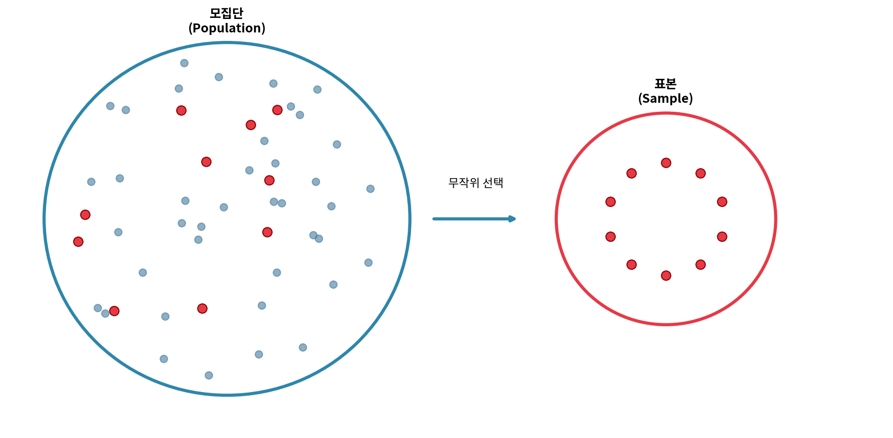
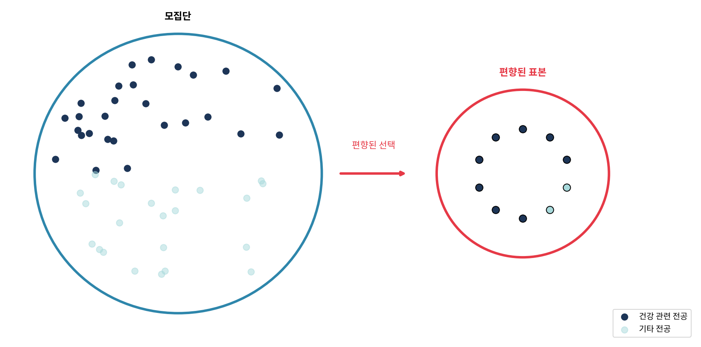
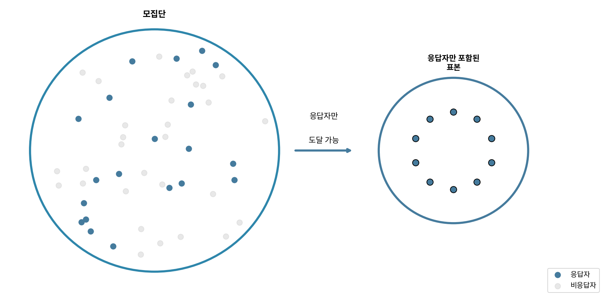
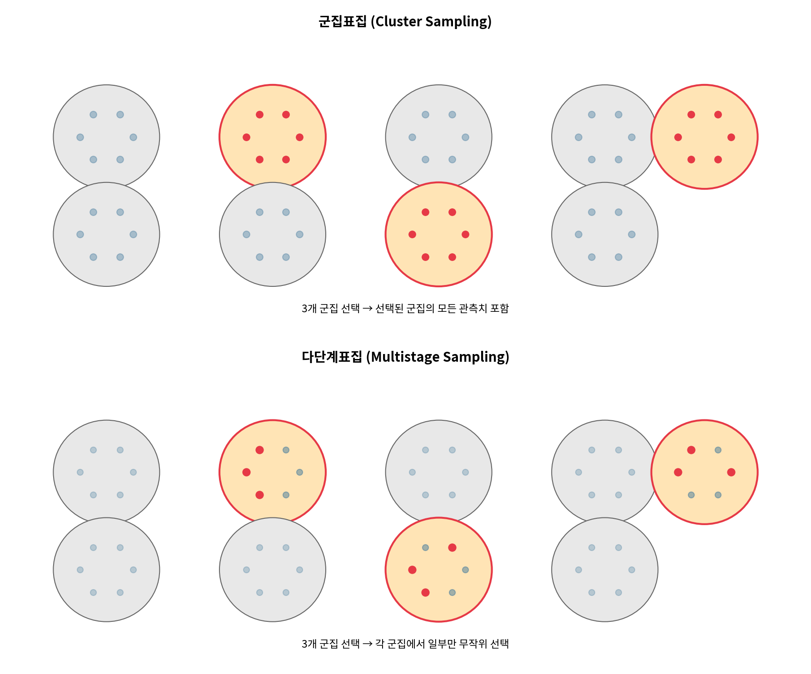
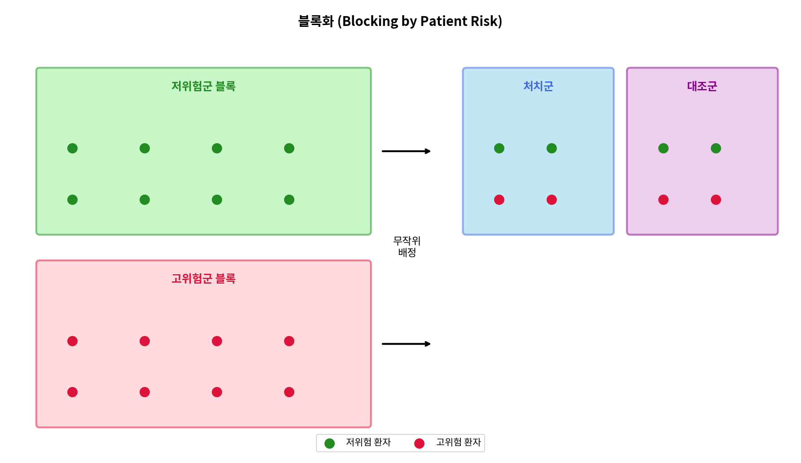
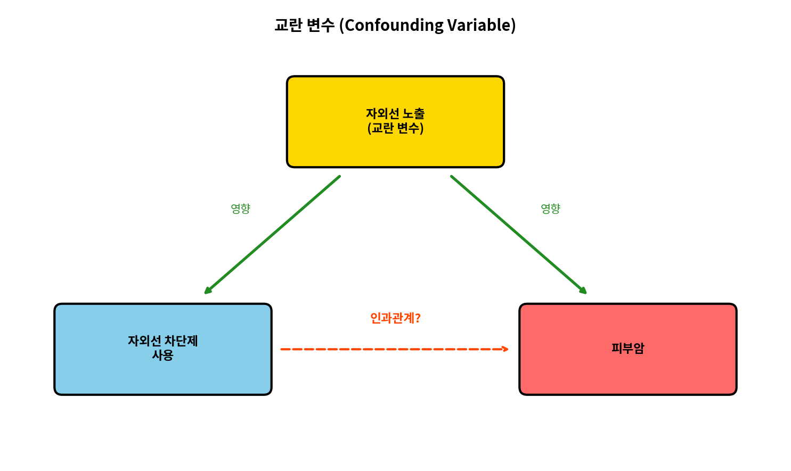
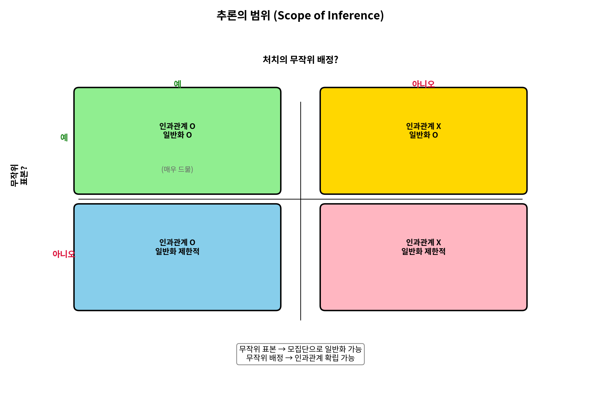

# 제2장 연구 설계

데이터를 다루는 세부 사항으로 들어가기 전에, 데이터가 어떻게 생성되는지에 대해 먼저 생각해 보자. 즉, 데이터가 광범위하고 완전한 결론을 도출하는 데 사용된다면, 데이터가 누구를 또는 무엇을 대표하는지 이해하는 것이 중요하다. 데이터 출처의 한 가지 중요한 측면은 **표집**(sampling)이다. 관측 단위가 더 큰 집단에서 어떻게 선택되었는지 알면 데이터가 무작위로 선택된 모집단으로 다시 일반화할 수 있다. 또한, 연구의 구조를 이해함으로써 인과 관계를 단순한 연관 관계와 구분할 수 있다. 데이터를 다루기 전에 스스로에게 물어야 할 좋은 질문은 "이 관측치들은 어떻게 수집되었는가?"이다. 데이터의 출처를 이해하면 데이터에 대해 많은 것을 배울 수 있다.

---

## 2.1 표집 원리와 전략

연구를 수행하는 첫 번째 단계는 조사할 주제나 질문을 식별하는 것이다. 명확하게 정리된 연구 질문은 어떤 대상이나 사례를 연구해야 하고 어떤 변수가 중요한지 식별하는 데 도움이 된다. 또한 데이터가 신뢰할 수 있고 연구 목표를 달성하는 데 도움이 되도록 데이터가 *어떻게* 수집되는지 고려하는 것이 중요하다.

### 2.1.1 모집단과 표본

다음 세 가지 연구 질문을 고려하자:

1. 대서양의 황새치에 함유된 평균 수은 농도는 얼마인가?
2. 지난 5년간 듀크대학교 학부생의 평균 졸업 소요 시간은 얼마인가?
3. 새로운 약물이 중증 심장 질환 환자의 사망 수를 줄이는가?

각 연구 질문은 목표 **모집단**(population)을 언급한다. 첫 번째 질문에서 목표 모집단은 대서양의 모든 황새치이며, 각 물고기가 하나의 케이스를 나타낸다. 모집단의 모든 케이스에 대해 데이터를 수집하는 것이 실현 가능하지 않은 경우가 많다. 전체 모집단에 대해 데이터를 수집하는 것을 **전수조사**(census)라고 한다. 전수조사가 어려운 이유는 전체 모집단에 대해 데이터를 수집하는 비용이 너무 비쌀 수 있기 때문이지만, 관심 있는 전체 모집단을 식별하는 것이 어렵거나 불가능할 수도 있기 때문이다! 대신 표본이 추출된다. **표본**(sample)은 우리가 가지고 있는 데이터이다. 이상적으로 표본은 모집단의 작은 부분이다. 예를 들어, 모집단에서 60마리의 황새치(또는 다른 수)가 선택될 수 있으며, 이 표본 데이터는 모집단 평균의 추정값을 제공하고 연구 질문에 답하는 데 사용될 수 있다.

---

### 📝 Guided Practice 2.1

위의 두 번째와 세 번째 질문에 대해 목표 모집단과 개별 케이스가 무엇인지 식별하라.

#### 상세 풀이

**두 번째 질문: "지난 5년간 듀크대학교 학부생의 평균 졸업 소요 시간은 얼마인가?"**

이 질문은 학위를 완료한 학생들에게만 해당된다는 점에 주의해야 한다. 졸업하지 않은 학생에 대해서는 졸업 소요 시간의 평균을 계산할 수 없다. 따라서:

- **목표 모집단:** 지난 5년간 듀크대학교에서 졸업한 모든 학부생
- **개별 케이스:** 각 졸업생 한 명 한 명

**세 번째 질문: "새로운 약물이 중증 심장 질환 환자의 사망 수를 줄이는가?"**

- **목표 모집단:** 중증 심장 질환을 가진 모든 사람 (현재와 미래 포함)
- **개별 케이스:** 중증 심장 질환을 가진 각 개인

#### Python 코드

```python
# Guided Practice 2.1: 모집단과 케이스 식별
# 연구 질문을 분석하여 모집단과 케이스를 체계적으로 정리

import pandas as pd

print("=" * 70)
print("Guided Practice 2.1: 모집단과 케이스 식별")
print("=" * 70)

# 연구 질문 데이터
questions = [
    {
        "번호": 1,
        "질문": "대서양의 황새치에 함유된 평균 수은 농도는?",
        "모집단": "대서양의 모든 황새치",
        "케이스": "각 황새치 (물고기 한 마리)",
        "비고": "원본 예시"
    },
    {
        "번호": 2,
        "질문": "지난 5년간 듀크대학교 학부생의 평균 졸업 소요 시간은?",
        "모집단": "지난 5년간 듀크대학교를 졸업한 모든 학부생",
        "케이스": "각 졸업생",
        "비고": "졸업하지 않은 학생은 제외됨"
    },
    {
        "번호": 3,
        "질문": "새로운 약물이 중증 심장 질환 환자의 사망을 줄이는가?",
        "모집단": "중증 심장 질환을 가진 모든 사람",
        "케이스": "중증 심장 질환을 가진 각 개인",
        "비고": "현재와 미래 환자 모두 포함"
    }
]

# 결과 출력
for q in questions:
    print(f"\n질문 {q['번호']}: {q['질문']}")
    print("-" * 60)
    print(f"  목표 모집단: {q['모집단']}")
    print(f"  개별 케이스: {q['케이스']}")
    if q['비고']:
        print(f"  참고사항: {q['비고']}")

# DataFrame으로 요약
print("\n" + "=" * 70)
print("요약 테이블")
print("=" * 70)
df = pd.DataFrame(questions)
print(df[['번호', '모집단', '케이스']].to_string(index=False))
print("=" * 70)
```

---

### 🔍 새로운 시각 2.1: 모집단과 표본의 관계

**왜 표본을 사용하는가?**

통계학에서 가장 근본적인 질문 중 하나는 "왜 전체를 조사하지 않고 일부만 조사하는가?"이다. 이에 대한 답은 실용적이면서도 깊은 통찰을 제공한다.

| 이유 | 설명 | 예시 |
|:---|:---|:---|
| **비용** | 모든 케이스를 조사하는 것은 경제적으로 불가능할 수 있다 | 미국 모든 가구의 소득을 직접 조사하는 것은 수십억 달러가 소요될 수 있다 |
| **시간** | 전수조사는 너무 오래 걸릴 수 있다 | 모든 대학 졸업생을 인터뷰하는 데 수년이 걸릴 수 있다 |
| **파괴적 검사** | 일부 측정은 대상을 파괴한다 | 황새치의 수은 농도를 측정하려면 물고기를 희생해야 한다 |
| **접근 불가능** | 일부 모집단은 정의상 접근이 불가능하다 | 미래의 모든 심장 질환 환자를 지금 연구할 수 없다 |
| **무한 모집단** | 일부 모집단은 이론적으로 무한하다 | 동전을 무한히 던질 수 있다 |

**핵심 통찰:** 좋은 표본은 작지만 모집단의 특성을 정확하게 반영할 수 있다. 이것이 통계학의 힘이다!

---

### 2.1.2 모수와 통계량

대부분의 통계 분석 절차에서 연구 질문은 수치적 요약을 이해하는 것으로 귀결된다. 그 숫자(또는 숫자들의 집합)는 당신이 이미 익숙한 양(평균과 같은)일 수도 있고, 이 책을 통해 배우게 될 것(7.2절에서 제공되는 최소제곱 모델의 기울기와 절편과 같은)일 수도 있다.

수치적 요약은 관측치의 표본이나 전체 모집단에서 계산될 수 있다. 그러나 모집단의 모든 단위를 측정하는 것은 일반적으로 불가능하다. 따라서 "전형적인" 수치적 요약은 표본에서 계산된다. 그럼에도 불구하고, 우리는 아르헨티나의 모든 성인의 평균 소득을 계산하는 것을 개념화할 수 있다.

데이터의 표본에서 숫자가 계산될 때(**표본 통계량**, sample statistic)와 전체 모집단에서 계산되거나 계산이 고려될 때(**모수**, population parameter)를 구별하기 위해 특정 용어를 사용한다. 통계량과 모수라는 용어는 주장과 모델을 전달하는 데 유용하며, 모집단에 대한 추론을 다루는 후반 장에서 광범위하게 사용될 것이다.

---

### 🔍 새로운 시각 2.2: 모수와 통계량 - 그리스 문자 vs 라틴 문자

통계학에서는 모수와 통계량을 구별하기 위해 다른 기호를 사용한다. 이 관례를 이해하면 나중에 추론 통계를 배울 때 큰 도움이 된다.

| 개념 | 모수 (Parameter) | 통계량 (Statistic) |
|:---|:---:|:---:|
| **정의** | 모집단 전체의 특성 | 표본에서 계산된 값 |
| **알 수 있는가?** | 보통 알 수 없음 (추정해야 함) | 데이터로부터 계산 가능 |
| **기호 체계** | 그리스 문자 | 라틴 문자 |
| **평균** | $\mu$ (뮤, mu) | $\bar{x}$ (x바, x-bar) |
| **표준편차** | $\sigma$ (시그마, sigma) | $s$ |
| **비율** | $p$ 또는 $\pi$ | $\hat{p}$ (p햇, p-hat) |
| **상관계수** | $\rho$ (로, rho) | $r$ |

**기억하는 팁:** 
- **P**arameter는 **P**opulation과 함께 간다
- **S**tatistic은 **S**ample과 함께 간다

```python
# 모수와 통계량의 관계 시뮬레이션
import numpy as np

# 모집단 생성 (실제로는 알 수 없지만, 시뮬레이션에서는 알 수 있음)
np.random.seed(42)
population = np.random.normal(loc=100, scale=15, size=100000)  # μ=100, σ=15

# 모수 (실제 값)
mu = population.mean()  # 모집단 평균
sigma = population.std()  # 모집단 표준편차

print(f"모수 (실제로는 알 수 없음):")
print(f"  μ (모집단 평균) = {mu:.2f}")
print(f"  σ (모집단 표준편차) = {sigma:.2f}")

# 표본 추출 및 통계량 계산
sample = np.random.choice(population, size=100, replace=False)
x_bar = sample.mean()  # 표본 평균
s = sample.std(ddof=1)  # 표본 표준편차 (불편 추정량)

print(f"\n통계량 (표본에서 계산):")
print(f"  x̄ (표본 평균) = {x_bar:.2f}")
print(f"  s (표본 표준편차) = {s:.2f}")

print(f"\n추정 오차:")
print(f"  평균 추정 오차: {abs(x_bar - mu):.2f}")
print(f"  표준편차 추정 오차: {abs(s - sigma):.2f}")
```

---

### 2.1.3 일화적 증거

세 가지 연구 질문에 대한 다음과 같은 가능한 응답을 고려하자:

1. 뉴스에 나온 한 남자가 황새치를 먹고 수은 중독에 걸렸으므로, 황새치의 평균 수은 농도는 위험하게 높을 것이다.
2. 듀크대학교를 졸업하는 데 7년 이상 걸린 두 학생을 만났으므로, 듀크에서 졸업하는 데는 다른 많은 대학보다 더 오래 걸릴 것이다.
3. 내 친구의 아버지가 새로운 심장병 약을 먹은 후 심장마비로 돌아가셨으므로, 그 약은 효과가 없을 것이다.

각 결론은 데이터에 기반한다. 그러나 두 가지 문제가 있다. 첫째, 데이터는 한두 개의 케이스만 대표한다. 둘째, 그리고 더 중요하게, 이 케이스들이 실제로 모집단을 대표하는지 불분명하다. 이렇게 즉흥적으로 수집된 데이터를 **일화적 증거**(anecdotal evidence)라고 한다.

**일화적 증거.**

즉흥적으로 수집된 데이터에 주의하라. 그러한 증거는 진실이고 검증 가능할 수 있지만, 예외적인 케이스만 대표할 수 있으므로 모집단의 좋은 대표가 아닐 수 있다.

일화적 증거는 일반적으로 그들의 놀라운 특성에 기반하여 기억하는 비정상적인 케이스로 구성된다. 예를 들어, 우리는 4년 만에 졸업한 여섯 명보다 7년 걸려 졸업한 두 사람을 더 기억할 가능성이 높다. 가장 비정상적인 케이스를 보는 대신, 모집단을 더 잘 대표하는 많은 케이스의 표본을 검토해야 한다.

---

### 🔍 새로운 시각 2.3: 일화적 증거의 위험성 - 인지 편향과의 연결

**왜 우리는 일화에 끌리는가?**

인간의 뇌는 추상적인 통계보다 구체적인 이야기에 더 잘 반응하도록 진화했다. 이것은 여러 인지 편향과 연결된다:

| 인지 편향 | 설명 | 일화적 증거와의 연결 |
|:---|:---|:---|
| **생생함 효과** | 생생하고 감정적인 정보가 더 잘 기억된다 | 개인적 이야기 > 건조한 통계 |
| **가용성 휴리스틱** | 쉽게 떠오르는 예시가 더 흔하다고 착각 | 극적인 사례가 더 쉽게 떠오름 |
| **확증 편향** | 기존 믿음을 확인하는 정보를 선호 | 믿고 싶은 이야기를 더 잘 기억 |
| **대표성 휴리스틱** | 작은 표본이 전체를 대표한다고 착각 | 한두 사례로 전체를 판단 |

**실제 사례:**

- **복권:** "내 친구가 복권에 당첨됐어!" → 복권이 좋은 투자라고 생각 (수백만 명의 낙첨자는 무시)
- **백신:** "백신 맞고 아픈 사람 봤어!" → 백신이 위험하다고 생각 (수백만 명의 안전한 접종은 무시)
- **비행기:** "비행기 사고 뉴스 봤어!" → 비행기가 위험하다고 생각 (자동차가 훨씬 더 위험함에도)

```python
# 일화적 증거 vs 체계적 데이터의 차이 시뮬레이션
import numpy as np

np.random.seed(42)

# 실제 졸업 시간 분포 (대부분 4년, 일부 더 오래)
graduation_times = np.concatenate([
    np.random.normal(4, 0.3, 900),   # 90%는 약 4년
    np.random.normal(5.5, 0.5, 80),  # 8%는 약 5.5년
    np.random.normal(7.5, 0.5, 20)   # 2%는 약 7.5년
])

print("=" * 60)
print("졸업 시간 분석: 일화 vs 체계적 데이터")
print("=" * 60)

# 체계적 데이터 분석
print(f"\n전체 데이터 분석 (n={len(graduation_times)}):")
print(f"  평균 졸업 시간: {graduation_times.mean():.2f}년")
print(f"  중앙값: {np.median(graduation_times):.2f}년")
print(f"  4년 이내 졸업 비율: {(graduation_times <= 4.5).mean()*100:.1f}%")
print(f"  7년 이상 걸린 비율: {(graduation_times >= 7).mean()*100:.1f}%")

# 일화적 증거 (기억에 남는 극단적 사례)
extreme_cases = graduation_times[graduation_times >= 7]
print(f"\n일화적 증거 (7년 이상 걸린 사례만 기억):")
print(f"  사례 수: {len(extreme_cases)}명")
print(f"  이들의 평균: {extreme_cases.mean():.2f}년")
print(f"  → '졸업하는 데 오래 걸린다'는 잘못된 인상을 줄 수 있음")
print("=" * 60)
```

---

### 2.1.4 모집단에서 표집하기

지난 5년간 듀크대학교 학부생의 졸업 소요 시간을 졸업생 표본을 수집하여 추정하려고 할 수 있다. 지난 5년간의 모든 졸업생이 *모집단*을 나타내고, 검토를 위해 선택된 졸업생들이 집합적으로 *표본*이라고 불린다. 일반적으로 우리는 항상 모집단에서 *무작위로* 표본을 선택하려고 한다. 가장 기본적인 무작위 선택 유형은 추첨이 수행되는 방식과 동일하다. 예를 들어, 졸업생을 선택할 때, 각 졸업생의 이름을 추첨 티켓에 쓰고 10장의 티켓을 뽑을 수 있다. 선택된 이름들은 10명 졸업생의 무작위 표본을 나타낼 것이다.



**그림 2.1:** 10명의 졸업생이 모집단에서 무작위로 선택되어 표본에 포함된다.

---

### 📝 Guided Practice 2.2

영양학을 전공하는 학생에게 연구를 위해 여러 졸업생을 선택하도록 요청한다고 가정하자. 어떤 학생들을 선택할 것 같은가? 그들의 표본이 모든 졸업생을 대표할 것이라고 생각하는가?

#### 상세 풀이

영양학 전공 학생은 자신이 아는 사람들이나 자신과 비슷한 관심사를 가진 사람들을 선택할 가능성이 높다. 구체적으로:

**예상되는 편향:**
1. **건강 관련 전공 과대 대표:** 영양학, 생물학, 운동과학, 간호학 등 건강 관련 분야의 졸업생을 불균형적으로 많이 선택할 가능성이 높다.
2. **사회적 네트워크 편향:** 자신의 친구, 동아리 멤버, 같은 수업을 들은 학생들을 선택할 가능성이 높다.
3. **특정 특성 과대 대표:** 건강에 관심이 많은 학생, 운동을 즐기는 학생 등이 과대 대표될 수 있다.

**결론:** 이 표본은 모든 졸업생을 대표하지 **않을** 것이다. 이것은 **편향된 표본**(biased sample)이다.



**그림 2.2:** 영양학 전공자가 졸업생 표본을 선택하도록 요청받으면 건강 관련 전공의 졸업생을 불균형적으로 많이 선택할 수 있다.

#### Python 코드

```python
# Guided Practice 2.2: 편향된 표본 시뮬레이션
import numpy as np
import pandas as pd

np.random.seed(42)

print("=" * 70)
print("Guided Practice 2.2: 편향된 표본 추출 시뮬레이션")
print("=" * 70)

# 실제 모집단의 전공 분포 (가상의 대학)
majors = ['건강/의료', '공학', '인문학', '사회과학', '자연과학', '경영학', '예술']
actual_proportions = [0.08, 0.22, 0.15, 0.18, 0.12, 0.20, 0.05]

# 영양학 전공자가 선택할 때의 편향된 분포
# (건강/의료 분야를 과대 대표)
biased_proportions = [0.45, 0.08, 0.10, 0.12, 0.15, 0.08, 0.02]

print("\n전공별 비율 비교:")
print("-" * 50)
print(f"{'전공':<15} {'실제 비율':>12} {'편향된 표본':>12} {'차이':>10}")
print("-" * 50)

for major, actual, biased in zip(majors, actual_proportions, biased_proportions):
    diff = biased - actual
    sign = "+" if diff > 0 else ""
    print(f"{major:<15} {actual*100:>10.1f}% {biased*100:>10.1f}% {sign}{diff*100:>8.1f}%")

print("-" * 50)

# 표본 추출 시뮬레이션
n_sample = 50

# 무작위 표본
random_sample = np.random.choice(majors, size=n_sample, p=actual_proportions)

# 편향된 표본 (영양학 전공자가 선택)
biased_sample = np.random.choice(majors, size=n_sample, p=biased_proportions)

print(f"\n표본 크기: {n_sample}명")
print("\n무작위 표본 vs 편향된 표본:")
print("-" * 50)
for major in majors:
    random_count = (random_sample == major).sum()
    biased_count = (biased_sample == major).sum()
    print(f"{major:<15}: 무작위 {random_count:>2}명 ({random_count/n_sample*100:>5.1f}%)  "
          f"편향 {biased_count:>2}명 ({biased_count/n_sample*100:>5.1f}%)")

print("=" * 70)
print("\n결론: 영양학 전공자가 선택한 표본은 건강/의료 분야를 과대 대표하여")
print("      모집단을 정확하게 대표하지 못한다.")
print("=" * 70)
```

---

누군가가 어떤 졸업생이 표본에 포함될지 직접 선택할 수 있다면, 표본이 그 사람의 관심사를 과대 대표할 가능성이 있으며, 이는 완전히 의도치 않을 수 있다. 이것은 표본에 **편향**(bias)을 도입한다. 무작위로 표집하면 이 문제를 해결하는 데 도움이 된다. 가장 기본적인 무작위 표본을 **단순무작위표본**(simple random sample)이라고 하며, 케이스를 선택하기 위해 모자에서 이름을 뽑는 것과 같다. 이것은 모집단의 각 케이스가 포함될 동일한 기회를 가지며 표본의 케이스들이 서로 관련되지 않음을 의미한다.

단순무작위표본을 추출하는 행위는 편향을 최소화하는 데 도움이 된다. 그러나 편향은 다른 방식으로도 발생할 수 있다. 사람들이 무작위로 선택되더라도, 예를 들어 설문조사의 경우, **비응답률**(non-response rate)이 높으면 주의해야 한다. 예를 들어, 설문조사를 위해 무작위로 표집된 사람들 중 30%만 실제로 응답한다면, 결과가 전체 모집단을 **대표**(representative)하는지 불분명하다. 이 **비응답 편향**(non-response bias)은 결과를 왜곡할 수 있다.



**그림 2.3:** 비응답의 가능성으로 인해 설문 연구는 모집단 내의 특정 그룹에만 도달할 수 있다. 이 문제를 완전히 해결하는 것은 어렵고, 종종 불가능하다.

또 다른 일반적인 함정은 **편의표본**(convenience sample)으로, 쉽게 접근 가능한 개인이 표본에 포함될 가능성이 더 높다. 예를 들어, 정치 설문조사가 브롱스에서 걷고 있는 사람들을 세워서 수행된다면, 이것은 뉴욕시 전체를 대표하지 않을 것이다. 편의표본이 어떤 하위 모집단을 대표하는지 분별하기 어려운 경우가 많다.

---

### 📝 Guided Practice 2.3

우리는 웹사이트를 통해 제품, 판매자, 회사에 대한 평점에 쉽게 접근할 수 있다. 이러한 평점은 평점을 제공하기 위해 일부러 시간을 내는 사람들만 기반으로 한다. 제품에 대한 온라인 리뷰의 50%가 부정적이라면, 이것이 구매자의 50%가 제품에 불만족한다는 것을 의미하는가? 왜 그런가 또는 왜 그렇지 않은가?

#### 상세 풀이

**아니오, 온라인 리뷰의 50%가 부정적이라고 해서 구매자의 50%가 불만족한 것은 아니다.**

**이유:**

1. **자기 선택 편향 (Self-selection bias):** 리뷰를 작성하는 사람들은 모든 구매자를 대표하지 않는다. 강한 의견(매우 만족하거나 매우 불만족)을 가진 사람들이 리뷰를 작성할 가능성이 더 높다.

2. **부정성 편향 (Negativity bias):** 연구에 따르면 불만족한 고객이 만족한 고객보다 리뷰를 작성할 가능성이 2-3배 더 높다. 사람들은 좋은 경험보다 나쁜 경험을 공유하려는 동기가 더 강하다.

3. **침묵하는 다수 (Silent majority):** 대부분의 만족한 고객은 그냥 제품을 사용하고 리뷰를 쓰지 않는다. "문제 없음"은 뉴스가 되지 않는다.

4. **극단적 경험 과대 대표:** 평범한 경험을 한 사람들은 리뷰를 쓸 동기가 적다.

#### Python 코드

```python
# Guided Practice 2.3: 온라인 리뷰 편향 시뮬레이션
import numpy as np

np.random.seed(42)

print("=" * 70)
print("Guided Practice 2.3: 온라인 리뷰 편향 시뮬레이션")
print("=" * 70)

# 10,000명의 실제 고객 만족도 (1-5점 척도)
n_customers = 10000

# 실제 만족도 분포: 대부분 만족 (평균 4점 정도)
true_satisfaction = np.random.choice(
    [1, 2, 3, 4, 5],
    size=n_customers,
    p=[0.05, 0.08, 0.12, 0.45, 0.30]  # 75%가 4점 이상
)

# 리뷰 작성 확률 (만족도에 따라 다름)
# 불만족한 고객이 리뷰를 작성할 확률이 더 높음
review_probability = {
    1: 0.50,  # 매우 불만족: 50% 확률로 리뷰 작성
    2: 0.35,  # 불만족: 35%
    3: 0.10,  # 보통: 10%
    4: 0.08,  # 만족: 8%
    5: 0.15   # 매우 만족: 15% (극찬하려는 사람들)
}

# 리뷰 작성 여부 결정
wrote_review = np.array([np.random.random() < review_probability[s] for s in true_satisfaction])

# 리뷰를 작성한 사람들의 만족도
reviewer_satisfaction = true_satisfaction[wrote_review]

print(f"\n총 고객 수: {n_customers:,}명")
print(f"리뷰 작성자 수: {wrote_review.sum():,}명 ({wrote_review.mean()*100:.1f}%)")

# 실제 만족도 vs 리뷰 기반 만족도
print("\n만족도 분포 비교:")
print("-" * 60)
print(f"{'점수':<8} {'실제 고객':<15} {'리뷰 작성자':<15} {'차이':<10}")
print("-" * 60)

for score in [1, 2, 3, 4, 5]:
    true_pct = (true_satisfaction == score).mean() * 100
    review_pct = (reviewer_satisfaction == score).mean() * 100
    diff = review_pct - true_pct
    sign = "+" if diff > 0 else ""
    print(f"{score}점      {true_pct:>10.1f}%    {review_pct:>10.1f}%    {sign}{diff:>6.1f}%")

print("-" * 60)

# "부정적" 리뷰 비율 (1-2점)
true_negative = (true_satisfaction <= 2).mean() * 100
review_negative = (reviewer_satisfaction <= 2).mean() * 100

print(f"\n부정적 리뷰 (1-2점) 비율:")
print(f"  실제 불만족 고객 비율: {true_negative:.1f}%")
print(f"  리뷰 기준 부정적 비율: {review_negative:.1f}%")
print(f"  → 리뷰가 부정적 의견을 {review_negative/true_negative:.1f}배 과대 대표")

# 평균 점수 비교
print(f"\n평균 만족도:")
print(f"  실제 평균: {true_satisfaction.mean():.2f}점")
print(f"  리뷰 평균: {reviewer_satisfaction.mean():.2f}점")

print("=" * 70)
print("\n결론: 온라인 리뷰의 50%가 부정적이더라도,")
print("      실제 고객의 50%가 불만족하다고 결론 내릴 수 없다.")
print("      자기 선택 편향과 부정성 편향으로 인해 리뷰는")
print("      불만족한 고객을 과대 대표하는 경향이 있다.")
print("=" * 70)
```

---

### 🔍 새로운 시각 2.4: 표집 편향의 다양한 형태

표집 편향은 여러 형태로 나타난다. 각각을 이해하면 연구 설계에서 이를 피할 수 있다.

| 편향 유형 | 설명 | 예시 | 해결 방법 |
|:---|:---|:---|:---|
| **선택 편향** | 특정 그룹이 표본에 포함될 확률이 다름 | 전화 설문에서 유선전화만 사용 → 젊은 층 과소 대표 | 다양한 접촉 방법 사용 |
| **비응답 편향** | 응답자와 비응답자의 특성이 다름 | 바쁜 직장인은 설문에 응답할 시간이 없음 | 추적 조사, 인센티브 제공 |
| **자발적 응답 편향** | 스스로 참여하는 사람들이 특정 특성을 가짐 | 온라인 리뷰는 극단적 의견 과대 대표 | 무작위 표집 사용 |
| **편의 표집 편향** | 쉽게 접근 가능한 대상만 선택 | 대학가에서 설문 → 학생 과대 대표 | 체계적 표집 설계 |
| **생존자 편향** | 살아남은/남아있는 대상만 관찰 | 성공한 기업만 연구 → 성공 요인 왜곡 | 실패한 케이스도 포함 |

---
다. **다단계표집**(multistage sampling)은 군집표집과 유사하지만, 각 군집의 모든 관측치를 유지하는 대신, 선택된 각 군집 내에서 무작위 표본을 수집한다.



**그림 2.5:** 군집표집과 다단계표집의 예. 상단 패널에서는 군집표집이 사용되었다: 데이터가 9개 군집으로 분류되고, 이 군집들 중 3개가 표집되었으며, 이 3개 군집 내의 모든 관측치가 표본에 포함되었다. 하단 패널에서는 다단계표집이 사용되었으며, 이는 군집표집과 다른 점은 표집된 각 군집의 모든 케이스를 측정하는 대신 표본에 포함할 각 군집의 부분집합을 무작위로 선택한다는 것이다.

때때로 군집표집이나 다단계표집이 대안적인 표집 기법보다 더 경제적일 수 있다. 또한 층화표집과 달리, 이러한 접근 방식은 군집 내에 케이스 간 변동이 많지만 군집 자체는 서로 매우 다르게 보이지 않을 때 가장 유용하다. 예를 들어, 동네가 군집을 나타낸다면, 각 동네 내의 인구가 매우 다양할 때 군집표집이나 다단계표집이 가장 잘 작동한다. 이러한 방법의 단점은 일반적으로 데이터를 분석하는 데 더 고급 기법이 필요하다는 것이지만, 이 책의 방법은 그러한 데이터를 처리하도록 확장될 수 있다.

---

### 📝 Guided Practice 2.5

인도네시아의 인구가 조밀한 열대 시골 지역에서 말라리아 발생률을 추정하는 데 관심이 있다고 가정하자. 인도네시아 정글의 그 지역에 30개의 마을이 있고, 각 마을은 다음 마을과 다소 비슷하지만 마을 간 거리가 상당하다는 것을 알게 되었다. 말라리아에 대해 150명을 검사하고 싶다. 어떤 표집 방법을 사용해야 하는가?

#### 상세 풀이

이 상황에서 각 표집 방법의 적합성을 분석해 보자:

**단순무작위표집:**
- 30개 마을 모두에서 개인을 추출할 가능성이 높음
- 마을 간 거리가 멀어서 데이터 수집 비용이 매우 높을 것
- 비현실적

**층화표집:**
- 유사한 개인의 층을 어떻게 구성할지 불분명
- 개인 수준의 특성(나이, 성별 등)으로 층화하더라도 여전히 많은 마을을 방문해야 함
- 어려움

**군집표집:**
- 마을을 군집으로 사용
- 일부 마을만 선택하고 해당 마을의 모든 또는 많은 주민을 검사
- 데이터 수집 비용 크게 절감
- 마을 간에 유사하다면 좋은 선택

**다단계표집:** ✅ **가장 적합**
- 1단계: 30개 마을 중 일부(예: 15개)를 무작위 선택
- 2단계: 선택된 각 마을에서 10명씩 무작위 선택
- 총 150명 검사 가능
- 비용 효율적이면서도 신뢰할 수 있는 추정

#### Python 코드

```python
# Guided Practice 2.5: 말라리아 연구 - 표집 방법 비교
import numpy as np

np.random.seed(42)

print("=" * 70)
print("Guided Practice 2.5: 인도네시아 말라리아 연구 표집 전략")
print("=" * 70)

# 시나리오 설정
n_villages = 30
pop_per_village = 200  # 마을당 약 200명
total_population = n_villages * pop_per_village
target_sample = 150

# 마을 간 이동 비용 (단위: 만원)
travel_cost_per_village = 100  # 마을 하나 방문하는 데 100만원
test_cost_per_person = 5  # 검사 비용 5만원/인

print(f"\n연구 환경:")
print(f"  마을 수: {n_villages}개")
print(f"  마을당 인구: 약 {pop_per_village}명")
print(f"  총 모집단: {total_population:,}명")
print(f"  목표 표본 크기: {target_sample}명")

print(f"\n비용 파라미터:")
print(f"  마을 방문 비용: {travel_cost_per_village}만원/마을")
print(f"  검사 비용: {test_cost_per_person}만원/인")

# 각 표집 방법의 비용 비교
print("\n" + "-" * 60)
print("표집 방법별 비용 비교:")
print("-" * 60)

# 1. 단순무작위표집 (모든 마을 방문 가정)
srs_villages = n_villages * 0.9  # 약 27개 마을에서 추출될 것으로 예상
srs_cost = srs_villages * travel_cost_per_village + target_sample * test_cost_per_person
print(f"\n1. 단순무작위표집:")
print(f"   예상 방문 마을: ~{srs_villages:.0f}개")
print(f"   총 비용: {srs_cost:,.0f}만원")
print(f"   평가: ❌ 비용이 너무 높음")

# 2. 군집표집 (5개 마을 선택, 각 마을 30명 전원)
cluster_villages = 5
cluster_per_village = 30
cluster_cost = cluster_villages * travel_cost_per_village + (cluster_villages * cluster_per_village) * test_cost_per_person
print(f"\n2. 군집표집:")
print(f"   선택 마을: {cluster_villages}개")
print(f"   마을당 검사: {cluster_per_village}명")
print(f"   총 표본: {cluster_villages * cluster_per_village}명")
print(f"   총 비용: {cluster_cost:,.0f}만원")
print(f"   평가: ⚠️ 비용 절감, 그러나 5개 마을만으로 대표성 우려")

# 3. 다단계표집 (15개 마을 선택, 각 마을 10명)
multi_villages = 15
multi_per_village = 10
multi_cost = multi_villages * travel_cost_per_village + target_sample * test_cost_per_person
print(f"\n3. 다단계표집 (권장):")
print(f"   선택 마을: {multi_villages}개")
print(f"   마을당 검사: {multi_per_village}명")
print(f"   총 표본: {multi_villages * multi_per_village}명")
print(f"   총 비용: {multi_cost:,.0f}만원")
print(f"   평가: ✅ 비용 효율적 + 대표성 확보")

print("\n" + "-" * 60)
print(f"비용 절감:")
print(f"  단순무작위표집 대비: {(1 - multi_cost/srs_cost)*100:.1f}% 절감")
print("-" * 60)

print("\n결론: 다단계표집이 가장 적합한 방법이다.")
print("      15개 마을을 무작위 선택하고, 각 마을에서 10명씩")
print("      무작위로 선택하면 비용을 크게 절감하면서도")
print("      신뢰할 수 있는 말라리아 발생률 추정이 가능하다.")
print("=" * 70)
```

---

### 🔍 새로운 시각 2.5: 표집 방법 선택 가이드

어떤 표집 방법을 사용할지 결정하는 것은 연구 설계의 중요한 부분이다. 다음 의사결정 흐름도를 참고하라:

| 상황 | 권장 방법 | 이유 |
|:---|:---|:---|
| 모집단이 동질적이고 접근 용이 | **단순무작위표집** | 가장 단순하고 분석이 쉬움 |
| 모집단에 알려진 그룹이 있고, 그룹 간 차이가 큼 | **층화표집** | 모든 그룹의 대표성 보장, 정밀도 향상 |
| 케이스가 자연스러운 군집을 형성하고, 군집 간 유사 | **군집표집** | 비용 효율적, 특히 군집이 지리적으로 분산된 경우 |
| 군집이 존재하지만 군집 내 모든 케이스 조사가 불필요 | **다단계표집** | 군집표집의 이점 + 추가적인 무작위화 |

---

## 2.2 실험

연구자들이 케이스에 처치를 배정하는 연구를 **실험**(experiments)이라고 한다. 이 배정이 무작위화를 포함할 때, 예를 들어 동전 던지기로 환자가 어떤 처치를 받을지 결정할 때, 이것을 **무작위 실험**(randomized experiment)이라고 한다. 무작위 실험은 두 변수 간의 인과 관계를 보여주려고 할 때 근본적으로 중요하다.

### 2.2.1 실험 설계의 원리

1. **통제**(Controlling). 연구자들은 케이스에 처치를 배정하고, 그룹 간의 다른 차이를 **통제**하기 위해 최선을 다한다. 예를 들어, 환자가 알약 형태로 약을 복용할 때, 일부 환자는 물 한 모금만으로 알약을 먹는 반면 다른 환자는 물 한 잔 전체와 함께 먹을 수 있다. 물 소비의 효과를 통제하기 위해, 의사는 모든 환자에게 알약과 함께 12온스 물을 마시도록 지시할 수 있다.

2. **무작위화**(Randomization). 연구자들은 통제할 수 없는 변수를 설명하기 위해 환자를 처치 그룹에 무작위로 배정한다. 예를 들어, 일부 환자는 식습관으로 인해 질병에 더 취약할 수 있다. 이 예에서 식습관은 **교란 변수**(confounding variable)이며, 이는 설명 변수와 반응 변수 모두와 연관된 변수로 정의된다. 환자를 처치군이나 대조군에 무작위로 배정하면 이러한 차이를 균등하게 만드는 데 도움이 된다.

---

**교란 변수.**

**교란 변수**(confounding variable)는 설명 변수와 반응 변수 모두와 연관된 변수이다. 두 변수 모두와 연관되어 있기 때문에, 설명 변수가 반응 변수를 야기했다고 연구가 결론 내리는 것을 방해한다. 총 아이스크림 판매량을 설명 변수로, 보트 사고 수를 반응 변수로 하는 우스운 예를 고려하자(이들은 높은 상관관계가 있는 것처럼 보일 수 있다). 외부 온도가 두 변수 모두와 연관되어 있으므로, 높은 아이스크림 판매량이 더 많은 보트 사고의 원인이라고 결론 내릴 수 없다.

교란 변수는 연구의 일부로 측정될 수도 있고 측정되지 않을 수도 있다. 어쨌든, 관찰 연구에서 원인-결과 결론을 도출하는 것은 교란 변수의 항상 존재하는 가능성 때문에 어렵다.

---

3. **반복**(Replication). 연구자들이 더 많은 케이스를 관찰할수록, 설명 변수가 반응에 미치는 효과를 더 정확하게 추정할 수 있다. 단일 연구에서 우리는 충분히 큰 표본을 수집함으로써 **반복**한다. 충분히 크다고 간주되는 것은 실험마다 다르지만, 최소한 처치 그룹당 여러 대상(실험 단위)을 원한다. 반복을 달성하는 또 다른 방법은 이전 발견을 검증하기 위해 전체 연구를 복제하는 것이다. **재현 위기**(replication crisis)라는 용어는 여러 분야의 과학 연구에서 과거 발견이 재현되지 못한 진행 중인 방법론적 위기를 말한다. **의사반복**(pseudoreplication)은 서로 다른 처치 하의 개별 관측치가 서로 심하게 의존할 때 발생한다. 예를 들어, 연구 과정에서 10개 시점에서 혈압 측정을 하는 실험에 50명의 피험자가 있다고 가정하자. 연구가 끝날 때까지 50 × 10 = 500개의 측정치를 갖게 될 것이다. 500개의 관측치가 있다고 보고하는 것은 의사반복으로 간주될 것이다. 왜냐하면 주어진 개인의 혈압 측정치는 서로 독립적이지 않기 때문이다. 의사반복은 종종 잘못된 실체가 반복되고 보고된 표본 크기가 과장될 때 발생한다.

4. **블록화**(Blocking). 연구자들은 때때로 처치 외의 변수가 반응에 영향을 미친다는 것을 알거나 의심한다. 이러한 상황에서, 그들은 먼저 이 변수를 기반으로 개인을 **블록**(blocks)으로 그룹화한 다음 각 블록 내에서 케이스를 처치 그룹에 무작위로 배정할 수 있다. 이 전략은 종종 **블록화**라고 불린다. 예를 들어, 심장마비에 대한 약물의 효과를 보고 있다면, 먼저 연구의 환자를 저위험과 고위험 블록으로 나눈 다음, 각 블록에서 절반의 환자를 대조군에, 나머지 절반을 처치군에 무작위로 배정할 수 있다(그림 2.6 참조). 이 전략은 각 처치 그룹이 동일한 수의 저위험 환자와 동일한 수의 고위험 환자를 갖도록 보장한다.



**그림 2.6:** 환자 위험도에 따른 블록화. 환자들이 먼저 저위험과 고위험 블록으로 나뉜 다음, 각 블록의 환자들이 처치 그룹에 균등하게 무작위 배정된다. 이 전략은 두 위험 범주의 환자가 각 처치 그룹에 동등하게 대표되도록 보장한다.

처음 세 가지 실험 설계 원리를 어떤 연구에든 통합하는 것이 중요하며, 이 책은 그러한 실험에서 수집된 데이터를 분석하는 데 적용 가능한 방법을 설명한다. 블록화는 약간 더 고급 기법이며, 이 책의 통계적 방법은 블록화를 사용하여 수집된 데이터를 분석하도록 확장될 수 있다.

---

### 🔍 새로운 시각 2.6: 실험 설계의 네 가지 원리

| 원리 | 목적 | 구현 방법 | 예시 |
|:---|:---|:---|:---|
| **통제** | 외부 요인 최소화 | 처치 외 조건을 동일하게 유지 | 모든 환자에게 같은 양의 물 제공 |
| **무작위화** | 교란 변수의 영향 균형화 | 동전 던지기, 난수 생성 등으로 그룹 배정 | 환자를 처치군/대조군에 무작위 배정 |
| **반복** | 추정의 정밀도 향상 | 충분히 큰 표본 크기 확보 | 각 처치 그룹에 최소 30명 |
| **블록화** | 알려진 변동 원인 통제 | 먼저 그룹화 후 그룹 내에서 무작위 배정 | 성별로 나눈 후 각 성별 내에서 무작위 배정 |

**중요 포인트:**
- 통제와 무작위화는 **인과관계 확립**을 위해 필수적이다
- 반복은 **정밀한 추정**을 위해 필요하다
- 블록화는 **효율성 향상**을 위한 선택적 전략이다

---

### 2.2.2 인간 실험에서 편향 줄이기

무작위 실험은 오랫동안 데이터 수집의 황금 표준으로 여겨져 왔지만, 모든 경우에 원인-결과 관계에 대한 편향 없는 관점을 보장하지는 않는다. 인간 연구는 편향이 의도치 않게 발생할 수 있는 완벽한 예이다. 여기서 심장마비 환자를 치료하기 위해 새로운 약물이 사용된 연구를 다시 고려하자. 특히, 연구자들은 그 약물이 환자의 사망을 줄이는지 알고 싶었다.

이 연구자들은 약물의 효과에 대한 인과적 결론을 도출하고 싶었기 때문에 무작위 실험을 설계했다. 연구 자원자들은 무작위로 두 연구 그룹 중 하나에 배치되었다. 한 그룹인 **처치군**(treatment group)은 약물을 받았다. **대조군**(control group)이라고 불리는 다른 그룹은 어떤 약물 처치도 받지 않았다.

연구에 참여한 사람의 입장이 되어 보자. 처치군에 있다면, 당신을 도울 것으로 기대하는 새로운 약을 받게 된다. 반면에, 다른 그룹에 있는 사람은 약을 받지 않고 가만히 앉아서, 자신의 참여가 사망 위험을 증가시키지 않기를 바란다. 이러한 관점은 이 연구에 실제로 두 가지 효과가 있음을 시사한다: 관심 있는 하나는 약물의 효과이고, 두 번째는 약을 (안) 먹는 것에 대한 감정적 효과로, 이는 정량화하기 어렵다.

연구자들은 일반적으로 연구에 편향을 줄 수 있는 감정적 효과에 관심이 없다. 이 문제를 우회하기 위해, 연구자들은 환자들이 어떤 그룹에 속해 있는지 알기를 원하지 않는다. 연구자들이 환자들에게 자신의 처치에 대해 알리지 않을 때, 연구는 **맹검**(blind)이라고 한다. 그러나 한 가지 문제가 있다: 환자가 처치를 받지 않으면, 자신이 대조군에 있다는 것을 알게 될 것이다. 이 문제에 대한 해결책은 대조군 환자에게 가짜 처치를 주는 것이다. 이것을 **위약**(placebo)이라고 하며, 효과적인 위약은 연구를 진정으로 맹검으로 만드는 열쇠이다. 위약의 고전적인 예는 실제 처치 알약처럼 보이도록 만든 설탕 알약이다. 그러나 특정 실험에서 그러한 가짜 처치를 제공하는 것이 윤리적이지 않을 수 있다. 예를 들어, 의학 실험에서 일반적으로 대조군은 현재의 표준 치료를 받아야 한다. 종종 위약은 환자에게 약간이지만 실제적인 개선을 가져온다. 이 효과는 **위약 효과**(placebo effect)라고 불린다.

환자만 맹검되어야 하는 것이 아니다: 의사와 연구자들도 의도치 않게 연구에 편향을 줄 수 있다. 의사가 환자가 실제 처치를 받았다는 것을 알면, 위약을 받고 있다고 알고 있는 환자보다 그 환자에게 무의식적으로 더 많은 관심이나 케어를 줄 수 있다. 이 편향을 방지하기 위해, 일부 경우에 측정 가능한 효과가 있는 것으로 밝혀진, 대부분의 현대 연구는 **이중 맹검**(double-blind) 설정을 사용한다. 여기서 환자와 상호작용하는 의사나 연구자들은 환자처럼 누가 처치를 받고 있고 누가 받고 있지 않은지 알지 못한다.

---

### 📝 Guided Practice 2.6

1.1절의 연구를 다시 살펴보자. 연구자들이 위험에 처한 환자에서 스텐트가 뇌졸중 감소에 효과적인지 테스트하고 있었다. 이것은 실험인가? 연구가 맹검되었는가? 이중 맹검이었는가?

#### 상세 풀이

**이것은 실험인가?**
- **예, 실험이다.** 연구자들이 환자들을 처치 그룹(스텐트 + 의학적 관리)과 대조 그룹(의학적 관리만)에 배정했다. 처치가 능동적으로 배정되었다.

**연구가 맹검되었는가?**
- **아니오, 맹검되지 않았다.** 스텐트는 수술 절차이다. 환자들은 자신이 수술을 받았는지 안 받았는지 알 수 있다. 수술은 마취, 절개, 회복 시간이 필요하므로 환자가 처치를 받았는지 쉽게 알 수 있다.

**이중 맹검이었는가?**
- **아니오.** 연구가 맹검되지 않았으므로 이중 맹검일 수 없다. 이중 맹검이 되려면 먼저 단일 맹검이 되어야 한다.

#### Python 코드

```python
# Guided Practice 2.6: 스텐트 연구의 맹검 분석
print("=" * 70)
print("Guided Practice 2.6: 스텐트 연구 분석")
print("=" * 70)

# 연구 특성 분석
study_characteristics = {
    "처치 배정": "연구자가 환자를 그룹에 배정함",
    "처치 유형": "수술적 처치 (스텐트 삽입)",
    "환자 인식 가능성": "높음 - 수술 여부를 알 수 있음",
    "의사 인식": "알고 있음 - 누가 수술받았는지 알아야 함"
}

print("\n[연구 특성]")
for key, value in study_characteristics.items():
    print(f"  {key}: {value}")

print("\n[평가]")
questions = [
    ("이것은 실험인가?", True, "처치(스텐트)가 연구자에 의해 배정됨"),
    ("연구가 맹검되었는가?", False, "환자가 수술 여부를 알 수 있음"),
    ("이중 맹검이었는가?", False, "단일 맹검도 아니므로 이중 맹검 불가")
]

for question, answer, reason in questions:
    status = "예" if answer else "아니오"
    print(f"\n  Q: {question}")
    print(f"  A: {status}")
    print(f"  이유: {reason}")

print("\n" + "=" * 70)
print("결론: 스텐트 연구는 실험이지만 맹검되지 않았다.")
print("      수술적 처치의 특성상 환자가 처치 여부를 알 수 있기 때문이다.")
print("=" * 70)
```

---

### 📝 Guided Practice 2.7

1.1절의 연구에서, 연구자들이 위약을 사용할 수 있었는가? 그렇다면, 그 위약은 어떻게 생겼을 것인가?

#### 상세 풀이

**위약 사용 가능성:** 예, 연구자들은 **가짜 수술**(sham surgery)을 위약으로 사용할 수 있었다.

**가짜 수술의 형태:**
- 환자를 마취시킴
- 피부에 작은 절개를 함 (스텐트 삽입을 위한 것처럼)
- 실제로는 스텐트를 삽입하지 않음
- 절개 부위를 봉합함
- 환자는 진짜 수술을 받았다고 생각함

**윤리적 고려사항:**
그러나 가짜 수술에는 심각한 윤리적 문제가 있다:

1. **추가 위험 발생:** 가짜 수술도 마취, 절개, 감염 위험 등 실제 위험을 수반한다
2. **이익 없는 위험:** 대조군 환자는 위험만 지고 처치의 잠재적 이익은 없다
3. **기만의 윤리성:** 환자에게 가짜 수술이라고 알려야 하는가?

이러한 복잡한 윤리적 상황 때문에 가짜 수술의 사용은 논쟁의 여지가 있으며, 각 연구에서 신중하게 검토되어야 한다.

---

## 2.3 관찰 연구

처치가 명시적으로 적용되지 않은(또는 명시적으로 보류되지 않은) 연구를 **관찰 연구**(observational studies)라고 한다. 예를 들어, 1.2절에서 설명한 대출 데이터와 카운티 데이터에 대한 연구는 **관찰 데이터**에 의존하기 때문에 둘 다 관찰 연구로 간주될 것이다.

실험에 기반하여 인과적 결론을 도출하는 것은 종종 합리적이다. 왜냐하면 설명 변수, 즉 처치를 무작위로 배정할 수 있기 때문이다. 그러나 관찰 데이터에 기반하여 동일한 인과적 결론을 도출하는 것은 위험할 수 있으며 권장되지 않는다. 따라서 관찰 연구는 일반적으로 연관을 보여주거나 나중에 실험으로 확인할 수 있는 가설을 형성하는 데만 충분하다.

---

### 📝 예제 2.1: 자외선 차단제와 피부암

관찰 연구가 자외선 차단제 사용과 피부암을 추적했고, 누군가가 자외선 차단제를 더 많이 사용할수록 피부암에 걸릴 가능성이 더 높다는 것을 발견했다고 가정하자. 이것은 자외선 차단제가 피부암을 *야기*한다는 것을 의미하는가?

#### 상세 풀이

**아니오!** 일부 이전 연구는 자외선 차단제를 사용하는 것이 실제로 피부암 위험을 줄인다고 말해주므로, 그림 2.7에 보여진 것처럼 자외선 차단제 사용과 피부암 사이의 이 가설적 연관을 설명할 수 있는 다른 변수가 있을 수 있다. 빠진 중요한 정보 조각 중 하나는 자외선 노출이다. 누군가가 하루 종일 태양 아래 있다면, 자외선 차단제를 사용할 가능성이 더 높고 *또한* 피부암에 걸릴 가능성이 더 높다. 자외선 노출은 단순한 관찰 조사에서 설명되지 않는다.



**그림 2.7:** 자외선 노출은 자외선 차단제 사용과 피부암 모두의 근본 원인일 수 있다.

이 예에서, 자외선 노출은 교란 변수이다. 교란 변수의 존재가 관찰 연구가 인과적 주장을 할 수 있는 능력을 방해하는 것이다. 관찰 연구에서 인과적 결론을 정당화하는 한 가지 방법은 교란 변수에 대한 철저한 검색이지만, 모든 교란 변수를 검토하거나 측정할 수 있다는 보장은 없다.

#### Python 코드

```python
# 예제 2.1: 자외선 차단제와 피부암 - 교란 변수 시뮬레이션
import numpy as np
from scipy import stats

np.random.seed(42)

print("=" * 70)
print("예제 2.1: 자외선 차단제와 피부암 - 교란 변수의 효과")
print("=" * 70)

n = 1000  # 관찰 대상 수

# 진정한 인과 구조:
# 자외선 노출 → 자외선 차단제 사용 (양의 관계)
# 자외선 노출 → 피부암 위험 (양의 관계)
# 자외선 차단제 사용 → 피부암 (실제로는 보호 효과, 음의 관계)

# 자외선 노출 (진정한 원인)
sun_exposure = np.random.normal(50, 20, n)  # 주당 노출 시간
sun_exposure = np.clip(sun_exposure, 0, 100)

# 자외선 차단제 사용 (자외선 노출에 의해 영향받음)
# 자외선 노출이 많을수록 차단제를 더 많이 사용
sunscreen_use = 0.3 * sun_exposure + np.random.normal(15, 10, n)
sunscreen_use = np.clip(sunscreen_use, 0, 100)

# 피부암 위험 (자외선 노출에 의해 영향받고, 차단제 사용은 보호 효과)
# 자외선 노출 ↑ → 위험 ↑
# 차단제 사용 ↑ → 위험 ↓ (실제 효과)
skin_cancer_risk = 2.0 * sun_exposure - 0.5 * sunscreen_use + np.random.normal(0, 20, n)
skin_cancer_risk = np.clip(skin_cancer_risk, 0, 200)

# 단순 상관관계 분석 (교란 변수 무시)
corr_sunscreen_cancer, p_value = stats.pearsonr(sunscreen_use, skin_cancer_risk)

print("\n[단순 관찰 분석 - 교란 변수 무시]")
print(f"  자외선 차단제 사용 ↔ 피부암 위험: r = {corr_sunscreen_cancer:.3f}")
print(f"  결론: 양의 상관관계! 차단제를 많이 쓸수록 피부암 위험 높아 보임")
print("  → 그러나 이것은 잘못된 결론!")

# 진정한 관계 분석
corr_sun_cancer, _ = stats.pearsonr(sun_exposure, skin_cancer_risk)
corr_sun_sunscreen, _ = stats.pearsonr(sun_exposure, sunscreen_use)

print("\n[교란 변수(자외선 노출) 고려]")
print(f"  자외선 노출 ↔ 피부암 위험: r = {corr_sun_cancer:.3f}")
print(f"  자외선 노출 ↔ 차단제 사용: r = {corr_sun_sunscreen:.3f}")

# 자외선 노출 수준으로 그룹 나누기
low_sun = sun_exposure < np.percentile(sun_exposure, 33)
high_sun = sun_exposure > np.percentile(sun_exposure, 66)

# 자외선 노출을 통제한 후 분석
corr_low_sun, _ = stats.pearsonr(sunscreen_use[low_sun], skin_cancer_risk[low_sun])
corr_high_sun, _ = stats.pearsonr(sunscreen_use[high_sun], skin_cancer_risk[high_sun])

print("\n[자외선 노출 통제 후 분석]")
print(f"  저노출 그룹에서 차단제 ↔ 피부암: r = {corr_low_sun:.3f}")
print(f"  고노출 그룹에서 차단제 ↔ 피부암: r = {corr_high_sun:.3f}")
print("  → 자외선 노출을 통제하면 차단제의 보호 효과(음의 관계)가 드러남!")

print("\n" + "=" * 70)
print("결론: 교란 변수를 고려하지 않으면 잘못된 결론을 내릴 수 있다.")
print("      자외선 차단제와 피부암의 양의 상관관계는")
print("      '자외선 노출'이라는 교란 변수 때문에 나타난 허구적 관계이다.")
print("=" * 70)
```

---

관찰 연구는 두 가지 형태로 나온다: 전향적 연구와 후향적 연구. **전향적 연구**(prospective study)는 개인을 식별하고 사건이 전개됨에 따라 정보를 수집한다. 예를 들어, 의료 연구자들은 행동이 암 위험에 미치는 가능한 영향을 평가하기 위해 수년에 걸쳐 환자 그룹을 식별하고 추적할 수 있다. 그러한 연구의 한 예는 간호사 건강 연구(Nurses' Health Study)이다. 1976년에 시작되어 1989년에 확장된 간호사 건강 연구는 275,000명 이상의 간호사에 대한 데이터를 수집했으며 여전히 참가자를 등록하고 있다. 이 전향적 연구는 등록된 간호사를 모집한 다음 설문지를 사용하여 그들로부터 데이터를 수집한다. **후향적 연구**(retrospective studies)는 사건이 발생한 후에 데이터를 수집한다. 예를 들어, 연구자들은 의료 기록에서 과거 사건을 검토할 수 있다. 일부 데이터셋은 전향적으로 수집된 변수와 후향적으로 수집된 변수를 모두 포함할 수 있다. 예를 들어 연구에 들어가기 전 참가자의 삶에 대한 정보를 수집하고 그 후에 연구 전반에 걸쳐 참가자에 대한 데이터를 수집하는 의학 연구와 같다.

---

## 2.4 장 복습

### 2.4.1 요약

능숙한 분석가는 작업하고 있는 데이터의 유형과 변수에 대한 완전한 이해를 얻기 위해 데이터를 시각화하는 방법에 대한 좋은 감각을 가질 것이다. 그러나 똑같이 중요한 것은 데이터 출처이다. 이 장에서 우리는 무작위 실험과 모집단에서 좋은, 무작위, 대표적인 표본을 추출하는 것에 대해 논의했다. 추론 방법에 대해 논의할 때(11장부터 시작), 도출할 수 있는 결론은 데이터가 어떻게 수집되었는지에 따라 달라질 것이다. 그림 2.8은 표집 및 배정 방법이 추론 범위와 어떻게 관련되는지 요약한다. 주어진 데이터 분석에서 결론을 내릴 때 그림 2.8을 정기적으로 다시 방문하는 것이 중요할 것이다.



**그림 2.8:** 분석 결론은 데이터가 어떻게 수집되었는지에 따라 신중하게 내려져야 한다. 왼쪽 상단 박스에서 오는 데이터셋은 매우 드물다. 왜냐하면 일반적으로 윤리는 처치의 무작위 배정이 자원자에게만 주어질 수 있도록 요구하기 때문이다. 대표적인(이상적으로 무작위) 표집과 실험(처치의 무작위 배정) 모두 모집단에 대한 통계적 결론을 내리는 데 중요하다.

---

### 2.4.2 용어

이 장에서 소개된 용어는 표 2.1에 제시되어 있다. 이러한 용어 중 일부가 무엇을 의미하는지 확실하지 않다면, 텍스트로 돌아가서 정의를 검토하는 것이 좋다. **굵은 텍스트**로 쉽게 찾을 수 있을 것이다.

| 영문 | 한국어 | 영문 | 한국어 |
|:---|:---|:---|:---|
| anecdotal evidence | 일화적 증거 | experiment | 실험 |
| bias | 편향 | multistage sample | 다단계표본 |
| blind | 맹검 | non-response bias | 비응답 편향 |
| blocking | 블록화 | observational study | 관찰 연구 |
| census | 전수조사 | placebo | 위약 |
| cluster | 군집 | placebo effect | 위약 효과 |
| cluster sampling | 군집표집 | population | 모집단 |
| confounding variable | 교란 변수 | population parameter | 모수 |
| control | 통제 | prospective study | 전향적 연구 |
| control group | 대조군 | pseudoreplication | 의사반복 |
| convenience sample | 편의표본 | randomized experiment | 무작위 실험 |
| double-blind | 이중 맹검 | representative | 대표적인 |
| replication | 반복 | replication crisis | 재현 위기 |
| retrospective study | 후향적 연구 | sample | 표본 |
| sample bias | 표본 편향 | sample statistic | 표본 통계량 |
| simple random sample | 단순무작위표본 | simple random sampling | 단순무작위표집 |
| strata | 층 | stratified sampling | 층화표집 |
| treatment group | 처치군 | | |

---
 소음 수준이 미치는 효과를 테스트하기 위한 연구가 설계되었다. 연구자는 조명과 소음 수준이 안경을 쓰는 사람과 쓰지 않는 사람에게 다른 효과를 가질 수 있다고 생각하므로, 두 그룹의 사람들이 각 처치에서 동등하게 대표되도록 하고 싶다. 고려되는 조명 처치는 형광등 천장 조명, 노란색 천장 조명, 천장 조명 없음(책상 램프만)이다. 고려되는 소음 처치는 소음 없음, 공사 소음, 사람 잡담 소음이다.

a. 이것은 어떤 유형의 연구인가?
b. 이 연구에서 몇 개의 요인이 고려되는가? 그것들을 식별하고 수준을 설명하라.
c. 이 연구에서 안경 착용 변수의 역할은 무엇인가?

#### 상세 풀이

**(a) 연구 유형:** **실험** (Experiment)
- 연구자가 참가자에게 처치(조명, 소음)를 배정함
- 무작위 배정을 사용하면 무작위 실험

**(b) 요인과 수준:**

| 요인 | 수준 수 | 수준 |
|:---|:---:|:---|
| 조명 유형 | 3 | ①형광등, ②노란색 조명, ③책상 램프만 |
| 소음 유형 | 3 | ①소음 없음, ②공사 소음, ③사람 잡담 |

**총 처치 조합:** 3 × 3 = **9개**

**(c) 안경 착용 변수의 역할:** **블록화 변수** (Blocking Variable)
- 안경 착용자와 비착용자를 먼저 블록으로 나눔
- 각 블록 내에서 9개 처치 조합에 무작위 배정
- 목적: 안경 착용 효과를 통제하여 처치 효과를 더 정밀하게 추정

#### Python 코드

```python
# 연습문제 21: 조명, 소음, 시험 성적
import itertools

print("=" * 70)
print("연습문제 21: 조명, 소음, 시험 성적 (요인 실험)")
print("=" * 70)

# 요인 정의
light_levels = ["형광등", "노란색 조명", "책상 램프만"]
noise_levels = ["소음 없음", "공사 소음", "사람 잡담"]
glasses_levels = ["안경 착용", "안경 미착용"]

print("\n(a) 연구 유형: 실험 (Experiment)")
print("   이유: 연구자가 처치(조명, 소음)를 배정함")

print("\n(b) 요인과 수준:")
print("-" * 50)
print("  요인 1: 조명 유형")
for i, level in enumerate(light_levels, 1):
    print(f"    수준 {i}: {level}")

print("\n  요인 2: 소음 유형")
for i, level in enumerate(noise_levels, 1):
    print(f"    수준 {i}: {level}")

# 모든 처치 조합
combinations = list(itertools.product(light_levels, noise_levels))
print(f"\n  총 처치 조합: {len(light_levels)} × {len(noise_levels)} = {len(combinations)}개")

print("\n  처치 조합 목록:")
for i, (light, noise) in enumerate(combinations, 1):
    print(f"    {i}. {light} + {noise}")

print("\n(c) 안경 착용 변수의 역할: 블록화 변수")
print("-" * 50)
print("  • 안경 착용자/비착용자를 블록으로 나눔")
print("  • 각 블록 내에서 9개 처치에 무작위 배정")
print("  • 목적: 안경 착용 효과를 통제")

# 실험 구조 요약
print("\n[실험 구조 요약]")
print("=" * 50)
print(f"  요인 수: 2개 (조명, 소음)")
print(f"  처치 조합 수: {len(combinations)}개")
print(f"  블록화 변수: 안경 착용 여부 ({len(glasses_levels)}개 블록)")
print(f"  반응 변수: 시험 성적")
print("=" * 70)
```

---

### 연습문제 23. **탄산음료 선호도.** 
반 친구들이 일반 콜라와 다이어트 콜라 중 어느 것의 맛을 선호하는지 알아보기 위한 실험을 수업에서 진행하고 싶다. 이 연구를 위한 설계를 간략하게 설명하라.

#### 상세 풀이

**실험 설계:**

1. **참가자 준비:**
   - 반 친구들을 참가자로 모집
   - 음료 선호도를 미리 알려주지 않도록 주의

2. **맹검 설계:**
   - 두 음료를 동일한 무표시 컵(예: A, B)에 담음
   - 참가자가 어떤 것이 일반 콜라이고 다이어트인지 모르도록 함

3. **순서 효과 통제:**
   - 참가자를 두 그룹으로 무작위 배정
   - 그룹 1: A 먼저, 그 다음 B 시음
   - 그룹 2: B 먼저, 그 다음 A 시음
   - (또는 각 참가자에게 무작위 순서 배정)

4. **데이터 수집:**
   - 각 참가자에게 어떤 컵의 음료를 더 선호하는지 질문
   - 응답 기록

5. **분석:**
   - A와 B의 선호도 비율 비교
   - 어떤 음료가 더 선호되는지 결정

#### Python 코드

```python
# 연습문제 23: 탄산음료 선호도 실험
import numpy as np

np.random.seed(42)

print("=" * 70)
print("연습문제 23: 탄산음료 선호도 실험 설계")
print("=" * 70)

# 참가자 수
n_participants = 30

print("\n[실험 설계]")
print("-" * 50)

print("\n1. 맹검 설계:")
print("   • 일반 콜라 → 컵 A")
print("   • 다이어트 콜라 → 컵 B")
print("   • 참가자는 어떤 것이 어떤 것인지 모름")

print("\n2. 순서 효과 통제 (무작위 배정):")
# 무작위로 절반은 A먼저, 절반은 B먼저
order_assignment = np.random.choice(['A먼저', 'B먼저'], n_participants)
print(f"   • A 먼저 시음: {(order_assignment == 'A먼저').sum()}명")
print(f"   • B 먼저 시음: {(order_assignment == 'B먼저').sum()}명")

print("\n3. 데이터 수집:")
print("   • 각 참가자에게 두 음료 시음 후 선호도 질문")
print("   • 질문: '어떤 컵의 음료를 더 선호하십니까? A 또는 B'")

print("\n4. 시뮬레이션 결과 (가상):")
# 가상의 선호도 데이터 생성 (60% 일반 콜라 선호 가정)
preferences = np.random.choice(['일반 콜라', '다이어트 콜라'], 
                               n_participants, p=[0.6, 0.4])
regular_pref = (preferences == '일반 콜라').sum()
diet_pref = (preferences == '다이어트 콜라').sum()

print(f"   • 일반 콜라 선호: {regular_pref}명 ({regular_pref/n_participants*100:.1f}%)")
print(f"   • 다이어트 콜라 선호: {diet_pref}명 ({diet_pref/n_participants*100:.1f}%)")

print("\n[핵심 설계 원리]")
print("  ✓ 맹검: 참가자가 처치를 모름")
print("  ✓ 무작위화: 순서 효과 통제")
print("  ✓ 통제: 동일한 조건에서 시음")
print("=" * 70)
```

---

### 연습문제 25. **치아씨드와 체중 감량.** 
치아 펫(Chia Pets) - 솜털 같은 초록 머리카락이 자라는 테라코타 인형 - 은 치아 식물을 가정의 단골 이름으로 만들었다. 그러나 치아는 그 이후로 다이어트 보조제로 명성을 얻었다. 2009년의 한 연구에서 38명의 남성과 38명의 여성이 모집되어 각각 두 그룹(처치군 또는 대조군)으로 무작위 배정되었다. 한 그룹은 하루에 두 번 25그램의 치아씨드를 받았고, 다른 그룹은 위약을 받았다. 참가자들은 연구의 일부가 되기 위해 자원했다. 12주 후, 과학자들은 식욕이나 체중 감량에서 그룹 간에 통계적으로 식별 가능한 차이가 없음을 발견했다. (Nieman et al. 2009)

a. 이것은 어떤 유형의 연구인가?
b. 이 연구에서 실험적 처치와 대조 처치는 무엇인가?
c. 이 연구에서 블록화가 사용되었는가? 그렇다면 블록화 변수는 무엇인가?
d. 이 연구에서 맹검이 사용되었는가?
e. 인과적 진술을 할 수 있는지, 결론을 더 넓은 모집단에 일반화할 수 있는지 설명하라.

#### 상세 풀이

| 항목 | 답 |
|:---|:---|
| (a) 연구 유형 | **무작위 실험** (Randomized Experiment) |
| (b) 처치 | **실험적 처치:** 하루 2회 25g 치아씨드 <br> **대조 처치:** 위약 |
| (c) 블록화 | **예**, 성별로 블록화 (남성 38명, 여성 38명 각각 두 그룹으로 배정) |
| (d) 맹검 | **예**, 위약 사용 (참가자가 치아씨드인지 위약인지 모름) |
| (e) 인과관계 및 일반화 | **인과관계:** 확립 가능 (무작위 실험) <br> **일반화:** 제한적 (자원자만 참여, 무작위 표본 아님) |

#### Python 코드

```python
# 연습문제 25: 치아씨드와 체중 감량
print("=" * 70)
print("연습문제 25: 치아씨드와 체중 감량 연구")
print("=" * 70)

# 연구 정보
study_info = {
    "총 참가자": 76,
    "남성": 38,
    "여성": 38,
    "연구 기간": "12주",
    "처치": "하루 2회 25g 치아씨드",
    "대조": "위약"
}

print("\n[연구 정보]")
for key, value in study_info.items():
    print(f"  {key}: {value}")

print("\n(a) 연구 유형: 무작위 실험")
print("    이유: 참가자가 처치군/대조군에 무작위 배정됨")

print("\n(b) 처치:")
print("    • 실험적 처치: 하루 2회 25g 치아씨드")
print("    • 대조 처치: 위약")

print("\n(c) 블록화: 예 - 성별로 블록화")
print("    • 남성 블록: 38명 → 처치군/대조군 각 19명")
print("    • 여성 블록: 38명 → 처치군/대조군 각 19명")
print("    • 목적: 성별 효과 통제")

print("\n(d) 맹검: 예")
print("    • 위약 사용으로 참가자가 처치 여부 모름")
print("    • (이중 맹검 여부는 명시되지 않음)")

print("\n(e) 추론 범위:")
print("-" * 50)
print("  [인과관계]")
print("    • 무작위 배정: 예 ✓")
print("    • 결론: 인과관계 확립 가능")
print("    • (이 경우: 치아씨드가 체중 감량을 야기하지 않음)")

print("\n  [일반화]")
print("    • 무작위 표본: 아니오 (자원자)")
print("    • 결론: 일반화 제한적")
print("    • 다른 인구에게 적용하려면 주의 필요")

print("\n[연구 결론]")
print("  • 치아씨드는 12주간 식욕이나 체중 감량에")
print("    통계적으로 유의미한 효과가 없었음")
print("  • 이 결론은 인과적 진술 (실험이므로)")
print("=" * 70)
```

---

### 연습문제 27. **결함 있는 추론.** 
다음 시나리오에서 추론의 결함을 식별하라. 그러한 강한 결론을 내리고 싶었다면 연구의 개인들이 달리 해야 했던 것을 설명하라.

a. 초등학교 학생들에게 부모가 작성한 후 돌려보내도록 요청된 설문지가 주어진다. 질문 중 하나는 "당신의 근무 일정이 방과 후 아이들과 시간을 보내기 어렵게 만듭니까?"이다. 응답한 부모 중 85%가 "아니오"라고 말했다. 이 결과를 바탕으로, 학교 관계자들은 대다수의 부모가 방과 후 아이들과 시간을 보내는 데 어려움이 없다고 결론짓는다.

b. 최근 출산한 1,000명의 여성에 대한 단순무작위표본에서 임신 중 흡연 여부에 대해 설문조사가 실시된다. 아이들에게 호흡기 문제가 있는지 묻는 후속 설문조사가 3년 후에 실시된다. 그러나 이 여성들 중 567명만이 같은 주소에서 연락된다. 연구자는 이 567명의 여성이 모든 어머니를 대표한다고 보고한다.

c. 정형외과 의사가 관절 문제가 없는 30명의 환자에게 설문지를 실시하고 그중 20명이 정기적으로 달리기를 한다는 것을 발견한다. 그는 달리기가 관절 문제의 위험을 감소시킨다고 결론짓는다.

#### 상세 풀이

**(a) 부모 설문조사:**

| 결함 | 설명 |
|:---|:---|
| **비응답 편향** | 응답한 부모만 분석됨. 방과 후 시간이 부족한 바쁜 부모는 설문지를 작성하고 돌려보낼 시간이 없었을 가능성이 높음 |
| **잘못된 결론** | 응답한 85%가 "아니오"라고 해서 모든 부모의 85%가 어려움이 없다고 할 수 없음 |

**해결 방법:** 비응답자에 대한 추적 조사, 전화 설문, 또는 학교에서 직접 설문 실시

**(b) 출산 여성 추적 연구:**

| 결함 | 설명 |
|:---|:---|
| **비응답/탈락 편향** | 1,000명 중 567명(56.7%)만 추적됨. 이사한 433명은 다른 특성을 가질 수 있음 |
| **대표성 문제** | 3년간 같은 주소에 거주한 여성은 이사한 여성과 다를 수 있음 (예: 경제적 안정성, 생활 패턴) |

**해결 방법:** 탈락자 추적 노력, 탈락 이유 분석, 가중치 조정

**(c) 정형외과 의사 연구:**

| 결함 | 설명 |
|:---|:---|
| **선택 편향** | 정형외과에 온 환자만 조사 (일반 인구 아님) |
| **역인과관계 가능** | 관절이 건강한 사람이 달리기를 할 수 있는 것일 수 있음 (달리기 → 건강이 아닌, 건강 → 달리기) |
| **인과관계 주장** | 관찰 연구에서 인과적 결론을 내림 |

**해결 방법:** 무작위 실험 설계, 또는 교란 변수 통제한 관찰 연구

---

### 연습문제 29. **잘 먹고 기분 좋아지기.** 
젊은 성인의 심리적 웰빙에 과일과 채소 섭취의 효과에 대한 공중보건 연구에서, 참가자들은 세 그룹 중 하나에 무작위로 배정되었다: (1) 평소대로 식단, (2) 과일과 채소 섭취를 늘리라는 문자 메시지 알림과 구매 바우처를 포함한 생태학적 순간 개입, 또는 (3) 참가자들에게 정상 식단 위에 섭취할 신선한 과일과 채소 2인분이 추가로 주어진 과일 및 채소 개입. 참가자들은 스마트폰으로 야간 설문조사를 하도록 요청받았다. 참가자들은 뉴질랜드 오타고 대학교의 학생 자원자였다. 14일간의 연구 끝에, 세 번째 그룹의 참가자들만이 다른 그룹에 비해 14일 동안 심리적 웰빙의 개선을 보였다. (Conner et al. 2017)

a. 이것은 어떤 유형의 연구인가?
b. 설명 변수와 반응 변수를 식별하라.
c. 연구 결과를 모집단에 일반화할 수 있는지 설명하라.
d. 연구 결과를 인과 관계를 확립하는 데 사용할 수 있는지 설명하라.
e. 연구에 대해 보도한 신문 기사는 "이 연구의 결과는 젊은 성인에게 신선한 과일과 채소를 제공하는 것이 짧은 기간 동안에도 심리적 이점을 가질 수 있다는 증거를 제공한다"라고 명시한다. 이 진술이 연구에 의해 지지될 수 있도록 어떻게 수정하겠는가?

#### 상세 풀이

**(a) 연구 유형:** **무작위 실험** (Randomized Experiment)
- 참가자들이 세 그룹에 무작위로 배정됨

**(b) 변수:**
- **설명 변수:** 식단 개입 유형 (3개 수준: 평소 식단, 문자+바우처, 과일채소 직접 제공)
- **반응 변수:** 심리적 웰빙 (야간 설문으로 측정)

**(c) 일반화:** **제한적**
- 참가자: 뉴질랜드 오타고 대학교 학생 자원자
- 무작위 표본 아님
- 다른 나라, 다른 연령대, 비학생에게 일반화하기 어려움

**(d) 인과관계:** **확립 가능**
- 무작위 배정이 사용됨
- "과일과 채소 직접 제공이 심리적 웰빙 개선을 야기했다"고 말할 수 있음

**(e) 진술 수정:**

**원래 진술:** "이 연구의 결과는 젊은 성인에게 신선한 과일과 채소를 제공하는 것이 짧은 기간 동안에도 심리적 이점을 가질 수 있다는 **증거를 제공한다**"

**문제점:**
- "젊은 성인" - 너무 넓음 (뉴질랜드 대학생만 연구됨)
- "증거를 제공한다" - 단일 연구로 "증거"라고 하기엔 과장

**수정된 진술:** "이 연구의 결과는 **뉴질랜드 대학생 표본에서** 신선한 과일과 채소를 제공하는 것이 짧은 기간 동안 심리적 이점과 **연관될 수 있음을 시사한다**. **추가 연구가 필요하며**, 결과를 다른 인구에 일반화하기 위해서는 더 다양한 표본이 필요하다."

---

## 연습문제 풀이 요약

| 문제 | 핵심 개념 | 유형 |
|:---:|:---|:---|
| 1 | 모수 vs 통계량 | 개념 |
| 3 | 추론 범위 (관찰 연구) | 분석 |
| 5 | 추론 범위 (무작위 실험) | 분석 |
| 7 | 관측치, 변수, 통계량, 모수 | 개념 |
| 9 | 층화표집 | 표집 |
| 11 | 교란 변수 | 분석 |
| 13 | 표집 방법 평가 | 표집 |
| 15 | 연구 설계 요소 | 분석 |
| 17 | 표집 방법과 편향 | 표집 |
| 19 | 실험 설계 (요인, 블록화) | 실험 |
| 21 | 다요인 실험 | 실험 |
| 23 | 실험 설계 | 실험 |
| 25 | 실험 분석 (맹검, 블록화) | 실험 |
| 27 | 추론 결함 식별 | 비판적 사고 |
| 29 | 종합 분석 | 종합 |

---
