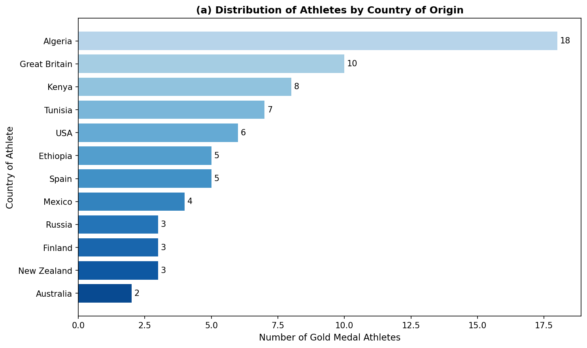
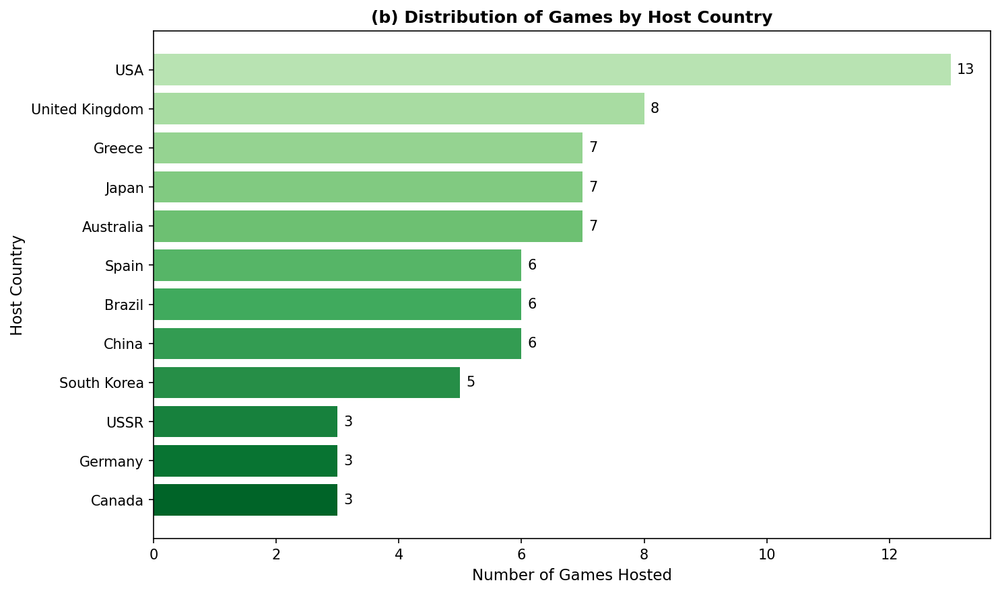
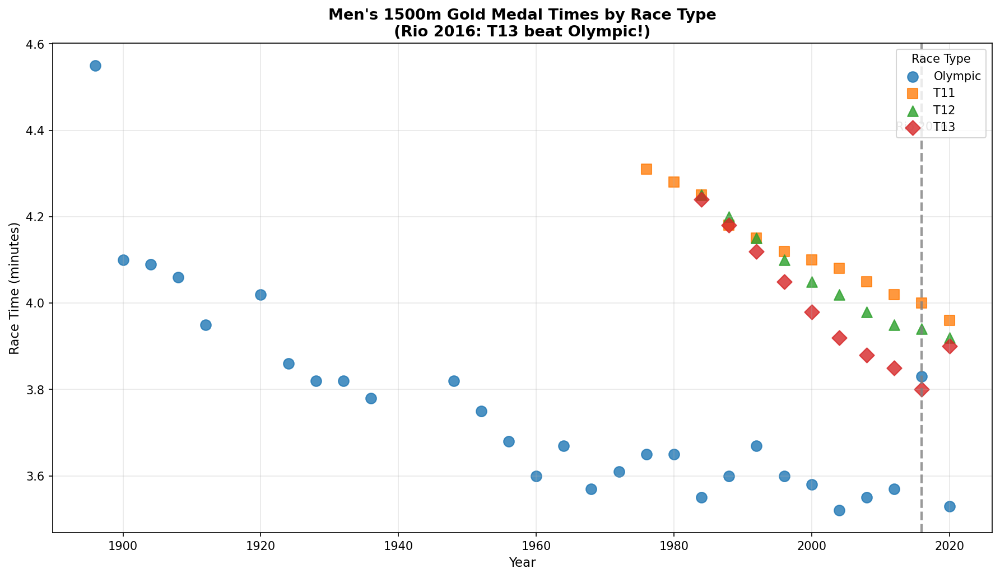
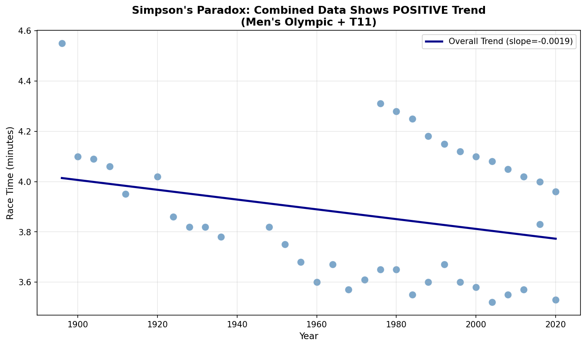
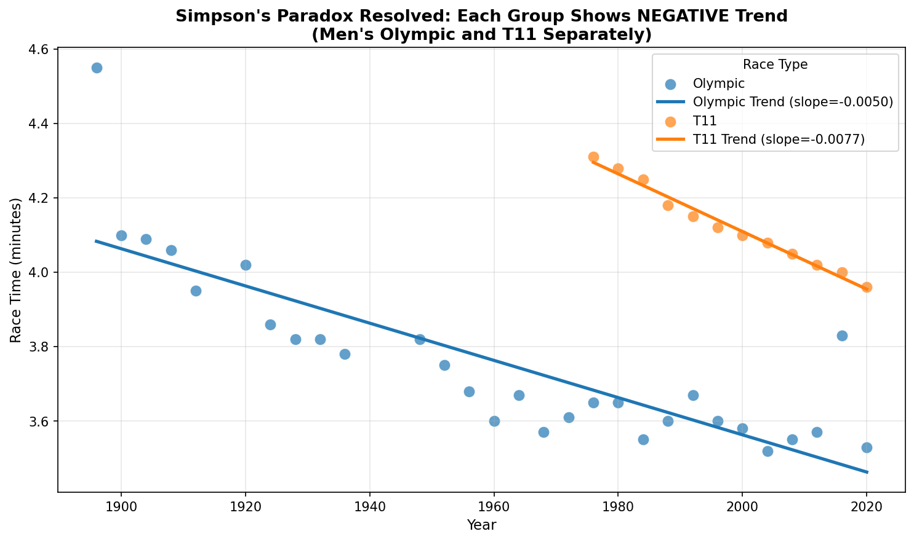

# 제3장: 응용: 데이터

## Introduction to Modern Statistics (2판) 한국어 번역

> **원서**: Çetinkaya-Rundel, M., & Hardin, J. (2024). *Introduction to Modern Statistics* (2nd ed.). OpenIntro.
>
> **번역 원칙**
> - 학술 문어체 사용 (~이다, ~다)
> - 용어 표기: **한글**(영문)
> - 각 소챕터마다 [새로운 시각] 섹션 포함
> - 모든 예제와 Guided Practice에 상세 풀이 및 Python 코드 제공

---

## 목차

- [3.1 사례 연구: 올림픽 1500m](#31-사례-연구-올림픽-1500m)
- [3.2 심슨의 역설](#32-심슨의-역설)
- [3.3 대화형 R 튜토리얼](#33-대화형-r-튜토리얼)
- [3.4 R 실습](#34-r-실습)

---

# 3 응용: 데이터

## 3.1 사례 연구: 올림픽 1500m

많은 사람들이 4년마다 (또는 하계와 동계 스포츠를 모두 좋아한다면 2년마다) **올림픽 경기**(Olympic Games)에 열광하지만, **패럴림픽 경기**(Paralympic Games)는 동일한 경쟁의 스릴을 제공함에도 불구하고 올림픽 경기보다 덜 유명하다.

패럴림픽 경기는 제2차 세계대전에서 부상당한 병사들의 재활을 돕기 위한 방법으로 시작되었다. 최초의 패럴림픽 경기는 1960년 이탈리아 로마에서 개최되었다. 1988년(대한민국 서울) 이후로, 패럴림픽 경기는 하계와 동계 모두 같은 도시에서 올림픽 경기가 끝난 몇 주 후에 개최되어 왔다.

이 사례 연구에서는 올림픽과 패럴림픽 1500m 달리기 경주(올림픽의 "마일"이라고 불리지만, 실제 1마일보다는 약간 짧다)의 금메달 수상자를 비교하는 데이터셋을 소개한다. 이 사례 연구의 목표는 **데이터 과학자**(data scientist)가 새로운 데이터셋을 처음 접했을 때 무엇을 하는지 안내하는 것이다. 또한 다음 몇 장에서 소개할 **탐색적 데이터 분석**(exploratory data analysis) 개념과 기법을 미리 보여주고자 한다. 마지막으로, **심슨의 역설**(Simpson's paradox)을 소개하고 분석에서 여러 변수의 영향을 이해하는 것이 얼마나 중요한지 논의한다.

---

### [새로운 시각] 데이터 과학자의 첫 번째 단계

데이터 과학자가 새로운 데이터셋을 받았을 때 가장 먼저 하는 일은 무엇일까? 이것은 마치 의사가 환자를 처음 만났을 때 기본적인 진찰부터 시작하는 것과 같다.

**EDA(탐색적 데이터 분석)의 기본 단계:**

1. **데이터 미리보기**: 데이터의 처음과 마지막 몇 행을 살펴본다
2. **데이터 사전 확인**: 각 변수가 무엇을 의미하는지 파악한다
3. **데이터 수집 방법 이해**: 관찰 연구인가, 실험인가?
4. **변수 유형 분류**: 수치형 vs 범주형, 연속형 vs 이산형
5. **기초 통계량 계산**: 평균, 중앙값, 범위 등
6. **시각화**: 분포와 관계 패턴 탐색

이 과정은 어떤 복잡한 분석을 수행하기 전에 반드시 거쳐야 하는 필수 단계이다.

---

### 3.1.1 데이터셋 소개

`paralympic_1500` 데이터는 `openintro` R 패키지에서 찾을 수 있다.

표 3.1은 데이터셋의 마지막 다섯 행을 보여주며, 이는 가장 최근 5개의 1500m 경주이다. 남자부(Men's)와 여자부(Women's) 선수들이 있고, 다양한 시각 장애 수준(T11, T12, T13, Olympic)의 선수들이 있음을 주목하라.

**표 3.1: `paralympic_1500` 데이터셋의 마지막 5행**

| 번호 | year | city | country_of_games | division | type | name | country_of_athlete | time | time_min |
|------|------|------|------------------|----------|------|------|--------------------|------|----------|
| 78 | 2020 | Tokyo | Japan | Men | T11 | Yeltsin Jacques | Brazil | 3:57.6 | 3.96 |
| 79 | 2020 | Tokyo | Japan | Men | T13 | Anton Kuliatin | Russian Paralympic Committee | 3:54.04 | 3.90 |
| 80 | 2020 | Tokyo | Japan | Women | Olympic | Faith Kipyegon | Kenya | 3:53.11 | 3.88 |
| 81 | 2020 | Tokyo | Japan | Women | T11 | Monica Rodriguez | Mexico | 4:37.4 | 4.62 |
| 82 | 2020 | Tokyo | Japan | Women | T13 | Tigist Menigstu | Ethiopia | 4:23.24 | 4.39 |

**표 3.2: `paralympic_1500` 데이터셋의 처음 5행**

| 번호 | year | city | country_of_games | division | type | name | country_of_athlete | time | time_min |
|------|------|------|------------------|----------|------|------|--------------------|------|----------|
| 1 | 1896 | Athens | Greece | Men | Olympic | Edwin Flack | Australia | 4:33.2 | 4.55 |
| 2 | 1900 | Paris | France | Men | Olympic | Charles Bennett | Great Britain | 4:6.2 | 4.10 |
| 3 | 1904 | St Louis | USA | Men | Olympic | Jim Lightbody | USA | 4:5.4 | 4.09 |
| 4 | 1908 | London | United Kingdom | Men | Olympic | Mel Sheppard | USA | 4:3.4 | 4.06 |
| 5 | 1912 | Stockholm | Sweden | Men | Olympic | Arnold Jackson | Great Britain | 3:56.8 | 3.95 |

---

### Guided Practice 3.1

**문제:** 이 데이터는 **관찰 연구**(observational study)에서 나온 것인가, 아니면 **실험**(experiment)에서 나온 것인가?

**상세 풀이:**

- **관찰 연구**: 연구자가 어떤 처치도 적용하지 않고, 단순히 관찰하고 데이터를 수집하는 연구
- **실험**: 연구자가 의도적으로 처치(treatment)를 적용하여 그 효과를 측정하는 연구

이 데이터셋의 경우 연구자들은 과거 올림픽과 패럴림픽 경기의 금메달 경주 기록을 수집했다. 연구자들이 선수들에게 어떤 처치를 적용하거나 변수를 조작하지 않았다.

**결론:** 이것은 **관찰 연구**(observational study)이다.

**Python 코드:**

```python
import pandas as pd

# 데이터 로드
df = pd.read_csv('paralympic_1500.csv')

# 연구 유형 판별을 위한 체크리스트
print("=" * 60)
print("연구 유형 판별 체크리스트")
print("=" * 60)

checklist = {
    "1. 연구자가 처치를 적용했는가?": "아니오 - 역사적 기록 수집",
    "2. 무작위 배정이 있었는가?": "아니오 - 선수들은 자연적으로 분류됨",
    "3. 통제 그룹이 설계되었는가?": "아니오 - 자연 발생적 그룹",
    "4. 변수를 의도적으로 조작했는가?": "아니오 - 관찰만 수행"
}

for question, answer in checklist.items():
    print(f"{question}")
    print(f"   → {answer}")

print("\n결론: 이것은 관찰 연구(observational study)이다.")
```

---

### Guided Practice 3.2

**문제:** 데이터셋에는 82행과 9열이 있다. 각 행과 각 열은 무엇을 나타내는가?

**상세 풀이:**

- **각 행**: 1500m 금메달 경주 하나를 나타낸다. 즉, 특정 연도, 특정 대회, 특정 종별의 한 경주 결과이다.
- **각 열**: 각 경주에 대한 정보를 담고 있는 변수를 나타낸다 (연도, 도시, 개최국, 종별, 유형, 선수명, 선수 국적, 기록 등)

**Python 코드:**

```python
import pandas as pd

df = pd.read_csv('paralympic_1500.csv')

print(f"행의 수: {len(df)}")
print(f"열의 수: {len(df.columns)}")
print(f"\n각 행의 의미: 1500m 금메달 경주 하나 (관측 단위)")
print(f"각 열의 의미: 각 경주에 대한 변수 (특성)")
print(f"\n열 목록: {list(df.columns)}")
```

---

### 3.1.2 변수 유형 파악

**표 3.3: `paralympic_1500` 데이터셋의 변수 설명**

| 변수 | 설명 |
|------|------|
| year | 대회가 열린 연도 |
| city | 대회 개최 도시 |
| country_of_games | 대회 개최국 |
| division | 종별: `Men` 또는 `Women` |
| type | 유형: `Olympic`, `T11`, `T12`, 또는 `T13` |
| name | 선수 이름 |
| country_of_athlete | 선수의 국적 |
| time | 금메달 경주 기록, m:s 형식 |
| time_min | 금메달 경주 기록, 소수점 분 (분 + 초/60) |

---

### Guided Practice 3.3

**문제:** `paralympic_1500` 데이터셋의 각 변수가 **수치형**(numerical)인지 **범주형**(categorical)인지 결정하라.

**상세 풀이:**

| 변수 | 유형 | 세부 분류 | 설명 |
|------|------|----------|------|
| year | 수치형 | 이산형 | 연도는 정수 값만 가짐 |
| city | 범주형 | 명목형 | 도시들 사이에 순서 없음 |
| country_of_games | 범주형 | 명목형 | 국가들 사이에 순서 없음 |
| division | 범주형 | 명목형 | Men/Women 사이에 순서 없음 |
| type | 범주형 | 순서형 (가능) | T11 > T12 > T13 (시각장애 정도) |
| name | 범주형 | 명목형 | 선수 이름들 사이에 순서 없음 |
| country_of_athlete | 범주형 | 명목형 | 국가들 사이에 순서 없음 |
| time | 범주형 (기술적) | - | 콜론(:)으로 분리된 문자열 |
| time_min | 수치형 | 연속형 | 어떤 양수 값도 가능 |

**Python 코드:**

```python
import pandas as pd

df = pd.read_csv('paralympic_1500.csv')

print("변수 유형 분류")
print("-" * 50)
for col in df.columns:
    dtype = df[col].dtype
    n_unique = df[col].nunique()
    if dtype in ['int64', 'float64']:
        var_type = "수치형"
    else:
        var_type = "범주형"
    print(f"{col:<20} {var_type:<10} 고유값: {n_unique}")
```

---

### 3.1.3 범주형 변수 탐색

그림 3.1은 이 데이터셋에서 두 범주형 변수의 분포를 보여준다. 미국이 대회를 가장 많이 개최했지만, 영국과 케냐 출신의 주자들이 1500m에서 가장 많이 우승했음을 알 수 있다.



*그림 3.1(a): `paralympic_1500` 데이터셋에서 선수 출신국의 분포*



*그림 3.1(b): `paralympic_1500` 데이터셋에서 대회 개최국의 분포*

---

### [새로운 시각] 막대 그래프와 히스토그램의 차이

막대 그래프와 히스토그램은 비슷해 보이지만 용도가 다르다:

| 특성 | 막대 그래프 | 히스토그램 |
|------|------------|-----------|
| 변수 유형 | 범주형 | 수치형 |
| 막대 간격 | 있음 | 없음 |
| X축 | 범주 이름 | 연속적인 수치 구간 |
| 의미 | 각 범주의 빈도 | 연속 변수의 분포 |

그림 3.1의 막대 그래프는 범주형 변수인 "국가"의 빈도를 보여주므로 막대 사이에 간격이 있어야 한다.

---

### 3.1.4 수치형 변수 탐색

표 3.4는 종별과 경주 유형별로 나눈 1500m 기록의 평균, 최소값, 최대값을 보여준다.

**표 3.4: 종별 및 경주 유형별 금메달 기록의 평균, 최소값, 최대값**

| division | type | mean | min | max |
|----------|------|------|-----|-----|
| Men | Olympic | 3.76 | 3.47 | 4.55 |
| Men | T11 | 4.14 | 3.96 | 4.31 |
| Men | T12 | 4.11 | 3.94 | 4.25 |
| Men | T13 | 3.98 | 3.80 | 4.24 |
| Women | Olympic | 4.02 | 3.88 | 4.18 |
| Women | T11 | 5.05 | 4.62 | 5.63 |

**Python 코드:**

```python
import pandas as pd

df = pd.read_csv('paralympic_1500.csv')

summary = df.groupby(['division', 'type'])['time_min'].agg(
    mean='mean', min='min', max='max', count='count'
).round(2)

print("종별 및 경주 유형별 1500m 금메달 기록 요약")
print(summary)
```

---

### 3.1.5 재미있는 발견

**재미있는 사실!** 2016년 **리우데자네이루 대회**에서 T13 금메달리스트가 올림픽 금메달리스트보다 더 빨리 달렸다! T13 금메달리스트의 기록은 3:48.29였고, 올림픽 금메달리스트의 기록은 3:50.00이었다.



*그림 3.2: 남자 올림픽 및 패럴림픽 선수들의 1500m 경주 기록. 회색 점선은 2016년 리우 대회를 나타낸다.*

---

## 3.2 심슨의 역설

**심슨의 역설**(Simpson's paradox)은 세 개(또는 그 이상)의 변수에 대한 설명이다. 이 역설은 **세 번째 변수가 처음 두 변수 사이의 관계를 역전시킬 때** 발생한다.

---

### [새로운 시각] 심슨의 역설 직관적 이해

심슨의 역설을 이해하기 위한 간단한 비유:

**상황:** 두 학교의 시험 성적을 비교한다.

| 학교 | 전체 평균 |
|------|----------|
| A 학교 | 75점 |
| B 학교 | 70점 |

전체적으로 A 학교가 더 좋아 보인다. 그러나 과목별로 나눠보면:

| 과목 | A 학교 | B 학교 |
|------|--------|--------|
| 수학 | 80점 | 85점 |
| 영어 | 70점 | 75점 |

**놀랍게도, B 학교가 모든 과목에서 더 높은 점수를 받았다!**

이것이 가능한 이유는 그룹의 크기가 불균형하기 때문이다.

---

### 3.2.1 전체 데이터의 추세

그림 3.3은 남자 올림픽과 패럴림픽(T11) 선수들의 1500m 경주 기록과 연도를 나타내는 산점도이다. 최적 적합선이 경주 기록과 연도 사이에 **양의 관계**(positive relationship)를 보여준다.



*그림 3.3: 남자 올림픽 및 패럴림픽(T11) 선수들의 1500m 경주 기록. 선은 전체 데이터셋에 대한 최적 적합선을 나타낸다.*

**Python 코드:**

```python
import pandas as pd
import numpy as np
from scipy import stats

df = pd.read_csv('paralympic_1500.csv')
men_olympic_t11 = df[(df['division'] == 'Men') & (df['type'].isin(['Olympic', 'T11']))]

slope, intercept, r_value, p_value, std_err = stats.linregress(
    men_olympic_t11['year'], men_olympic_t11['time_min']
)

print(f"전체 데이터 회귀 분석")
print(f"기울기: {slope:.6f} 분/년")
print(f"기울기가 양수 → 연도가 증가할수록 기록이 느려지는 추세")
print(f"이것은 직관에 반한다!")
```

---

### 3.2.2 그룹별 데이터의 추세

그림 3.4는 두 가지 유형의 경주 각각에 대해 별도로 최적 적합선이 중첩되어 있다. 각 경주 유형 내에서 관계가 **음**(negative)인 것에 주목하라.



*그림 3.4: 남자 올림픽 및 패럴림픽(T11) 선수들의 1500m 경주 기록. 최적 적합선은 올림픽과 패럴림픽 선수들에 대해 별도로 적합되어 있다.*

---

> ### 심슨의 역설 (Simpson's Paradox)
>
> 심슨의 역설은 두 변수 사이의 연관성이나 관계가 한 방향(예: 양의 방향)인데, 세 번째 변수를 고려하면 반대 방향(예: 음의 방향)이 될 때 발생한다.

---

**Python 코드:**

```python
import pandas as pd
from scipy import stats

df = pd.read_csv('paralympic_1500.csv')
men_olympic_t11 = df[(df['division'] == 'Men') & (df['type'].isin(['Olympic', 'T11']))]

# 전체 데이터 회귀
slope_all, _, _, _, _ = stats.linregress(
    men_olympic_t11['year'], men_olympic_t11['time_min'])
print(f"전체 기울기: {slope_all:+.6f} (양수)")

# 그룹별 회귀
for race_type in ['Olympic', 'T11']:
    subset = men_olympic_t11[men_olympic_t11['type'] == race_type]
    slope, _, _, _, _ = stats.linregress(subset['year'], subset['time_min'])
    print(f"{race_type} 기울기: {slope:+.6f} (음수)")

print("\n결론: 심슨의 역설 확인!")
```

---

### 3.2.3 심슨의 역설이 발생하는 이유

심슨의 역설은 세 번째 변수(여기서는 경주 유형)가 **불균형**하기 때문에 발생한다:

1. T11은 관측치 수가 더 적다 (12 vs 29)
2. T11은 더 최근 연도에 집중되어 있다 (1976년 이후)
3. T11의 기록이 일반적으로 더 느리다

이러한 불균형이 심슨의 역설을 초래한다!

---

### [새로운 시각] 심슨의 역설에서 배우는 교훈

1. **항상 교란 변수를 고려하라**: 두 변수 사이의 관계를 분석할 때, 그 관계에 영향을 미칠 수 있는 다른 변수가 있는지 생각해야 한다.
2. **집계된 데이터만 믿지 마라**: 전체 데이터에서 보이는 패턴이 하위 그룹에서는 다르게 나타날 수 있다.
3. **맥락을 이해하라**: 데이터가 수집된 맥락에 따라 적절한 분석 방법을 선택해야 한다.
4. **시각화가 중요하다**: 산점도와 같은 시각화는 숫자만으로는 명확하지 않은 패턴을 드러낼 수 있다.

---

## 마무리 질문

계속하기 전에, 다음 질문들이 이 데이터셋으로 답할 수 있는지 생각해 보라:

1. 시각 장애가 있는 패럴림픽 금메달리스트가 올림픽 금메달리스트를 이긴 적이 있는가?
2. 패럴림픽과 올림픽 1500m 금메달 선수들을 비교할 때, 여자부에서도 심슨의 역설이 성립하는가?
3. 인간이 1500m를 달릴 수 있는 시간의 생물학적 한계가 있는가?

---

## 3.3 대화형 R 튜토리얼

- [튜토리얼 1: 데이터 소개](https://openintrostat.github.io/ims-tutorials/01-data/)
- [튜토리얼 1 - 레슨 1: 데이터의 언어](https://openintro.shinyapps.io/ims-01-data-01/)
- [튜토리얼 1 - 레슨 2: 연구 유형](https://openintro.shinyapps.io/ims-01-data-02/)
- [튜토리얼 1 - 레슨 3: 표본추출 전략과 실험 설계](https://openintro.shinyapps.io/ims-01-data-03/)
- [튜토리얼 1 - 레슨 4: 사례 연구](https://openintro.shinyapps.io/ims-01-data-04/)

---

## 3.4 R 실습

- [R 소개 - 출생률](https://www.openintro.org/go?id=ims-r-lab-intro-to-r)

---

## 3장 요약

### 핵심 용어 정리

| 용어 | 영문 | 설명 |
|------|------|------|
| 데이터 과학자 | Data scientist | 데이터를 분석하여 인사이트를 추출하는 전문가 |
| 탐색적 데이터 분석 | Exploratory data analysis (EDA) | 데이터의 패턴과 특성을 파악하는 초기 분석 단계 |
| 관찰 연구 | Observational study | 연구자가 처치를 적용하지 않고 관찰만 하는 연구 |
| 수치형 변수 | Numerical variable | 수학적 연산이 의미 있는 변수 |
| 범주형 변수 | Categorical variable | 그룹이나 범주를 나타내는 변수 |
| 심슨의 역설 | Simpson's paradox | 전체와 부분의 관계 방향이 반대인 현상 |
| 교란 변수 | Confounding variable | 두 변수 사이의 관계에 영향을 미치는 제3의 변수 |

### 변수 유형 분류 체계

```
변수(Variable)
├── 수치형(Numerical)
│   ├── 연속형(Continuous): 키, 체중, 기록 시간
│   └── 이산형(Discrete): 연도, 자녀 수, 방문 횟수
└── 범주형(Categorical)
    ├── 명목형(Nominal): 국가, 성별, 색깔
    └── 순서형(Ordinal): 교육 수준, 만족도 등급
```

---

## 참고문헌

- Witmer, J. (2021). Simpson's Paradox, Visual Displays, and Causal Diagrams. *The American Mathematical Monthly*, 128(7), 598–610.

---

*번역 완료: Introduction to Modern Statistics (2판) Chapter 3*
