# 제4장 범주형 데이터 탐색

이 장에서는 요약 통계량과 시각화를 활용하여 **범주형**(categorical) 데이터를 탐색하는 방법에 초점을 맞춘다. 본 장에서 제시하는 요약과 그래프는 통계 소프트웨어를 사용하여 생성하지만, 처음 접하는 개념일 수 있으므로 생성 방법을 자세히 설명한다. 가능한 경우 **다변량 플롯**(multivariate plots), 즉 여러 변수 간의 관계를 시각화하는 그래프를 제시한다. 본 장에서 다루는 내용의 숙달은 이 책의 나머지 부분에서 소개하는 방법과 기법을 이해하는 데 매우 중요하다.

이 장에서는 제1장에서 이미 살펴본 Lending Club의 대출 데이터를 활용한다. 제1장의 `loan50` 데이터셋은 `loans`라는 더 큰 대출 데이터셋의 표본이다. 이 대출 데이터셋에는 Lending Club을 통해 이루어진 10,000건의 대출 정보가 포함되어 있다. 우리는 `homeownership`(주택 소유 형태)과 `application_type`(신청 유형) 간의 관계를 살펴볼 것이다. `loans` 데이터에서 `homeownership`은 `rent`(임차), `mortgage`(주택담보대출 보유), `own`(완전 소유) 중 하나의 값을 가지며, `application_type`은 대출 신청이 공동 신청인지 개인 신청인지를 나타낸다.

> **데이터 정보**: `loans_full_schema` 데이터는 **openintro** R 패키지에서 찾을 수 있다. 이 데이터셋의 데이터를 기반으로 `homeownership`과 `application_type` 변수를 수정하였으며, 이 수정된 데이터셋을 `loans`라고 부른다.

***

## 4.1 분할표와 막대 그래프

표 4.1은 두 변수인 `application_type`과 `homeownership`을 요약한다. Lending Club의 대출은 일반적으로 소규모 물품 구매나 현금 대출을 위한 것이며, 주택 구매를 위한 것은 아니다. 데이터셋의 개인들은 개인적 용도로 대출을 받고 있으며, 우리는 그들의 주택 소유 상태(대출 목적과는 무관함)에 따라 분류한다. 이러한 방식으로 두 범주형 변수의 데이터를 요약한 표를 **분할표**(contingency table)라고 한다. 표의 각 값은 특정 변수 조합이 발생한 횟수를 나타낸다.

예를 들어, 값 3496은 차용인이 임차하고 있고 신청 유형이 개인인 대출의 수를 나타낸다. **행 합계**(row totals)는 각 행의 총 개수를 제공하고, **열 합계**(column totals)는 각 열의 총 개수를 제공한다. 또한 각 범주 조합의 전체 백분율이나 비율만 보여주는 표를 만들거나, 표 4.2처럼 `homeownership` 변수에 대한 단일 변수 표를 만들 수도 있다.

**표 4.1**: 신청 유형과 주택 소유 형태에 대한 분할표

|               | homeownership |           |         |       |
|---------------|:-------------:|:---------:|:-------:|:-----:|
| application_type | rent | mortgage | own | 합계 |
| joint         | 362           | 950       | 183     | 1,495 |
| individual    | 3,496         | 3,839     | 1,170   | 8,505 |
| 합계          | 3,858         | 4,789     | 1,353   | 10,000|

**표 4.2**: 주택 소유 형태 변수의 빈도표

| homeownership | 빈도 |
|--------------|:----:|
| rent         | 3,858 |
| mortgage     | 4,789 |
| own          | 1,353 |
| 합계         | 10,000 |

**막대 그래프**(bar plot)는 단일 범주형 변수를 표시하는 일반적인 방법이다. 그림 4.1 (a)는 `homeownership` 변수의 막대 그래프를 보여준다. 그림 4.1 (b)에서는 빈도를 비율로 변환하여 각 수준에 속하는 관측치의 비율을 보여준다.

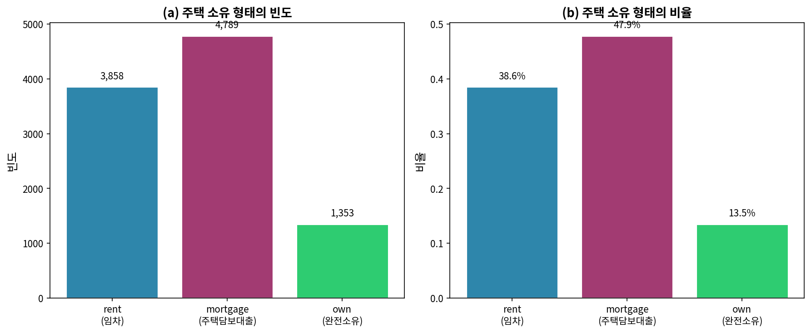

*그림 4.1: 주택 소유 형태의 분포. (a) 주택 소유 형태의 빈도. (b) 주택 소유 형태의 비율. 가장 높은 비율의 차용인은 주택담보대출을 보유하고 있다. 그다음으로 높은 집단은 임차이며, 가장 작은 집단은 완전 소유이다.*

***

### [새로운 시각] 범주형 데이터 시각화의 본질

범주형 데이터를 다룰 때 가장 먼저 이해해야 할 것은 "범주"의 본질이다. 수치형 데이터와 달리, 범주형 데이터는 본질적으로 크기 비교가 불가능하다. 예를 들어, "임차"가 "소유"보다 크거나 작다고 말할 수 없다. 이것이 바로 우리가 막대 그래프를 사용하는 이유이다.

막대 그래프와 히스토그램의 핵심적 차이점을 이해하는 것이 중요하다. 히스토그램에서는 막대가 서로 붙어 있는데, 이는 수치형 데이터의 연속성을 나타낸다. 반면 막대 그래프에서는 막대 사이에 간격이 있어 각 범주가 독립적임을 보여준다.

**베이지안 관점**: 베이지안 통계학의 관점에서, 분할표의 각 셀은 사전 확률 분포를 갱신하는 증거로 볼 수 있다. 예를 들어, "주택담보대출을 보유한 사람이 공동 신청할 확률은 얼마인가?"라는 질문에 대해, 분할표의 데이터는 이러한 조건부 확률을 직접 추정할 수 있게 해준다. 이는 $P(\text{공동}|\text{주택담보대출}) = \frac{950}{4789} \approx 0.198$로 계산된다.

***

## 4.2 두 범주형 변수의 시각화

### 4.2.1 두 변수를 포함한 막대 그래프

두 범주형 변수의 분포를 하나의 막대 그래프에 동시에 표시할 수 있다. 이러한 그래프는 일반적으로 두 범주형 변수 간의 관계를 시각화하는 데 유용하다. 그림 4.2는 이러한 그래프의 세 가지 유형을 보여준다.

그림 4.2 (a)는 **누적 막대 그래프**(stacked bar plot)이다. 이 그래프는 대출 신청자들이 가장 흔히 주택담보대출이 있는 집에 거주함을 가장 명확하게 보여준다. 그러나 이 그래프만으로는 주택 소유 형태의 각 수준에서 서로 다른 신청 유형이 어떻게 다른지 말하기 어렵다.

그림 4.2 (b)는 **표준화된 막대 그래프**(standardized bar plot, 채워진 막대 그래프라고도 함)이다. 이 유형의 시각화는 각 `homeownership` 수준에서 개인 또는 공동 대출 신청의 비율을 이해하는 데 도움이 된다. 또한 공동 및 개인 대출의 비율이 그룹 간에 다르기 때문에, 이 표본에서 두 변수가 연관되어 있다고 결론지을 수 있다.

마지막으로, 그림 4.2 (c)는 **병렬 막대 그래프**(dodged bar plot)이다. 이 그래프는 각 주택 소유 형태 수준 내에서 개인 신청이 공동 신청보다 더 흔함을 가장 명확하게 보여준다. 또한 공동 신청은 주택담보대출이 있는 신청자의 대출에서 가장 흔하다는 것을 보여준다.

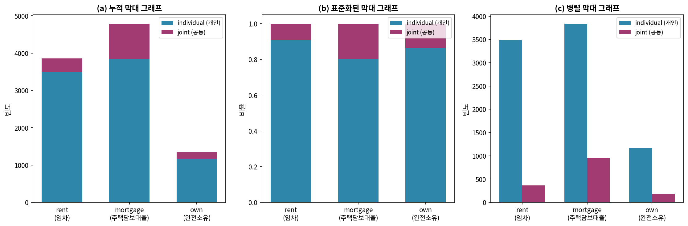

*그림 4.2: 주택 소유 형태와 신청 유형 변수를 보여주는 세 가지 막대 그래프. (a) 누적 막대 그래프. (b) 표준화된 막대 그래프. (c) 병렬 막대 그래프.*

***

**예제 4.1** 그림 4.2의 세 가지 막대 그래프를 살펴보라. 누적, 병렬, 표준화된 막대 그래프가 각각 언제 가장 유용한가?

**풀이**:

누적 막대 그래프는 하나의 변수를 설명변수(여기서는 `homeownership`)로, 다른 변수를 반응변수(여기서는 `application_type`)로 지정하는 것이 합리적일 때 가장 유용하다. 이는 효과적으로 하나의 변수로 먼저 그룹화한 다음 다른 변수로 세분화하기 때문이다.

병렬 막대 그래프는 어떤 변수가 설명변수이고 어떤 변수가 반응변수인지에 대해 더 중립적이다. 또한 6개의 서로 다른 그룹 조합에서 사례 수를 쉽게 파악할 수 있다. 그러나 단점 중 하나는 더 많은 수평 공간이 필요하다는 것이다. 그림 4.2에서 플롯 B가 다른 두 개에 비해 좁아 보이는 것은 플롯이 다소 답답해 보이게 한다. 또한 `own` 그룹이 다른 두 그룹에 비해 매우 다른 크기일 때, 변수 간 연관성이 있는지 파악하기 어렵다.

표준화된 누적 막대 그래프는 누적 막대 그래프의 주요 변수가 상대적으로 불균형할 때(예: 한 범주가 다른 범주의 1/3 정도의 관측치만 가질 때) 연관성을 확인하는 데 단순 누적 막대 그래프가 덜 유용하게 만드는 경우 도움이 된다. 표준화된 버전의 주요 단점은 각 막대가 나타내는 사례 수에 대한 감각을 완전히 잃는다는 것이다.

**Python 코드**:

```python
import pandas as pd
import matplotlib.pyplot as plt
import numpy as np

# 데이터 생성
data = {
    'homeownership': ['rent', 'mortgage', 'own'],
    'joint': [362, 950, 183],
    'individual': [3496, 3839, 1170]
}
df = pd.DataFrame(data)

# (a) 누적 막대 그래프
fig, axes = plt.subplots(1, 3, figsize=(15, 5))

# 누적 막대 그래프
x = np.arange(len(df['homeownership']))
width = 0.6
axes[0].bar(x, df['individual'], width, label='individual', color='#2E86AB')
axes[0].bar(x, df['joint'], width, bottom=df['individual'], label='joint', color='#A23B72')
axes[0].set_xticks(x)
axes[0].set_xticklabels(df['homeownership'])
axes[0].set_ylabel('빈도')
axes[0].set_title('(a) 누적 막대 그래프')
axes[0].legend()

# (b) 표준화된 막대 그래프
totals = df['joint'] + df['individual']
axes[1].bar(x, df['individual']/totals, width, label='individual', color='#2E86AB')
axes[1].bar(x, df['joint']/totals, width, bottom=df['individual']/totals, 
            label='joint', color='#A23B72')
axes[1].set_xticks(x)
axes[1].set_xticklabels(df['homeownership'])
axes[1].set_ylabel('비율')
axes[1].set_title('(b) 표준화된 막대 그래프')
axes[1].legend()

# (c) 병렬 막대 그래프
width = 0.35
axes[2].bar(x - width/2, df['individual'], width, label='individual', color='#2E86AB')
axes[2].bar(x + width/2, df['joint'], width, label='joint', color='#A23B72')
axes[2].set_xticks(x)
axes[2].set_xticklabels(df['homeownership'])
axes[2].set_ylabel('빈도')
axes[2].set_title('(c) 병렬 막대 그래프')
axes[2].legend()

plt.tight_layout()
plt.savefig('fig_4_2_bar_plots.png', dpi=150, bbox_inches='tight')
plt.show()
```

***

### 4.2.2 모자이크 플롯

**모자이크 플롯**(mosaic plot)은 분할표에 적합한 시각화 기법으로, 표준화된 누적 막대 그래프와 유사하지만 주요 변수의 상대적 그룹 크기도 볼 수 있다는 장점이 있다.

첫 번째 모자이크 플롯을 만들기 위해, 먼저 정사각형을 각 범주의 변수에 대한 열로 나눈다. 결과는 그림 4.3 (a)에 나와 있다. 각 열은 `homeownership`의 한 수준을 나타내며, 열의 너비는 해당 범주의 대출 비율에 해당한다. 예를 들어, 소유자인 차용인의 대출이 주택담보대출을 가진 차용인의 대출보다 적다. 일반적으로, 모자이크 플롯은 상자의 *면적*을 사용하여 각 범주의 사례 수를 나타낸다.

그림 4.3 (b)는 주택 소유 형태와 신청 유형 간의 관계를 보여준다. 각 열은 개인 및 공동 차용인의 대출 수에 비례하여 분할된다. 예를 들어, 두 번째 열은 차용인이 주택담보대출을 가진 대출을 나타내며, 개인 대출(위)과 공동 대출(아래)로 나뉜다. 또 다른 예로, 세 번째 열의 아래 부분은 차용인이 집을 소유하고 공동으로 신청한 대출을 나타내며, 이 열의 위 부분은 주택 소유자이면서 개인으로 신청한 차용인을 나타낸다. 이 플롯을 사용하여 `homeownership`과 `application_type` 변수가 연관되어 있음을 다시 확인할 수 있다. 일부 열이 다른 열과 다른 수직 위치에서 나뉘기 때문인데, 이는 표준화된 누적 막대 그래프에서 연관성을 확인하는 데 사용된 것과 동일한 기법이다.

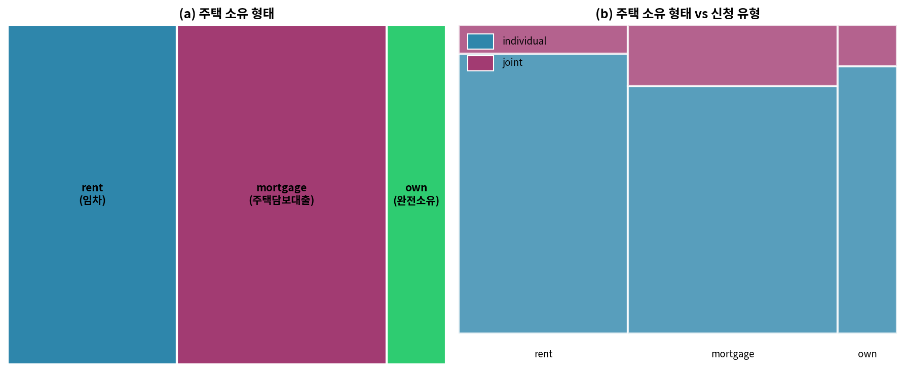

*그림 4.3: 두 개의 모자이크 플롯. (a) 주택 소유 형태만을 위한 플롯. (b) 주택 소유 형태와 신청 유형 간의 관계를 보여주는 플롯.*

그림 4.3에서는 차용인의 주택 소유 상태로 먼저 분할하기로 선택하였다. 그러나 그림 4.4처럼 신청 유형으로 먼저 분할할 수도 있다. 막대 그래프와 마찬가지로, 모자이크 플롯에서 첫 번째 분할을 나타내는 데 설명변수를 사용하고, 이러한 레이블을 고려 중인 변수에 부여하는 것이 합리적이라면 반응변수로 설명변수의 각 수준을 세분화하는 것이 일반적이다.

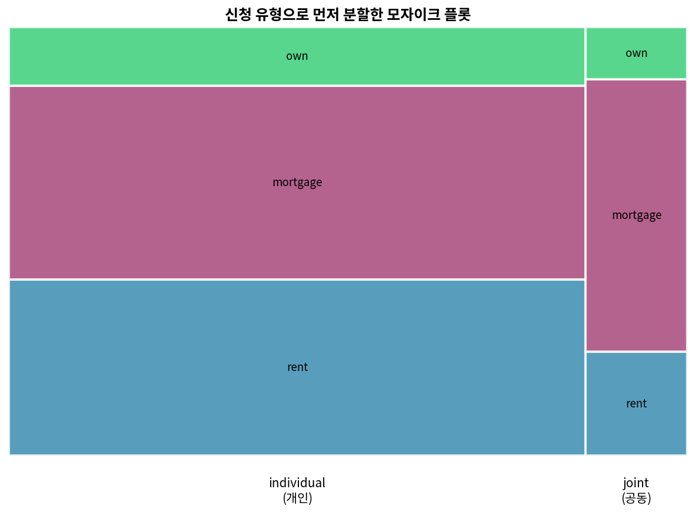

*그림 4.4: 대출이 개인 및 공동 신청 유형으로 나뉜 후 주택 소유 형태별로 그룹화된 모자이크 플롯.*

***

### [새로운 시각] 모자이크 플롯의 기하학적 직관

모자이크 플롯을 이해하는 가장 좋은 방법은 이를 "면적 = 빈도"의 원리로 생각하는 것이다. 전체 정사각형의 면적이 전체 데이터(10,000건의 대출)를 나타낸다면, 각 직사각형의 면적은 해당 조합의 빈도에 비례한다.

이를 확률적으로 해석하면 더 깊은 이해에 도달할 수 있다. 모자이크 플롯에서:
- 열의 너비 = $P(\text{homeownership}=x)$
- 각 열 내에서 분할된 높이 = $P(\text{application\_type}=y|\text{homeownership}=x)$
- 따라서 각 직사각형의 면적 = $P(\text{homeownership}=x) \times P(\text{application\_type}=y|\text{homeownership}=x) = P(\text{homeownership}=x, \text{application\_type}=y)$

이 해석은 **결합 확률**과 **조건부 확률** 사이의 관계를 시각적으로 이해하는 데 큰 도움이 된다.

**독립성 검정의 시각적 단서**: 만약 두 변수가 독립이라면, 모든 열에서 수평 분할선이 같은 높이에 있어야 한다. 분할선의 위치가 열마다 다르다면, 이는 두 변수 간의 연관성을 시사한다.

***

## 4.3 행 비율과 열 비율

이전 절에서 막대 그래프와 모자이크 플롯으로 두 범주형 변수의 시각화를 살펴보았다. 그러나 비율을 보여주는 막대 그래프와 모자이크 플롯의 값이 어떻게 계산되는지는 논의하지 않았다. 이 절에서는 한 변수 내에서 다른 변수의 비율별 분해를 조사하고, 이러한 관점을 제공하도록 분할표를 수정할 수 있다.

표 4.3은 표 4.1의 **행 비율**(row proportions)을 보여주며, 이는 빈도를 행 합계로 나누어 계산한다. 개인과 임차의 교차점에 있는 값 3496은 $3496 / 8505 = 0.411$로 대체된다. 즉, 3496을 그 행 합계인 8505로 나눈 것이다. 그렇다면 0.411은 무엇을 나타내는가? 이는 임차하는 개인 신청자의 비율에 해당한다.

**표 4.3**: 신청 유형과 주택 소유 형태에 대한 행 비율 분할표

|               | homeownership |           |         |       |
|---------------|:-------------:|:---------:|:-------:|:-----:|
| application_type | rent | mortgage | own | 합계 |
| joint         | 0.242         | 0.635     | 0.122   | 1     |
| individual    | 0.411         | 0.451     | 0.138   | 1     |

**열 비율**(column proportions)의 분할표도 유사하게 계산되며, 각각은 빈도를 해당 열 합계로 나누어 계산한다. 표 4.4는 이러한 표를 보여주며, 여기서 값 0.906은 임차인의 90.6%가 개인으로 대출을 신청했음을 나타낸다. 이 비율은 주택담보대출을 가진 사람들(80.2%)이나 집을 소유한 사람들(86.5%)의 대출에 비해 높다. 이러한 비율이 `homeownership`의 세 수준(`rent`, `mortgage`, `own`)에 따라 다르기 때문에, 이는 `application_type`과 `homeownership` 변수가 연관되어 있을 수 있다는 증거를 제공한다.

**표 4.4**: 신청 유형과 주택 소유 형태에 대한 열 비율 분할표

|               | homeownership |           |         |
|---------------|:-------------:|:---------:|:-------:|
| application_type | rent | mortgage | own |
| joint         | 0.094         | 0.198     | 0.135   |
| individual    | 0.906         | 0.802     | 0.865   |
| 합계          | 1.000         | 1.000     | 1.000   |

행 비율과 열 비율은 **조건부 비율**(conditional proportions)로도 생각할 수 있다. 이는 다른 범주형 변수의 수준에 조건부로 주어진 범주형 변수의 특정 수준에 있는 관측치의 비율을 알려주기 때문이다.

표 4.3의 행 비율을 사용하여 `application_type`과 `homeownership` 간의 연관성을 확인할 수도 있다. 이러한 행 비율을 비교할 때, 열을 따라 내려가면서 차용인이 임차하는지, 주택담보대출이 있는지, 소유하는지의 비율이 신청 유형에 따라 다른지 확인한다.

***

**Guided Practice 4.1** 표 4.3에서 0.451은 무엇을 나타내는가? 표 4.4에서 0.802는 무엇을 나타내는가?

**풀이**:
- 0.451은 주택담보대출이 있는 개인 신청자의 비율을 나타낸다. 즉, 개인 신청자 중 45.1%가 주택담보대출을 보유하고 있다.
- 0.802는 주택담보대출을 보유한 신청자 중 개인으로 신청한 비율을 나타낸다. 즉, 주택담보대출 보유자의 80.2%가 개인으로 대출을 신청하였다.

**Python 코드**:

```python
import pandas as pd
import numpy as np

# 분할표 데이터
data = np.array([[362, 950, 183],
                 [3496, 3839, 1170]])

# DataFrame 생성
df = pd.DataFrame(data, 
                  index=['joint', 'individual'],
                  columns=['rent', 'mortgage', 'own'])

print("원본 분할표:")
print(df)
print()

# 행 비율 계산
row_totals = df.sum(axis=1)
row_proportions = df.div(row_totals, axis=0)
print("행 비율:")
print(row_proportions.round(3))
print()

# 열 비율 계산
col_totals = df.sum(axis=0)
col_proportions = df.div(col_totals, axis=1)
print("열 비율:")
print(col_proportions.round(3))

# 특정 값 확인
print(f"\n0.451 = {3839/8505:.3f} (개인 신청자 중 주택담보대출 비율)")
print(f"0.802 = {3839/4789:.3f} (주택담보대출 보유자 중 개인 신청 비율)")
```

***

**Guided Practice 4.2** 표 4.3에서 0.122는 무엇을 나타내는가? 표 4.4에서 0.135는 무엇을 나타내는가?

**풀이**:
- 0.122는 집을 소유한 공동 차용인의 비율을 나타낸다. 즉, 공동 신청자 중 12.2%가 집을 완전 소유하고 있다.
- 0.135는 집을 소유한 차용인 중 공동으로 대출을 신청한 비율을 나타낸다. 즉, 완전 소유자의 13.5%가 공동으로 신청하였다.

***

**예제 4.2** 데이터 과학자들은 이메일 스팸 필터를 구축하기 위해 통계를 사용한다. 이메일의 특정 특성을 파악함으로써, 데이터 과학자는 일부 이메일을 높은 정확도로 스팸 또는 스팸이 아닌 것으로 분류할 수 있다. 그러한 특성 중 하나는 이메일에 굵은 텍스트와 같은 HTML 콘텐츠가 있는지 여부를 나타내는 이메일 형식이다. 이메일 형식과 스팸 상태에 초점을 맞추어 `email` 데이터셋을 사용할 것이다. 이 변수들은 표 4.5의 분할표에 요약되어 있다. 이 표에서 이메일을 스팸 또는 일반 이메일로 분류하려는 사람에게 행 비율과 열 비율 중 어느 것이 더 도움이 되겠는가?

**표 4.5**: 스팸과 형식에 대한 분할표

| spam     | HTML  | text  | 합계  |
|----------|:-----:|:-----:|:-----:|
| not spam | 2,568 | 986   | 3,554 |
| spam     | 158   | 209   | 367   |
| 합계     | 2,726 | 1,195 | 3,921 |

**풀이**:

데이터 과학자는 각 이메일 형식 내에서 스팸 비율이 어떻게 변하는지에 관심이 있을 것이다. 이는 열 비율에 해당한다: 일반 텍스트 이메일에서의 스팸 비율과 HTML 이메일에서의 스팸 비율이다. 열 비율을 생성하면, 일반 텍스트 이메일 중 더 높은 비율($209/1195 = 17.5\%$)이 HTML 이메일($158/2726 = 5.8\%$)에 비해 스팸임을 알 수 있다.

이 정보만으로는 이메일을 스팸 또는 스팸이 아닌 것으로 분류하기에 불충분하다. 일반 텍스트 이메일의 80% 이상이 스팸이 아니기 때문이다. 그러나 이 정보를 다른 많은 특성과 신중하게 결합하면, 일부 이메일을 확신을 가지고 스팸 또는 스팸이 아닌 것으로 분류할 수 있는 합리적인 기회가 있다.

이 예제는 행 비율과 열 비율이 동등하지 않다는 점을 지적한다. 표의 한 형태를 결정하기 전에, 가장 유용한 표가 구성되도록 각각을 고려하는 것이 중요하다. 그러나 때로는 둘 중 어느 것이 더 유용한지 명확하지 않을 수도 있다.

**Python 코드**:

```python
import pandas as pd
import numpy as np

# 이메일 데이터
email_data = np.array([[2568, 986],
                       [158, 209]])

email_df = pd.DataFrame(email_data,
                        index=['not spam', 'spam'],
                        columns=['HTML', 'text'])

print("이메일 분할표:")
print(email_df)
print()

# 열 비율 계산 (형식별 스팸 비율)
col_totals = email_df.sum(axis=0)
col_proportions = email_df.div(col_totals, axis=1)
print("열 비율 (형식별 스팸 비율):")
print(col_proportions.round(3))

print(f"\n일반 텍스트 이메일 중 스팸 비율: {209/1195:.3f} = 17.5%")
print(f"HTML 이메일 중 스팸 비율: {158/2726:.3f} = 5.8%")
```

***

**Guided Practice 4.3** 표 4.3과 표 4.4를 다시 살펴보라. 하나가 다른 것보다 더 유용할 수 있는 명백한 시나리오가 있는가?

**풀이**:

명백한 시나리오는 없다고 생각한다. 이메일 예제와 구별되는 점은 두 대출 변수에 우리가 가설을 세울 수 있는 명확한 설명변수-반응변수 관계가 없다는 것이다. 일반적으로 설명변수에 "조건부"로 하는 것이 가장 유용하다. 예를 들어, 이메일 예제에서 이메일 형식은 메시지가 스팸인지 여부의 가능한 설명변수로 보았으므로, 각 이메일 형식에 대한 상대 빈도(비율)를 계산하는 것이 더 흥미로웠다.

***

### [새로운 시각] 조건부 확률과 베이즈 정리의 응용

행 비율과 열 비율의 차이는 조건부 확률의 핵심 개념을 반영한다. 표 4.4의 열 비율을 예로 들면:

$$P(\text{individual}|\text{rent}) = 0.906$$

이는 "임차인이 주어졌을 때 개인 신청일 확률"을 의미한다. 반면 표 4.3의 행 비율에서:

$$P(\text{rent}|\text{individual}) = 0.411$$

이는 "개인 신청이 주어졌을 때 임차인일 확률"을 의미한다.

**베이즈 정리**를 사용하면 이 두 조건부 확률 사이의 관계를 이해할 수 있다:

$$P(\text{rent}|\text{individual}) = \frac{P(\text{individual}|\text{rent}) \times P(\text{rent})}{P(\text{individual})}$$

우리 데이터로 확인하면:
- $P(\text{individual}|\text{rent}) = 0.906$
- $P(\text{rent}) = 3858/10000 = 0.3858$
- $P(\text{individual}) = 8505/10000 = 0.8505$

따라서:
$$P(\text{rent}|\text{individual}) = \frac{0.906 \times 0.3858}{0.8505} = \frac{0.3495}{0.8505} \approx 0.411$$

이는 표 4.3의 값과 정확히 일치한다! 이러한 관계를 이해하면 실제 문제에서 어떤 비율이 더 관련성이 있는지 판단하는 데 도움이 된다.

***
## 4.4 원 그래프

**원 그래프**(pie chart)는 그림 4.5 (a)에 나와 있으며, 동일한 정보를 나타내는 막대 그래프가 그림 4.5 (b)에 함께 표시되어 있다. 원 그래프는 사례 집합이 어떻게 분해되는지에 대한 높은 수준의 개요를 제공하는 데 유용할 수 있다. 그러나 원 그래프에서 특정 세부 사항을 해독하기 어려울 수도 있다. 예를 들어, 원 그래프를 볼 때 주택담보대출이 있는 차용인의 대출이 임차보다 더 많다는 것이 즉시 명확하지 않지만, 막대 그래프에서는 이 세부 사항이 매우 명확하다.

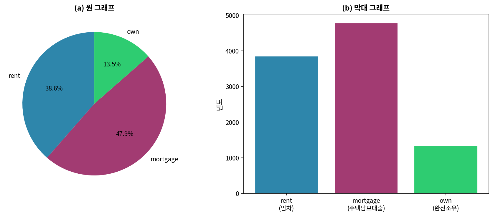

*그림 4.5: 주택 소유 형태의 원 그래프와 막대 그래프. 두 그래프 모두 대출을 받는 개인의 약 절반이 주택담보대출을 보유하고 있음을 보여준다. 약간 더 작은 집단이 임차이며, 가장 작은 차용인 집단이 집을 완전 소유한다.*

원 그래프는 매우 적은 수의 수준을 가진 범주형 변수를 시각화할 때 잘 작동하며, 특히 각 수준이 단순 분수(예: 1/2, 1/4 등)를 나타낼 때 효과적이다. 그러나 많은 수준을 가진 범주형 변수를 시각화하는 데 사용할 때는 읽기가 상당히 어려울 수 있다. 예를 들어, 그림 4.6의 원 그래프 (a)와 막대 그래프 (b)는 모두 대출 등급(A부터 G까지)의 분포를 나타낸다. 이 경우, 막대 그래프를 사용하여 각 대출 등급의 개수를 비교하는 것이 원 그래프보다 훨씬 쉽다.

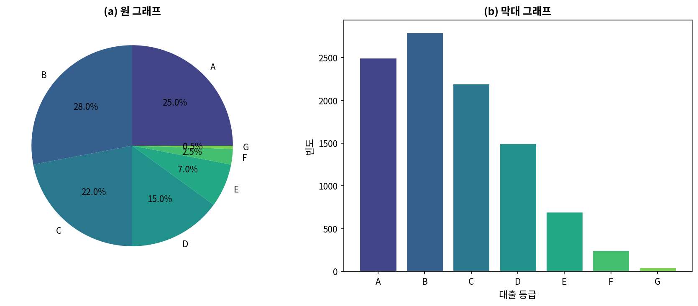

*그림 4.6: 대출 등급의 원 그래프와 막대 그래프. 두 그래프 모두 가장 빈번한 등급이 A, B, C임을 보여준다. 막대 그래프는 각 등급의 대출 수를 세는 것을 더 쉽게 만든다.*

***

### [새로운 시각] 원 그래프에 대한 비판적 고찰

원 그래프는 통계 시각화에서 가장 논쟁이 되는 그래프 유형 중 하나이다. 유명한 통계학자 에드워드 터프티(Edward Tufte)는 "원 그래프의 유일한 나쁜 점은 그것이 존재한다는 것이다"라고 말한 적이 있을 정도이다.

**왜 원 그래프가 문제가 되는가?**

1. **각도 인식의 한계**: 인간의 시각 시스템은 각도보다 길이를 비교하는 데 더 정확하다. 25%와 27%의 차이를 원 그래프에서 구별하기 어렵지만, 막대 그래프에서는 쉽게 볼 수 있다.

2. **비교의 어려움**: 두 개의 원 그래프를 비교하는 것은 두 개의 막대 그래프를 비교하는 것보다 훨씬 어렵다.

3. **3D 원 그래프의 왜곡**: 3차원 원 그래프는 원근법으로 인해 앞쪽 조각이 더 크게 보이는 심각한 왜곡을 일으킨다.

**그럼에도 원 그래프가 유용한 경우**:
- 전체 대비 부분의 개념을 강조해야 할 때
- 2-3개의 범주만 있을 때
- 각 범주가 대략 25%, 50%, 75%와 같은 명확한 비율을 나타낼 때

대안으로 **와플 차트**(waffle chart)를 고려해 볼 수 있다. 이는 다음 절에서 다룬다.

***

## 4.5 와플 차트

범주형 데이터를 시각화하는 또 다른 유용한 기법은 **와플 차트**(waffle chart)이다. 와플 차트는 범주형 변수의 각 수준에 속하는 데이터의 비율을 전달하는 데 사용될 수 있다. 원 그래프와 마찬가지로, 표현되는 수준의 수가 적을 때 가장 잘 작동한다. 그러나 원 그래프와 달리, 단순 분수가 아닌 비율을 비교하기 더 쉽게 만들 수 있다.

그림 4.7 (a)는 주택 소유 형태의 와플 차트이고, 그림 4.7 (b)는 대출 상태의 와플 차트이다.

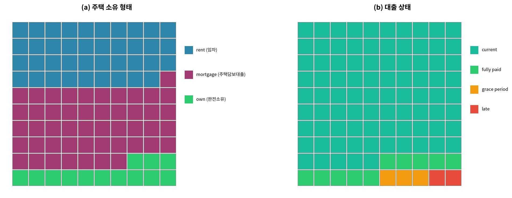

*그림 4.7: 주택 소유 형태와 대출 상태의 와플 차트. 와플 차트는 10×10 격자로 분해되며, 각 정사각형은 데이터의 1%를 나타낸다. 정사각형은 변수 분포에 비례하여 색칠된다.*

***

### [새로운 시각] 와플 차트의 인지적 장점

와플 차트가 원 그래프보다 나은 이유는 **단위 시각화**(unit visualization)의 원리에 있다. 각 작은 정사각형이 데이터의 1%를 나타내므로, 우리는 직접 "세어볼" 수 있다.

100개의 작은 정사각형 중:
- 약 39개가 임차 (39%)
- 약 48개가 주택담보대출 (48%)
- 약 13개가 완전 소유 (13%)

이러한 표현 방식은 특히 다음과 같은 상황에서 효과적이다:
1. **표본 크기 인식**: 원래 데이터가 몇 개의 관측치로 이루어져 있는지 직관적으로 이해할 수 있다.
2. **불확실성 표현**: 각 정사각형이 실제 사람이나 사례를 나타낸다고 생각하면, 통계적 불확실성을 더 잘 인식할 수 있다.
3. **아이콘 배열**: 와플 차트를 아이콘 배열(pictograph)로 확장하면, 예를 들어 사람 아이콘을 사용하여 더 직관적인 시각화가 가능하다.

***

## 4.6 그룹 간 수치형 데이터 비교

더 흥미로운 조사 중 일부는 그룹 간 수치형 데이터를 살펴봄으로써 고려될 수 있다. 이 절에서는 같은 그래프에 여러 그룹의 수치형 데이터에 대한 플롯을 만들기 위해 이미 본 몇 가지 방법을 확장하고, 그룹 간 수치형 데이터를 비교하기 위한 몇 가지 새로운 방법을 소개한다.

`county` 데이터셋을 다시 살펴보고, 2010년부터 2017년까지 인구가 증가한 카운티와 증가하지 않은 카운티의 가구 중위 소득을 비교할 것이다. 소득과 인구 증가 사이에 인과 관계를 만들고 싶을 수 있지만, 이것은 관찰 데이터이므로 그러한 해석은 기껏해야 불완전하다는 것을 기억하라.

미국의 3,142개 카운티에 대한 데이터가 있다. 그중 3개의 카운티에서 2017년 인구 데이터가 누락되어 있으며, 나머지 3,139개 카운티 중 1,541개에서 2010년부터 2017년까지 인구가 증가했고, 나머지 1,598개에서는 인구가 감소하였다. 표 4.6은 각 그룹에서 네 개의 관측치 표본을 보여준다.

**표 4.6**: 2010년부터 2017년까지 인구 증가가 있는 카운티와 인구 증가가 없는 카운티의 무작위 표본에서의 가구 중위 소득

| 주 | 카운티 | 인구 변화 (%) | 증가/미증가 | 가구 중위 소득 |
|----|--------|:-------------:|:-----------:|:--------------:|
| Arkansas | Izard County | 2.13 | 증가 | $39,135 |
| Georgia | Jackson County | 10.17 | 증가 | $57,999 |
| Oregon | Hood River County | 3.41 | 증가 | $57,269 |
| Texas | Montague County | 0.75 | 증가 | $46,592 |
| Kentucky | Ballard County | -2.62 | 미증가 | $42,988 |
| Kentucky | Letcher County | -5.13 | 미증가 | $30,293 |
| Texas | Jim Hogg County | -1.12 | 미증가 | $31,403 |
| Virginia | Richmond County | -0.19 | 미증가 | $47,341 |

색상을 사용하여 범주형 변수의 수준별로 수치형 변수의 히스토그램을 분할할 수 있다(히스토그램에 대한 소개는 제5.3절 참조). 이에 대한 예가 그림 4.8 (a)에 나와 있다.

**병렬 상자 그림**(side-by-side box plot)은 그룹 간 비교를 위한 또 다른 전통적인 도구이다. 예가 그림 4.8 (b)에 나와 있으며, 여기에는 각 그룹에 대해 하나씩 두 개의 상자 그림(상자 그림에 대한 소개는 제5.5절 참조)이 하나의 그래프 창에 배치되어 동일한 척도로 그려진다.

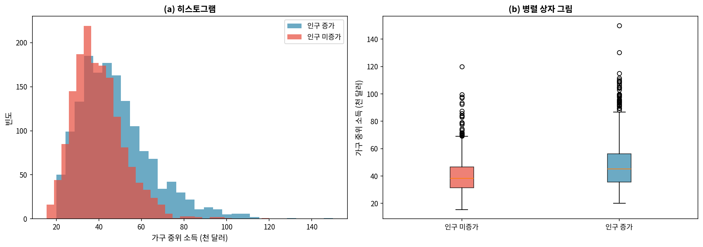

*그림 4.8: 인구 증가 여부에 따른 카운티별 가구 중위 소득의 시각화. (a) 히스토그램. (b) 병렬 상자 그림. 두 그래프 모두에서 인구 증가가 있는 카운티가 더 높은 중심의 가구 소득 분포를 가지고 있다.*

***

**Guided Practice 4.4** 그림 4.8의 그래프를 사용하여 두 그룹의 소득을 비교하라. 각 그룹의 대략적인 중심에 대해 무엇을 알 수 있는가? 그룹 간 변동성에 대해 무엇을 알 수 있는가? 그룹 간 형태가 비교적 일관적인가? 각 그룹에 몇 개의 *두드러진* 최빈값이 있는가?

**풀이**:

답변은 약간 다를 수 있다. 인구 증가가 있는 카운티는 소득이 더 높은 경향이 있다(중위수 약 $45,000) 반면, 인구 증가가 없는 카운티는 더 낮다(중위수 약 $40,000). 변동성도 인구 증가 그룹에서 약간 더 크다. 이는 IQR에서 분명하게 나타나는데, *증가* 그룹에서 약 50% 더 크다.

두 분포 모두 약간에서 중간 정도의 오른쪽 치우침을 보이며 단봉형이다. 상자 그림은 각 그룹에서 중위수보다 훨씬 위에 많은 관측치가 있음을 나타내지만, 수백 개 이상의 데이터 포인트를 포함하는 데이터셋을 검토할 때 많은 관측치가 수염 너머에 떨어질 것으로 예상해야 한다.

**Python 코드**:

```python
import numpy as np
import matplotlib.pyplot as plt

# 시뮬레이션 데이터 생성
np.random.seed(42)

# 인구 증가 카운티 (중위수 약 45,000)
income_gain = np.random.lognormal(mean=10.7, sigma=0.35, size=1541)
income_gain = np.clip(income_gain, 20000, 150000)

# 인구 미증가 카운티 (중위수 약 40,000)
income_no_gain = np.random.lognormal(mean=10.55, sigma=0.30, size=1598)
income_no_gain = np.clip(income_no_gain, 15000, 120000)

fig, axes = plt.subplots(1, 2, figsize=(14, 5))

# (a) 히스토그램
axes[0].hist(income_gain, bins=30, alpha=0.7, label='인구 증가', color='#3498db')
axes[0].hist(income_no_gain, bins=30, alpha=0.7, label='인구 미증가', color='#e74c3c')
axes[0].set_xlabel('가구 중위 소득 ($)')
axes[0].set_ylabel('빈도')
axes[0].set_title('(a) 히스토그램')
axes[0].legend()

# (b) 병렬 상자 그림
bp = axes[1].boxplot([income_no_gain, income_gain], 
                      labels=['인구 미증가', '인구 증가'],
                      patch_artist=True)
bp['boxes'][0].set_facecolor('#e74c3c')
bp['boxes'][1].set_facecolor('#3498db')
axes[1].set_ylabel('가구 중위 소득 ($)')
axes[1].set_title('(b) 병렬 상자 그림')

plt.tight_layout()
plt.savefig('fig_4_8_income_comparison.png', dpi=150, bbox_inches='tight')
plt.show()

print(f"인구 증가 카운티 중위수: ${np.median(income_gain):,.0f}")
print(f"인구 미증가 카운티 중위수: ${np.median(income_no_gain):,.0f}")
```

***

**Guided Practice 4.5** 그림 4.8의 각 그래프에서 어떤 구성 요소가 가장 유용하다고 생각하는가?

**풀이**:

답변은 다를 것이다. 병렬 상자 그림은 특히 중심과 산포를 비교하는 데 유용하고, 빈 히스토그램은 분포 형태, 치우침, 최빈값 및 잠재적 이상치를 보는 데 더 유용하다.

***

그룹 간 수치형 데이터를 비교하기 위한 또 다른 유용한 시각화는 **능선 그래프**(ridge plot)로, 동일한 척도로 하나의 그래프 창에 여러 그룹의 밀도 그래프(밀도 그래프에 대한 소개는 제5.5절 참조)를 결합한다. 그림 4.9는 인구 증가 여부에 따른 카운티별 가구 중위 소득 분포에 대한 능선 그래프를 보여준다.

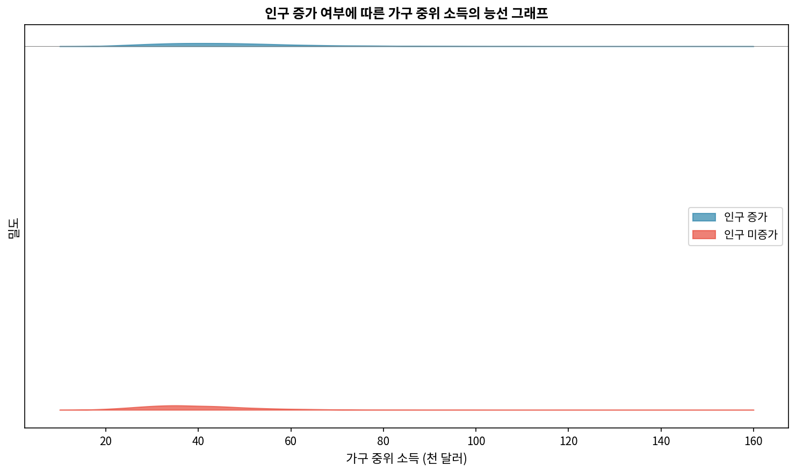

*그림 4.9: 인구 증가 여부에 따른 가구 중위 소득의 능선 그래프. 인구 증가가 있는 카운티가 더 높은 중심의 가구 소득 분포를 가지고 있음을 보여준다.*

***

**Guided Practice 4.6** 그림 4.9의 능선 그래프에서 그림 4.8의 것들과 비교하여 어떤 구성 요소가 가장 유용하다고 생각하는가?

**풀이**:

능선 그래프는 특히 분포의 형태와 최빈성(modality)에 대한 더 나은 감각을 제공한다.

***

그룹 간 수치형 데이터를 비교하기 위해 강조할 마지막 시각화 기법은 **면 분할**(faceting)이다. 이 기법에서는 그룹에 따라 데이터의 그래픽 표시를 여러 그래프 창으로 분할(면 분할)한다.

그림 4.10 (a)는 그림 4.8 (a)와 동일한 정보를 보여주지만, 여기서는 인구 증가 여부에 따른 카운티의 가구 중위 소득 분포가 두 개의 그래프 창으로 면 분할되어 있다. 비교를 쉽게 하기 위해 x축과 y축의 동일한 척도를 유지한다.

이 접근법의 장점은 두 범주형 변수의 수준에 걸쳐 데이터를 분할하도록 확장할 수 있어 세 변수 간의 관계를 표시할 수 있다는 것이다. 그림 4.10 (b)에서는 이제 `pop_change`와 `metro` 변수를 사용하여 데이터를 네 그룹으로 분할하였다:

- 왼쪽 상단: 인구 증가가 있는 대도시 지역이 *아닌* 카운티
- 오른쪽 상단: 인구 증가가 있는 대도시 지역인 카운티
- 왼쪽 하단: 인구 증가가 없는 대도시 지역이 아닌 카운티
- 오른쪽 하단: 인구 증가가 없는 대도시 지역인 카운티

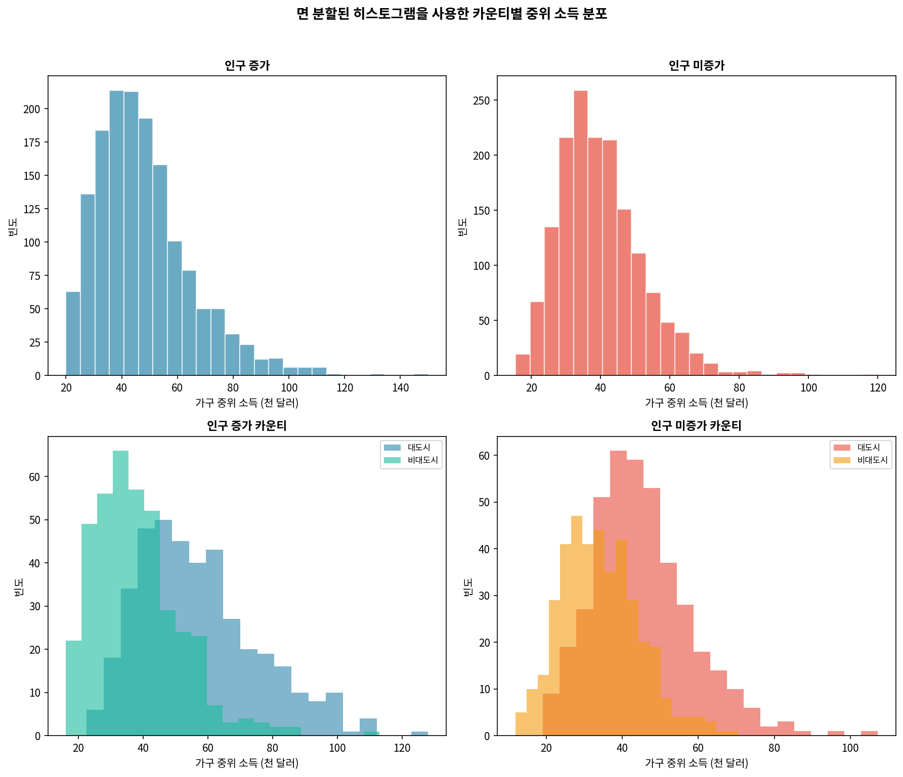

*그림 4.10: 면 분할된 히스토그램을 사용한 카운티별 중위 소득 분포. (a) 인구 증가별. (b) 인구 증가와 대도시 지역 여부 모두별.*

그림 4.11에서는 `median_edu`(카운티의 중위 교육 수준)라는 변수를 하나 더 추가하여 이 시각화를 계속 구축할 수 있다. 그림 4.11에서는 중위 교육 수준을 색상으로 나타내며, 분홍색(실선)은 중위 교육 수준이 고등학교 졸업장인 카운티를, 노란색(점선)은 대학 중퇴인 카운티를, 빨간색(점선)은 학사 학위인 카운티를 나타낸다.

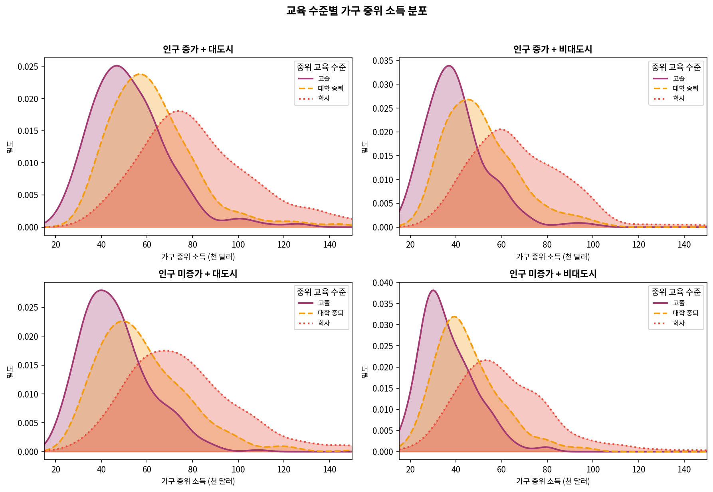

*그림 4.11: 카운티가 인구 증가 여부와 대도시 지역 여부에 따라 면 분할되고 카운티의 중위 교육 수준별로 색칠된 능선 그래프를 사용한 카운티별 중위 소득 분포. 중위 교육 수준이 학사 학위인 카운티는 대학 중퇴 또는 고등학교 졸업장만 있는 카운티보다 상당히 높은 가구 소득 분포를 가지고 있다.*

***

**Guided Practice 4.7** 그림 4.11을 기반으로, 인구 증가/미증가, 대도시 지역/비대도시 지역, 중위 학위에 따라 카운티의 가구 중위 소득이 어떻게 다른지에 대해 무엇을 말할 수 있는가?

**풀이**:

위치(대도시 여부)나 인구 변화에 관계없이, 고등학교 졸업장만 가진 개인에서 대학 중퇴, 학사 학위로 중위 가구 소득이 증가하는 것처럼 보인다. 특히 학사 학위를 가진 카운티는 다른 두 교육 수준 카운티보다 현저히 높은 소득 분포를 보인다.

***

### [새로운 시각] 심슨의 역설과 다변량 분석의 중요성

그림 4.10과 4.11은 왜 단일 변수만 볼 때 잘못된 결론에 도달할 수 있는지를 보여주는 좋은 예이다. 이는 **심슨의 역설**(Simpson's Paradox)과 밀접하게 관련되어 있다.

예를 들어, 전체 데이터에서 "인구 증가가 있는 카운티는 소득이 높다"는 결론을 내렸다고 가정하자. 하지만 이 관계가 실제로 무엇 때문인지 생각해 보면:

1. 대도시 지역은 인구 증가 가능성이 더 높다.
2. 대도시 지역은 소득도 더 높다.
3. 따라서 인구 증가와 소득 간의 관계는 "대도시 여부"라는 **혼란변수**(confounding variable)에 의해 부분적으로 설명될 수 있다.

이것이 바로 **다변량 분석**의 중요성이다. 단일 관계를 해석하기 전에, 잠재적 혼란변수를 고려해야 한다. 면 분할과 색상을 사용한 시각화는 이러한 복잡한 관계를 탐색하는 강력한 도구이다.

통계학의 유명한 격언 중 하나는 "상관관계는 인과관계를 의미하지 않는다"이다. 이 장에서 배운 시각화 기법은 이 격언의 의미를 실제로 이해하는 데 도움이 된다.

***

## 4.7 장 복습

### 4.7.1 요약

범주형 변수를 능숙하게 다루는 것은 데이터 분석가에게 중요한 기술이다. 이 장에서는 범주형 변수에 적용되는 다양한 시각화와 수치적 요약을 소개하였다. 두 변수가 동시에 제시될 때 그래픽 시각화는 더욱 설명력이 있다. 막대 그래프, 모자이크 플롯, 원 그래프, 조건부 비율의 추정을 제시하였다.

### 4.7.2 용어

이 장에서 소개한 용어는 표 4.7에 제시되어 있다. 이러한 용어 중 일부의 의미가 확실하지 않다면, 텍스트로 돌아가서 정의를 검토하는 것이 좋다. **굵은 글씨**로 쉽게 찾을 수 있다.

**표 4.7**: 이 장에서 소개한 용어

| 한국어 | 영문 |
|--------|------|
| 열 비율 | column proportions |
| 열 합계 | column totals |
| 조건부 비율 | conditional proportions |
| 분할표 | contingency table |
| 병렬 막대 그래프 | dodged bar plot |
| 면 분할 플롯 | faceted plot |
| 채워진 막대 그래프 | filled bar plot |
| 모자이크 플롯 | mosaic plot |
| 능선 그래프 | ridge plot |
| 행 비율 | row proportions |
| 행 합계 | row totals |
| 병렬 상자 그림 | side-by-side box plot |
| 누적 막대 그래프 | stacked bar plot |
| 표준화된 막대 그래프 | standardized bar plot |

***

## 4.8 연습문제

홀수 번호 연습문제의 답은 부록 A.4에서 찾을 수 있다.

***

### 연습문제 1: 아동의 항생제 사용

아래의 막대 그래프와 원 그래프는 기관지염(상기도 감염) 치료에서 항생제의 최적 사용 기간에 대한 연구에 참여한 아동의 기존 의료 상태 분포를 보여준다.

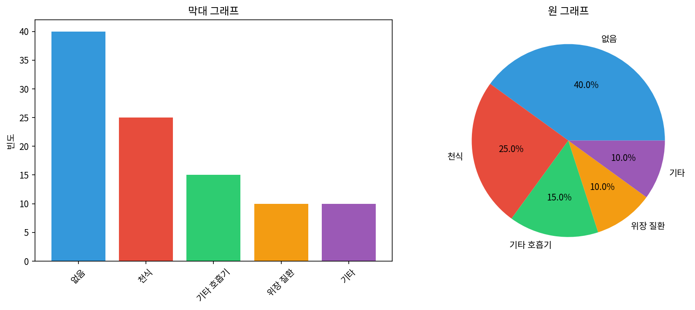

**(a)** 막대 그래프에서는 명확하지만 원 그래프에서는 명확하지 않은 특징은 무엇인가?

**(b)** 원 그래프에서는 명확하지만 막대 그래프에서는 명확하지 않은 특징은 무엇인가?

**(c)** 이러한 범주형 데이터를 표시하는 데 어떤 그래프를 선호하겠는가?

***

**연습문제 1 상세 풀이**:

**(a) 막대 그래프에서 명확한 특징:**
- 범주의 순서와 상대 빈도를 볼 수 있다.
- 각 범주의 정확한 빈도/비율을 쉽게 비교할 수 있다.
- 범주 간의 크기 차이가 명확하게 보인다.

**(b) 원 그래프에서 명확한 특징:**
- 원 그래프에서는 보이지만 막대 그래프에서는 보이지 않는 특징은 없다. 원 그래프가 제공하는 정보는 막대 그래프에서도 모두 얻을 수 있다.

**(c) 선호하는 그래프:**
- 막대 그래프를 선호한다. 범주의 상대 빈도도 볼 수 있고, 원 그래프의 모든 정보를 포함하면서도 더 정확한 비교가 가능하기 때문이다.

**Python 코드**:

```python
import matplotlib.pyplot as plt
import numpy as np

# 예시 데이터 (기존 의료 상태)
conditions = ['없음', '천식', '기타 호흡기', '위장 질환', '기타']
counts = [40, 25, 15, 10, 10]

fig, axes = plt.subplots(1, 2, figsize=(12, 5))

# 막대 그래프
colors = ['#3498db', '#e74c3c', '#2ecc71', '#f39c12', '#9b59b6']
axes[0].bar(conditions, counts, color=colors)
axes[0].set_ylabel('빈도')
axes[0].set_title('막대 그래프')
axes[0].tick_params(axis='x', rotation=45)

# 원 그래프
axes[1].pie(counts, labels=conditions, autopct='%1.1f%%', colors=colors)
axes[1].set_title('원 그래프')

plt.tight_layout()
plt.savefig('fig_ex_4_1.png', dpi=150, bbox_inches='tight')
plt.show()
```

***

### 연습문제 3: Black Lives Matter

2020년 6월 미국에서 실시된 Washington Post-Schar School 여론조사에서, 1,006명의 성인 무작위 전국 표본을 대상으로 미국 전역의 도시에서 조지 플로이드 살해 이후 발생한 시위를 지지하는지 반대하는지 물었다. 설문조사에서는 응답자의 나이 정보도 수집하였다. 결과는 아래의 누적 막대 그래프에 요약되어 있다.

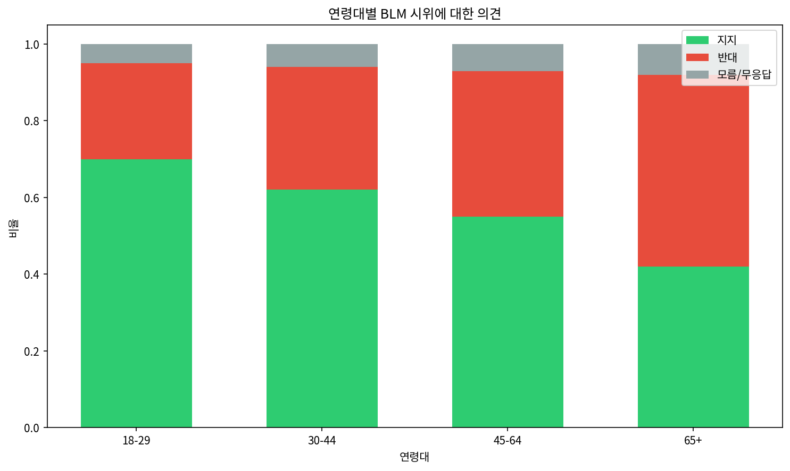

**(a)** 누적 막대 그래프를 기반으로, 시위에 대한 견해와 나이가 연관되어 있는 것처럼 보이는가? 이유를 설명하라.

**(b)** 이 두 변수 간의 잠재적 연관성을 설명할 수 있는 다른 가능한 변수를 추측하라.

***

**연습문제 3 상세 풀이**:

**(a) 연관성 분석:**
연령 그룹이 다양한 의견 수준으로 나뉘는 수평 위치가 다르므로, 시위 지지 가능성이 연령 그룹에 따라 다르다는 것을 나타낸다. 두 변수가 연관되어 있을 수 있다.

구체적으로:
- 젊은 연령층(18-29세)은 시위를 지지하는 비율이 더 높은 경향이 있다.
- 나이가 많은 연령층(65세 이상)은 시위를 반대하는 비율이 더 높은 경향이 있다.

따라서 연령과 시위에 대한 견해 사이에 연관성이 있는 것으로 보인다.

**(b) 잠재적 혼란변수:**
- **정치적 이념/성향**: 보수적인 사람은 반대할 가능성이 높고, 진보적인 사람은 지지할 가능성이 높을 수 있다.
- **교육 수준**: 교육 수준에 따라 사회 운동에 대한 견해가 다를 수 있다.

**Python 코드**:

```python
import matplotlib.pyplot as plt
import numpy as np

# 예시 데이터 (연령대별 시위 의견)
age_groups = ['18-29', '30-44', '45-64', '65+']
support = [0.70, 0.62, 0.55, 0.42]
oppose = [0.25, 0.32, 0.38, 0.50]
unsure = [0.05, 0.06, 0.07, 0.08]

x = np.arange(len(age_groups))
width = 0.6

fig, ax = plt.subplots(figsize=(10, 6))

ax.bar(x, support, width, label='지지', color='#2ecc71')
ax.bar(x, oppose, width, bottom=support, label='반대', color='#e74c3c')
ax.bar(x, unsure, width, bottom=np.array(support)+np.array(oppose), 
       label='모름/무응답', color='#95a5a6')

ax.set_ylabel('비율')
ax.set_xlabel('연령대')
ax.set_xticks(x)
ax.set_xticklabels(age_groups)
ax.set_title('연령대별 BLM 시위에 대한 의견')
ax.legend(loc='upper right')

plt.tight_layout()
plt.savefig('fig_ex_4_3.png', dpi=150, bbox_inches='tight')
plt.show()
```

***

### 연습문제 5: 심장 이식 데이터 표시

스탠포드 대학교 심장 이식 연구는 실험적 심장 이식 프로그램이 수명을 증가시키는지 결정하기 위해 수행되었다. 프로그램에 참여하는 각 환자는 공식적으로 심장 이식 후보로 지정되었으며, 이는 그들이 중증이고 새로운 심장의 혜택을 받을 수 있음을 의미한다. 환자들은 치료군과 대조군에 무작위로 배정되었다. 치료군의 환자들은 이식을 받았고, 대조군의 환자들은 받지 않았다. 아래의 시각화는 연구 결과의 두 가지 다른 버전을 보여준다.

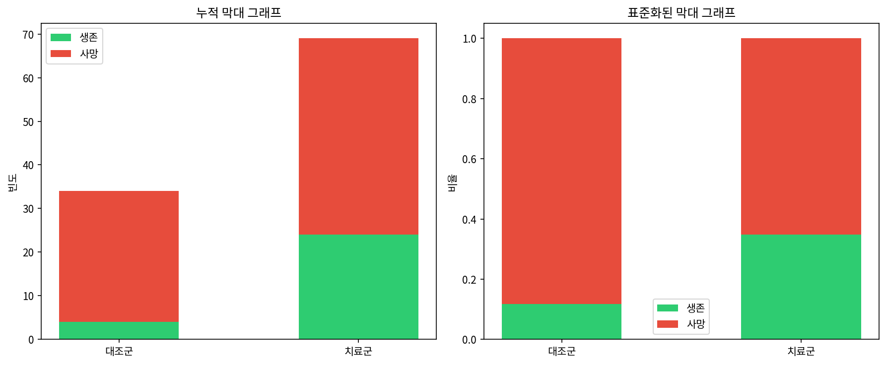

**(a)** 누적 막대 그래프(왼쪽)에서 더 쉽게 볼 수 있는 두 그룹 비교의 한 측면을 제공하라.

**(b)** 표준화된 막대 그래프(오른쪽)에서 더 쉽게 볼 수 있는 두 그룹 비교의 한 측면을 제공하라.

**(c)** 심장 이식 연구에서 이러한 측면 중 어느 것이 표시하기에 더 중요하겠는가? 즉, 어떤 막대 그래프가 데이터 시각화로서 더 나은가?

***

**연습문제 5 상세 풀이**:

**(a) 누적 막대 그래프의 장점:**
- 각 그룹의 참가자 수를 볼 수 있다.

**(b) 표준화된 막대 그래프의 장점:**
- 생존 비율을 직접 비교할 수 있다.

**(c) 심장 이식 연구에 더 적합한 그래프:**
표준화된 막대 그래프가 더 적합하다. 연구의 주요 관심사는 치료군 대 대조군의 생존 *비율* 향상이기 때문이다.

**Python 코드**:

```python
import matplotlib.pyplot as plt
import numpy as np

# 데이터 (심장 이식 연구)
groups = ['대조군', '치료군']
alive = [4, 24]
dead = [30, 45]

fig, axes = plt.subplots(1, 2, figsize=(12, 5))

x = np.arange(len(groups))
width = 0.5

# 누적 막대 그래프
axes[0].bar(x, alive, width, label='생존', color='#2ecc71')
axes[0].bar(x, dead, width, bottom=alive, label='사망', color='#e74c3c')
axes[0].set_xticks(x)
axes[0].set_xticklabels(groups)
axes[0].set_ylabel('빈도')
axes[0].set_title('누적 막대 그래프')
axes[0].legend()

# 표준화된 막대 그래프
totals = np.array(alive) + np.array(dead)
alive_prop = np.array(alive) / totals
dead_prop = np.array(dead) / totals

axes[1].bar(x, alive_prop, width, label='생존', color='#2ecc71')
axes[1].bar(x, dead_prop, width, bottom=alive_prop, label='사망', color='#e74c3c')
axes[1].set_xticks(x)
axes[1].set_xticklabels(groups)
axes[1].set_ylabel('비율')
axes[1].set_title('표준화된 막대 그래프')
axes[1].legend()

plt.tight_layout()
plt.savefig('fig_ex_4_5.png', dpi=150, bbox_inches='tight')
plt.show()

print(f"대조군 생존율: {alive[0]/(alive[0]+dead[0]):.1%}")
print(f"치료군 생존율: {alive[1]/(alive[1]+dead[1]):.1%}")
```

***

### 연습문제 7: 육류 소비와 기대 수명

You et al. (2022)에서 수집한 데이터에서, 총 육류 섭취량은 175개국의 기대 수명(출생 시)과 관련이 있다. 육류 섭취량은 연간 1인당 kg으로 측정된다(2011년부터 2013년까지 평균). 두 개의 능선 그래프는 소득과 육류 소비 사이의 연관성(고소득 국가가 더 많은 육류를 먹는 경향이 있음)과 소득과 기대 수명 사이의 연관성(고소득 국가가 더 높은 기대 수명을 가짐)을 보여준다.

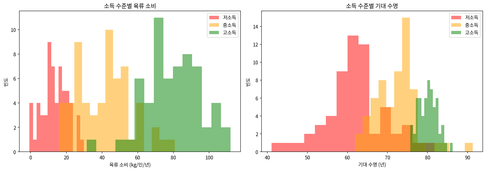

**(a)** 위의 그래프가 육류 소비와 기대 수명이 연관되어 있음을 보여주는가? 즉, 육류 소비가 낮은 국가가 기대 수명이 낮은지 알 수 있는가? 설명하라.

**(b)** 육류 소비와 기대 수명을 비교하는 그래프가 있고, 그것들이 *실제로* 연관되어 있다고 가정하자. 친구가 그 그래프가 높은 육류 소비가 더 긴 수명으로 이어진다는 것을 보여준다고 말한다. 당신은 정확하게 말한다: 아니, 관계가 소득 수준에 의해 혼란되어 있기 때문에 인과 관계가 있는지 알 수 없다. 당신이 의미하는 바를 설명하라.

**(c)** 혼란변수(소득과 같은)가 있는 상황에서 육류 소비와 기대 수명 간의 관계를 어떻게 조사할 수 있는가?

***

**연습문제 7 상세 풀이**:

**(a) 육류 소비와 기대 수명의 연관성:**
위의 그래프는 육류 소비와 기대 수명 간의 관계를 직접 보여주지 않는다. 고소득 국가 그룹이 가장 높은 육류 소비와 가장 높은 기대 수명을 가지고 있는 것은 사실이지만, 예를 들어 저소득과 중간 소득 그룹 간의 육류 소비를 구별할 수 없으므로(기대 수명과 연결하기 위해). 또한 소득 그룹 *내에서* 육류 소비와 기대 수명 간의 관계에 대해 아무것도 알 수 없다.

**(b) 혼란(교란)에 대한 설명:**
관계가 혼란되면 인과 메커니즘을 결정할 수 없다. 더 긴 기대 수명이 육류 소비 때문인지 더 높은 소득(많은 다른 수명 연장 관행과 함께 오는) 때문인지 알 수 없다.

**(c) 혼란변수 존재 시 관계 조사 방법:**
특정 혼란변수를 조사하기 위해:
1. 먼저 해당 혼란변수(여기서는 소득)에 따라 데이터를 범주로 나눈다.
2. 그런 다음 혼란변수의 각 수준(소득)에 대해 관심 있는 관계(육류 소비와 기대 수명)를 별도로 살펴본다.
3. 이를 **층화 분석**(stratified analysis)이라고 한다.

**Python 코드**:

```python
import matplotlib.pyplot as plt
import numpy as np
from scipy import stats

# 시뮬레이션 데이터 생성
np.random.seed(42)
n = 60

# 저소득 국가
meat_low = np.random.normal(15, 8, n)
life_exp_low = np.random.normal(62, 8, n)

# 중소득 국가
meat_mid = np.random.normal(40, 15, n)
life_exp_mid = np.random.normal(72, 5, n)

# 고소득 국가
meat_high = np.random.normal(80, 15, n)
life_exp_high = np.random.normal(80, 3, n)

fig, axes = plt.subplots(1, 2, figsize=(14, 5))

# 육류 소비 능선 그래프 (간단한 히스토그램으로 대체)
axes[0].hist(meat_low, alpha=0.5, label='저소득', color='red', bins=15)
axes[0].hist(meat_mid, alpha=0.5, label='중소득', color='orange', bins=15)
axes[0].hist(meat_high, alpha=0.5, label='고소득', color='green', bins=15)
axes[0].set_xlabel('육류 소비 (kg/인/년)')
axes[0].set_ylabel('빈도')
axes[0].set_title('소득 수준별 육류 소비')
axes[0].legend()

# 기대 수명 능선 그래프
axes[1].hist(life_exp_low, alpha=0.5, label='저소득', color='red', bins=15)
axes[1].hist(life_exp_mid, alpha=0.5, label='중소득', color='orange', bins=15)
axes[1].hist(life_exp_high, alpha=0.5, label='고소득', color='green', bins=15)
axes[1].set_xlabel('기대 수명 (년)')
axes[1].set_ylabel('빈도')
axes[1].set_title('소득 수준별 기대 수명')
axes[1].legend()

plt.tight_layout()
plt.savefig('fig_ex_4_7.png', dpi=150, bbox_inches='tight')
plt.show()
```

***

### 연습문제 9: 정시 도착

2013년 뉴욕시에서 출발하여 푸에르토리코(BQN), 로스앤젤레스(LAX), 샌프란시스코(SFO)로 향하는 JetBlue(B6) 또는 United Airlines(UA) 항공편을 고려하라. 아래는 각 항공사별, 각 도시별 지연(`delayed`) 및 정시(`on time`) 항공편 수의 표이다.

| dest | carrier | status | count |
|------|---------|--------|-------|
| BQN | B6 | delayed | 271 |
| BQN | B6 | on time | 322 |
| BQN | UA | delayed | 144 |
| BQN | UA | on time | 151 |
| LAX | B6 | delayed | 670 |
| LAX | B6 | on time | 999 |
| LAX | UA | delayed | 2368 |
| LAX | UA | on time | 3402 |
| SFO | B6 | delayed | 405 |
| SFO | B6 | on time | 615 |
| SFO | UA | delayed | 2694 |
| SFO | UA | on time | 4034 |

**(a)** 모든 JetBlue 항공편 중 지연된 비율은 얼마인가? 모든 United Airlines 항공편 중 지연된 비율은 얼마인가?

**(b)** 세 공항 각각에 대해, JetBlue와 United 각각의 지연된 항공편 비율을 구하라(6개의 숫자가 있어야 한다).

**(c)** United는 세 도시 각각에서 더 높은 비율의 지연 항공편을 가지고 있지만, JetBlue는 전체적으로 더 높은 비율의 지연 항공편을 가지고 있다. 제공된 데이터 수를 사용하여 이 겉보기 역설이 어떻게 발생할 수 있는지 설명하라.

***

**연습문제 9 상세 풀이**:

**(a) 전체 지연 비율:**

JetBlue 전체:
- 지연: 271 + 670 + 405 = 1,346
- 정시: 322 + 999 + 615 = 1,936
- 전체: 1,346 + 1,936 = 3,282
- 지연 비율: 1,346 / 3,282 = **41.0%**

United 전체:
- 지연: 144 + 2,368 + 2,694 = 5,206
- 정시: 151 + 3,402 + 4,034 = 7,587
- 전체: 5,206 + 7,587 = 12,793
- 지연 비율: 5,206 / 12,793 = **40.7%**

**(b) 각 공항별 지연 비율:**

BQN:
- JetBlue: 271/(271+322) = 271/593 = **45.7%** 지연
- United: 144/(144+151) = 144/295 = **48.8%** 지연 (United가 더 높음)

LAX:
- JetBlue: 670/(670+999) = 670/1669 = **40.1%** 지연
- United: 2368/(2368+3402) = 2368/5770 = **41.0%** 지연 (United가 더 높음)

SFO:
- JetBlue: 405/(405+615) = 405/1020 = **39.7%** 지연
- United: 2694/(2694+4034) = 2694/6728 = **40.0%** 지연 (United가 더 높음)

**(c) 심슨의 역설 설명:**

이것은 **심슨의 역설**(Simpson's Paradox)의 전형적인 예이다.

- JetBlue는 BQN으로의 항공편이 United보다 훨씬 많다(593 vs 295). BQN은 지연율이 높은 노선이다.
- United는 SFO와 LAX로의 항공편이 훨씬 많다(둘 다 지연율이 상대적으로 낮음).

따라서:
- JetBlue의 전체 지연 비율은 BQN 항공편(지연율 높음)에 의해 끌어올려진다.
- United의 전체 지연 비율은 SFO와 LAX 항공편(지연율 낮음)에 의해 끌어내려진다.

결과적으로, 개별 도시에서는 United가 더 높은 지연율을 가지지만, 전체적으로는 JetBlue가 더 높은 지연율을 보인다.

**Python 코드**:

```python
import pandas as pd
import numpy as np

# 데이터
data = {
    'dest': ['BQN', 'BQN', 'BQN', 'BQN', 'LAX', 'LAX', 'LAX', 'LAX', 
             'SFO', 'SFO', 'SFO', 'SFO'],
    'carrier': ['B6', 'B6', 'UA', 'UA', 'B6', 'B6', 'UA', 'UA',
                'B6', 'B6', 'UA', 'UA'],
    'status': ['delayed', 'on time', 'delayed', 'on time',
               'delayed', 'on time', 'delayed', 'on time',
               'delayed', 'on time', 'delayed', 'on time'],
    'count': [271, 322, 144, 151, 670, 999, 2368, 3402,
              405, 615, 2694, 4034]
}

df = pd.DataFrame(data)

# 피벗 테이블 생성
pivot = df.pivot_table(index=['dest', 'carrier'], columns='status', 
                       values='count', aggfunc='sum')
pivot['total'] = pivot['delayed'] + pivot['on time']
pivot['delay_rate'] = pivot['delayed'] / pivot['total']

print("공항별, 항공사별 지연율:")
print(pivot.round(3))

# 항공사별 전체 지연율
carrier_totals = df.groupby(['carrier', 'status'])['count'].sum().unstack()
carrier_totals['total'] = carrier_totals['delayed'] + carrier_totals['on time']
carrier_totals['delay_rate'] = carrier_totals['delayed'] / carrier_totals['total']

print("\n항공사별 전체 지연율:")
print(carrier_totals.round(3))

print("\n--- 분석 ---")
print(f"JetBlue 전체 지연율: {carrier_totals.loc['B6', 'delay_rate']:.1%}")
print(f"United 전체 지연율: {carrier_totals.loc['UA', 'delay_rate']:.1%}")
print("\n각 도시에서 United가 더 높은 지연율을 가지지만,")
print("전체적으로는 JetBlue가 더 높은 지연율을 보인다.")
print("이것이 심슨의 역설이다!")
```

***

## 부록: Chapter 4 연습문제 해답 요약 (홀수 번호)

| 연습문제 | 핵심 답변 |
|---------|----------|
| 1 | (a) 범주의 순서와 상대 빈도 (b) 해당 없음 (c) 막대 그래프 선호 |
| 3 | (a) 연령별로 수평 분할 위치가 다르므로 연관성 있음 (b) 정치 성향, 교육 수준 |
| 5 | (a) 참가자 수 (b) 생존 비율 (c) 표준화된 막대 그래프 |
| 7 | (a) 그래프가 직접적 관계를 보여주지 않음 (b) 소득이 혼란변수 (c) 층화 분석 |
| 9 | 심슨의 역설: 개별 도시에서는 UA가 높지만 전체는 B6가 높음 |
