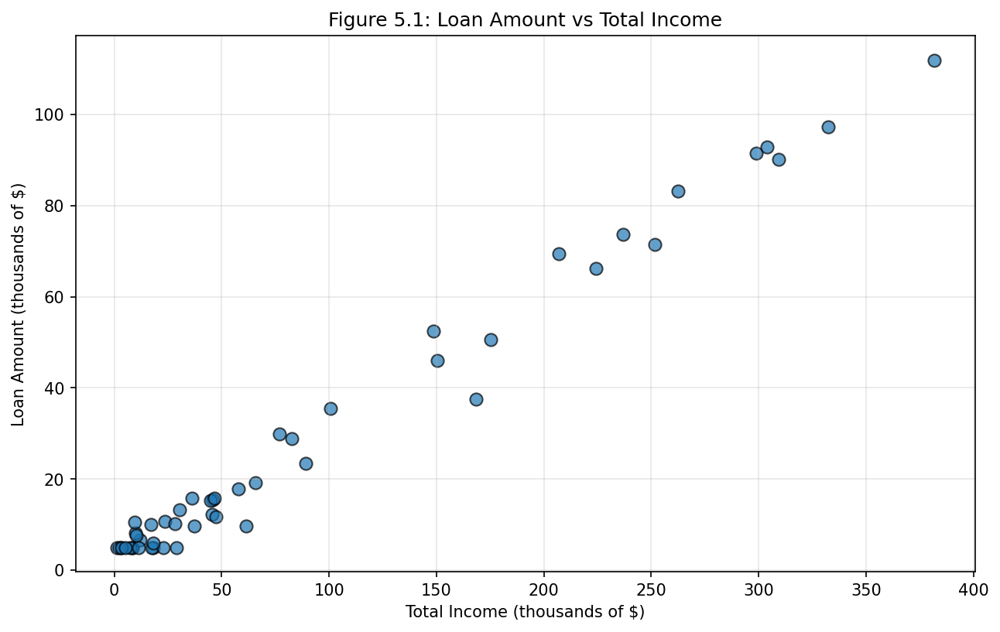

# 제5장 수치형 데이터 탐색

이 장에서는 요약 통계량과 시각화를 활용하여 **수치형**(numerical) 데이터를 탐색하는 방법에 초점을 맞춘다. 이 장에서 제시하는 요약 통계량과 그래프는 통계 소프트웨어를 사용하여 생성하지만, 이것이 처음 접하는 개념일 수 있으므로 이 장에서는 이러한 요약 통계량과 그래프를 만드는 방법을 자세히 설명한다. 이 장의 내용을 숙달하는 것은 이 책의 나머지 부분에서 소개하는 방법과 기법을 이해하는 데 매우 중요하다.

`loan50` 데이터셋에서 `loan_amount` 변수를 살펴보자. 이 변수는 데이터셋에 포함된 50개 대출 각각의 대출 규모를 나타낸다.

이 변수는 두 대출 규모의 수치적 차이를 합리적으로 논의할 수 있으므로 수치형 변수이다. 반면에 지역 번호와 우편번호는 수치형이 아니라 **범주형**(categorical) 변수이다.

이 장 전체에서 1.2절에서 소개한 `loan50`과 `county` 데이터셋을 사용하여 수치적 방법을 적용한다.

> `county` 데이터는 **usdata** R 패키지에서, `loan50` 데이터는 **openintro** R 패키지에서 찾을 수 있다.

---

## 5.1 대응 데이터를 위한 산점도

**산점도**(scatterplot)는 두 수치형 변수에 대한 데이터를 사례별로 보여준다. 그림 1.2에서는 `county` 데이터셋의 자가 주택 소유율과 다세대 주거 구조물(예: 아파트)에 속하는 주거 단위의 비율 간의 관계를 산점도로 살펴보았다. 그림 5.1에서는 `loan50` 데이터셋의 대출자 총 소득(`total_income`)과 대출 금액(`loan_amount`)을 비교하는 또 다른 산점도를 보여준다. 모든 산점도에서 각 점은 하나의 사례를 나타낸다. `loan50`에는 50개의 사례가 있으므로 그림 5.1에는 50개의 점이 있다.



*그림 5.1: `loan50` 데이터셋의 대출 금액 대 총 소득 산점도.*

그림 5.1을 보면, 그래프의 왼쪽에 소득이 $100,000 미만인 대출자가 많고, 소득이 $250,000 이상인 대출자는 소수에 불과하다.

그림 5.2는 미국 3,142개 카운티의 빈곤율과 중위 가구 소득 간의 관계를 보여준다. 점선으로 강조된 것처럼 관계는 명백히 **비선형**(nonlinear)이다.

> **Guided Practice 5.1**
> 산점도는 데이터에 대해 무엇을 드러내며, 어떻게 유용한가?
>
> **풀이:** 산점도는 단순한 추세이든 더 복잡한 관계이든, 변수들을 연관시키는 연관성을 신속하게 파악하는 데 도움이 된다.

> **Guided Practice 5.2**
> 산점도에서 말굽 모양의 연관성을 가질 두 변수를 설명하라.
>
> **풀이:** 세로축이 "좋은 것"을 나타내고 가로축이 적당한 정도만 좋은 것을 나타내는 경우를 생각해 보자. 건강과 물 소비가 이 설명에 맞는다.

### 새로운 시각: 산점도 해석의 핵심

산점도를 해석할 때 다음 네 가지 특성을 체계적으로 확인하는 것이 좋다:

1. **방향**(Direction): 양의 관계, 음의 관계, 또는 관계 없음
2. **형태**(Form): 선형 또는 비선형
3. **강도**(Strength): 약함, 중간, 강함
4. **이상치**(Outliers): 전체 패턴에서 벗어난 점의 존재

---

## 5.2 점도표와 평균

때로는 단일 변수의 분포에 관심이 있다. 이러한 경우 **점도표**(dot plot)가 가장 기본적인 표시를 제공한다.

**평균**(mean), 흔히 **산술평균**(average)이라고도 하는데, 이는 데이터 **분포**(distribution)의 중심을 측정하는 일반적인 방법이다.

> **평균(Mean)**
>
> 표본 평균은 관측값의 합을 관측치 수로 나누어 계산할 수 있다:
>
> $$\bar{x} = \frac{x_1 + x_2 + \cdots + x_n}{n}$$

표본 평균은 종종 $\bar{x}$로 표시한다. 모집단 평균에는 특별한 레이블이 있다: $\mu$ (그리스 문자 "뮤").

> **Guided Practice 5.3**
> 평균 공식에서 $x_i$가 무엇을 나타내는지 유추하라.
>
> **풀이:** $x_i$는 데이터셋의 $i$번째 관측치에 해당한다.

> **Guided Practice 5.4**
> 이 대출 표본에서 $n$은 얼마인가?
>
> **풀이:** 표본 크기는 $n = 50$이다.

> **예제 5.5**
> 50개 대출 표본을 기반으로, 전체 데이터셋의 모든 대출에 대한 평균 이자율인 $\mu_x$의 합리적인 추정치는 무엇인가?
>
> **풀이:** 표본 평균 11.57은 $\mu_x$의 대략적인 **점추정치**(point estimate)를 제공한다.

평균은 측정 기준을 더 쉽게 해석하고 비교할 수 있도록 재조정하거나 표준화할 수 있기 때문에 유용하다.

*표 5.1: 천식을 앓고 있는 1,500명 성인에 대한 시험 결과*

|  | 새 약 | 표준 약 |
|---|---|---|
| 환자 수 | 500 | 1000 |
| 총 천식 발작 횟수 | 200 | 300 |

각 그룹에서 환자당 평균 천식 발작 횟수:
- 새 약: $200 / 500 = 0.4$ 환자당 천식 발작
- 표준 약: $300 / 1000 = 0.3$ 환자당 천식 발작

> **예제 5.7**
> 미국의 1인당 평균 소득을 계산할 때 각 카운티의 1인당 소득을 단순 평균하면 안 된다. 대신 **가중 평균**(weighted mean)을 사용해야 한다.

---

## 5.3 히스토그램과 형태

점도표는 각 관측치의 정확한 값을 보여준다. 작은 데이터셋에는 유용하지만 표본이 클수록 읽기 어려워질 수 있다. **히스토그램**(histogram)은 값을 구간에 할당하여 이 문제를 해결한다.

*표 5.2: 구간화된 이자율 데이터의 도수*

| 이자율 | 도수 |
|---|---|
| (5% - 7.5%] | 11 |
| (7.5% - 10%] | 15 |
| (10% - 12.5%] | 8 |
| (12.5% - 15%] | 4 |
| (15% - 17.5%] | 5 |
| (17.5% - 20%] | 4 |
| (20% - 22.5%] | 1 |
| (22.5% - 25%] | 1 |
| (25% - 27.5%] | 1 |

히스토그램은 **데이터 밀도**(data density)에 대한 관점을 제공한다. 더 높은 막대는 데이터가 상대적으로 더 흔한 곳을 나타낸다.

분포의 형태:
- **오른쪽 치우침**(right skewed): 긴 오른쪽 꼬리
- **왼쪽 치우침**(left skewed): 긴 왼쪽 꼬리
- **대칭**(symmetric): 양방향으로 동일하게 늘어짐

**최빈값**(mode)은 분포에서 두드러진 봉우리로 나타난다:
- **단봉**(unimodal): 하나의 봉우리
- **쌍봉**(bimodal): 두 개의 봉우리
- **다봉**(multimodal): 두 개 이상의 봉우리

> **Guided Practice 5.10**
> 초등학교의 어린 학생들과 성인 교사들의 키를 측정했다. 이 키 데이터셋에서 몇 개의 최빈값을 예상하는가?
>
> **풀이:** 데이터는 아마도 쌍봉일 것이다 (어린이와 성인 두 그룹).

### 새로운 시각: 분포의 형태가 말해주는 것

분포의 형태는 데이터가 생성된 과정에 대한 중요한 통찰을 제공한다:
- **오른쪽 치우침**: 자연적인 하한선(예: 0)이 있고 극단적으로 큰 값이 가능할 때 (예: 소득, 주택 가격)
- **왼쪽 치우침**: 자연적인 상한선이 있을 때 (예: 시험 점수)
- **쌍봉**: 두 개의 다른 그룹이 혼합되어 있음 (예: 남녀 키 혼합)

---

## 5.4 분산과 표준편차

평균은 변수의 중심을 설명하는 방법으로 소개되었으며, 데이터의 **변동성**(variability)도 중요하다.

관측치와 평균 사이의 거리를 **편차**(deviation)라고 한다:

$$x_i - \bar{x}$$

편차를 제곱한 다음 평균을 구하면 표본 **분산**(variance) $s^2$:

$$s^2 = \frac{\sum_{i=1}^n (x_i - \bar{x})^2}{n-1}$$

**표준편차**(standard deviation)는 분산의 제곱근:

$$s = \sqrt{s^2}$$

> **분산과 표준편차**
>
> 분산은 평균으로부터의 평균 제곱 거리이다. 표준편차는 분산의 제곱근이다.

표준편차는 관측치의 평균으로부터의 전형적인 편차를 나타낸다. 종종 데이터의 약 68%가 평균의 1 표준편차 이내에 있고, 약 95%가 2 표준편차 이내에 있다.

모집단 값: 분산에 $\sigma^2$, 표준편차에 $\sigma$ (그리스 문자 "시그마").

> **예제 5.12**
> 이자율 분포는 단봉이고 높은 쪽으로 치우쳐 있다. 많은 이자율이 평균 11.57% 근처에 있고, 대부분이 평균의 1 표준편차(5.05%) 이내에 있다.

### 새로운 시각: 68-95-99.7 규칙

종 모양의 대칭 분포(정규분포)에서:
- 약 **68%**의 데이터가 평균의 **1 표준편차** 이내
- 약 **95%**의 데이터가 평균의 **2 표준편차** 이내
- 약 **99.7%**의 데이터가 평균의 **3 표준편차** 이내

---

## 5.5 상자 그림, 사분위수, 중앙값

**상자 그림**(box plot)은 다섯 가지 통계량을 사용하여 데이터셋을 요약한다.

상자 내부의 어두운 선은 **중앙값**(median)을 나타낸다.

> **중앙값: 중간에 있는 숫자**
>
> 데이터가 정렬되면, **중앙값**은 정확히 중간에 있는 관측치이다.

상자의 길이를 **사분위수 범위**(IQR)라고 한다:
$$IQR = Q_3 - Q_1$$

- **제1사분위수** ($Q_1$): 25번째 백분위수
- **제3사분위수** ($Q_3$): 75번째 백분위수

**수염**(whiskers)은 상자 바깥의 데이터를 포착한다.

**이상치**(outlier)는 $Q_1 - 1.5 \times IQR$ 또는 $Q_3 + 1.5 \times IQR$을 넘어서는 관측치이다.

> **Guided Practice 5.14**
> 상자 그림에서 $Q_1$, $Q_3$, IQR 값을 추정하라.
>
> **풀이:** $Q_1 \approx$ 8%, $Q_3 \approx$ 14%, IQR $\approx$ 6%.

### 새로운 시각: 다섯 숫자 요약

상자 그림은 "다섯 숫자 요약"(five-number summary)을 시각화한다:
1. **최솟값**
2. **제1사분위수** (Q1)
3. **중앙값**
4. **제3사분위수** (Q3)
5. **최댓값**

---

## 5.6 로버스트 통계량

중앙값과 IQR은 극단적인 관측치가 값에 거의 영향을 미치지 않기 때문에 **로버스트 통계량**(robust statistics)이라고 한다.

*표 5.4: 로버스트 vs 비로버스트 통계량 비교*

|  | 로버스트 |  | 비로버스트 |  |
|---|---|---|---|---|
| 시나리오 | 중앙값 | IQR | 평균 | 표준편차 |
| 원본 데이터 | 9.93 | 5.75 | 11.6 | 5.05 |
| 26.3%를 15%로 이동 | 9.93 | 5.75 | 11.3 | 4.61 |
| 26.3%를 35%로 이동 | 9.93 | 5.75 | 11.7 | 5.68 |

> **Guided Practice 5.15**
> 평균과 중앙값 중 어느 것이 극단적인 관측치에 더 영향을 받는가?
>
> **풀이:** 평균이 중앙값보다 더 영향을 받는다.

### 새로운 시각: 평균 vs 중앙값 선택 가이드

| 상황 | 권장 통계량 | 이유 |
|---|---|---|
| 치우친 분포 | 중앙값 | 극단값에 덜 민감 |
| 대칭 분포 | 평균 또는 중앙값 | 둘 다 비슷한 값 |
| 총계가 중요 | 평균 | 평균 × n = 총합 |
| 이상치 존재 | 중앙값, IQR | 로버스트 통계량 사용 |

---

## 5.7 데이터 변환

데이터가 매우 강하게 치우쳐 있을 때, 모델링하기 쉽도록 **변환**(transformation)하는 경우가 있다.

일반적인 변환:
- **로그 변환**: $\log_{10}(\text{원래 관측치})$
- **제곱근 변환**: $\sqrt{\text{원래 관측치}}$
- **역수 변환**: $\frac{1}{\text{원래 관측치}}$

변환의 목표:
- 데이터 구조를 다르게 보기
- 치우침 줄이기
- 모델링 돕기
- 산점도에서 비선형 관계 직선화

### 새로운 시각: 로그 변환의 직관적 이해

로그 변환이 효과적인 이유: **상대적 변화**를 강조한다.
- 원래 척도: 100→200과 1000→1100은 같은 거리(100)
- 로그 척도: 100→200(2배)과 1000→2000(2배)이 같은 거리

---

## 5.8 데이터 매핑

지리적 데이터를 만나면, 변수의 높은 값과 낮은 값을 색으로 보여주는 **강도 지도**(intensity map)를 만들어야 한다.

> **예제 5.19**
> 빈곤율과 실업률 강도 지도에서 남부 깊은 지역이 높은 빈곤율을 보인다.

### 새로운 시각: 지리적 시각화의 힘과 한계

**장점:**
- 공간적 패턴과 클러스터를 즉시 파악 가능
- 지역 간 상대적 비교가 용이

**한계:**
- 면적이 큰 지역이 시각적으로 과대 표현됨
- 정확한 값을 읽기 어려움

---

## 5.9 장 요약

### 5.9.1 요약

수치형 변수를 유창하게 다루는 것은 데이터 분석가에게 중요한 기술이다. 이 장에서는 산점도, 점도표, 히스토그램, 상자 그림을 제시했다. 수치형 변수는 평균, 중앙값, 사분위수, 표준편차, 분산을 사용하여 요약할 수 있다.

### 5.9.2 용어

*표 5.5: 이 장에서 소개된 용어*

| 한국어 | 영어 | 한국어 | 영어 |
|---|---|---|---|
| 산술평균 | average | 사분위수 범위 | IQR |
| 쌍봉 | bimodal | 왼쪽 치우침 | left skewed |
| 상자 그림 | box plot | 평균 | mean |
| 데이터 밀도 | data density | 중앙값 | median |
| 밀도 그림 | density plot | 다봉 | multimodal |
| 편차 | deviation | 비선형 | nonlinear |
| 분포 | distribution | 이상치 | outlier |
| 점도표 | dot plot | 백분위수 | percentile |
| 제1사분위수 | first quartile | 점추정치 | point estimate |
| 히스토그램 | histogram | 오른쪽 치우침 | right skewed |
| 강도 지도 | intensity map | 로버스트 통계량 | robust statistics |
| 표준편차 | standard deviation | 산점도 | scatterplot |
| 대칭 | symmetric | 꼬리 | tail |
| 제3사분위수 | third quartile | 변환 | transformation |
| 단봉 | unimodal | 변동성 | variability |
| 분산 | variance | 가중 평균 | weighted mean |

---

## 5.10 연습문제

이 절에서는 Chapter 5의 홀수 번호 연습문제에 대한 상세 풀이와 Python 코드를 제공한다.

---

## 연습문제 5.1: 포유류 수명

수명(년)과 임신 기간(일)에 대한 데이터가 62종의 포유류에서 수집되었다.

**(a)** 수명과 임신 기간 사이에 어떤 유형의 연관성이 명백한가?

**풀이:** **양의 연관성**(positive association)이 있다: 임신 기간이 더 긴 포유류가 더 오래 사는 경향이 있다.

**(b)** 그래프의 축이 바뀌면 어떤 유형의 연관성을 예상하는가?

**풀이:** 연관성은 여전히 **양수**일 것이다. 축을 바꾸어도 관계의 방향은 변하지 않는다.

**(c)** 수명과 임신 기간은 독립적인가?

**풀이:** **아니오**, 독립적이지 않다. 두 변수 간에 연관성이 있으므로 독립적이지 않다.

```python
import numpy as np
import matplotlib.pyplot as plt
from scipy import stats

# 예시 데이터
np.random.seed(42)
gestation = np.array([16, 21, 31, 46, 63, 90, 120, 150, 230, 270, 365, 400, 450, 624])
lifespan = np.array([2, 4, 7, 10, 12, 15, 20, 25, 40, 50, 70, 80, 90, 100])

# 상관계수 계산
r, p_value = stats.pearsonr(gestation, lifespan)
print(f"상관계수: r = {r:.4f}")
print(f"p-value: {p_value:.6f}")
print(f"결론: 양의 연관성이 통계적으로 유의함")
```

---

## 연습문제 5.3: 박테리아 번식

페트리 접시에 백만 개의 박테리아 세포만 지탱할 수 있다고 가정하자.

**풀이:** 그래프는 **S자형(시그모이드) 곡선**을 보여야 한다:

1. 초기 단계: 느린 성장
2. 지수 성장 단계: 빠른 증가
3. 감속 단계: 자원 제한으로 성장 둔화
4. 정체 단계: 수용력(백만 세포)에 도달

```python
import numpy as np
import matplotlib.pyplot as plt

def logistic_growth(t, K=1000000, r=0.5, N0=100):
    return K / (1 + ((K - N0) / N0) * np.exp(-r * t))

t = np.linspace(0, 30, 100)
N = logistic_growth(t)

plt.figure(figsize=(10, 6))
plt.plot(t, N / 1e6, 'b-', linewidth=2)
plt.axhline(y=1, color='r', linestyle='--', label='수용력 (100만)')
plt.xlabel('시간')
plt.ylabel('박테리아 수 (백만)')
plt.title('박테리아 성장 곡선')
plt.legend()
plt.grid(True, alpha=0.3)
plt.show()
```

---

## 연습문제 5.5: 보충 시험

25명 중 24명이 평균 74점, 표준편차 8.9점. 보충 시험 학생 64점.

**(a)** 새 학생의 점수가 평균을 높이는가 낮추는가?

**풀이:** **감소**한다. 새 점수(64점)가 이전 평균(74점)보다 작기 때문이다.

**(b)** 새 평균은 얼마인가?

**풀이:** 가중 평균 계산:
$$\bar{x}_{new} = \frac{24 \times 74 + 1 \times 64}{25} = \frac{1840}{25} = 73.6$$

**(c)** 표준편차는 증가하는가 감소하는가?

**풀이:** **증가**한다. 새 점수(64점)는 평균(74점)에서 1 표준편차(8.9) 이상 떨어져 있다.

```python
import numpy as np

n_old = 24
mean_old = 74
std_old = 8.9
new_score = 64

# 새 평균
new_mean = (n_old * mean_old + new_score) / (n_old + 1)
print(f"새 평균: {new_mean:.1f}")

# z-점수
z_score = (new_score - mean_old) / std_old
print(f"z-점수: {z_score:.2f}")
print(f"|z| > 1이므로 표준편차 증가")
```

---

## 연습문제 5.7: 광산 휴가

평균 35일 유급 휴가. 평균을 높이려면 누구를 해고해야 하는가?

**풀이:** **휴가 일수가 가장 적은 직원**을 해고해야 한다.

평균 아래의 값을 제거하면:
- 합계는 감소 (낮은 값 제거)
- 관측치 수도 감소
- 남은 데이터의 평균은 **증가**

```python
import numpy as np

np.random.seed(42)
vacation_days = np.random.normal(35, 10, 100)

print(f"원래 평균: {np.mean(vacation_days):.2f}일")

# 휴가 가장 적은 10명 제외
remaining = np.sort(vacation_days)[10:]
print(f"하위 10명 해고 후: {np.mean(remaining):.2f}일")
```

---

## 연습문제 5.9: 평균과 표준편차 비교

**(a)** A: 3,5,5,5,8,11,11,11,13; B: 3,5,5,5,8,11,11,11,20

**풀이:** B는 평균이 더 높고 ($20 > 13$), 표준편차도 더 높다 (20이 더 멀리 떨어짐).

**(b)** A: -20,0,0,0,15,25,30,30; B: -40,0,0,0,15,25,30,30

**풀이:** A는 평균이 더 높고 ($-20 > -40$), B는 표준편차가 더 높다.

**(c)** A: 0,2,4,6,8,10; B: 20,22,24,26,28,30

**풀이:** B는 평균이 더 높고, 표준편차는 **같다** (동일한 퍼짐).

**(d)** A: 100,200,300,400,500; B: 0,50,300,550,600

**풀이:** 평균은 **같고** (둘 다 300), B는 표준편차가 더 높다.

```python
import numpy as np

datasets = {
    'a': ([3,5,5,5,8,11,11,11,13], [3,5,5,5,8,11,11,11,20]),
    'b': ([-20,0,0,0,15,25,30,30], [-40,0,0,0,15,25,30,30]),
    'c': ([0,2,4,6,8,10], [20,22,24,26,28,30]),
    'd': ([100,200,300,400,500], [0,50,300,550,600])
}

for key, (A, B) in datasets.items():
    print(f"({key})")
    print(f"  A: mean={np.mean(A):.2f}, std={np.std(A, ddof=1):.2f}")
    print(f"  B: mean={np.mean(B):.2f}, std={np.std(B, ddof=1):.2f}")
```

---

## 연습문제 5.11: 대기질 (AQI)

**(a)** 중앙값 AQI 추정

**풀이:** 약 **26**

**(b)** 평균이 중앙값보다 높거나 낮은가?

**풀이:** **높다**. 분포가 오른쪽으로 치우쳐 있으므로.

**(c)** Q1, Q3, IQR 추정

**풀이:** Q1 ≈ 15-20, Q3 ≈ 35-40, IQR ≈ 20

**(d)** 이상치가 있는가?

**풀이:** 상한: Q3 + 1.5×IQR = 37.5 + 30 = 67.5
하한: Q1 - 1.5×IQR = 17.5 - 30 = -12.5
데이터가 이 범위 내에 있으므로 **이상치 없음**

---

## 연습문제 5.13: 히스토그램 vs 상자 그림

**히스토그램에서 명백하지만 상자 그림에서 명백하지 않은 것:**
- 분포가 **쌍봉**이라는 것
- 데이터 밀도의 정확한 형태

**상자 그림에서 명백하지만 히스토그램에서 명백하지 않은 것:**
- Q1, 중앙값, Q3의 정확한 값
- 잠재적 이상치가 점으로 명확히 표시됨

---

## 연습문제 5.15: 분포와 적절한 통계량

| 변수 | 예상 형태 | 중심 통계량 | 변동성 통계량 |
|---|---|---|---|
| (a) 반려동물 수 | 오른쪽 치우침 | 중앙값 | IQR |
| (b) 출퇴근 거리 | 오른쪽 치우침 | 중앙값 | IQR |
| (c) 성인 남성 키 | 대칭 | 평균 | 표준편차 |
| (d) 사망 연령 | 왼쪽 치우침 | 중앙값 | IQR |
| (e) 쉬운 시험 점수 | 왼쪽 치우침 | 중앙값 | IQR |

---

## 연습문제 5.17: TV 시청자

평균 8.28시간, 표준편차 7.18시간. 분포가 대칭인가?

**풀이:** **아니오**, **오른쪽 치우침** 예상.

이유:
1. 0에서 자연적 경계
2. 표준편차(7.18)가 평균(8.28)과 거의 같음

---

## 연습문제 5.19: 중간범위

중간범위 = (최댓값 + 최솟값) / 2

로버스트한가?

**풀이:** **아니오**. 가장 극단적인 두 값만 사용하므로 이상치에 매우 민감하다.

```python
data_original = [1, 2, 3, 4, 5]
data_outlier = [1, 2, 3, 4, 100]

midrange_orig = (1 + 5) / 2  # = 3
midrange_out = (1 + 100) / 2  # = 50.5

print(f"원본: 중간범위 = {midrange_orig}")
print(f"이상치 추가: 중간범위 = {midrange_out}")
```

---

## 연습문제 5.21: 통계 점수

20명 점수: 57,66,69,71,72,73,74,77,78,78,79,79,81,81,82,83,83,88,89,94

75번째 백분위수 이상이면 A. 몇 명이 A를 받는가?

**풀이:** 상위 25% = **5명**

```python
scores = [57,66,69,71,72,73,74,77,78,78,79,79,81,81,82,83,83,88,89,94]
import numpy as np

Q3 = np.percentile(scores, 75)
print(f"Q3 = {Q3}")
print(f"A 받는 학생: 5명 (상위 25%)")
```

---

## 연습문제 5.23: 새로운 통계량

$\frac{\bar{x}}{\text{median}}$의 값에 따른 분포 형태:

| 조건 | 예상 형태 |
|---|---|
| = 1 | 대칭 |
| < 1 | 왼쪽 치우침 |
| > 1 | 오른쪽 치우침 |

---

## 연습문제 5.25: 히스패닉 인구

**(a)** 분포는 **극단적으로 오른쪽 치우침**. 로그 변환된 분포가 훨씬 덜 치우쳐 있어 분석에 유용하다.

**(b)** 지도에서 명백한 것: 히스패닉 인구가 남서부 국경에 집중
히스토그램에서 명백한 것: 90% 이상인 카운티 존재, 정확한 분포 형태

**(c)** 둘 다 유용하지만, 지리적 패턴을 위해서는 **지도**가 더 적합하다.

---

*이 번역은 OpenIntro의 Introduction to Modern Statistics, 2nd Edition의 Chapter 5를 기반으로 작성되었다.*
