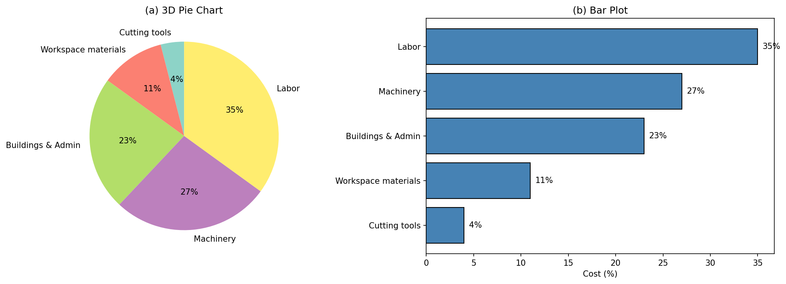
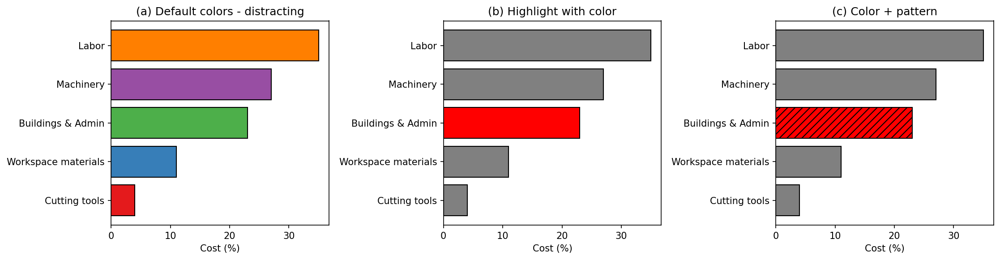
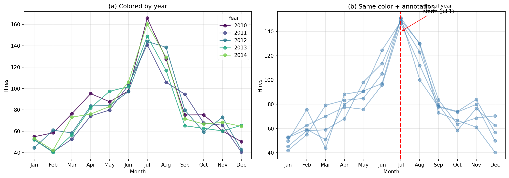
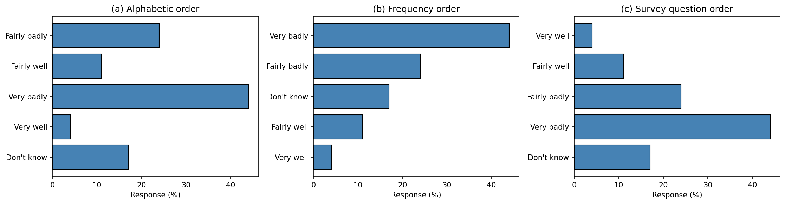
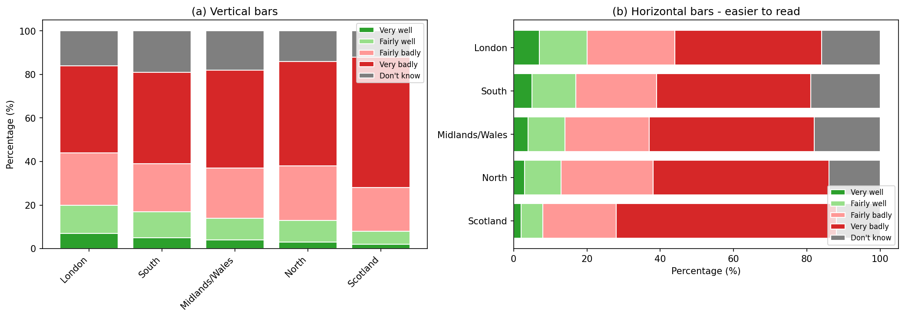
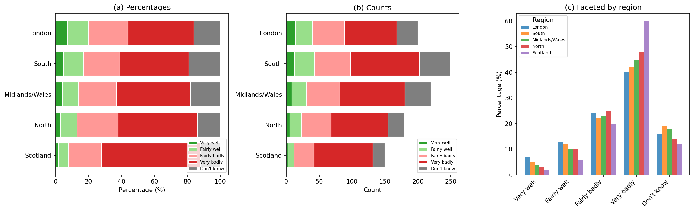
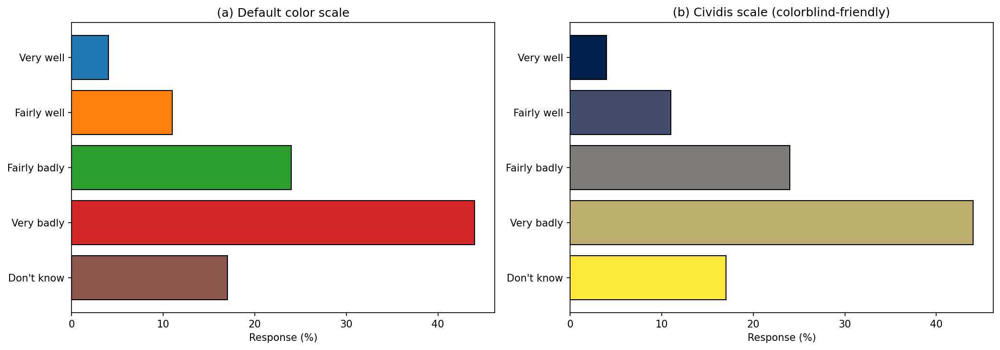

# 제6장 응용: 탐색

## 6.1 사례 연구: 탐색적 결과의 효과적인 전달

그래프는 아이디어를 직접적이고 빠르게 전달할 수 있는 강력한 도구이다. 우리 모두 "그림 한 장이 천 마디 말보다 낫다"라는 말을 알고 있다. 그러나 불행히도 이미지가 부정확하거나 오해를 불러일으키는 메시지를 전달하는 경우도 있다.

이 장에서는 그래프를 활용하여 데이터를 정확하고 효과적으로 제시하는 방법에 초점을 맞춘다. 데이터 모델링과 마찬가지로 창의적인 시각화는 일종의 예술이다. 그러나 예술에서도 권장되는 지침 원칙이 있다. 여기서는 데이터 시각화를 만들기 위한 몇 가지 모범 사례를 제공한다.

---

### 6.1.1 단순하게 유지하라

그래픽을 만들 때 독자에게 무엇을 보여주고 싶은지 염두에 두어야 한다. 색상은 의미 있는 방식으로 항목을 그룹화하거나 수준을 구별하는 데 사용해야 한다. 색상이 단순히 그래프를 밝게 하는 데만 사용될 때는 주의를 산만하게 할 수 있다.

비용을 다섯 가지 범주로 요약한 제조 회사를 생각해 보자. 그림 6.1에 제공된 두 그래픽에서, 그림 6.1(a)의 파이 차트에서 크기를 눈으로 비교하기 어렵다는 것을 알 수 있다. 즉, 파이 조각을 볼 때 "건물 및 관리"가 "작업장 자재"와 얼마나 다른지 눈으로 구별할 수 있는가? 또한 파이 차트의 색상은 아무런 의미가 없으므로 주의를 산만하게 한다. 마지막으로, 이미지의 3차원적 측면은 독자가 제시된 데이터를 이해하는 능력을 향상시키지 않는다.

대안으로, 그림 6.1(b)에 막대 그래프가 제공되어 있다. 이미지의 다른 측면에 방해받지 않으면서 범주 간 차이의 크기를 식별하는 것이 얼마나 쉬운지 주목하라. 일반적으로, 특히 그래프로 표시되는 범주형 데이터에 몇 개 이상의 수준이 있는 경우, 막대 그래프가 파이 차트보다 독자가 이해하기 더 쉽다.



*그림 6.1: 두 가지 매우 다른 시각화로 표시된 동일한 정보. (a) 3차원 파이 차트. (b) 막대 그래프.*

### 새로운 시각: 파이 차트 vs 막대 그래프

파이 차트와 막대 그래프 중 어느 것을 선택해야 할까? 연구에 따르면 인간의 눈은 각도보다 길이를 더 정확하게 비교할 수 있다. 이것이 막대 그래프가 일반적으로 선호되는 이유이다.

| 특성 | 파이 차트 | 막대 그래프 |
|---|---|---|
| 비교 정확도 | 낮음 (각도 비교) | 높음 (길이 비교) |
| 범주 수가 많을 때 | 복잡해짐 | 여전히 명확함 |
| 부분-전체 관계 | 직관적 | 간접적 |
| 권장 상황 | 2-3개 범주, 비율 강조 | 대부분의 경우 |

**Python 코드: 파이 차트 vs 막대 그래프 비교**

```python
import matplotlib.pyplot as plt
import numpy as np

# 제조 비용 데이터
categories = ['절삭 공구', '작업장 자재', '건물 및 관리', '기계', '노동']
costs = [4, 11, 23, 27, 35]

fig, axes = plt.subplots(1, 2, figsize=(14, 5))

# (a) 파이 차트
colors = plt.cm.Set3(np.linspace(0, 1, len(categories)))
axes[0].pie(costs, labels=categories, autopct='%1.0f%%', colors=colors, startangle=90)
axes[0].set_title('(a) 파이 차트')

# (b) 막대 그래프
bars = axes[1].barh(categories, costs, color='steelblue', edgecolor='black')
axes[1].set_xlabel('비용 (%)')
axes[1].set_title('(b) 막대 그래프')
axes[1].set_xlim(0, 40)

# 값 레이블 추가
for bar, cost in zip(bars, costs):
    axes[1].text(bar.get_width() + 0.5, bar.get_y() + bar.get_height()/2, 
                 f'{cost}%', va='center')

plt.tight_layout()
plt.savefig('figures/fig_6_1_pie_vs_bar.png', dpi=150, bbox_inches='tight')
plt.show()
```

---

### 6.1.2 색상을 사용하여 주의를 끌어라

그래프에 **색상**(color)을 추가하는 데는 여러 가지 이유가 있다. 명심해야 할 중요한 원칙은 색상을 사용하여 주의를 끄는 것이다. 물론 시각화가 시각적으로 얼마나 만족스러운지도 고려해야 하며, 특정 기능에 주의를 끌지 않고 시각적으로 만족스럽게 만들기 위해 색상을 추가하는 것도 괜찮을 수 있다. 그러나 기본 색상에 대해 비판적이어야 하고 색상을 포함할지 여부와 방법을 명시적으로 결정해야 한다.

그림 6.2(b)에서 색상이 독자의 주의를 특정 정보에 끌도록 하는 방식으로 사용되었음을 알 수 있다. 그림 6.2(a)의 기본 색상은 주의를 산만하게 하고 독자가 예를 들어 빨간색과 보라색 막대 사이에 뭔가 유사한 점이 있는지 의문을 갖게 만든다. 또한 모든 사람이 색상을 같은 방식으로 보는 것은 아니므로, 색상과 하나 이상의 기능(예: 패턴)을 추가하여 그림 6.2(c)에서 보여주는 것처럼 주의를 끄는 기능을 여러 방식으로 참조할 수 있도록 하는 것이 종종 유용하다.



*그림 6.2: 다른 측면을 강조하기 위한 다른 색상으로 동일한 정보를 시각화한 세 개의 막대 차트. (a) 기본 색상은 데이터 이해에 도움이 되지 않는다. (b) 색상이 "건물 및 관리" 막대에 직접 주의를 끈다. (c) 색상과 선 유형이 "건물 및 관리" 막대에 직접 주의를 끈다.*

### 새로운 시각: 색상의 전략적 사용

색상을 효과적으로 사용하기 위한 핵심 원칙:

1. **강조할 것만 색상 지정**: 나머지는 회색으로 처리
2. **색맹 친화적 팔레트 사용**: 전 세계 남성의 약 8%가 색맹
3. **중복 인코딩**: 색상 + 패턴 또는 색상 + 위치로 정보 전달
4. **의미 있는 색상 선택**: 빨간색 = 경고/부정적, 녹색 = 긍정적 등

**Python 코드: 색상으로 주의 끌기**

```python
import matplotlib.pyplot as plt
import numpy as np

categories = ['절삭 공구', '작업장 자재', '건물 및 관리', '기계', '노동']
costs = [4, 11, 23, 27, 35]

fig, axes = plt.subplots(1, 3, figsize=(15, 4))

# (a) 기본 색상 - 주의 산만
colors_default = ['#e41a1c', '#377eb8', '#4daf4a', '#984ea3', '#ff7f00']
axes[0].barh(categories, costs, color=colors_default, edgecolor='black')
axes[0].set_title('(a) 기본 색상 - 주의 산만')
axes[0].set_xlabel('비용 (%)')

# (b) 강조 색상 - "건물 및 관리"에 주의
colors_highlight = ['gray', 'gray', 'red', 'gray', 'gray']
axes[1].barh(categories, costs, color=colors_highlight, edgecolor='black')
axes[1].set_title('(b) 색상으로 강조')
axes[1].set_xlabel('비용 (%)')

# (c) 색상 + 패턴
bars = axes[2].barh(categories, costs, color=colors_highlight, edgecolor='black')
# 강조된 막대에 해치 패턴 추가
bars[2].set_hatch('///')
axes[2].set_title('(c) 색상 + 패턴으로 강조')
axes[2].set_xlabel('비용 (%)')

plt.tight_layout()
plt.savefig('figures/fig_6_2_color_attention.png', dpi=150, bbox_inches='tight')
plt.show()
```

---

### 6.1.3 이야기를 전달하라

많은 그래프에서 중요한 측면은 그래프로 표시되는 데이터셋에 제공되지 않은 정보를 포함하는 것이다. 외부 정보는 데이터를 맥락화하고 연구의 서사를 전달하는 데 도움이 된다.

그림 6.3에서 오른쪽 그래프는 대학의 회계연도 시작에 대한 정보로 **주석**(annotation)이 달려 있어 데이터가 제공하는 정보를 맥락화한다. 때로는 추가 정보가 $y = x$로 주어진 대각선일 수 있으며, 선 위의 점은 $y$ 좌표가 $x$ 좌표보다 큰 값을 가진 것을 독자에게 빠르게 보여주고, 선 아래의 점은 그 반대를 보여준다.



*그림 6.3: 5개 역년에 걸친 듀크 대학교 월별 채용 추세를 보여주는 시계열 그래프. (a) 연도별 색상 구분. (b) 모든 연도 동일한 색상, 추세를 요약하는 주석.*

### 새로운 시각: 주석의 힘

효과적인 주석은 다음과 같은 요소를 포함할 수 있다:
- **참조선**: 평균, 목표값, 또는 중요한 임계값 표시
- **텍스트 레이블**: 주요 데이터 포인트 또는 이상치 설명
- **영역 강조**: 특정 기간이나 범위에 대한 배경 음영
- **외부 이벤트**: 데이터에 영향을 미친 역사적 사건 표시

**Python 코드: 주석이 있는 시계열**

```python
import matplotlib.pyplot as plt
import numpy as np
import pandas as pd

# 듀크 대학교 채용 데이터 시뮬레이션
np.random.seed(42)
months = ['Jan', 'Feb', 'Mar', 'Apr', 'May', 'Jun', 
          'Jul', 'Aug', 'Sep', 'Oct', 'Nov', 'Dec']
years = [2010, 2011, 2012, 2013, 2014]

fig, axes = plt.subplots(1, 2, figsize=(14, 5))

# 데이터 생성 (7월에 피크가 있는 패턴)
base_pattern = [50, 60, 70, 80, 90, 100, 150, 120, 80, 70, 65, 55]

# (a) 연도별 색상 구분
colors = plt.cm.viridis(np.linspace(0, 0.8, len(years)))
for i, year in enumerate(years):
    hires = [b + np.random.normal(0, 10) for b in base_pattern]
    axes[0].plot(months, hires, 'o-', color=colors[i], label=str(year), alpha=0.8)

axes[0].set_xlabel('월')
axes[0].set_ylabel('채용 수')
axes[0].set_title('(a) 연도별 색상 구분')
axes[0].legend(title='연도')
axes[0].grid(True, alpha=0.3)

# (b) 동일 색상 + 주석
for i, year in enumerate(years):
    hires = [b + np.random.normal(0, 10) for b in base_pattern]
    axes[1].plot(months, hires, 'o-', color='steelblue', alpha=0.5)

# 회계연도 시작 주석
axes[1].axvline(x=6, color='red', linestyle='--', linewidth=2)
axes[1].annotate('회계연도 시작\n(7월 1일)', 
                 xy=(6, 140), xytext=(8, 155),
                 fontsize=10, ha='center',
                 arrowprops=dict(arrowstyle='->', color='red'))

axes[1].set_xlabel('월')
axes[1].set_ylabel('채용 수')
axes[1].set_title('(b) 동일 색상 + 추세 요약 주석')
axes[1].grid(True, alpha=0.3)

plt.tight_layout()
plt.savefig('figures/fig_6_3_duke_hires.png', dpi=150, bbox_inches='tight')
plt.show()
```

---

### 6.1.4 순서가 중요하다

대부분의 소프트웨어 프로그램에는 일부 그래프 세부 사항에 대한 내장 메서드가 있다 - 일부는 수준을 알파벳순으로 정렬하고, 일부는 사용자 정의 순서로 정렬하는 기능을 제공한다. 그림 6.4(a)에서 볼 수 있듯이, 알파벳 순서는 데이터를 설명하는 데 특별히 의미가 없다. 때로는 그림 6.4(b)에서 보여주는 것처럼 막대를 가장 높은 것에서 가장 낮은 것으로(또는 그 반대로) **정렬**(order)하는 것이 합리적이다. 그러나 이 경우 가장 좋은 순서는 아마도 질문이 제시된 순서일 것이며, 이것이 그림 6.4(c)에 나타나 있다. 문제의 맥락에서 의미가 없는 순서(예: 여기서 알파벳순)는 축을 빠르게 훑어보고 막대 레이블을 주의 깊게 읽지 않는 독자를 오도할 수 있다.

2019년 9월, YouGov 설문조사는 1,639명의 영국 성인에게 다음 질문을 했다:

> 정부가 영국의 유럽연합 탈퇴를 얼마나 잘 또는 잘못 처리하고 있다고 생각하십니까?
>
> - 매우 잘
> - 꽤 잘
> - 꽤 못함
> - 매우 못함
> - 모름



*그림 6.4: 수준의 배열이 다른 동일한 정보를 시각화한 세 개의 막대 차트. (a) 알파벳 순서. (b) 빈도 순서. (c) 설문 질문에서 제시된 순서와 동일.*

### 새로운 시각: 범주 순서 선택 가이드

| 상황 | 권장 순서 | 이유 |
|---|---|---|
| 순서형 변수 (예: 리커트 척도) | 본래의 순서 | 자연스러운 진행 표시 |
| 비교가 주 목적 | 빈도/크기 순서 | 가장 큰/작은 것 쉽게 식별 |
| 시간 관련 범주 | 시간순 | 추세 파악 |
| 지리적 범주 | 지리적 순서 (북→남 등) | 공간적 패턴 강조 |
| 특별한 의미 없음 | 빈도 순서 | 기본적으로 가장 유용 |

**절대 피해야 할 것**: 의미 없는 알파벳 순서 (대부분의 소프트웨어 기본값)

**Python 코드: 순서의 영향**

```python
import matplotlib.pyplot as plt
import numpy as np

# Brexit 설문 데이터
responses_alpha = ['꽤 못함', '꽤 잘', '매우 못함', '매우 잘', '모름']
counts_alpha = [24, 11, 44, 4, 17]

# 빈도순 정렬
sorted_pairs = sorted(zip(counts_alpha, responses_alpha), reverse=True)
counts_freq = [x[0] for x in sorted_pairs]
responses_freq = [x[1] for x in sorted_pairs]

# 설문 순서
responses_survey = ['매우 잘', '꽤 잘', '꽤 못함', '매우 못함', '모름']
counts_survey = [4, 11, 24, 44, 17]

fig, axes = plt.subplots(1, 3, figsize=(15, 4))

# (a) 알파벳 순서
axes[0].barh(responses_alpha, counts_alpha, color='steelblue', edgecolor='black')
axes[0].set_xlabel('응답자 수 (%)')
axes[0].set_title('(a) 알파벳 순서')
axes[0].invert_yaxis()

# (b) 빈도 순서
axes[1].barh(responses_freq, counts_freq, color='steelblue', edgecolor='black')
axes[1].set_xlabel('응답자 수 (%)')
axes[1].set_title('(b) 빈도 순서')
axes[1].invert_yaxis()

# (c) 설문 순서
axes[2].barh(responses_survey, counts_survey, color='steelblue', edgecolor='black')
axes[2].set_xlabel('응답자 수 (%)')
axes[2].set_title('(c) 설문 질문 순서')
axes[2].invert_yaxis()

plt.tight_layout()
plt.savefig('figures/fig_6_4_brexit_order.png', dpi=150, bbox_inches='tight')
plt.show()
```

---

### 6.1.5 레이블을 가능한 한 읽기 쉽게 만들어라

Brexit 설문 결과는 영국의 지역별로 추가로 분류되었다. 누적 막대 그래프는 다섯 지역에 걸쳐 Brexit 의견을 비교할 수 있게 해준다. 그림 6.5(a)에서 막대는 수직이고 그림 6.5(b)에서는 수평이다. 두 그래픽의 정량적 정보는 동일하지만, 그래프를 뒤집고 수평 막대를 만들면 **축 레이블**(axis labels)을 위한 공간이 더 많아진다. 범주를 읽기 쉬울수록 독자는 시각화에서 더 많은 것을 배울 것이다. 목표는 가능한 한 많은 정보를 간결하고 명확한 방식으로 전달하는 것임을 기억하라.



*그림 6.5: 누적 막대 그래프. (a) x축을 가로지르는 수직 막대. (b) y축을 가로지르는 수평 막대. 수평 방향은 지역 레이블을 더 쉽게 읽을 수 있게 한다.*

### 새로운 시각: 레이블 가독성 최적화

효과적인 레이블을 위한 지침:

1. **긴 레이블은 수평 막대 사용**: 텍스트가 겹치지 않음
2. **약어 피하기**: 독자가 추측할 필요 없도록
3. **글꼴 크기 테스트**: 최종 출력 크기에서 읽을 수 있는지 확인
4. **레이블 회전 최소화**: 45° 또는 90° 회전은 읽기 어려움
5. **단위 명시**: 축 제목에 단위 포함 (예: "비용 (%)", "시간 (초)")

**Python 코드: 수직 vs 수평 막대**

```python
import matplotlib.pyplot as plt
import numpy as np

# 지역별 Brexit 의견 데이터
regions = ['런던', '잉글랜드 남부', '잉글랜드 중부/웨일스', 
           '잉글랜드 북부', '스코틀랜드']
very_well = [7, 5, 4, 3, 2]
fairly_well = [13, 12, 10, 10, 6]
fairly_badly = [24, 22, 23, 25, 20]
very_badly = [40, 42, 45, 48, 60]
dont_know = [16, 19, 18, 14, 12]

fig, axes = plt.subplots(1, 2, figsize=(14, 5))

# (a) 수직 막대
x = np.arange(len(regions))
width = 0.6
bottom = np.zeros(len(regions))

colors = ['#2ca02c', '#98df8a', '#ff9896', '#d62728', '#7f7f7f']
labels = ['매우 잘', '꽤 잘', '꽤 못함', '매우 못함', '모름']
data = [very_well, fairly_well, fairly_badly, very_badly, dont_know]

for d, c, l in zip(data, colors, labels):
    axes[0].bar(x, d, width, bottom=bottom, label=l, color=c, edgecolor='white')
    bottom += d

axes[0].set_xticks(x)
axes[0].set_xticklabels(regions, rotation=45, ha='right')
axes[0].set_ylabel('비율 (%)')
axes[0].set_title('(a) 수직 막대 - 레이블 회전 필요')
axes[0].legend(loc='upper right', fontsize=8)

# (b) 수평 막대
y = np.arange(len(regions))
left = np.zeros(len(regions))

for d, c, l in zip(data, colors, labels):
    axes[1].barh(y, d, height=0.6, left=left, label=l, color=c, edgecolor='white')
    left += d

axes[1].set_yticks(y)
axes[1].set_yticklabels(regions)
axes[1].set_xlabel('비율 (%)')
axes[1].set_title('(b) 수평 막대 - 레이블 읽기 쉬움')
axes[1].legend(loc='upper right', fontsize=8)
axes[1].invert_yaxis()

plt.tight_layout()
plt.savefig('figures/fig_6_5_brexit_region.png', dpi=150, bbox_inches='tight')
plt.show()
```

---

### 6.1.6 목적을 선택하라

모든 그래픽 결정은 **목적**(purpose)을 가지고 이루어져야 한다. 앞서 언급했듯이, 기본 옵션을 고수하는 것이 항상 데이터 스토리의 서사를 전달하는 데 최선인 것은 아니다. 누적 막대 그래프는 이야기의 한 부분을 전달한다. 연구 질문에 따라, 연구에 가장 중요한 이야기 부분을 전달하지 못할 수도 있다.

그림 6.6은 동일한 정보를 나타내는 세 가지 다른 방법을 제공한다. 지역 간 가장 중요한 비교가 비율인 경우 그림 6.6(a)를 선호할 수 있다. 지역 간 가장 중요한 비교가 지역의 총 개인 수도 고려하는 경우 그림 6.6(b)를 선호할 수 있다. 각 지역에 대한 별도의 막대 그래프가 원하는 포인트를 전달하면 지역별로 **패싯**(facet)된 그림 6.6(c)를 사용하라. 그림 6.6(c)는 또한 전체 제목과 데이터 소스가 있는 간결한 URL을 제공한다. 고려해야 할 다른 신중한 결정에는 정보를 제공하는 레이블을 사용하고 중복을 피하는 것이 포함된다.



*그림 6.6: 설문조사의 두 변수, 지역과 의견의 세 가지 다른 표현. (a) 백분율을 보여주는 지역과 의견의 누적 막대 그래프. (b) 개수를 보여주는 지역과 의견의 누적 막대 그래프. (c) 개수를 보여주는 지역과 의견의 나란히 놓인 막대 그래프.*

### 새로운 시각: 시각화 목적에 따른 그래프 선택

| 연구 질문 | 권장 시각화 | 이유 |
|---|---|---|
| 범주 간 비율 비교 | 표준화된 누적 막대 | 모든 막대가 100%로 동일 |
| 절대 크기 비교 | 개수 누적 막대 | 전체 크기 차이 표시 |
| 각 범주 세부 패턴 | 패싯 그래프 | 개별 분포 명확히 표시 |
| 추세 파악 | 선 그래프 | 시간에 따른 변화 강조 |
| 분포 비교 | 상자 그림 / 바이올린 | 중심, 퍼짐, 이상치 표시 |

**Python 코드: 동일 데이터의 세 가지 표현**

```python
import matplotlib.pyplot as plt
import numpy as np

# 지역별 응답 데이터 (개수)
regions = ['런던', '남부', '중부/웨일스', '북부', '스코틀랜드']
n_per_region = [200, 250, 220, 180, 150]  # 각 지역 응답자 수

# 각 지역별 의견 비율 (%)
opinions = ['매우 잘', '꽤 잘', '꽤 못함', '매우 못함', '모름']
# 실제 비율 데이터
data_pct = {
    '런던': [7, 13, 24, 40, 16],
    '남부': [5, 12, 22, 42, 19],
    '중부/웨일스': [4, 10, 23, 45, 18],
    '북부': [3, 10, 25, 48, 14],
    '스코틀랜드': [2, 6, 20, 60, 12]
}

colors = ['#2ca02c', '#98df8a', '#ff9896', '#d62728', '#7f7f7f']

fig, axes = plt.subplots(1, 3, figsize=(16, 5))

# (a) 백분율 누적 막대
y = np.arange(len(regions))
left = np.zeros(len(regions))
for i, opinion in enumerate(opinions):
    values = [data_pct[r][i] for r in regions]
    axes[0].barh(y, values, left=left, label=opinion, color=colors[i], edgecolor='white')
    left += values

axes[0].set_yticks(y)
axes[0].set_yticklabels(regions)
axes[0].set_xlabel('비율 (%)')
axes[0].set_title('(a) 백분율 누적')
axes[0].legend(loc='lower right', fontsize=8)
axes[0].invert_yaxis()

# (b) 개수 누적 막대
left = np.zeros(len(regions))
for i, opinion in enumerate(opinions):
    values = [data_pct[r][i] * n_per_region[j] / 100 for j, r in enumerate(regions)]
    axes[1].barh(y, values, left=left, label=opinion, color=colors[i], edgecolor='white')
    left += values

axes[1].set_yticks(y)
axes[1].set_yticklabels(regions)
axes[1].set_xlabel('응답자 수')
axes[1].set_title('(b) 개수 누적')
axes[1].legend(loc='lower right', fontsize=8)
axes[1].invert_yaxis()

# (c) 패싯 (각 지역별)
width = 0.15
x = np.arange(len(opinions))
for i, region in enumerate(regions):
    axes[2].bar(x + i*width, data_pct[region], width, label=region, alpha=0.8)

axes[2].set_xticks(x + width * 2)
axes[2].set_xticklabels(opinions, rotation=45, ha='right')
axes[2].set_ylabel('비율 (%)')
axes[2].set_title('(c) 지역별 비교')
axes[2].legend(title='지역', fontsize=8)

plt.tight_layout()
plt.savefig('figures/fig_6_6_three_ways.png', dpi=150, bbox_inches='tight')
plt.show()
```

---

### 6.1.7 의미 있는 색상을 선택하라

그래프를 만들 때 마지막으로 고려해야 할 사항은 색상 선택이다. 기본 또는 무지개 색상이 변수의 수준을 가장 잘 구별하는 선택인 것은 아니다. 다양한 시력을 가진 사람들에게 뚜렷하고 명확한 색상 조합을 찾기 위해 많은 연구가 수행되었다. cividis 척도는 순서형 데이터에 잘 작동한다. (Nuñez, Anderton, and Renslow 2018) 그림 6.7은 두 가지 다른 색상 테마로 동일한 그래프를 보여준다.



*그림 6.7: 두 가지 다른 색상 옵션으로 동일한 막대 그래프. (a) 기본 색상 척도. (b) Cividis 척도.*

### 새로운 시각: 색맹 친화적 색상 팔레트

전 세계 남성의 약 8%, 여성의 약 0.5%가 색맹이다. 시각화를 설계할 때 이를 고려해야 한다.

| 팔레트 이름 | 특징 | 적합한 데이터 유형 |
|---|---|---|
| Viridis | 색맹 친화적, 순차적 | 연속형, 순서형 |
| Cividis | 색맹 친화적, 더 부드러움 | 순서형 |
| ColorBrewer | 다양한 목적별 팔레트 | 범주형, 발산형, 순차적 |
| Okabe-Ito | 색맹 친화적 범주형 | 명목형 |

**Python 코드: 색상 팔레트 비교**

```python
import matplotlib.pyplot as plt
import numpy as np

# Brexit 데이터
opinions = ['매우 잘', '꽤 잘', '꽤 못함', '매우 못함', '모름']
counts = [4, 11, 24, 44, 17]

fig, axes = plt.subplots(1, 2, figsize=(14, 5))

# (a) 기본 색상 척도
colors_default = plt.cm.tab10(np.linspace(0, 0.5, len(opinions)))
bars1 = axes[0].barh(opinions, counts, color=colors_default, edgecolor='black')
axes[0].set_xlabel('응답자 수 (%)')
axes[0].set_title('(a) 기본 색상 척도')
axes[0].invert_yaxis()

# (b) Cividis 척도 (색맹 친화적)
colors_cividis = plt.cm.cividis(np.linspace(0, 1, len(opinions)))
bars2 = axes[1].barh(opinions, counts, color=colors_cividis, edgecolor='black')
axes[1].set_xlabel('응답자 수 (%)')
axes[1].set_title('(b) Cividis 척도 (색맹 친화적)')
axes[1].invert_yaxis()

plt.tight_layout()
plt.savefig('figures/fig_6_7_color_scales.png', dpi=150, bbox_inches='tight')
plt.show()
```

---

## 6.2 장 요약

이 장에서는 그래프를 만들 때 모범 사례를 보여주기 위해 다양한 표현을 대조했다. 근본적인 원칙은 그래프가 간결하고 명확하게 최대한의 정보를 제공해야 한다는 것이다. 레이블은 명확하고 독자가 읽기 쉽도록 수평으로 배치되어야 한다. 제목을 잊지 말고, 가능하다면 데이터 출처를 포함하라.

### 핵심 원칙 요약

| 원칙 | 설명 |
|---|---|
| 단순하게 유지 | 불필요한 장식 제거, 파이 차트보다 막대 그래프 |
| 색상으로 주의 끌기 | 강조하고 싶은 것에만 색상 사용 |
| 이야기 전달 | 맥락을 제공하는 주석 추가 |
| 순서 고려 | 의미 있는 순서로 범주 정렬 |
| 읽기 쉬운 레이블 | 긴 레이블은 수평 막대 사용 |
| 목적 선택 | 연구 질문에 맞는 시각화 유형 선택 |
| 의미 있는 색상 | 색맹 친화적 팔레트 사용 |

---

## 6.3 용어

*표 6.1: 이 장에서 소개된 용어*

| 한국어 | 영어 |
|---|---|
| 주석 | annotation |
| 축 레이블 | axis labels |
| 색상 | color |
| 색맹 친화적 | colorblind-friendly |
| 패싯 | facet |
| 정렬 | order |
| 목적 | purpose |

---

## 6.4 연습문제

이 장은 응용 장(Application chapter)으로, 별도의 연습문제가 없다. 대신 이 부분(Part II: 탐색적 데이터 분석)의 개념을 적용하는 다음 활동을 권장한다.

### 대화형 R 튜토리얼

이 부분에서 배운 개념을 다음 자기 주도 튜토리얼을 통해 R에서 탐색할 수 있다:

- **튜토리얼 2: 탐색적 데이터 분석**
  - 레슨 1: 범주형 데이터 시각화
  - 레슨 2: 수치형 데이터 시각화
  - 레슨 3: 통계량으로 요약하기
  - 레슨 4: 사례 연구

### R 실습

이 부분의 개념을 데이터 분석 사례 연구를 통해 더 깊이 적용할 수 있다:

- **데이터 소개 - 항공편 지연** (Intro to data - Flight delays)

---

## 부록: 시각화 체크리스트

효과적인 데이터 시각화를 만들기 위한 체크리스트:

**내용**
- [ ] 그래프가 하나의 명확한 메시지를 전달하는가?
- [ ] 데이터가 정확하게 표현되었는가?
- [ ] 불필요한 요소가 제거되었는가?

**디자인**
- [ ] 적절한 그래프 유형을 선택했는가?
- [ ] 색상이 목적에 맞게 사용되었는가?
- [ ] 색맹 친화적 팔레트인가?
- [ ] 레이블이 읽기 쉬운가?

**맥락**
- [ ] 제목이 명확한가?
- [ ] 축 레이블에 단위가 포함되었는가?
- [ ] 데이터 출처가 명시되었는가?
- [ ] 필요한 주석이 추가되었는가?

**기술적**
- [ ] 해상도가 충분한가?
- [ ] 파일 형식이 적절한가? (웹용 PNG, 인쇄용 PDF)
- [ ] 글꼴 크기가 최종 출력에서 읽을 수 있는가?

---

## 참고문헌

Nuñez, J. R., C. R. Anderton, and R. S. Renslow. 2018. "Optimizing Colormaps with Consideration for Color Vision Deficiency to Enable Accurate Interpretation of Scientific Data." *PloS One* 13 (7). https://doi.org/10.1371/journal.pone.0199239.

YouGov Survey Results. 2019. "Brexit and 2019 Election." Retrieved Oct 7, 2019. https://d25d2506sfb94s.cloudfront.net/cumulus_uploads/document/x0msmggx08/YouGov%20-%20Brexit%20and%202019%20election.pdf

---

*이 번역은 OpenIntro의 Introduction to Modern Statistics, 2nd Edition의 Chapter 6를 기반으로 작성되었다.*
