# 제7장 단일 예측변수를 이용한 선형 회귀

**선형 회귀**(linear regression)는 매우 강력한 통계 기법이다. 많은 사람들이 뉴스에서 산점도 위에 직선이 겹쳐진 그래프를 보며 회귀 모델에 대해 어느 정도 익숙해져 있다. 선형 모델은 두 수치 변수 사이에 선형 관계가 있다고 가정할 때, 예측이나 두 변수 간의 관계를 설명하는 데 사용될 수 있다.

---

## 7.1 직선 적합, 잔차, 상관관계

선형 회귀를 고려할 때 직선 적합 과정에 대해 깊이 생각하는 것이 도움이 된다. 이 절에서는 선형 모델의 형태를 정의하고, 좋은 적합의 기준을 탐색하며, **상관관계**(correlation)라는 새로운 통계량을 소개한다.

---

### 7.1.1 데이터에 직선 적합하기

그림 7.1은 관계가 직선으로 완벽하게 모델링될 수 있는 두 변수를 보여준다. 이 직선의 방정식은 $y = 5 + 64.96x$이다. 완벽한 선형 관계가 무엇을 의미하는지 생각해 보자: $x$의 값만 알면 $y$의 정확한 값을 알 수 있다. 완벽한 선형 관계는 거의 모든 자연 과정에서 비현실적이다. 예를 들어, 가족 소득$(x)$을 알면 대학이 예비 학생에게 얼마나 많은 재정 지원을 제공할지$(y)$에 대한 유용한 정보를 얻을 수 있다. 그러나 가족의 재정 외에도 재정 지원에 영향을 미치는 다른 요인들이 있으므로 예측은 완벽하지 않을 것이다.

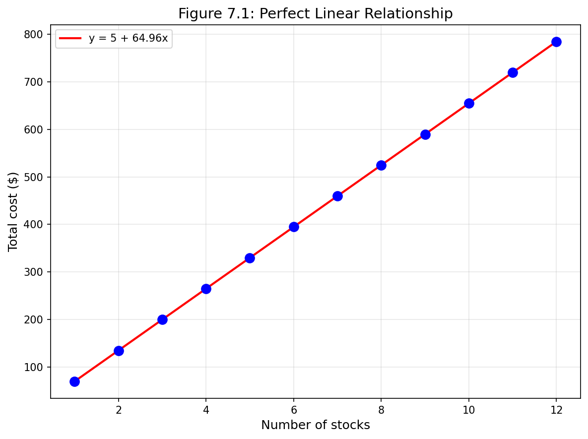

*그림 7.1: 12명의 별도 구매자로부터의 요청이 거래 회사에 동시에 접수되어 Target Corporation 주식(티커 TGT, 2018년 12월 28일)을 구매했고, 주식의 총 비용이 보고되었다. 비용이 선형 공식을 사용하여 계산되기 때문에 선형 적합은 완벽하다.*

선형 회귀는 두 변수 $x$와 $y$ 사이의 관계를 약간의 오차와 함께 직선으로 모델링할 수 있는 데이터에 직선을 적합하는 통계적 방법이다:

$$y = b_0 + b_1 x + e$$

$b_0$과 $b_1$ 값은 각각 모델의 **절편**(intercept)과 **기울기**(slope)를 나타내며, 오차는 $e$로 표현된다. 이 값들은 데이터를 기반으로 계산되며, 즉 표본 통계량이다. 관측된 데이터가 관심 있는 모집단에서 추출한 무작위 표본이라면, 이 값들은 모집단 모수 $\beta_0$과 $\beta_1$의 점추정치로 간주된다. 24장에서 표본 통계량을 기반으로 선형 모델의 모수에 대한 추론을 하는 방법을 논의할 것이다.

> 그리스 문자 $\beta$는 "베타"로 발음한다.

$x$를 사용하여 $y$를 예측할 때, 보통 $x$를 **예측변수**(predictor) 또는 설명변수라고 부르고 $y$를 **결과변수**(outcome) 또는 반응변수라고 부른다. 또한 우리의 주요 관심이 종종 평균 결과의 예측에 있기 때문에 모델을 작성할 때 $e$ 항을 생략하는 경우가 많다.

모든 데이터가 직선 위에 완벽하게 떨어지는 경우는 드물다. 대신, 그림 7.2에 표시된 예들처럼 데이터가 *점들의 구름*으로 나타나는 것이 더 일반적이다. 각 경우에서 데이터는 직선 주위에 떨어지며, 관측치 중 어느 것도 정확히 직선 위에 떨어지지 않는다. 첫 번째 그래프는 비교적 강한 하향 선형 추세를 보여주며, 직선 주위 데이터의 나머지 변동성은 $x$와 $y$ 사이의 관계 강도에 비해 작다. 두 번째 그래프는 상향 추세를 보여주지만 첫 번째만큼 강하지 않다. 마지막 그래프는 데이터에서 매우 약한 하향 추세를 보여주며, 거의 알아차리기 어려울 정도로 미미하다. 이러한 각 예에서 모델 모수 $\beta_0$과 $\beta_1$의 추정치에 대해 어느 정도의 불확실성이 있을 것이다. 예를 들어, 직선을 약간 위아래로 이동해야 할지, 더 또는 덜 기울여야 할지 궁금할 수 있다.

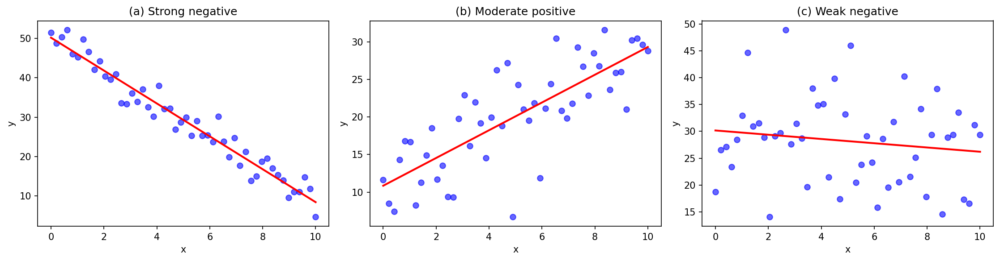

*그림 7.2: 데이터가 모두 직선 위에 정확히 떨어지지 않더라도 선형 모델이 유용할 수 있는 세 가지 데이터셋.*

변수들 사이에 명확한 관계가 있더라도 데이터에 직선을 적합하는 것이 도움이 되지 않는 경우도 있다. 그림 7.3에 그러한 경우가 나와 있는데, 추세가 선형이 아님에도 변수들 사이에 매우 명확한 관계가 있다. 이 장과 다음 장에서 비선형 추세를 논의하지만, 비선형 모델 적합의 세부 사항은 후속 과정에서 다룬다.

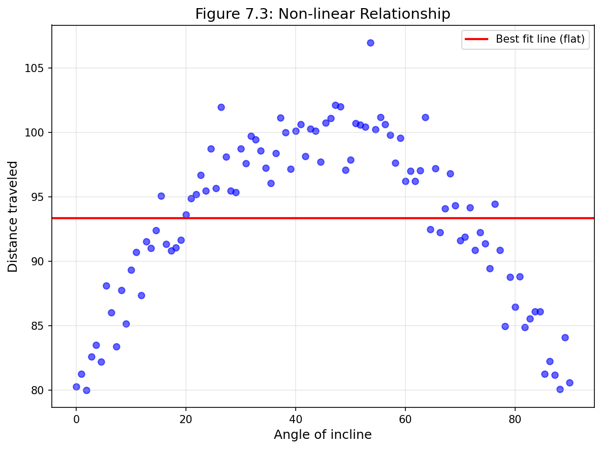

*그림 7.3: 이 데이터에 대한 최적 적합 직선은 평평하며, 이는 비선형 관계를 설명하는 유용한 방법이 아니다. 이 데이터는 물리학 실험에서 나온 것이다.*

### 새로운 시각: 선형 vs 비선형 관계의 구분

실제 데이터에서 선형 관계와 비선형 관계를 구분하는 것은 중요한 기술이다. 다음 표는 각 유형의 특징을 요약한다:

| 특성 | 선형 관계 | 비선형 관계 |
|---|---|---|
| 산점도 패턴 | 점들이 직선 주위에 분포 | 점들이 곡선 패턴을 형성 |
| 잔차 패턴 | 무작위로 0 주위에 분포 | 체계적인 패턴 (U자형, 부채꼴 등) |
| 변환 필요성 | 불필요 | 로그, 제곱근 등 변환 고려 |
| 적합한 모델 | 단순 선형 회귀 | 다항 회귀, 비선형 모델 |

**Python 코드: 선형 vs 비선형 관계 시각화**

```python
import numpy as np
import matplotlib.pyplot as plt

np.random.seed(42)

# 완벽한 선형 관계 (주식 구매)
x_stocks = np.arange(1, 13)
y_cost = 5 + 64.96 * x_stocks  # 정확히 선형

# 불완전한 선형 관계들
x = np.linspace(0, 10, 100)
y_strong_neg = 50 - 4*x + np.random.normal(0, 3, 100)  # 강한 음의 관계
y_moderate_pos = 10 + 2*x + np.random.normal(0, 5, 100)  # 중간 양의 관계
y_weak = 30 - 0.5*x + np.random.normal(0, 8, 100)  # 약한 관계

# 비선형 관계 (포물선)
x_nonlin = np.linspace(-5, 5, 100)
y_nonlin = x_nonlin**2 + np.random.normal(0, 2, 100)

fig, axes = plt.subplots(2, 2, figsize=(12, 10))

# (a) 완벽한 선형
axes[0, 0].scatter(x_stocks, y_cost, color='blue', s=80)
axes[0, 0].plot(x_stocks, y_cost, 'r-', linewidth=2)
axes[0, 0].set_xlabel('Number of stocks')
axes[0, 0].set_ylabel('Total cost ($)')
axes[0, 0].set_title('(a) Perfect linear relationship')

# (b) 강한 음의 선형
axes[0, 1].scatter(x, y_strong_neg, alpha=0.6, color='blue')
z = np.polyfit(x, y_strong_neg, 1)
p = np.poly1d(z)
axes[0, 1].plot(x, p(x), 'r-', linewidth=2)
axes[0, 1].set_xlabel('x')
axes[0, 1].set_ylabel('y')
axes[0, 1].set_title('(b) Strong negative linear')

# (c) 중간 양의 선형
axes[1, 0].scatter(x, y_moderate_pos, alpha=0.6, color='blue')
z = np.polyfit(x, y_moderate_pos, 1)
p = np.poly1d(z)
axes[1, 0].plot(x, p(x), 'r-', linewidth=2)
axes[1, 0].set_xlabel('x')
axes[1, 0].set_ylabel('y')
axes[1, 0].set_title('(c) Moderate positive linear')

# (d) 비선형 (포물선)
axes[1, 1].scatter(x_nonlin, y_nonlin, alpha=0.6, color='blue')
# 선형 적합 (부적절)
z = np.polyfit(x_nonlin, y_nonlin, 1)
p = np.poly1d(z)
axes[1, 1].plot(x_nonlin, p(x_nonlin), 'r-', linewidth=2, label='Linear fit (poor)')
axes[1, 1].set_xlabel('x')
axes[1, 1].set_ylabel('y')
axes[1, 1].set_title('(d) Non-linear relationship')
axes[1, 1].legend()

plt.tight_layout()
plt.savefig('figures/fig_7_1_2_3_linear_types.png', dpi=150, bbox_inches='tight')
plt.show()
```

---

### 7.1.2 선형 회귀를 사용하여 주머니쥐 머리 길이 예측하기

**붓꼬리주머니쥐**(Brushtail possum)는 호주에 사는 유대류이며, 그림 7.4에 사진이 나와 있다. 연구자들은 104마리의 이 동물들을 포획하여 체측치를 측정한 후 다시 야생으로 방사했다. 여기서는 이러한 측정치 중 두 가지를 고려한다: 각 주머니쥐의 머리에서 꼬리까지의 전체 길이와 각 주머니쥐의 머리 길이.

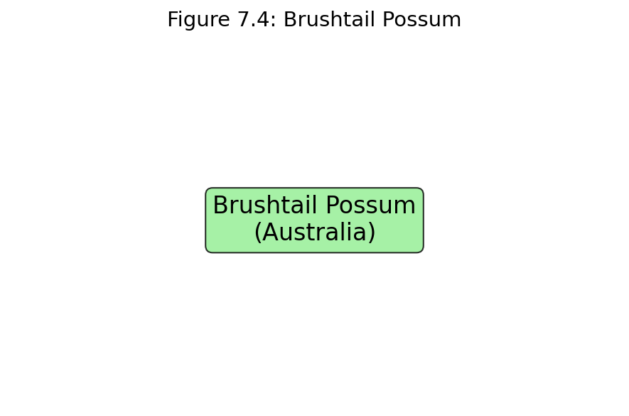

*그림 7.4: 호주의 붓꼬리주머니쥐. 사진: Greg Schecter, CC BY 2.0 라이선스.*

> `possum` 데이터는 openintro R 패키지에서 찾을 수 있다.

그림 7.5는 주머니쥐의 머리 길이(mm)와 전체 길이(cm)에 대한 산점도를 보여준다. 각 점은 데이터의 단일 주머니쥐를 나타낸다. 머리와 전체 길이 변수는 연관되어 있다: 평균 이상의 전체 길이를 가진 주머니쥐들은 평균 이상의 머리 길이를 가지는 경향이 있다. 관계가 완벽하게 선형은 아니지만, 이러한 변수들 간의 연결을 직선으로 부분적으로 설명하는 것이 도움이 될 수 있다.


*그림 7.5: 104마리 붓꼬리주머니쥐의 전체 길이에 대한 머리 길이를 보여주는 산점도. 머리 길이 86.7mm와 전체 길이 84cm인 주머니쥐를 나타내는 점이 강조되어 있다.*

우리는 주머니쥐의 머리와 전체 길이 사이의 관계를 직선으로 설명하고자 한다. 이 예에서는 전체 길이를 예측변수 $x$로 사용하여 주머니쥐의 머리 길이 $y$를 예측할 것이다. 그림 7.6에서와 같이 눈으로 선형 관계를 적합할 수 있다.

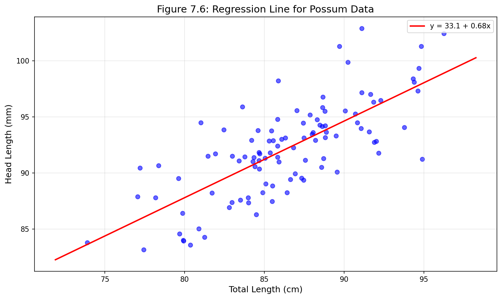

*그림 7.6: 머리 길이와 전체 길이 사이의 관계를 나타내기 위해 적합된 합리적인 선형 모델.*

이 직선의 방정식은 다음과 같다:

$$\hat{y} = 41 + 0.59x$$

$y$ 위의 "모자(hat)"는 이것이 추정치임을 나타내는 데 사용된다. 이 직선을 사용하여 주머니쥐의 특성을 논의할 수 있다. 예를 들어, 이 방정식은 전체 길이가 80cm인 주머니쥐가 다음과 같은 머리 길이를 가질 것으로 예측한다:

$$\hat{y} = 41 + 0.59 \times 80 = 88.2$$

이 추정치는 평균으로 볼 수 있다: 이 방정식은 전체 길이가 80cm인 주머니쥐들의 평균 머리 길이가 88.2mm일 것으로 예측한다. 80cm 주머니쥐에 대한 추가 정보가 없다면, 평균을 사용하는 머리 길이 예측은 합리적인 추정치이다.

**예제 7.1: 주머니쥐 머리 길이 예측**

전체 길이가 90cm인 주머니쥐의 머리 길이를 예측하라.

**풀이:**

$$\hat{y} = 41 + 0.59 \times 90 = 41 + 53.1 = 94.1 \text{ mm}$$

**Python 코드:**

```python
import numpy as np

# 회귀 모델 계수
intercept = 41
slope = 0.59

# 예측
total_length = 90  # cm
predicted_head_length = intercept + slope * total_length
print(f"전체 길이 {total_length}cm인 주머니쥐의 예측 머리 길이: {predicted_head_length:.1f} mm")
```

주머니쥐의 머리 길이를 예측하는 데 전체 길이 외에도 도움이 될 수 있는 다른 변수들이 있을 수 있다. 아마도 수컷 주머니쥐와 암컷 주머니쥐 사이에 관계가 약간 다를 수 있거나, 호주의 한 지역과 다른 지역의 주머니쥐 사이에 차이가 있을 수 있다. 그림 7.7(a)는 성별을 고려한 붓꼬리주머니쥐의 전체 길이와 머리 길이 사이의 관계를 보여준다. 수컷 주머니쥐(파란 삼각형)는 암컷 주머니쥐(빨간 원)보다 전체 길이와 머리 길이 모두 더 큰 것으로 보인다. 그림 7.7(b)는 나이를 고려한 같은 관계를 보여준다. 나이가 이 주머니쥐들의 전체 길이와 머리 길이 사이의 관계를 변화시키는지 말하기 어렵다.

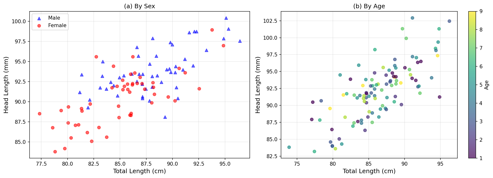

*그림 7.7: 성별 또는 나이를 고려한 붓꼬리주머니쥐의 전체 길이와 머리 길이 사이의 관계. (a) 성별별. (b) 나이별.*

8장에서는 모델에 둘 이상의 예측변수를 포함하는 방법을 배울 것이다. 그 전에 먼저 하나의 예측변수로 선형 모델을 가장 잘 구축하는 방법을 더 잘 이해해야 한다.

### 새로운 시각: 다중 그룹 비교의 중요성

실제 데이터 분석에서는 종종 여러 그룹 간의 관계를 비교해야 한다. 위의 주머니쥐 예에서 성별에 따른 차이는 중요한 통찰을 제공할 수 있다. 이러한 그룹별 분석은 **심슨의 역설**(Simpson's Paradox)을 피하는 데 도움이 된다 - 전체 데이터에서 보이는 추세가 하위 그룹에서는 반대로 나타날 수 있는 현상이다.

---

### 7.1.3 잔차

**잔차**(Residuals)는 모델 적합을 설명한 후 데이터에 남아 있는 변동이다:

$$\text{데이터} = \text{적합} + \text{잔차}$$

각 관측치에는 잔차가 있으며, 주머니쥐 데이터에 적합한 선형 모델에 대한 세 개의 잔차가 그림 7.8에 나와 있다. 관측치가 회귀선 위에 있으면, 관측치에서 선까지의 수직 거리인 잔차는 양수이다. 선 아래의 관측치는 음의 잔차를 가진다. 올바른 선형 모델을 선택하는 한 가지 목표는 잔차를 가능한 한 작게 만드는 것이다.

그림 7.8에서 빨간 원으로 표시된 관측치는 약 -1의 작은 음의 잔차를 가지며, 회색 다이아몬드로 표시된 관측치는 약 +7의 큰 양의 잔차를 가지며, 분홍색 삼각형으로 표시된 관측치는 약 -4의 중간 음의 잔차를 가진다. 잔차의 크기는 일반적으로 절대값으로 논의된다. 예를 들어, 분홍색 삼각형으로 표시된 관측치의 잔차는 빨간 원으로 표시된 관측치의 잔차보다 크다. 왜냐하면 $|-4|$가 $|-1|$보다 크기 때문이다.


*그림 7.8: 세 점이 강조된 머리 길이와 전체 길이 사이의 관계를 나타내기 위해 적합된 합리적인 선형 모델.*

> **잔차: 관측값과 예측값의 차이**
>
> $i$번째 관측치 $(x_i, y_i)$의 잔차는 관측된 결과$(y_i)$와 모델 적합을 기반으로 예측한 결과$(\hat{y}_i)$의 차이이다:
>
> $$e_i = y_i - \hat{y}_i$$
>
> 일반적으로 $x_i$를 모델에 대입하여 $\hat{y}_i$를 식별한다.

**예제 7.2: 잔차 계산**

그림 7.8에 표시된 선형 적합은 $\hat{y} = 41 + 0.59x$로 주어진다. 이 직선을 기반으로 관측치 $(76.0, 85.1)$의 잔차를 계산하라. 이 관측치는 그림 7.8에서 빨간 원으로 표시되어 있다. 앞서 시각적 추정치 -1과 비교해 보라.

**풀이:**

먼저 모델을 기반으로 빨간 원으로 표시된 관측치의 예측값을 계산한다:

$$\hat{y} = 41 + 0.59 \times 76.0 = 41 + 44.84 = 85.84$$

다음으로 실제 머리 길이와 예측된 머리 길이의 차이를 계산한다:

$$e = y - \hat{y} = 85.1 - 85.84 = -0.74$$

모델의 오차는 $e = -0.74$ mm이며, 이는 시각적 추정치 -1 mm에 매우 가깝다. 음의 잔차는 선형 모델이 이 주머니쥐의 머리 길이를 과대예측했음을 나타낸다.

**Python 코드:**

```python
import numpy as np

# 회귀 모델
intercept = 41
slope = 0.59

# 관측치
x_obs = 76.0
y_obs = 85.1

# 예측값 계산
y_pred = intercept + slope * x_obs
print(f"예측값: {y_pred:.2f} mm")

# 잔차 계산
residual = y_obs - y_pred
print(f"잔차: {residual:.2f} mm")

# 해석
if residual < 0:
    print("모델이 과대예측했다 (관측값 < 예측값)")
else:
    print("모델이 과소예측했다 (관측값 > 예측값)")
```

**Guided Practice 7.1**

모델이 관측치를 과소예측하면 잔차는 양수일까 음수일까? 과대예측하면 어떨까?

**풀이:**

모델이 관측치를 과소예측하면, 모델 추정치는 실제값 아래에 있다. 잔차는 실제 관측값에서 모델 추정치를 뺀 것이므로 양수여야 한다. 모델이 관측치를 과대예측하면 그 반대가 성립한다: 잔차는 음수이다.

**Guided Practice 7.2**

그림에서 파란 다이아몬드로 표시된 관측치 $(85.0, 98.6)$와 분홍색 삼각형으로 표시된 관측치 $(95.5, 94.0)$의 잔차를 선형 관계 $\hat{y} = 41 + 0.59x$를 사용하여 계산하라.

**풀이:**

**파란 다이아몬드 (85.0, 98.6):**
$$\hat{y} = 41 + 0.59 \times 85.0 = 41 + 50.15 = 91.15$$
$$e = 98.6 - 91.15 = 7.45$$

**분홍색 삼각형 (95.5, 94.0):**
$$\hat{y} = 41 + 0.59 \times 95.5 = 41 + 56.345 = 97.345$$
$$e = 94.0 - 97.345 = -3.345$$

**Python 코드:**

```python
# 두 관측치의 잔차 계산
observations = [(85.0, 98.6, '파란 다이아몬드'), (95.5, 94.0, '분홍색 삼각형')]

intercept = 41
slope = 0.59

for x_obs, y_obs, name in observations:
    y_pred = intercept + slope * x_obs
    residual = y_obs - y_pred
    print(f"{name}: x={x_obs}, y={y_obs}")
    print(f"  예측값: {y_pred:.2f}, 잔차: {residual:.2f}")
```

잔차는 선형 모델이 데이터셋에 얼마나 잘 적합하는지 평가하는 데 유용하다. 우리는 종종 그림 7.9에 표시된 것처럼 산점도에 잔차를 표시한다. 잔차는 예측된 결과 변수 값을 수평 좌표로, 잔차를 수직 좌표로 하여 그려진다.

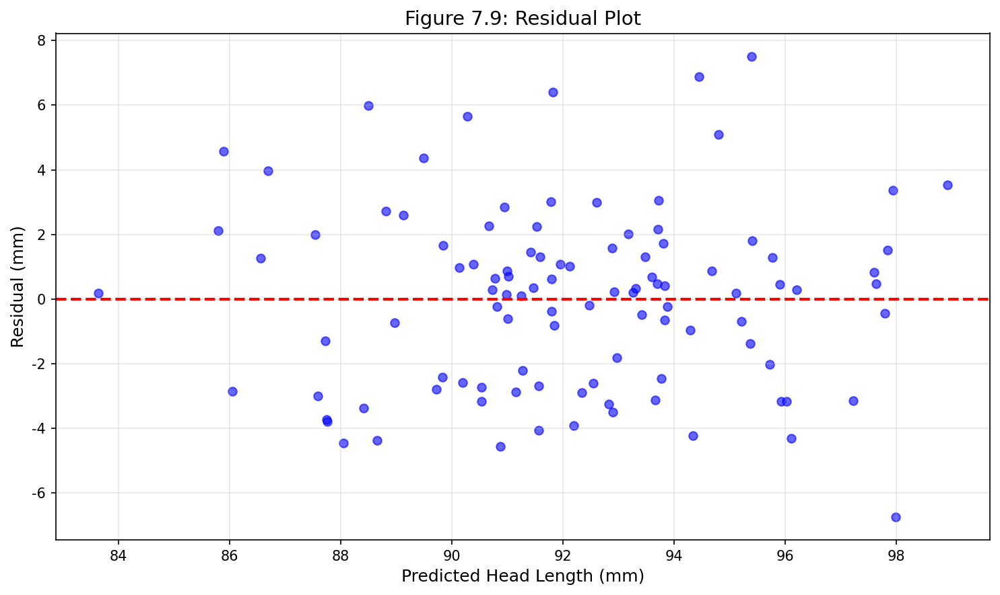

*그림 7.9: 붓꼬리주머니쥐의 전체 길이로부터 머리 길이를 예측하는 모델에 대한 잔차 그래프.*

잔차 그래프의 한 가지 목적은 모델을 적합한 후에도 데이터에 여전히 분명한 특성이나 패턴을 식별하는 것이다.

### 새로운 시각: 잔차 그래프 해석 가이드

좋은 선형 모델의 잔차 그래프는 다음 특성을 가져야 한다:

| 특성 | 좋은 적합 | 문제 있는 적합 |
|---|---|---|
| 패턴 | 무작위로 흩어짐 | U자형, 부채꼴, 곡선 패턴 |
| 중심 | 0 주위에 분포 | 0에서 체계적으로 벗어남 |
| 퍼짐 | 일정한 분산 | 이분산성 (분산이 x에 따라 변함) |
| 이상치 | 거의 없음 | 극단적인 값들이 존재 |

**Python 코드: 잔차 그래프 생성**

```python
import numpy as np
import matplotlib.pyplot as plt
from scipy import stats

# 주머니쥐 데이터 시뮬레이션
np.random.seed(42)
n = 104
total_length = np.random.normal(87, 5, n)
head_length = 41 + 0.59 * total_length + np.random.normal(0, 3, n)

# 회귀 적합
slope, intercept, r_value, p_value, std_err = stats.linregress(total_length, head_length)
predicted = intercept + slope * total_length
residuals = head_length - predicted

fig, axes = plt.subplots(1, 2, figsize=(14, 5))

# 산점도 + 회귀선
axes[0].scatter(total_length, head_length, alpha=0.6, color='blue')
x_line = np.linspace(total_length.min(), total_length.max(), 100)
y_line = intercept + slope * x_line
axes[0].plot(x_line, y_line, 'r-', linewidth=2)
axes[0].set_xlabel('Total Length (cm)')
axes[0].set_ylabel('Head Length (mm)')
axes[0].set_title('Scatterplot with Regression Line')

# 잔차 그래프
axes[1].scatter(predicted, residuals, alpha=0.6, color='blue')
axes[1].axhline(y=0, color='red', linestyle='--', linewidth=2)
axes[1].set_xlabel('Predicted Head Length (mm)')
axes[1].set_ylabel('Residual (mm)')
axes[1].set_title('Residual Plot')

plt.tight_layout()
plt.savefig('figures/fig_7_9_residual_plot.png', dpi=150, bbox_inches='tight')
plt.show()
```

---

### 7.1.4 상관관계로 선형 관계 설명하기

우리는 강한 선형 관계를 가진 그래프와 매우 약한 선형 관계를 가진 그래프를 보았다. 이러한 선형 관계의 강도를 통계량으로 정량화할 수 있다면 유용할 것이다.

> **상관관계: 선형 관계의 강도**
>
> **상관관계**(Correlation)는 항상 -1과 1 사이의 값을 가지며, 두 변수 사이의 선형 관계의 강도와 방향을 설명한다. 상관관계를 $r$로 표기한다.

상관관계 값은 단위가 없으며 단위의 선형 변환(예: 인치에서 센티미터로)에 영향을 받지 않는다.

다른 통계량과 마찬가지로 공식을 사용하여 상관관계를 계산할 수 있다. 그러나 상관관계 공식은 다소 복잡하며, 다른 통계량과 마찬가지로 일반적으로 컴퓨터나 계산기에서 계산을 수행한다.

$$r = \frac{1}{n-1} \sum_{i=1}^{n} \frac{x_i - \bar{x}}{s_x} \frac{y_i - \bar{y}}{s_y}$$

여기서 $\bar{x}$, $\bar{y}$, $s_x$, $s_y$는 각각 예측변수와 결과변수의 표본 평균과 표준편차이다.

그림 7.10은 8개의 그래프와 해당 상관관계를 보여준다. 관계가 완벽하게 선형일 때만 상관관계가 -1 또는 +1이다. 관계가 강하고 양수이면 상관관계는 +1에 가깝다. 강하고 음수이면 -1에 가깝다. 변수 사이에 명확한 선형 관계가 없으면 상관관계는 0에 가깝다.

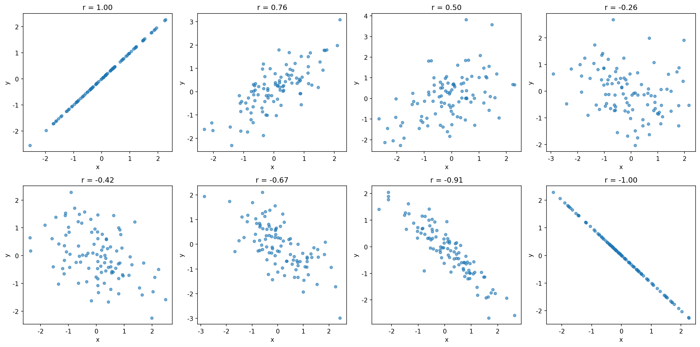

*그림 7.10: 표본 산점도와 그 상관관계. 첫 번째 행은 양의 관계를 가진 변수들을 보여주며, 오른쪽 위를 향하는 추세로 표현된다. 두 번째 행은 음의 추세를 가진 변수들을 보여주며, 한 변수의 큰 값이 다른 변수의 낮은 값과 연관된다.*

상관관계는 선형 추세의 강도를 정량화하기 위한 것이다. 비선형 추세는 강하더라도 관계의 강도를 반영하지 않는 상관관계를 생성하는 경우가 있다; 그림 7.11에서 그러한 세 가지 예를 볼 수 있다.

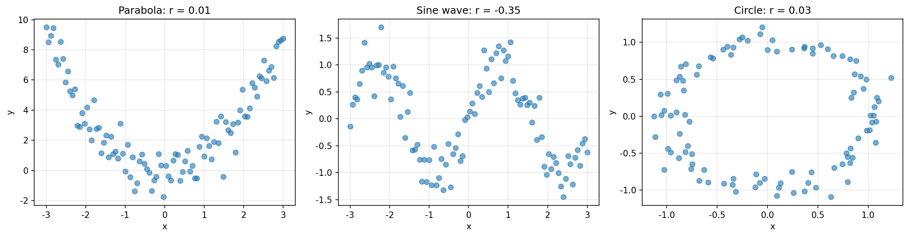

*그림 7.11: 표본 산점도와 그 상관관계. 각 경우에 변수들 사이에 강한 관계가 있다. 그러나 관계가 선형이 아니기 때문에 상관관계는 상대적으로 약하다.*

**Python 코드: 다양한 상관관계 시각화**

```python
import numpy as np
import matplotlib.pyplot as plt

np.random.seed(42)
n = 100

fig, axes = plt.subplots(2, 4, figsize=(16, 8))

# 다양한 상관관계를 가진 데이터 생성
correlations = [1.0, 0.75, 0.50, 0.00, -0.50, -0.75, -0.90, -1.0]
titles = ['r = 1.0', 'r = 0.75', 'r = 0.50', 'r ≈ 0', 
          'r = -0.50', 'r = -0.75', 'r = -0.90', 'r = -1.0']

for idx, (r_target, title) in enumerate(zip(correlations, titles)):
    row = idx // 4
    col = idx % 4
    
    if abs(r_target) == 1:
        x = np.linspace(0, 10, n)
        y = x if r_target > 0 else -x
    else:
        # 목표 상관관계를 가진 데이터 생성
        x = np.random.normal(0, 1, n)
        if r_target == 0:
            y = np.random.normal(0, 1, n)
        else:
            y = r_target * x + np.sqrt(1 - r_target**2) * np.random.normal(0, 1, n)
    
    axes[row, col].scatter(x, y, alpha=0.6, s=20)
    actual_r = np.corrcoef(x, y)[0, 1]
    axes[row, col].set_title(f'{title}\n(actual: {actual_r:.2f})')
    axes[row, col].set_xlabel('x')
    axes[row, col].set_ylabel('y')

plt.tight_layout()
plt.savefig('figures/fig_7_10_correlations.png', dpi=150, bbox_inches='tight')
plt.show()
```

**예제 7.3: 상관계수 계산**

다음 5개의 데이터 쌍에 대한 상관계수를 계산하라: (1, 2), (2, 4), (3, 5), (4, 4), (5, 5)

**풀이:**

```python
import numpy as np

x = np.array([1, 2, 3, 4, 5])
y = np.array([2, 4, 5, 4, 5])

# 평균 계산
x_mean = np.mean(x)
y_mean = np.mean(y)
print(f"x의 평균: {x_mean}")
print(f"y의 평균: {y_mean}")

# 표준편차 계산
x_std = np.std(x, ddof=1)  # 표본 표준편차
y_std = np.std(y, ddof=1)
print(f"x의 표준편차: {x_std:.4f}")
print(f"y의 표준편차: {y_std:.4f}")

# 상관계수 계산 (공식 사용)
n = len(x)
r = (1/(n-1)) * np.sum(((x - x_mean)/x_std) * ((y - y_mean)/y_std))
print(f"상관계수 (공식): {r:.4f}")

# numpy를 사용한 검증
r_numpy = np.corrcoef(x, y)[0, 1]
print(f"상관계수 (numpy): {r_numpy:.4f}")
```

출력:
```
x의 평균: 3.0
y의 평균: 4.0
x의 표준편차: 1.5811
y의 표준편차: 1.2247
상관계수 (공식): 0.7746
상관계수 (numpy): 0.7746
```

상관관계의 한 가지 중요한 측면은 *단위가 없다*는 것이다. 즉, 직선의 기울기 측정(x 좌표의 1 단위 증가에 대한 y 좌표의 증가를 제공)과 달리 x와 y의 상관관계에는 단위가 연관되어 있지 않다. 그림 7.12는 507명의 신체 활동이 활발한 개인의 체중과 키 사이의 관계를 보여준다. 그림 7.12(a)에서 체중은 킬로그램(kg)으로, 키는 센티미터(cm)로 측정된다. 그림 7.12(b)에서 체중은 파운드(lbs)로, 키는 인치(in)로 변환되었다. 상관계수($r = 0.72$)도 두 그래프에 표시되어 있다. 관계의 모양은 변하지 않았으며 상관계수도 변하지 않았음을 알 수 있다. 그래프에서 유일한 시각적 변화는 점의 축 *레이블*이다.

### 새로운 시각: 상관관계의 한계

상관관계는 강력한 도구이지만 몇 가지 중요한 한계가 있다:

1. **선형 관계만 측정**: 비선형 관계는 감지하지 못한다
2. **인과관계를 의미하지 않음**: 상관관계 ≠ 인과관계
3. **이상치에 민감**: 극단값이 상관계수를 크게 왜곡할 수 있다
4. **집계의 함정**: 하위 그룹별로 다른 패턴이 있을 수 있다

**기억할 점**: "상관관계가 있다고 해서 인과관계가 있는 것은 아니다!"

## 7.2 최소제곱 회귀

눈으로 선형 모델을 적합하는 것은 개인의 선호도에 기반하기 때문에 비판을 받을 수 있다. 이 절에서는 산점도에 직선을 적합하는 더 엄격한 접근 방식으로 *최소제곱 회귀*를 사용한다.

---

### 7.2.1 Elmhurst 대학 1학년생을 위한 학자금 지원

이 절에서는 일리노이주 Elmhurst 대학 1학년 학급의 50명 학생 무작위 표본에서 가족 소득과 학자금 지원 데이터에 대한 데이터셋을 고려한다. **학자금 지원**(Gift aid)은 대출과 달리 상환할 필요가 없는 재정 지원이다. 이 데이터의 산점도가 선형 적합과 함께 그림 7.13에 나와 있다. 직선은 데이터의 음의 추세를 따른다; 가족 소득이 높은 학생들은 대학으로부터 더 적은 학자금 지원을 받는 경향이 있다.

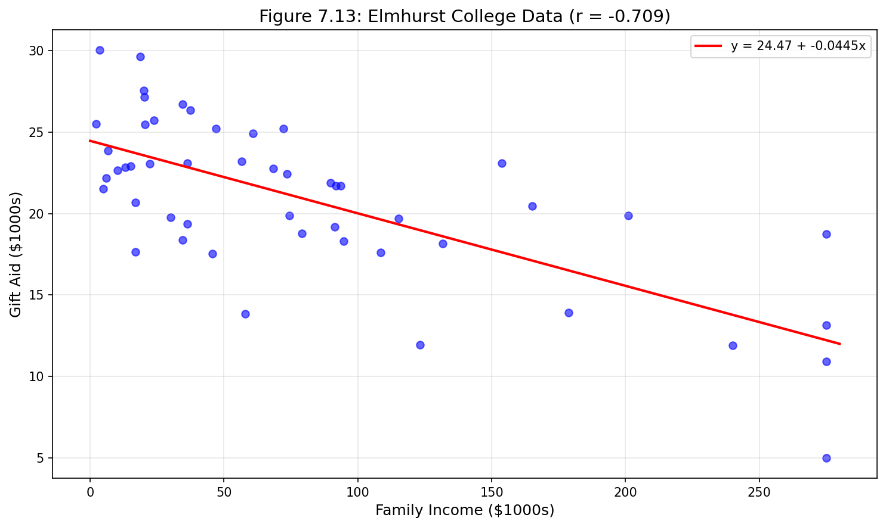

*그림 7.13: Elmhurst 대학 1학년 학생 50명의 무작위 표본에 대한 학자금 지원과 가족 소득.*

**Guided Practice 7.3**

그림 7.13에서 상관관계는 양수인가 음수인가?

**풀이:**

가족 소득이 높을수록 학자금 지원이 낮은 것과 연관되어 있으므로 상관관계는 음수이다. 컴퓨터를 사용하여 상관관계를 계산할 수 있다: -0.499.

---

### 7.2.2 최적 직선을 찾기 위한 객관적 측도

"최적" 직선이 무엇을 의미하는지 생각하는 것부터 시작한다. 수학적으로, 우리는 잔차가 작은 직선을 원한다. 그러나 수학적 이유 외에도, 어떤 직선을 적합하든 잔차가 작아야 한다는 것(즉, 점들이 직선에 가까워야 한다)이 직관적으로도 이해가 된다. 처음 떠오를 수 있는 옵션은 잔차 크기의 합을 최소화하는 것이다:

$$|e_1| + |e_2| + \dots + |e_n|$$

이것은 컴퓨터 프로그램으로 수행할 수 있다. 그림 7.14에 표시된 결과 점선은 이 적합이 상당히 합리적일 수 있음을 보여준다.

그러나 더 일반적인 관행은 **잔차 제곱합**을 최소화하는 직선을 선택하는 것이다:

$$e_1^2 + e_2^2 + \dots + e_n^2$$

이 최소제곱 기준을 최소화하는 직선은 그림 7.14에서 실선으로 표시되며 일반적으로 **최소제곱선**(least squares line)이라고 부른다.

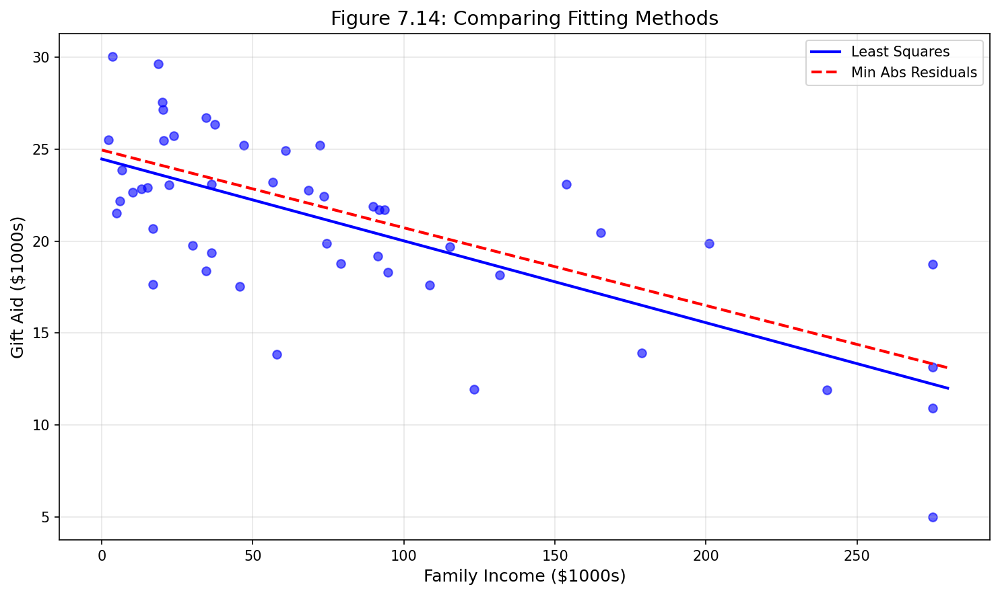

*그림 7.14: Elmhurst 대학 1학년 학생 50명의 무작위 표본에 대한 학자금 지원과 가족 소득. 점선은 잔차 절대값의 합을 최소화하는 직선이고, 실선은 잔차 제곱합을 최소화하는 직선, 즉 최소제곱선이다.*

잔차 크기의 합을 최소화하는 대신 최소제곱 옵션을 선택하는 이유는 다음과 같다:

1. 가장 일반적으로 사용되는 방법이다.
2. 최소제곱선 계산은 통계 소프트웨어에서 널리 지원된다.
3. 많은 응용에서, 다른 잔차보다 두 배 큰 잔차는 두 배 이상 나쁘다. 예를 들어, 4만큼 벗어나는 것은 보통 2만큼 벗어나는 것보다 두 배 이상 나쁘다. 잔차를 제곱하면 이러한 불일치를 설명한다.
4. 모델을 모집단에 대한 추론에 연결하는 분석은 최소제곱으로 직선을 적합할 때 가장 간단하다.

### 새로운 시각: 최소제곱법의 기하학적 의미

최소제곱법은 수직 거리의 제곱합을 최소화한다. 이것은 다음과 같은 기하학적 해석을 가진다:

- 각 데이터 점에서 직선까지의 수직 거리를 측정
- 이 거리들을 제곱하여 모두 양수로 만듦
- 제곱된 거리들의 합이 가장 작은 직선을 선택

왜 수직 거리인가? 우리가 $x$로 $y$를 예측하기 때문이다. $y$ 방향의 오차가 우리가 최소화하고 싶은 것이다.

**Python 코드: 최소제곱선 적합**

```python
import numpy as np
import matplotlib.pyplot as plt
from scipy import stats

# Elmhurst 데이터 시뮬레이션
np.random.seed(42)
n = 50
family_income = np.random.exponential(100, n)
family_income = np.clip(family_income, 0, 275)
gift_aid = 24.3 - 0.043 * family_income + np.random.normal(0, 4, n)
gift_aid = np.clip(gift_aid, 5, 35)

# 최소제곱 회귀
slope, intercept, r_value, p_value, std_err = stats.linregress(family_income, gift_aid)

print(f"절편 (b0): {intercept:.3f}")
print(f"기울기 (b1): {slope:.4f}")
print(f"상관계수 (r): {r_value:.3f}")
print(f"결정계수 (R²): {r_value**2:.3f}")

# 그래프
plt.figure(figsize=(10, 6))
plt.scatter(family_income, gift_aid, alpha=0.6, color='blue')
x_line = np.linspace(0, 280, 100)
y_line = intercept + slope * x_line
plt.plot(x_line, y_line, 'r-', linewidth=2, label=f'y = {intercept:.2f} + {slope:.4f}x')
plt.xlabel('Family Income ($1000s)')
plt.ylabel('Gift Aid ($1000s)')
plt.title('Elmhurst College: Gift Aid vs Family Income')
plt.legend()
plt.grid(True, alpha=0.3)
plt.savefig('figures/fig_7_13_elmhurst.png', dpi=150, bbox_inches='tight')
plt.show()
```

---

### 7.2.3 최소제곱선 찾기 및 해석

Elmhurst 데이터에 대해 최소제곱 회귀선의 방정식을 다음과 같이 작성할 수 있다:

$$\widehat{\texttt{aid}} = \beta_0 + \beta_1 \times \texttt{family\_income}$$

여기서 방정식은 학생의 가족 소득을 기반으로 학자금 지원을 예측하도록 설정되어 있으며, 이는 Elmhurst를 고려하는 학생들에게 유용할 것이다. 이 두 값 $\beta_0$과 $\beta_1$은 회귀선의 모수이다.

모수는 관측된 데이터를 사용하여 추정된다. 실제로 이 추정은 표본 평균과 같은 다른 추정치와 마찬가지로 컴퓨터를 사용하여 수행된다.

표 7.2는 Elmhurst 데이터에 대한 최소제곱 적합 요약을 보여준다.

*표 7.2: Elmhurst 데이터에 대한 최소제곱 적합 요약*

| 항 | 추정치 | 표준오차 | 통계량 | p값 |
|---|---|---|---|---|
| (절편) | 24.32 | 1.29 | 18.83 | <0.0001 |
| family_income | -0.04 | 0.01 | -3.98 | 0.0002 |

모델 출력은 절편이 약 24.319이고 `family_income`에 대한 기울기가 약 -0.043임을 알려준다.

**예제 7.4: 모수 해석**

Elmhurst 데이터에 대한 절편과 기울기 추정치는 $b_0$ = 24.319와 $b_1$ = -0.043이다. 이 숫자들은 실제로 무엇을 의미하는가?

**풀이:**

기울기 모수를 해석하는 것은 거의 모든 응용에서 유용하다. 가족 소득이 $1,000 추가될 때마다, 학생이 평균적으로 1,000 × (-0.0431) = -$43.10의 순 차이, 즉 $43.10 *더 적은* 지원을 받을 것으로 예상한다. 모델에서 가족 소득의 계수가 음수이기 때문에 가족 소득이 높을수록 지원이 적어진다. 이 해석에서 주의해야 한다: 실제 연관성이 있지만, 이 데이터가 관측 연구이므로 변수 간의 인과 관계를 해석할 수 없다. 즉, 특정 학생의 가족 소득을 증가시키면 학생의 지원이 감소할 수 있다는 것은 아니다. (대학에 연락하여 관계가 인과적인지, 즉 Elmhurst 대학의 지원 결정이 부분적으로 학생의 가족 소득에 기반하는지 물어보는 것은 합리적일 것이다.)

추정된 절편 $b_0$ = 24.319는 학생의 가족에게 소득이 없는 경우 평균 지원, $24,319를 설명한다. 절편의 의미는 Elmhurst의 일부 학생들의 가족 소득이 $0이므로 이 응용과 관련이 있다. 다른 응용에서는 $x$가 0에 가까운 관측치가 없으면 절편이 실용적 가치가 거의 또는 전혀 없을 수 있다.

> **최소제곱으로 추정된 모수 해석**
>
> 기울기는 예측변수 $x$가 1 단위 더 컸을 경우 $y$의 예측된 평균 결과의 추정된 차이를 설명한다. 절편은 $x = 0$일 때의 $y$의 평균 결과를 설명하며, 선형 모델이 $x = 0$까지 유효한 경우에만 해당된다 (많은 응용에서 $x = 0$ 값이 관측되거나 관련이 없다).

**Python 코드: 최소제곱선 계산 (수동)**

```python
import numpy as np

# Elmhurst 데이터 요약 통계
# 표 7.3에서 가져온 값
x_mean = 102  # 가족 소득 평균 ($1000s)
y_mean = 19.9  # 학자금 지원 평균 ($1000s)
x_sd = 63.2   # 가족 소득 표준편차
y_sd = 5.46   # 학자금 지원 표준편차
r = -0.499    # 상관계수

# 최소제곱선 계수 계산
# b1 = (sy/sx) * r
b1 = (y_sd / x_sd) * r
print(f"기울기 (b1) = (sy/sx) * r = ({y_sd}/{x_sd}) * {r} = {b1:.4f}")

# b0 = y_mean - b1 * x_mean
b0 = y_mean - b1 * x_mean
print(f"절편 (b0) = y_mean - b1 * x_mean = {y_mean} - ({b1:.4f}) * {x_mean} = {b0:.3f}")

# 최종 모델
print(f"\n최소제곱 회귀선: ŷ = {b0:.2f} + ({b1:.4f})x")
print(f"또는: aid = {b0:.2f} - 0.043 × family_income")
```

**Guided Practice 7.4**

표 7.3의 요약 통계를 사용하여 가족 소득에 대한 학자금 지원의 회귀선 기울기를 계산하라.

*표 7.3: 가족 소득과 학자금 지원에 대한 요약 통계*

| 가족 소득, x | | 학자금 지원, y | | |
|---|---|---|---|---|
| 평균 | sd | 평균 | sd | r |
| 102 | 63.2 | 19.9 | 5.46 | -0.499 |

**풀이:**

표 7.3의 요약 통계를 사용하여 기울기를 계산한다:

$$b_1 = \frac{s_y}{s_x} r = \frac{5.46}{63.2} \times (-0.499) = -0.0431$$

> **요약 통계에서 최소제곱선 식별하기**
>
> 요약 통계에서 최소제곱선을 식별하려면:
> - 기울기 모수를 추정한다, $b_1 = (s_y / s_x) r$
> - 점 $(\bar{x}, \bar{y})$가 최소제곱선 위에 있음을 주목하고, $x_0 = \bar{x}$와 $y_0 = \bar{y}$를 점-기울기 방정식에 사용한다: $y - \bar{y} = b_1 (x - \bar{x})$
> - 방정식을 단순화하면 $y = \bar{y} - b_1 \bar{x} + b_1 x$를 얻으며, 이것은 $b_0 = \bar{y} - b_1 \bar{x}$임을 보여준다.

**Guided Practice 7.5**

표본 평균에서 얻은 점 (102, 19.9)와 기울기 추정치 $b_1 = -0.0431$을 사용하여 가족 소득을 기반으로 지원을 예측하는 최소제곱선을 찾아라.

**풀이:**

$(102, 19.9)$와 기울기 $b_1 = -0.0431$을 사용하여 점-기울기 방정식을 적용한다:

$$y - 19.9 = -0.0431 (x - 102)$$

오른쪽을 전개하고 양변에 19.9를 더하면 방정식이 단순화된다:

$$\widehat{\texttt{aid}} = 24.3 - 0.0431 \times \texttt{family\_income}$$

**Guided Practice 7.6**

고등학교 졸업반 학생이 Elmhurst 대학을 고려하고 있다고 가정하자. 그 학생이 우리가 추정한 선형 방정식을 단순히 사용하여 대학으로부터의 재정 지원을 계산할 수 있을까?

**풀이:**

추정치로 사용할 수 있지만, 이 접근 방식에 대한 몇 가지 제한이 중요하다. 첫째, 모든 데이터는 한 1학년 학급에서 나왔으며, 대학이 지원을 결정하는 방식은 해마다 바뀔 수 있다. 둘째, 방정식은 불완전한 추정치를 제공할 것이다. 선형 방정식이 데이터의 추세를 모델링하는 데 좋지만, 개별 학생의 지원은 완벽하게 예측되지 않을 것이다 (직선 주위의 개별 데이터 점에서 볼 수 있듯이).

---

### 7.2.4 외삽은 위험하다

선형 모델은 두 변수 사이의 관계를 근사하는 데 사용될 수 있다. 그러나 모든 모델과 마찬가지로 실제 한계가 있다. 선형 회귀는 단순히 모델링 프레임워크일 뿐이다. 진실은 거의 항상 단순한 직선보다 훨씬 더 복잡하다. 예를 들어, 제한된 창 밖의 데이터가 어떻게 행동할지 모른다.

**예제 7.5: 외삽의 위험**

모델 $\widehat{\texttt{aid}} = 24.3 - 0.0431 \times \texttt{family\_income}$을 사용하여 가족 소득이 $1 million인 다른 1학년 학생의 지원을 추정하라.

**풀이:**

$1 million 소득을 가진 가족에 대한 지원을 계산하고 싶다. 우리 모델에서 데이터가 $1,000 단위이므로 이것은 1,000으로 표현될 것이다.

$$24.3 - 0.0431 \times 1000 = -18.8$$

모델은 이 학생이 -$18,800의 지원을 받을 것으로 예측한다 (!). 그러나 Elmhurst 대학은 일부 학생들이 등록금 외에 추가로 지불하도록 선택하는 *음의 지원*을 제공하지 않는다.

원래 데이터 영역 밖의 값에 모델 추정치를 적용하는 것을 **외삽**(extrapolation)이라고 한다. 일반적으로 선형 모델은 두 변수 사이의 실제 관계의 근사치일 뿐이다. 외삽을 하면 근사적인 선형 관계가 분석되지 않은 곳에서도 유효할 것이라는 신뢰할 수 없는 베팅을 하는 것이다.

### 새로운 시각: 외삽을 피하는 방법

| 상황 | 권장 사항 |
|---|---|
| 예측하려는 x 값이 관측 범위 내 | 모델 사용 가능 |
| 예측하려는 x 값이 관측 범위 약간 외 | 주의해서 사용, 불확실성 표시 |
| 예측하려는 x 값이 관측 범위 크게 외 | 사용하지 않음 |

**Python 코드: 외삽의 위험 시각화**

```python
import numpy as np
import matplotlib.pyplot as plt

# Elmhurst 모델
b0 = 24.3
b1 = -0.0431

# 관측 범위
x_observed = np.linspace(0, 275, 50)
y_observed = b0 + b1 * x_observed

# 외삽 범위
x_extrapolate = np.linspace(275, 1000, 50)
y_extrapolate = b0 + b1 * x_extrapolate

plt.figure(figsize=(12, 6))
plt.plot(x_observed, y_observed, 'b-', linewidth=2, label='관측 범위 내')
plt.plot(x_extrapolate, y_extrapolate, 'r--', linewidth=2, label='외삽 (위험!)')
plt.axhline(y=0, color='gray', linestyle='-', linewidth=1)
plt.axvline(x=275, color='green', linestyle=':', linewidth=2, label='관측 데이터 끝')

# 음의 지원 영역 표시
plt.fill_between(x_extrapolate, y_extrapolate, 0, 
                 where=(y_extrapolate < 0), alpha=0.3, color='red',
                 label='불가능한 예측 (음의 지원)')

plt.xlabel('Family Income ($1000s)')
plt.ylabel('Gift Aid ($1000s)')
plt.title('Extrapolation is Dangerous')
plt.legend()
plt.grid(True, alpha=0.3)
plt.xlim(0, 1000)
plt.ylim(-20, 30)
plt.savefig('figures/fig_7_extrapolation.png', dpi=150, bbox_inches='tight')
plt.show()

print(f"가족 소득 $1,000,000 ($1000 단위로 1000)에 대한 예측 지원:")
print(f"ŷ = {b0} + ({b1}) × 1000 = {b0 + b1 * 1000:.1f} ($1000s)")
print("이것은 불가능한 음의 값이다!")
```

---

### 7.2.5 적합 강도 설명하기

우리는 앞서 상관관계 $r$을 사용하여 두 변수 사이의 선형 관계 강도를 평가했다. 그러나 $R^2$, **R-제곱**(R-squared)을 사용하여 선형 적합의 강도를 설명하는 것이 더 일반적이다. 선형 모델이 제공되면, 데이터가 선형 적합 주위에 얼마나 밀접하게 군집하는지 설명하고 싶을 수 있다.

선형 모델의 $R^2$는 최소제곱선으로 설명되는 결과 변수의 변동 양을 설명한다. 예를 들어, 그림 7.13에 표시된 Elmhurst 데이터를 고려하자. 결과 변수인 받은 지원의 분산은 약 $s_{aid}^2 \approx 29.8$ million이다 (표 7.1에 표시된 일부 데이터에서 계산됨). 그러나 최소제곱선을 적용하면, 이 모델은 학생의 가족 소득을 사용하여 지원을 예측할 때 불확실성을 줄인다. 잔차의 변동성은 모델 사용 후 얼마나 많은 변동이 남아 있는지 설명한다: $s_{RES}^2 \approx 22.4$ million. 간단히 말해, 다음과 같은 감소가 있었다:

$$\frac{s_{aid}^2 - s_{RES}^2}{s_{aid}^2} = \frac{29800 - 22400}{29800} = \frac{7500}{29800} \approx 0.25$$

또는 선형 모델을 사용하여 가족 소득 정보로 지원을 예측함으로써 결과 변수 변동의 약 25%가 감소했다. $R^2$는 정확히 상관관계의 제곱값에 해당한다:

$$r = -0.499 \rightarrow R^2 = 0.25$$

**Guided Practice 7.7**

선형 모델이 상관관계 -0.97의 매우 강한 음의 관계를 가지면, 예측변수에 의해 설명되는 결과의 변동은 얼마나 되는가?

**풀이:**

약 $R^2 = (-0.97)^2 = 0.94$ 또는 결과 변수 변동의 94%가 선형 모델에 의해 설명된다.

> **결정계수: 모델에 의해 설명되는 결과 변수의 변동 비율**
>
> $r$이 항상 -1과 1 사이이므로, $R^2$는 항상 0과 1 사이이다. 이 통계량을 **결정계수**(coefficient of determination)라고 하며, 예측변수 $x$를 가진 선형 모델로 설명할 수 있는 결과 변수 $y$의 변동 비율을 측정한다.

더 일반적으로, $R^2$는 직선 주위의 변동성 측도를 총 변동성 측도로 나눈 비율로 계산할 수 있다.

> **$y$의 변동성을 측정하기 위한 제곱합**
>
> $y$ 값의 변동성은 평균 $\bar{y}$로부터 얼마나 떨어지는 경향이 있는지로 측정할 수 있다. 이 값을 **총제곱합**(total sum of squares, SST)이라고 정의하며, 다음 공식을 사용하여 계산한다:
>
> $$SST = (y_1 - \bar{y})^2 + (y_2 - \bar{y})^2 + \cdots + (y_n - \bar{y})^2$$
>
> $x$를 알 때 $y$ 값의 남은 변동성은 **오차제곱합**(sum of squared errors, SSE) 또는 잔차제곱합으로 측정할 수 있다:
>
> $$SSE = (y_1 - \hat{y}_1)^2 + (y_2 - \hat{y}_2)^2 + \cdots + (y_n - \hat{y}_n)^2 = e_1^2 + e_2^2 + \dots + e_n^2$$
>
> 결정계수는 다음과 같이 계산할 수 있다:
>
> $$R^2 = \frac{SST - SSE}{SST} = 1 - \frac{SSE}{SST}$$

**예제 7.6: $R^2$ 계산**

`elmhurst` 데이터셋의 50명 학생 중, 학자금 지원의 총 변동성은 $SST = 1461$이다. 잔차제곱합은 $SSE = 1098$이다. $R^2$를 찾아라.

**풀이:**

$SSE$와 $SST$를 알고 있으므로, $R^2$를 다음과 같이 계산할 수 있다:

$$R^2 = 1 - \frac{SSE}{SST} = 1 - \frac{1098}{1461} = 0.25$$

상관관계를 제곱했을 때 찾은 값과 같다: $R^2 = (-0.499)^2 = 0.25$.

**Python 코드: R² 계산**

```python
import numpy as np
from scipy import stats

# 데이터 시뮬레이션
np.random.seed(42)
n = 50
family_income = np.random.exponential(100, n)
gift_aid = 24.3 - 0.043 * family_income + np.random.normal(0, 4, n)

# 회귀 분석
slope, intercept, r_value, p_value, std_err = stats.linregress(family_income, gift_aid)
predicted = intercept + slope * family_income
residuals = gift_aid - predicted

# SST 계산
y_mean = np.mean(gift_aid)
SST = np.sum((gift_aid - y_mean)**2)
print(f"SST (총제곱합): {SST:.2f}")

# SSE 계산
SSE = np.sum(residuals**2)
print(f"SSE (오차제곱합): {SSE:.2f}")

# R² 계산 (두 가지 방법)
R2_from_SS = 1 - SSE/SST
R2_from_r = r_value**2

print(f"\nR² (제곱합 사용): {R2_from_SS:.4f}")
print(f"R² (r² 사용): {R2_from_r:.4f}")
print(f"상관계수 r: {r_value:.4f}")

print(f"\n해석: 가족 소득이 학자금 지원 변동의 {R2_from_SS*100:.1f}%를 설명한다.")
```

### 새로운 시각: R²의 해석

$R^2$ 값은 0과 1 사이이며, 다음과 같이 해석할 수 있다:

| R² 값 | 해석 |
|---|---|
| 0.00 - 0.25 | 약한 설명력 |
| 0.25 - 0.50 | 보통의 설명력 |
| 0.50 - 0.75 | 상당한 설명력 |
| 0.75 - 1.00 | 강한 설명력 |

그러나 이 기준은 분야에 따라 다르다. 사회과학에서는 $R^2 = 0.30$이 좋은 것으로 간주될 수 있지만, 물리학에서는 $R^2 = 0.95$ 이상이 기대될 수 있다.

---

### 7.2.6 두 수준을 가진 범주형 예측변수

범주형 변수도 결과를 예측하는 데 유용하다. 여기서는 두 수준을 가진 범주형 예측변수를 고려한다 (*수준*은 *범주*와 같다). Nintendo Wii용 비디오 게임 *Mario Kart*에 대한 Ebay 경매를 고려하며, 경매의 총 가격과 게임 상태가 기록되었다. 여기서 게임 상태를 기반으로 총 가격을 예측하고자 하며, 상태는 `used`와 `new` 값을 가진다.

> `mariokart` 데이터는 openintro R 패키지에서 찾을 수 있다.

경매 데이터의 그래프가 그림 7.15에 나와 있다. 원래 데이터셋에는 $100 이상의 가격에 판매되는 일부 Mario Kart 게임이 포함되어 있지만, 이 분석에서는 $100 미만으로 판매된 141개의 Mario Kart 게임으로 관심을 제한했다.

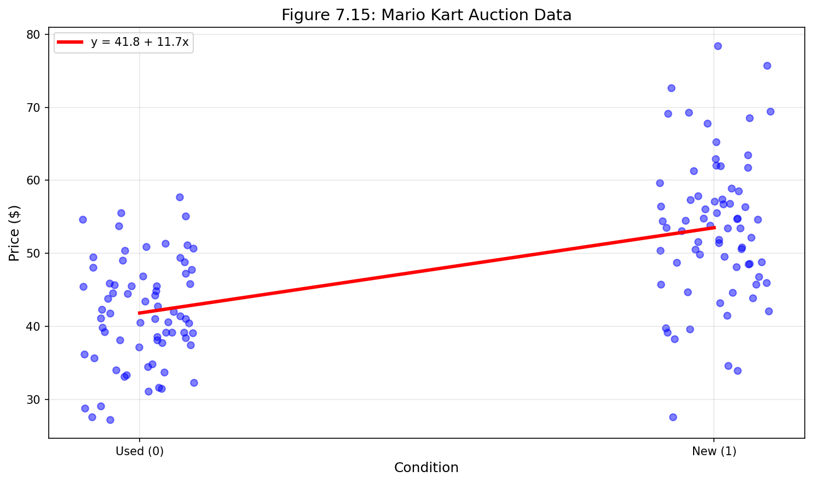

*그림 7.15: 중고($x = 0$)와 새 제품($x = 1$) 상태 게임으로 나뉜 비디오 게임 Mario Kart의 총 경매 가격. 최소제곱 회귀선도 표시되어 있다.*

게임 상태 변수를 회귀 방정식에 포함시키려면 범주를 수치 형태로 변환해야 한다. 게임이 새 것일 때 1, 중고일 때 0을 취하는 `condnew`라는 **지시변수**(indicator variable)를 사용하여 이를 수행한다. 이 지시변수를 사용하여 선형 모델을 다음과 같이 작성할 수 있다:

$$\widehat{\texttt{price}} = b_0 + b_1 \times \texttt{condnew}$$

모수 추정치는 표 7.4에 나와 있다.

*표 7.4: 게임 상태에 대한 최종 경매 가격의 최소제곱 회귀 요약*

| 항 | 추정치 | 표준오차 | 통계량 | p값 |
|---|---|---|---|---|
| (절편) | 42.9 | 0.81 | 52.67 | <0.0001 |
| condnew | 10.9 | 1.26 | 8.66 | <0.0001 |

표 7.4의 값을 사용하여 모델 방정식을 다음과 같이 요약할 수 있다:

$$\widehat{\texttt{price}} = 42.87 + 10.9 \times \texttt{condnew}$$

**예제 7.7: 범주형 예측변수 해석**

eBay 경매에서 Mario Kart 가격에 대한 모델에서 추정된 두 모수를 해석하라.

**풀이:**

절편은 `condnew`가 0일 때, 즉 게임이 중고 상태일 때의 예측 가격이다. 즉, 중고 버전 게임의 평균 판매 가격은 $42.9이다. 기울기는 평균적으로 새 게임이 중고 게임보다 약 $10.9 더 비싸게 팔린다는 것을 나타낸다.

> **범주형 예측변수에 대한 모델 추정치 해석**
>
> 추정된 절편은 첫 번째 범주(즉, 지시변수 값 0에 해당하는 범주)에 대한 결과 변수의 값이다. 추정된 기울기는 두 범주 간의 결과 변수의 평균 변화이다.

**Python 코드: 범주형 예측변수를 사용한 회귀**

```python
import numpy as np
import matplotlib.pyplot as plt
from scipy import stats

# Mario Kart 데이터 시뮬레이션
np.random.seed(42)
n_used = 70
n_new = 71

# 중고 게임 (condnew = 0)
price_used = np.random.normal(42.9, 8, n_used)
cond_used = np.zeros(n_used)

# 새 게임 (condnew = 1)
price_new = np.random.normal(53.8, 10, n_new)  # 42.9 + 10.9
cond_new = np.ones(n_new)

# 데이터 결합
price = np.concatenate([price_used, price_new])
condition = np.concatenate([cond_used, cond_new])

# 회귀 분석
slope, intercept, r_value, p_value, std_err = stats.linregress(condition, price)

print("Mario Kart 경매 회귀 분석 결과:")
print(f"절편 (중고 평균 가격): ${intercept:.2f}")
print(f"기울기 (새 제품 추가 가격): ${slope:.2f}")
print(f"R²: {r_value**2:.3f}")

# 그래프
plt.figure(figsize=(10, 6))

# 지터 추가하여 점들이 겹치지 않도록
jitter = np.random.uniform(-0.1, 0.1, len(condition))
plt.scatter(condition + jitter, price, alpha=0.5, color='blue')

# 회귀선
x_line = np.array([0, 1])
y_line = intercept + slope * x_line
plt.plot(x_line, y_line, 'r-', linewidth=3, label=f'ŷ = {intercept:.1f} + {slope:.1f}x')

plt.xticks([0, 1], ['Used (0)', 'New (1)'])
plt.xlabel('Condition')
plt.ylabel('Price ($)')
plt.title('Mario Kart Auction Prices by Condition')
plt.legend()
plt.grid(True, alpha=0.3)
plt.savefig('figures/fig_7_15_mariokart.png', dpi=150, bbox_inches='tight')
plt.show()

print(f"\n예측:")
print(f"중고 게임 예측 가격: ${intercept:.2f}")
print(f"새 게임 예측 가격: ${intercept + slope:.2f}")
```

### 새로운 시각: 지시변수의 이해

지시변수(더미 변수라고도 함)는 범주형 데이터를 회귀 분석에 포함시키는 표준적인 방법이다:

| 범주 | 지시변수 값 | 회귀에서의 의미 |
|---|---|---|
| 기준 범주 (예: 중고) | 0 | 절편이 이 범주의 평균 |
| 비교 범주 (예: 새것) | 1 | 기울기가 범주 간 차이 |

두 개 이상의 범주가 있는 경우, 여러 지시변수가 필요하다. 이에 대해서는 8장에서 자세히 다룬다.

## 7.3 선형 회귀에서의 이상치

이 절에서는 이상치가 언제 중요하고 영향력이 있는지 논의한다. 하나의 예측변수와 하나의 결과변수를 가진 회귀 모델에서 **이상치**(outliers)는 점들의 구름에서 멀리 떨어진 관측치이다. 이러한 점들은 최소제곱선에 강한 영향을 미칠 수 있기 때문에 특히 중요하다. 관측치가 $x$ 방향, $y$ 방향, 또는 두 방향 모두에서 이상치일 수 있다는 점에 주목하라. 그러나 일변량 의미에서 이상치인 것($x$ 또는 $y$ 또는 둘 다)이 이변량 모델에서 이상치인 것은 아니다. 점들이 이변량 모델과 일치하면, 최소제곱 회귀선에 영향을 미치지 않을 것이다 (관측치가 $x$ 또는 $y$ 또는 두 방향 모두에서 이상치이더라도!).

**Guided Practice 7.8**

그림 7.16(a)에 세 개의 그래프가 해당 최소제곱선 및 잔차 그래프와 함께 표시되어 있다. 각 산점도와 잔차 그래프 쌍에 대해 이상치를 식별하고 최소제곱선에 어떻게 영향을 미치는지 주목하라. 이상치는 대다수의 다른 점들과 함께 속하지 않는 것으로 보이는 점임을 기억하라.

**풀이:**

- **A**: 다른 점들에서 멀리 떨어진 하나의 이상치가 있다 ($y$ 방향에서 이상치이며 이변량 모델의 이상치이다). 그러나 직선에 약간만 영향을 미치는 것으로 보인다.

- **B**: 오른쪽에 하나의 이상치가 있다 ($x$와 $y$ 방향에서 이상치이지만 이변량 모델의 이상치는 아니다). 그러나 최소제곱선에 상당히 가까우므로 영향력이 크지 않았음을 시사한다.

- **C**: 구름에서 멀리 떨어진 하나의 점이 있다 ($x$와 $y$ 방향에서 이상치이며 이변량 모델의 이상치이다). 이 이상치는 오른쪽에서 최소제곱선을 위로 끌어당기는 것으로 보인다; 주요 구름 주위의 직선이 잘 적합하지 않는 것처럼 보이는지 살펴보라.

**Guided Practice 7.9**

그림 7.16(b)에 세 개의 그래프가 최소제곱선 및 잔차 그래프와 함께 표시되어 있다. 이전 연습에서와 같이, 각 산점도와 잔차 그래프 쌍에 대해 이상치를 식별하고 최소제곱선에 어떻게 영향을 미치는지 주목하라.

**풀이:**

- **D**: 주요 구름과 4개의 이상치로 이루어진 작은 이차 구름이 있다 ($x$와 이변량 모델 모두에 대해). 이차 구름이 직선에 다소 강하게 영향을 미치는 것으로 보이며, 최소제곱선이 거의 모든 곳에서 잘 적합하지 않게 만든다. 이중 구름에 대한 흥미로운 설명이 있을 수 있으며, 이는 조사할 수 있는 것이다.

- **E**: 점들의 주요 구름에서 명확한 추세가 없으며 오른쪽의 이상치 ($x$와 $y$ 모두에 대해)가 최소제곱선의 기울기를 대부분 (그리고 문제적으로) 제어하는 것으로 보인다. 이 점은 겉보기에 없는 곳에 이변량 모델을 만든다.

- **F**: 구름에서 멀리 떨어진 하나의 이상치가 있다 ($x$와 $y$ 모두에 대해). 그러나 최소제곱선에 상당히 가까이 떨어지며 영향력이 크지 않은 것으로 보인다 (이변량 모델에 대해 이상치가 아니다).

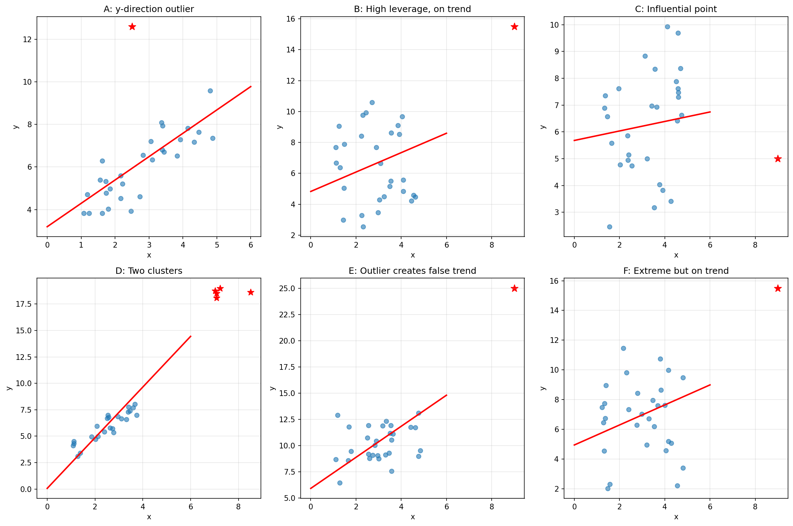

*그림 7.16: 6개 데이터셋의 그래프, 각각 최소제곱선과 해당 잔차 그래프가 있다. 각 데이터셋에는 적어도 하나의 이상치가 있다. (a) 그래프 A, B, C. (b) 그래프 D, E, F.*

그림 7.16(a)와 7.16(b)의 잔차 그래프를 검토하라. 그래프 C, D, E에서 x축을 따라 나머지 점들에서 멀리 떨어져 있고 나머지 데이터의 추세 궤적에 있지 않은 몇 가지 관측치가 있음을 발견할 것이다. 이러한 경우 이상치가 최소제곱선의 기울기에 영향을 미쳤다. 그래프 E에서 데이터의 대부분은 명확한 추세를 보이지 않지만, 이 데이터에 직선을 적합하면 실제로 없는 곳에 추세를 부과하는 것이다.

이상치 관측치를 다루는 좋은 관행은 두 가지 분석을 생성하는 것이다: 이상치 관측치가 있는 분석과 없는 분석. 두 분석을 고객에게 제시하고 이상치 관측치의 역할을 논의하면 데이터에 적절한 모델에 대한 더 전체적인 이해로 이어질 것이다.

> **레버리지**
>
> 구름 중심에서 수평으로 멀리 떨어진 점들은 직선을 더 강하게 끌어당기는 경향이 있으므로, 우리는 이를 **높은 레버리지**(high leverage)를 가진 점 또는 **레버리지 점**(leverage points)이라고 부른다.

직선에서 수평으로 멀리 떨어진 점들은 높은 레버리지를 가진 점이다; 이러한 점들은 최소제곱선의 기울기에 강하게 영향을 미칠 수 있다. 이러한 높은 레버리지 점 중 하나가 그림 7.16(a)와 7.16(b)의 그래프 C, D, E에서처럼 직선의 기울기에 실제로 영향을 미치는 것으로 보이면, 우리는 이를 **영향력 있는 점**(influential point)이라고 부른다. 일반적으로 직선을 해당 점 없이 적합했다면 영향력 있는 점이 최소제곱선에서 비정상적으로 멀리 떨어져 있었을 경우 점이 영향력 있다고 말할 수 있다.

> **이상치의 유형**
>
> 나머지 데이터에서 두드러지는 점 (또는 점들의 그룹)을 이상치라고 한다. 점들의 구름 중심에서 수평으로 멀리 떨어진 이상치를 레버리지 점이라고 한다. 직선의 기울기에 영향을 미치는 이상치를 영향력 있는 점이라고 한다.

이상치를 제거하고 싶은 유혹이 있다. 아주 좋은 이유 없이 이렇게 하지 마라. 예외적인 (그리고 흥미로운) 사례를 무시하는 모델은 종종 성능이 나쁘다. 예를 들어, 금융 회사가 가장 큰 시장 변동 - "이상치" - 를 무시하면 잘못 생각한 투자를 하여 곧 파산할 것이다.

### 새로운 시각: 이상치 처리 의사결정 흐름도

이상치를 발견했을 때 다음 단계를 따르라:

1. **이상치 확인**: 데이터 입력 오류인가?
   - 예 → 수정하거나 제거
   - 아니오 → 2단계로

2. **영향력 평가**: 이상치가 회귀선에 큰 영향을 미치는가?
   - 예 → 3단계로
   - 아니오 → 보통 그대로 유지

3. **이상치 분석**:
   - 이상치 포함/제외 두 모델 모두 분석
   - 결과 비교 및 보고
   - 이상치의 실질적 의미 고려

**Python 코드: 이상치 영향 분석**

```python
import numpy as np
import matplotlib.pyplot as plt
from scipy import stats

np.random.seed(42)

# 정상 데이터 생성
n = 50
x = np.random.uniform(10, 30, n)
y = 10 + 2*x + np.random.normal(0, 5, n)

# 영향력 있는 이상치 추가
x_with_outlier = np.append(x, 50)
y_with_outlier = np.append(y, 30)  # 추세에서 벗어남

fig, axes = plt.subplots(1, 2, figsize=(14, 5))

# 이상치 없이
slope1, intercept1, r1, _, _ = stats.linregress(x, y)
axes[0].scatter(x, y, alpha=0.6, color='blue')
x_line = np.linspace(5, 55, 100)
axes[0].plot(x_line, intercept1 + slope1*x_line, 'r-', linewidth=2)
axes[0].set_xlabel('x')
axes[0].set_ylabel('y')
axes[0].set_title(f'Without Outlier\nSlope = {slope1:.3f}, R² = {r1**2:.3f}')

# 이상치 포함
slope2, intercept2, r2, _, _ = stats.linregress(x_with_outlier, y_with_outlier)
axes[1].scatter(x_with_outlier[:-1], y_with_outlier[:-1], alpha=0.6, color='blue')
axes[1].scatter(x_with_outlier[-1], y_with_outlier[-1], color='red', s=100, 
                marker='*', label='Influential Outlier')
axes[1].plot(x_line, intercept2 + slope2*x_line, 'r-', linewidth=2)
axes[1].set_xlabel('x')
axes[1].set_ylabel('y')
axes[1].set_title(f'With Outlier\nSlope = {slope2:.3f}, R² = {r2**2:.3f}')
axes[1].legend()

plt.tight_layout()
plt.savefig('figures/fig_7_16_outliers.png', dpi=150, bbox_inches='tight')
plt.show()

print(f"이상치 없이: 기울기 = {slope1:.4f}")
print(f"이상치 포함: 기울기 = {slope2:.4f}")
print(f"기울기 변화: {abs(slope1-slope2)/slope1*100:.1f}%")
```

---

## 7.4 장 요약

### 7.4.1 요약

이 장 전체에서 선형 모델의 뉘앙스를 설명했다. 수치형 설명변수(예: 주머니쥐 전체 길이)와 범주형 설명변수(예: 비디오 게임이 새 것인지 여부)를 사용하여 선형 모델을 만드는 방법을 배웠다. 선형 모델의 잔차는 모델이 얼마나 잘 적합하는지 이해하는 데 사용되는 중요한 지표이다; 높은 레버리지 점, 영향력 있는 점, 그리고 다른 유형의 이상치는 모델 적합에 영향을 미칠 수 있다. 상관관계는 어떤 변수가 설명변수이고 어떤 변수가 결과변수인지 지정하지 않고 두 변수의 선형 관계의 강도와 방향을 측정하는 것이다. 향후 장에서는 데이터 표본에서 관심 모집단에 대한 주장으로 선형 모델을 일반화하는 데 초점을 맞출 것이다.

### 새로운 시각: 7장의 핵심 개념 정리

| 개념 | 정의 | 중요 포인트 |
|---|---|---|
| 선형 회귀 | $y = b_0 + b_1 x + e$ | 두 연속 변수 관계 모델링 |
| 절편 ($b_0$) | $x=0$일 때 $y$의 예측값 | 실제 의미 확인 필요 |
| 기울기 ($b_1$) | $x$가 1 증가할 때 $y$의 평균 변화 | 관계의 방향과 강도 |
| 잔차 ($e$) | $y - \hat{y}$ | 예측 오차 |
| 상관계수 ($r$) | 선형 관계 강도, -1 ~ 1 | 단위 없음 |
| 결정계수 ($R^2$) | $r^2$, 설명된 변동 비율 | 0 ~ 1 |
| 최소제곱법 | 잔차 제곱합 최소화 | 가장 일반적인 적합 방법 |
| 외삽 | 관측 범위 밖 예측 | 위험! 피할 것 |
| 레버리지 점 | x 방향으로 극단적인 점 | 회귀선에 강한 영향 가능 |
| 영향력 있는 점 | 회귀선을 크게 변화시키는 점 | 이상치 포함/제외 분석 |

---

### 7.4.2 용어

이 장에서 소개된 용어는 표 7.5에 정리되어 있다. 이러한 용어들 중 일부가 무엇을 의미하는지 확실하지 않다면, 텍스트로 돌아가서 정의를 검토하는 것을 권장한다. **굵은 글씨**로 쉽게 찾을 수 있다.

*표 7.5: 이 장에서 소개된 용어*

| 한글 용어 | 영문 용어 |
|---|---|
| 결정계수 | coefficient of determination |
| 최소제곱선 | least squares line |
| 회귀제곱합 | regression sum of squares |
| 상관관계 | correlation |
| 레버리지 점 | leverage point |
| 잔차 | residuals |
| 외삽 | extrapolation |
| 결과변수 | outcome |
| 오차제곱합 | sum of squared error |
| 높은 레버리지 | high leverage |
| 이상치 | outlier |
| 총제곱합 | total sum of squares |
| 지시변수 | indicator variable |
| 예측변수 | predictor |
| R-제곱 | R-squared |
| 영향력 있는 점 | influential point |

---

## 7.5 연습문제

홀수 번호 연습문제의 해답은 부록 A.7에서 찾을 수 있다.

---

### 연습문제 7.1: 잔차 시각화

아래에 표시된 산점도에는 각각 회귀선이 겹쳐져 있다. 각각에 대해 잔차 그래프(잔차 대 $x$)를 구성한다면, 그 그래프들이 어떻게 보일지 말로 설명하라.

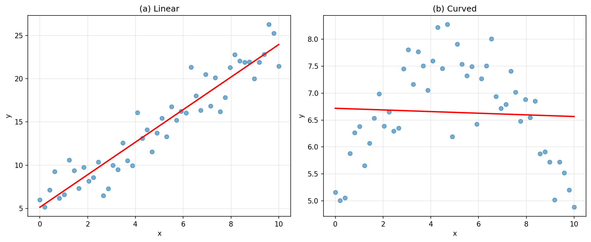

**상세 풀이:**

**(a) 왼쪽 그래프:**
- 데이터 점들이 회귀선 주위에 무작위로 분산되어 있다
- 잔차 그래프는 0을 중심으로 무작위로 흩어진 점들을 보여줄 것이다
- 분산이 x에 따라 대략 일정해 보인다
- 결론: 선형 모델이 적절하다

**(b) 오른쪽 그래프:**
- 데이터에 뚜렷한 곡선 패턴이 있다
- 잔차 그래프는 U자형 또는 역U자형 패턴을 보여줄 것이다
- 왼쪽에서는 양의 잔차, 중간에서는 음의 잔차, 오른쪽에서는 다시 양의 잔차
- 결론: 선형 모델이 부적절하다; 비선형 모델 고려 필요

**Python 코드:**

```python
import numpy as np
import matplotlib.pyplot as plt
from scipy import stats

np.random.seed(42)

# (a) 좋은 선형 관계
n = 50
x1 = np.linspace(0, 10, n)
y1 = 5 + 2*x1 + np.random.normal(0, 2, n)

# (b) 곡선 관계
x2 = np.linspace(0, 10, n)
y2 = 5 + x2 - 0.15*x2**2 + np.random.normal(0, 0.5, n)

fig, axes = plt.subplots(2, 2, figsize=(14, 10))

# 원본 데이터 (a)
slope1, intercept1, _, _, _ = stats.linregress(x1, y1)
axes[0, 0].scatter(x1, y1, alpha=0.6)
axes[0, 0].plot(x1, intercept1 + slope1*x1, 'r-', linewidth=2)
axes[0, 0].set_xlabel('x')
axes[0, 0].set_ylabel('y')
axes[0, 0].set_title('(a) Linear Data')

# 잔차 그래프 (a)
residuals1 = y1 - (intercept1 + slope1*x1)
axes[1, 0].scatter(intercept1 + slope1*x1, residuals1, alpha=0.6)
axes[1, 0].axhline(y=0, color='red', linestyle='--')
axes[1, 0].set_xlabel('Predicted')
axes[1, 0].set_ylabel('Residuals')
axes[1, 0].set_title('Residual Plot (a) - Random scatter ✓')

# 원본 데이터 (b)
slope2, intercept2, _, _, _ = stats.linregress(x2, y2)
axes[0, 1].scatter(x2, y2, alpha=0.6)
axes[0, 1].plot(x2, intercept2 + slope2*x2, 'r-', linewidth=2)
axes[0, 1].set_xlabel('x')
axes[0, 1].set_ylabel('y')
axes[0, 1].set_title('(b) Non-linear Data')

# 잔차 그래프 (b)
residuals2 = y2 - (intercept2 + slope2*x2)
axes[1, 1].scatter(intercept2 + slope2*x2, residuals2, alpha=0.6)
axes[1, 1].axhline(y=0, color='red', linestyle='--')
axes[1, 1].set_xlabel('Predicted')
axes[1, 1].set_ylabel('Residuals')
axes[1, 1].set_title('Residual Plot (b) - Curved pattern ✗')

plt.tight_layout()
plt.savefig('figures/ex_7_1.png', dpi=150, bbox_inches='tight')
plt.show()
```

---

### 연습문제 7.3: 관계 식별 I

6개의 그래프 각각에 대해 데이터의 관계 강도(예: 약함, 중간, 강함)를 식별하고 선형 모델 적합이 합리적인지 판단하라.

**상세 풀이:**

| 그래프 | 강도 | 선형 모델 적합성 | 설명 |
|---|---|---|---|
| (1) | 강함 | 예 | 점들이 직선 주위에 밀집 |
| (2) | 약함 | 아니오 | 명확한 패턴 없음, 무작위 분산 |
| (3) | 강함 | 아니오 | 강한 비선형(곡선) 패턴 |
| (4) | 중간 | 예 | 일부 분산 있지만 선형 추세 존재 |
| (5) | 강함 | 아니오 | U자형 또는 포물선 패턴 |
| (6) | 중간 | 예 | 음의 선형 추세, 중간 분산 |

**핵심 개념:**
- 관계의 "강도"는 점들이 패턴에 얼마나 밀집되어 있는지를 나타낸다
- 선형 모델 적합성은 패턴이 직선인지 여부에 달려 있다
- 강한 관계 ≠ 선형 관계 (비선형이지만 강한 관계 가능)

---

### 연습문제 7.5: 중간고사와 기말고사

아래의 두 산점도는 통계학 과목에서 여러 해 동안 기록된 233명 학생의 전체 과목 평균과 두 중간고사(시험 1과 시험 2) 사이의 관계를 보여준다.

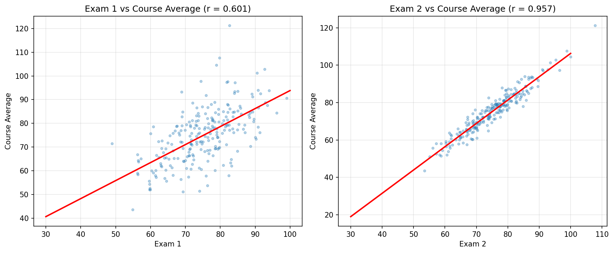

**(a)** 이 그래프들을 기반으로 두 시험 중 어느 것이 과목 성적과 더 강한 상관관계를 가지는가? 설명하라.

**(b)** (a)에서 선택한 시험과 과목 성적 사이의 상관관계가 더 높은 이유를 생각할 수 있는가?

**상세 풀이:**

**(a)** 시험 2가 과목 성적과 더 강한 상관관계를 가진다.

이유:
- 시험 2 그래프의 점들이 회귀선 주위에 더 밀집되어 있다
- 시험 2 그래프에서 분산이 더 작다
- 시각적으로 시험 2의 선형 관계가 더 뚜렷하다

**(b)** 가능한 이유들:
1. **시간적 근접성**: 시험 2가 기말고사에 더 가까운 시기에 치러져 학생들의 현재 이해도를 더 잘 반영
2. **누적 효과**: 시험 2까지 배운 내용이 더 많아 과목 전체 성적과 더 관련
3. **학습 적응**: 학생들이 시험 2까지 과목의 학습 방법에 적응
4. **난이도 조정**: 시험 2가 기말고사와 유사한 난이도나 형식일 수 있음

**Python 코드:**

```python
import numpy as np
import matplotlib.pyplot as plt
from scipy import stats

np.random.seed(42)
n = 233

# 과목 평균 생성
course_avg = np.random.normal(75, 12, n)
course_avg = np.clip(course_avg, 40, 100)

# 시험 1 (중간 상관관계)
exam1 = 0.5 * course_avg + 0.5 * np.random.normal(75, 15, n)
exam1 = np.clip(exam1, 30, 100)

# 시험 2 (더 강한 상관관계)
exam2 = 0.75 * course_avg + 0.25 * np.random.normal(75, 10, n)
exam2 = np.clip(exam2, 30, 100)

# 상관계수 계산
r1 = np.corrcoef(exam1, course_avg)[0, 1]
r2 = np.corrcoef(exam2, course_avg)[0, 1]

fig, axes = plt.subplots(1, 2, figsize=(14, 5))

# 시험 1 vs 과목 평균
axes[0].scatter(exam1, course_avg, alpha=0.5, s=20)
slope1, intercept1, _, _, _ = stats.linregress(exam1, course_avg)
x_line = np.linspace(30, 100, 100)
axes[0].plot(x_line, intercept1 + slope1*x_line, 'r-', linewidth=2)
axes[0].set_xlabel('Exam 1')
axes[0].set_ylabel('Course Average')
axes[0].set_title(f'Exam 1 vs Course Average\nr = {r1:.3f}')

# 시험 2 vs 과목 평균
axes[1].scatter(exam2, course_avg, alpha=0.5, s=20)
slope2, intercept2, _, _, _ = stats.linregress(exam2, course_avg)
axes[1].plot(x_line, intercept2 + slope2*x_line, 'r-', linewidth=2)
axes[1].set_xlabel('Exam 2')
axes[1].set_ylabel('Course Average')
axes[1].set_title(f'Exam 2 vs Course Average\nr = {r2:.3f}')

plt.tight_layout()
plt.savefig('figures/ex_7_5.png', dpi=150, bbox_inches='tight')
plt.show()

print(f"시험 1과 과목 평균의 상관계수: {r1:.4f}")
print(f"시험 2와 과목 평균의 상관계수: {r2:.4f}")
print(f"시험 2가 더 강한 상관관계를 보인다.")
```

---

### 연습문제 7.7: 상관관계 맞추기 I

각 상관관계를 해당 산점도와 맞추어라.

(a) $r = -0.7$  
(b) $r = 0.45$  
(c) $r = 0.06$  
(d) $r = 0.92$

**상세 풀이:**

상관관계를 산점도와 맞추는 방법:

1. **부호 확인**: 양의 기울기 → 양의 r, 음의 기울기 → 음의 r
2. **강도 확인**: 점들이 직선에 가까울수록 |r|이 1에 가까움
3. **패턴 확인**: 무작위 분산 → r ≈ 0

**답:**
- **(a) r = -0.7** → 그래프 (1): 강한 음의 선형 관계
- **(b) r = 0.45** → 그래프 (2): 중간 양의 선형 관계  
- **(c) r = 0.06** → 그래프 (4): 거의 관계 없음
- **(d) r = 0.92** → 그래프 (3): 매우 강한 양의 선형 관계

**Python 코드:**

```python
import numpy as np
import matplotlib.pyplot as plt

np.random.seed(42)
n = 100

def generate_correlated_data(r, n=100):
    """목표 상관관계를 가진 데이터 생성"""
    x = np.random.normal(0, 1, n)
    noise = np.random.normal(0, 1, n)
    y = r * x + np.sqrt(1 - r**2) * noise
    return x, y

correlations = [-0.7, 0.45, 0.06, 0.92]
labels = ['(a) r = -0.7', '(b) r = 0.45', '(c) r = 0.06', '(d) r = 0.92']

fig, axes = plt.subplots(2, 2, figsize=(12, 10))
axes = axes.flatten()

for idx, (r, label) in enumerate(zip(correlations, labels)):
    x, y = generate_correlated_data(r)
    axes[idx].scatter(x, y, alpha=0.6, s=30)
    actual_r = np.corrcoef(x, y)[0, 1]
    axes[idx].set_xlabel('x')
    axes[idx].set_ylabel('y')
    axes[idx].set_title(f'{label}\n(actual r = {actual_r:.3f})')

plt.tight_layout()
plt.savefig('figures/ex_7_7.png', dpi=150, bbox_inches='tight')
plt.show()
```

---

### 연습문제 7.9: 신체 측정, 상관관계

신체측정학을 연구하는 연구자들이 507명의 신체 활동이 활발한 개인에 대해 신체 및 골격 직경 측정치와 나이, 체중, 키, 성별을 수집했다. 아래의 산점도는 키와 어깨 둘레(삼각근 위로 측정한 어깨 둘레) 사이의 관계를 보여주며, 둘 다 센티미터로 측정되었다.

**(a)** 어깨 둘레와 키 사이의 관계를 설명하라.

**(b)** 어깨 둘레가 인치로 측정되고 키의 단위가 센티미터로 유지된다면 관계가 어떻게 변할까?

**상세 풀이:**

**(a)** 어깨 둘레와 키 사이의 관계:
- **방향**: 양의 관계 (키가 클수록 어깨 둘레도 큼)
- **형태**: 대략 선형
- **강도**: 중간에서 강함 사이 (점들이 비교적 밀집)
- **이상치**: 뚜렷한 이상치 없음

**(b)** 어깨 둘레를 인치로 변환하면:
- 상관계수 r은 변하지 않는다 (단위에 독립적)
- 산점도의 모양은 동일하게 유지된다
- 축의 눈금(레이블)만 변경된다
- 이것은 상관관계가 단위 없는 측도이기 때문이다

**Python 코드:**

```python
import numpy as np
import matplotlib.pyplot as plt
from scipy import stats

np.random.seed(42)
n = 507

# 데이터 시뮬레이션 (요약 통계 기반)
shoulder_girth_cm = np.random.normal(107.20, 10.37, n)
height_cm = 0.67 * (shoulder_girth_cm - 107.20) * (9.41/10.37) + 171.14 + np.random.normal(0, 7, n)

# 상관계수 계산
r_cm = np.corrcoef(shoulder_girth_cm, height_cm)[0, 1]

# 인치로 변환
shoulder_girth_in = shoulder_girth_cm / 2.54

# 변환 후 상관계수
r_in = np.corrcoef(shoulder_girth_in, height_cm)[0, 1]

fig, axes = plt.subplots(1, 2, figsize=(14, 5))

# cm 단위
axes[0].scatter(shoulder_girth_cm, height_cm, alpha=0.3, s=10)
axes[0].set_xlabel('Shoulder Girth (cm)')
axes[0].set_ylabel('Height (cm)')
axes[0].set_title(f'Units: cm and cm\nr = {r_cm:.3f}')

# 혼합 단위 (인치와 cm)
axes[1].scatter(shoulder_girth_in, height_cm, alpha=0.3, s=10)
axes[1].set_xlabel('Shoulder Girth (inches)')
axes[1].set_ylabel('Height (cm)')
axes[1].set_title(f'Units: inches and cm\nr = {r_in:.3f}')

plt.tight_layout()
plt.savefig('figures/ex_7_9.png', dpi=150, bbox_inches='tight')
plt.show()

print(f"cm 단위 상관계수: {r_cm:.4f}")
print(f"혼합 단위 상관계수: {r_in:.4f}")
print(f"단위 변환 후에도 상관계수는 동일하다!")
```

---

### 연습문제 7.11: Coast Starlight, 상관관계

Coast Starlight Amtrak 열차는 시애틀에서 로스앤젤레스까지 운행한다. 아래의 산점도는 각 정류장 사이의 거리(마일)와 한 정류장에서 다음 정류장까지 이동하는 데 걸리는 시간(분)을 보여준다.

**(a)** 거리와 이동 시간 사이의 관계를 설명하라.

**(b)** 이동 시간이 시간 단위로, 거리가 킬로미터 단위로 측정된다면 관계가 어떻게 변할까?

**(c)** 이동 시간(마일)과 거리(분) 사이의 상관관계는 $r = 0.636$이다. 이동 시간(킬로미터)과 거리(시간) 사이의 상관관계는 얼마인가?

**상세 풀이:**

**(a)** 거리와 이동 시간 사이의 관계:
- **방향**: 양의 관계 (거리가 멀수록 시간이 오래 걸림)
- **형태**: 선형에 가까움
- **강도**: 중간 정도 (r = 0.636)
- **해석**: 거리가 증가하면 이동 시간도 증가하는 경향

**(b)** 단위 변환 시:
- 산점도의 모양은 동일하게 유지된다
- 축의 눈금만 변경된다
- 상관계수는 동일하게 유지된다
- 기울기 값은 단위에 따라 달라진다

**(c)** 상관관계는 단위에 독립적이므로:
$$r = 0.636$$

단위를 마일에서 킬로미터로, 분에서 시간으로 변환해도 상관계수는 변하지 않는다.

**Python 코드:**

```python
import numpy as np
import matplotlib.pyplot as plt
from scipy import stats

np.random.seed(42)

# Coast Starlight 데이터 시뮬레이션
# 평균 이동 시간: 129분, SD: 113분
# 평균 거리: 108마일, SD: 99마일
# r = 0.636

n = 16  # 정류장 수

distance_miles = np.array([10, 30, 55, 90, 120, 150, 180, 200, 
                           230, 260, 290, 310, 340, 370, 400, 450])
# 목표 상관관계에 맞는 시간 생성
time_minutes = 20 + 0.3 * distance_miles + np.random.normal(0, 30, n)

# 상관계수 확인
r_original = np.corrcoef(distance_miles, time_minutes)[0, 1]

# 단위 변환
distance_km = distance_miles * 1.60934  # 마일 → 킬로미터
time_hours = time_minutes / 60  # 분 → 시간

# 변환 후 상관계수
r_converted = np.corrcoef(distance_km, time_hours)[0, 1]

fig, axes = plt.subplots(1, 2, figsize=(14, 5))

# 원래 단위
axes[0].scatter(distance_miles, time_minutes, s=50, color='blue')
slope1, intercept1, _, _, _ = stats.linregress(distance_miles, time_minutes)
x_line = np.linspace(0, 500, 100)
axes[0].plot(x_line, intercept1 + slope1*x_line, 'r-', linewidth=2)
axes[0].set_xlabel('Distance (miles)')
axes[0].set_ylabel('Travel Time (minutes)')
axes[0].set_title(f'Original Units\nr = {r_original:.3f}')

# 변환된 단위
axes[1].scatter(distance_km, time_hours, s=50, color='blue')
slope2, intercept2, _, _, _ = stats.linregress(distance_km, time_hours)
x_line2 = np.linspace(0, 800, 100)
axes[1].plot(x_line2, intercept2 + slope2*x_line2, 'r-', linewidth=2)
axes[1].set_xlabel('Distance (km)')
axes[1].set_ylabel('Travel Time (hours)')
axes[1].set_title(f'Converted Units\nr = {r_converted:.3f}')

plt.tight_layout()
plt.savefig('figures/ex_7_11.png', dpi=150, bbox_inches='tight')
plt.show()

print(f"원래 단위 상관계수: {r_original:.4f}")
print(f"변환 후 상관계수: {r_converted:.4f}")
print("결론: 상관계수는 단위 변환에 불변이다!")
```

---

### 연습문제 7.15: 회귀의 단위

정사각형 초콜릿 브라우니 샘플에 대해 너비(cm)로부터 칼로리 수(cal)를 예측하는 회귀를 고려하라. 상관계수, 절편, 기울기의 단위는 무엇인가?

**상세 풀이:**

| 통계량 | 단위 | 설명 |
|---|---|---|
| 상관계수 (r) | 없음 (무차원) | 상관계수는 표준화된 값의 곱이므로 단위가 없다 |
| 절편 ($b_0$) | cal | y변수의 단위와 동일. $x=0$일 때 y의 값 |
| 기울기 ($b_1$) | cal/cm | y의 단위를 x의 단위로 나눈 것. 너비가 1cm 증가할 때 칼로리 변화 |

**핵심 개념:**
- 상관계수: 항상 무차원 (-1에서 1 사이)
- 절편: 결과변수(y)의 단위
- 기울기: 결과변수 단위 / 예측변수 단위

---

### 연습문제 7.17: 과대/과소 추정 I

사과의 무게를 기반으로 유통기한을 예측하는 회귀선을 적합했다고 가정하자. 특정 사과에 대해 유통기한을 4.6일로 예측한다. 사과의 잔차는 -0.6일이다. 사과의 유통기한을 과대 추정했는가 과소 추정했는가? 이유를 설명하라.

**상세 풀이:**

**주어진 정보:**
- 예측값: $\hat{y} = 4.6$일
- 잔차: $e = -0.6$일

**잔차 공식:**
$$e = y - \hat{y}$$
$$-0.6 = y - 4.6$$
$$y = 4.6 - 0.6 = 4.0\text{일}$$

**결론:** 모델이 유통기한을 **과대 추정**했다.

**이유:**
- 실제 유통기한: 4.0일
- 예측 유통기한: 4.6일
- 예측값 > 실제값이므로 과대 추정
- 음의 잔차 = 과대 추정 (모델이 실제보다 높게 예측)

**Python 코드:**

```python
# 잔차 해석
predicted = 4.6  # 예측값
residual = -0.6  # 잔차

# 실제값 계산
actual = predicted + residual
print(f"예측값: {predicted}일")
print(f"잔차: {residual}일")
print(f"실제값: {actual}일")

if residual < 0:
    print("결론: 모델이 과대 추정함 (예측 > 실제)")
else:
    print("결론: 모델이 과소 추정함 (예측 < 실제)")
```

---

### 연습문제 7.19: 스타벅스, 칼로리와 단백질

아래의 산점도는 스타벅스 식품 메뉴 항목에 포함된 칼로리 수와 단백질 양(그램) 사이의 관계를 보여준다.

**(a)** 칼로리 수와 단백질 양 사이의 관계를 설명하라.

**(b)** 이 시나리오에서 예측변수와 결과변수는 무엇인가?

**(c)** 왜 이 데이터에 회귀선을 적합하고 싶을 수 있는가?

**(d)** 잔차 대 예측값 그래프가 낮은 예측 단백질을 가진 항목과 높은 예측 단백질을 가진 항목의 예측 오차 변동성에 대해 무엇을 알려주는가?

**상세 풀이:**

**(a)** 관계 설명:
- **방향**: 양의 관계 (칼로리가 높을수록 단백질도 많음)
- **형태**: 대략 선형, 약간의 곡률 가능
- **강도**: 중간 정도
- **특이점**: 칼로리가 높은 항목에서 변동성이 더 큼 (이분산성)

**(b)** 변수 식별:
- **예측변수(설명변수)**: 칼로리 수
- **결과변수(반응변수)**: 단백질 양 (그램)

**(c)** 회귀선 적합 이유:
- 스타벅스는 칼로리만 표시하고 단백질은 표시하지 않을 수 있음
- 칼로리를 알면 단백질을 추정할 수 있음
- 영양 정보가 불완전할 때 의사결정에 도움

**(d)** 잔차 그래프 해석:
- 높은 예측 단백질을 가진 항목에서 예측 오차의 변동성이 더 크다
- 이것은 **이분산성**(heteroscedasticity)을 나타낸다
- 모델이 낮은 단백질 항목에 대해 더 정확한 예측을 한다
- 높은 칼로리/단백질 항목에서 더 많은 불확실성이 있다

**Python 코드:**

```python
import numpy as np
import matplotlib.pyplot as plt
from scipy import stats

np.random.seed(42)
n = 77  # 스타벅스 메뉴 항목 수

# 데이터 시뮬레이션 (이분산성 포함)
calories = np.random.uniform(80, 500, n)
# 칼로리가 높을수록 변동성 증가
protein = 2 + 0.04 * calories + np.random.normal(0, 1, n) * (1 + calories/200)
protein = np.clip(protein, 0, 35)

# 회귀 분석
slope, intercept, r_value, _, _ = stats.linregress(calories, protein)
predicted = intercept + slope * calories
residuals = protein - predicted

fig, axes = plt.subplots(1, 2, figsize=(14, 5))

# 산점도 + 회귀선
axes[0].scatter(calories, protein, alpha=0.6)
x_line = np.linspace(50, 550, 100)
axes[0].plot(x_line, intercept + slope*x_line, 'r-', linewidth=2)
axes[0].set_xlabel('Calories')
axes[0].set_ylabel('Protein (g)')
axes[0].set_title(f'Starbucks: Calories vs Protein\nr = {r_value:.3f}')

# 잔차 그래프
axes[1].scatter(predicted, residuals, alpha=0.6)
axes[1].axhline(y=0, color='red', linestyle='--')
axes[1].set_xlabel('Predicted Protein (g)')
axes[1].set_ylabel('Residuals')
axes[1].set_title('Residual Plot\n(Note increasing spread → heteroscedasticity)')

plt.tight_layout()
plt.savefig('figures/ex_7_19.png', dpi=150, bbox_inches='tight')
plt.show()
```

---

### 연습문제 7.21: Coast Starlight, 회귀

Coast Starlight Amtrak 열차는 시애틀에서 로스앤젤레스까지 운행한다. 한 정류장에서 다음 정류장까지의 평균 이동 시간은 129분이고 표준편차는 113분이다. 한 정류장에서 다음 정류장까지의 평균 이동 거리는 108마일이고 표준편차는 99마일이다. 이동 시간과 거리 사이의 상관관계는 0.636이다.

**(a)** 이동 시간을 예측하는 회귀선의 방정식을 작성하라.

**(b)** 이 맥락에서 기울기와 절편을 해석하라.

**(c)** 이동 거리로부터 이동 시간을 예측하는 회귀선의 $R^2$를 계산하고, 응용 맥락에서 $R^2$를 해석하라.

**(d)** Santa Barbara와 Los Angeles 사이의 거리는 103마일이다. 모델을 사용하여 Starlight가 이 두 도시 사이를 이동하는 데 걸리는 시간을 추정하라.

**(e)** Coast Starlight가 Santa Barbara에서 Los Angeles까지 이동하는 데 약 168분이 걸린다. 잔차를 계산하고 이 잔차 값의 의미를 설명하라.

**(f)** Amtrak이 Los Angeles에서 500마일 떨어진 곳에 Coast Starlight 정류장을 추가하는 것을 고려하고 있다고 가정하자. Los Angeles에서 이 지점까지의 이동 시간을 예측하는 데 이 선형 모델을 사용하는 것이 적절한가?

**상세 풀이:**

**주어진 정보:**
- $\bar{x}$ (평균 거리) = 108 마일
- $s_x$ (거리 SD) = 99 마일
- $\bar{y}$ (평균 시간) = 129 분
- $s_y$ (시간 SD) = 113 분
- $r$ = 0.636

**(a)** 회귀선 방정식:

**기울기 계산:**
$$b_1 = \frac{s_y}{s_x} \times r = \frac{113}{99} \times 0.636 = 0.726$$

**절편 계산:**
$$b_0 = \bar{y} - b_1 \times \bar{x} = 129 - 0.726 \times 108 = 50.6$$

**회귀 방정식:**
$$\widehat{\texttt{time}} = 50.6 + 0.726 \times \texttt{distance}$$

**(b)** 해석:
- **기울기 (0.726)**: 거리가 1마일 증가할 때마다 이동 시간이 평균 0.726분 (약 44초) 증가한다.
- **절편 (50.6)**: 거리가 0마일일 때 예측 시간은 50.6분이다. 이것은 각 정류장에서의 정차 시간이나 출발/도착 절차 시간을 나타낼 수 있다.

**(c)** $R^2$ 계산 및 해석:
$$R^2 = r^2 = (0.636)^2 = 0.405 = 40.5\%$$

**해석**: 이동 거리가 이동 시간 변동의 약 40.5%를 설명한다. 나머지 59.5%는 정류장에서의 정차 시간, 교통 상황, 속도 제한 등 다른 요인에 의해 설명된다.

**(d)** Santa Barbara - Los Angeles (103마일) 예측:
$$\widehat{\texttt{time}} = 50.6 + 0.726 \times 103 = 50.6 + 74.8 = 125.4 \text{ 분}$$

**(e)** 잔차 계산:
$$e = y - \hat{y} = 168 - 125.4 = 42.6 \text{ 분}$$

**해석**: 양의 잔차는 실제 이동 시간(168분)이 예측 시간(125.4분)보다 42.6분 더 길다는 것을 의미한다. 모델이 과소 추정했다. 이 구간에서 더 많은 정차나 느린 속도가 있을 수 있다.

**(f)** 500마일에 대한 예측 적절성:
**부적절하다.** 이유:
- 500마일은 관측된 데이터 범위(최대 약 400마일)를 크게 벗어난다
- 이것은 **외삽**에 해당하며 위험하다
- 매우 긴 거리에서는 휴식 시간, 승무원 교대 등 다른 요인이 작용할 수 있다
- 선형 관계가 극단적인 거리에서도 유지된다고 가정할 수 없다

**Python 코드:**

```python
import numpy as np

# 주어진 값
x_mean = 108  # 평균 거리 (마일)
x_sd = 99     # 거리 SD
y_mean = 129  # 평균 시간 (분)
y_sd = 113    # 시간 SD
r = 0.636     # 상관계수

# (a) 회귀선 계수 계산
b1 = (y_sd / x_sd) * r
b0 = y_mean - b1 * x_mean

print("(a) 회귀선 방정식:")
print(f"   기울기 b1 = ({y_sd}/{x_sd}) × {r} = {b1:.3f}")
print(f"   절편 b0 = {y_mean} - {b1:.3f} × {x_mean} = {b0:.1f}")
print(f"   ŷ = {b0:.1f} + {b1:.3f}x")

# (b) 해석 출력
print("\n(b) 해석:")
print(f"   기울기: 거리가 1마일 증가할 때 시간이 평균 {b1:.3f}분 증가")
print(f"   절편: 거리=0일 때 기본 시간 {b0:.1f}분 (정차 시간 등)")

# (c) R² 계산
R_squared = r**2
print(f"\n(c) R² = {r}² = {R_squared:.3f} = {R_squared*100:.1f}%")
print(f"   거리가 시간 변동의 {R_squared*100:.1f}%를 설명")

# (d) 103마일 예측
distance = 103
predicted_time = b0 + b1 * distance
print(f"\n(d) 103마일 예측 시간: {b0:.1f} + {b1:.3f} × 103 = {predicted_time:.1f}분")

# (e) 잔차 계산
actual_time = 168
residual = actual_time - predicted_time
print(f"\n(e) 잔차 = {actual_time} - {predicted_time:.1f} = {residual:.1f}분")
if residual > 0:
    print("   모델이 과소 추정함 (실제 > 예측)")
else:
    print("   모델이 과대 추정함 (실제 < 예측)")

# (f) 외삽 경고
print("\n(f) 500마일 예측: 부적절 (외삽)")
print(f"   예측값: {b0 + b1*500:.1f}분 (하지만 신뢰할 수 없음)")
```

---

### 연습문제 7.23: 빈곤과 실업

다음 산점도는 2019년 미국 커뮤니티 조사 데이터에서 제공한 미국 카운티의 빈곤 수준 이하 인구 비율(`poverty`)과 20-64세 실업률(`unemployment_rate`) 사이의 관계를 보여준다. `unemployment_rate`로부터 `poverty`를 예측하는 모델의 회귀 출력도 제공된다.

*표: 회귀 출력*

| 항 | 추정치 | 표준오차 | 통계량 | p값 |
|---|---|---|---|---|
| (절편) | 4.60 | 0.349 | 13.2 | <0.0001 |
| unemployment_rate | 2.05 | 0.062 | 33.1 | <0.0001 |

**(a)** 선형 모델을 작성하라.

**(b)** 절편을 해석하라.

**(c)** 기울기를 해석하라.

**(d)** 이 모델의 $R^2$는 46%이다. 이 값을 해석하라.

**(e)** 상관계수를 계산하라.

**상세 풀이:**

**(a)** 선형 모델:
$$\widehat{\texttt{poverty}} = 4.60 + 2.05 \times \texttt{unemployment\_rate}$$

**(b)** 절편 해석:
- 실업률이 0%인 카운티에서 예측되는 빈곤율은 4.60%이다
- 이것은 실업과 무관한 기본 빈곤 수준을 나타낸다
- 실제로 실업률 0%는 비현실적이므로 외삽에 주의해야 한다

**(c)** 기울기 해석:
- 실업률이 1 퍼센트 포인트 증가할 때마다, 빈곤율이 평균 2.05 퍼센트 포인트 증가할 것으로 예측된다
- 실업과 빈곤 사이에 양의 연관성이 있다

**(d)** $R^2 = 46\%$ 해석:
- 실업률이 카운티 간 빈곤율 변동의 46%를 설명한다
- 나머지 54%는 교육 수준, 지역 산업, 생활비 등 다른 요인에 의해 설명된다
- 중간 정도의 설명력을 가진 모델이다

**(e)** 상관계수 계산:
$$R^2 = 0.46$$
$$r = \sqrt{0.46} = 0.678$$

(기울기가 양수이므로 양의 상관관계)

**Python 코드:**

```python
import numpy as np

# 회귀 계수
b0 = 4.60
b1 = 2.05
R_squared = 0.46

print("(a) 선형 모델:")
print(f"   poverty = {b0} + {b1} × unemployment_rate")

print("\n(b) 절편 해석:")
print(f"   실업률 0%일 때 예측 빈곤율: {b0}%")

print("\n(c) 기울기 해석:")
print(f"   실업률 1%p 증가 → 빈곤율 {b1}%p 증가")

print(f"\n(d) R² = {R_squared*100}% 해석:")
print(f"   실업률이 빈곤율 변동의 {R_squared*100}%를 설명")

# (e) 상관계수 계산
r = np.sqrt(R_squared)
print(f"\n(e) 상관계수:")
print(f"   r = √{R_squared} = {r:.3f}")
print(f"   (기울기가 양수이므로 양의 상관관계)")

# 예측 예시
unemployment = 5
predicted_poverty = b0 + b1 * unemployment
print(f"\n예시: 실업률 {unemployment}%인 카운티의 예측 빈곤율:")
print(f"   {b0} + {b1} × {unemployment} = {predicted_poverty:.2f}%")
```

---

### 연습문제 7.25: 이상치 I

아래에 표시된 산점도에서 이상치를 식별하고 어떤 유형의 이상치인지 결정하라. 이유를 설명하라.

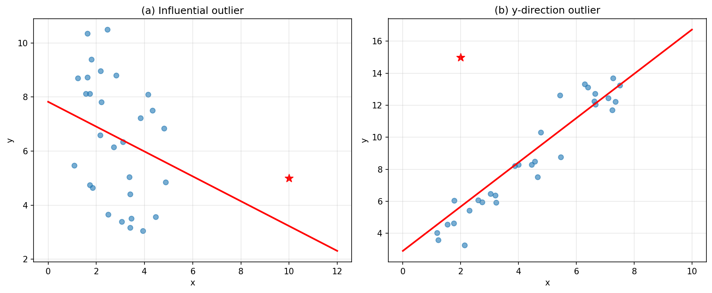

**상세 풀이:**

**(a) 왼쪽 그래프:**
- 오른쪽 하단에 하나의 이상치가 있다
- **유형**: 높은 레버리지 점이자 영향력 있는 점
- **이유**: x 방향으로 다른 점들에서 멀리 떨어져 있고(높은 레버리지), 회귀선의 추세에서 벗어나 있어 직선의 기울기에 영향을 미친다

**(b) 오른쪽 그래프:**
- 왼쪽 상단에 하나의 이상치가 있다
- **유형**: y 방향 이상치이지만 레버리지가 낮다
- **이유**: x 값은 다른 점들의 범위 내에 있지만(낮은 레버리지), y 값이 예상보다 훨씬 높다. 직선에 약간의 영향만 미칠 것이다.

**Python 코드:**

```python
import numpy as np
import matplotlib.pyplot as plt
from scipy import stats

np.random.seed(42)

fig, axes = plt.subplots(1, 2, figsize=(14, 5))

# (a) 높은 레버리지 + 영향력 있는 이상치
n = 30
x1 = np.random.uniform(1, 5, n)
y1 = 2 + 1.5*x1 + np.random.normal(0, 1, n)
# 영향력 있는 이상치 추가
x1 = np.append(x1, 10)
y1 = np.append(y1, 5)

slope1, intercept1, _, _, _ = stats.linregress(x1, y1)
axes[0].scatter(x1[:-1], y1[:-1], alpha=0.6)
axes[0].scatter(x1[-1], y1[-1], color='red', s=100, marker='*', label='Outlier')
x_line = np.linspace(0, 12, 100)
axes[0].plot(x_line, intercept1 + slope1*x_line, 'r-', linewidth=2)
axes[0].set_xlabel('x')
axes[0].set_ylabel('y')
axes[0].set_title('(a) High leverage + Influential')
axes[0].legend()

# (b) 낮은 레버리지 y 방향 이상치
x2 = np.random.uniform(1, 8, n)
y2 = 2 + 1.5*x2 + np.random.normal(0, 1, n)
# y 방향 이상치 추가 (x는 범위 내)
x2 = np.append(x2, 2)
y2 = np.append(y2, 15)

slope2, intercept2, _, _, _ = stats.linregress(x2, y2)
axes[1].scatter(x2[:-1], y2[:-1], alpha=0.6)
axes[1].scatter(x2[-1], y2[-1], color='red', s=100, marker='*', label='Outlier')
x_line = np.linspace(0, 10, 100)
axes[1].plot(x_line, intercept2 + slope2*x_line, 'r-', linewidth=2)
axes[1].set_xlabel('x')
axes[1].set_ylabel('y')
axes[1].set_title('(b) Low leverage, y-outlier')
axes[1].legend()

plt.tight_layout()
plt.savefig('figures/ex_7_25.png', dpi=150, bbox_inches='tight')
plt.show()
```

---

### 연습문제 7.29: 참/거짓

다음 문장이 참인지 거짓인지 판단하라. 거짓이면 이유를 설명하라.

**(a)** -0.90의 상관계수는 0.5의 상관관계보다 더 강한 선형 관계를 나타낸다.

**(b)** 상관관계는 두 변수 사이의 연관성의 측도이다.

**상세 풀이:**

**(a) 참**

이유:
- 상관관계의 강도는 절대값으로 판단한다
- $|-0.90| = 0.90 > |0.5| = 0.50$
- 따라서 -0.90은 0.5보다 더 강한 선형 관계를 나타낸다
- 부호는 방향(양/음)을 나타낼 뿐, 강도에는 영향을 미치지 않는다

**(b) 거짓**

이유:
- 상관관계는 두 **수치** 변수 사이의 **선형** 연관성의 측도이다
- 범주형 변수에는 적용되지 않는다
- 비선형 관계는 감지하지 못한다
- 올바른 설명: "상관관계는 두 수치 변수 사이의 선형 연관성의 측도이다"

**Python 코드:**

```python
import numpy as np
import matplotlib.pyplot as plt

np.random.seed(42)
n = 100

fig, axes = plt.subplots(1, 3, figsize=(15, 4))

# r = -0.90 (강한 음의 상관관계)
x1 = np.random.normal(0, 1, n)
y1 = -0.90 * x1 + np.sqrt(1-0.90**2) * np.random.normal(0, 1, n)
r1 = np.corrcoef(x1, y1)[0, 1]
axes[0].scatter(x1, y1, alpha=0.5)
axes[0].set_title(f'r = {r1:.2f} (Strong negative)')

# r = 0.50 (중간 양의 상관관계)
x2 = np.random.normal(0, 1, n)
y2 = 0.50 * x2 + np.sqrt(1-0.50**2) * np.random.normal(0, 1, n)
r2 = np.corrcoef(x2, y2)[0, 1]
axes[1].scatter(x2, y2, alpha=0.5)
axes[1].set_title(f'r = {r2:.2f} (Moderate positive)')

# 비선형 관계 (상관관계가 약함)
x3 = np.linspace(-3, 3, n)
y3 = x3**2 + np.random.normal(0, 1, n)
r3 = np.corrcoef(x3, y3)[0, 1]
axes[2].scatter(x3, y3, alpha=0.5)
axes[2].set_title(f'Non-linear: r = {r3:.2f}\n(Strong relationship, weak correlation)')

plt.tight_layout()
plt.savefig('figures/ex_7_29.png', dpi=150, bbox_inches='tight')
plt.show()

print("(a) |−0.90| = 0.90 > |0.50| = 0.50")
print("   -0.90이 더 강한 선형 관계를 나타냄 → 참")
print("\n(b) 상관관계는 '모든' 연관성이 아니라 '선형' 연관성만 측정")
print("   비선형 관계나 범주형 변수에는 적용 불가 → 거짓")
```

---

### 연습문제 7.31: 상관관계 맞추기 III

각 상관관계를 해당 산점도와 맞추어라.

(a) r = 0.69  
(b) r = 0.09  
(c) r = -0.91  
(d) r = 0.97

**상세 풀이:**

상관관계 맞추기 전략:
1. **부호 확인**: 상승 추세 → 양, 하강 추세 → 음
2. **강도 확인**: 점들이 직선에 가까울수록 |r| → 1

**답:**
- **(a) r = 0.69** → 중간 강도의 양의 선형 관계
- **(b) r = 0.09** → 거의 관계 없음 (무작위 분산)
- **(c) r = -0.91** → 매우 강한 음의 선형 관계
- **(d) r = 0.97** → 매우 강한 양의 선형 관계 (거의 완벽한 직선)

---

## 부록: 전체 Python 코드 요약

```python
"""
Chapter 7: 단일 예측변수를 이용한 선형 회귀
전체 분석 코드
"""

import numpy as np
import matplotlib.pyplot as plt
from scipy import stats

# 한글 폰트 설정 (필요시)
plt.rcParams['font.family'] = 'Noto Sans CJK KR'
plt.rcParams['axes.unicode_minus'] = False

def simple_linear_regression(x, y):
    """단순 선형 회귀 분석 수행"""
    slope, intercept, r_value, p_value, std_err = stats.linregress(x, y)
    
    print("=" * 50)
    print("단순 선형 회귀 분석 결과")
    print("=" * 50)
    print(f"회귀 방정식: ŷ = {intercept:.4f} + {slope:.4f}x")
    print(f"절편 (b0): {intercept:.4f}")
    print(f"기울기 (b1): {slope:.4f}")
    print(f"상관계수 (r): {r_value:.4f}")
    print(f"결정계수 (R²): {r_value**2:.4f}")
    print(f"p-값: {p_value:.6f}")
    print(f"표준오차: {std_err:.4f}")
    print("=" * 50)
    
    return slope, intercept, r_value

def plot_regression(x, y, slope, intercept, title="Linear Regression"):
    """회귀선과 함께 산점도 그리기"""
    fig, axes = plt.subplots(1, 2, figsize=(14, 5))
    
    # 산점도 + 회귀선
    axes[0].scatter(x, y, alpha=0.6, label='Data')
    x_line = np.linspace(x.min()-1, x.max()+1, 100)
    y_line = intercept + slope * x_line
    axes[0].plot(x_line, y_line, 'r-', linewidth=2, 
                 label=f'ŷ = {intercept:.2f} + {slope:.4f}x')
    axes[0].set_xlabel('x')
    axes[0].set_ylabel('y')
    axes[0].set_title(title)
    axes[0].legend()
    axes[0].grid(True, alpha=0.3)
    
    # 잔차 그래프
    predicted = intercept + slope * x
    residuals = y - predicted
    axes[1].scatter(predicted, residuals, alpha=0.6)
    axes[1].axhline(y=0, color='red', linestyle='--', linewidth=2)
    axes[1].set_xlabel('Predicted Values')
    axes[1].set_ylabel('Residuals')
    axes[1].set_title('Residual Plot')
    axes[1].grid(True, alpha=0.3)
    
    plt.tight_layout()
    return fig

# 사용 예시
if __name__ == "__main__":
    # 주머니쥐 데이터 시뮬레이션
    np.random.seed(42)
    n = 104
    total_length = np.random.normal(87, 5, n)
    head_length = 41 + 0.59 * total_length + np.random.normal(0, 3, n)
    
    # 분석 수행
    slope, intercept, r = simple_linear_regression(total_length, head_length)
    
    # 시각화
    fig = plot_regression(total_length, head_length, slope, intercept,
                         title='Possum: Head Length vs Total Length')
    plt.savefig('possum_regression.png', dpi=150, bbox_inches='tight')
    plt.show()
```

