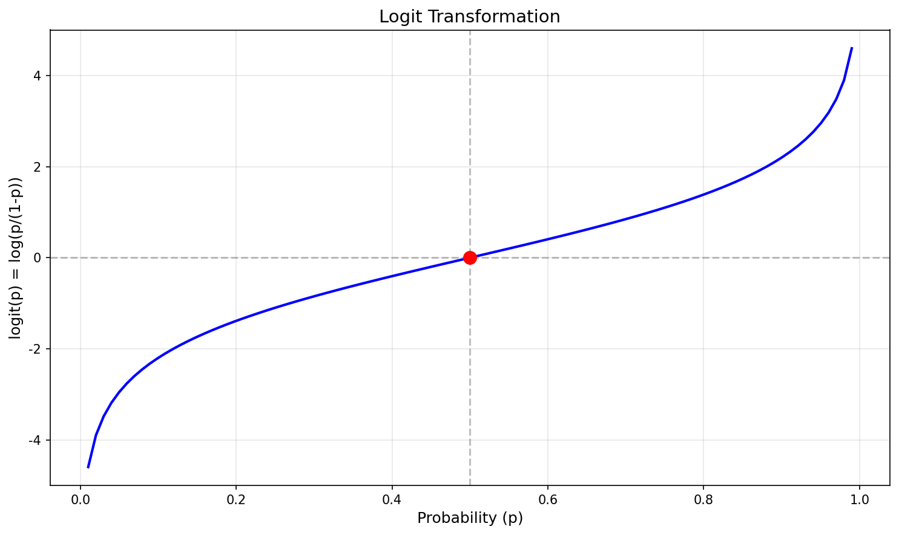

# Chapter 9: 로지스틱 회귀

## 학습 목표

이 장에서는 예/아니오와 같이 두 개의 수준을 가진 범주형 반응변수가 있을 때 모델을 구축하는 도구로서 **로지스틱 회귀**(logistic regression)를 소개한다. 로지스틱 회귀는 일반 다중 회귀가 잘 작동하지 않는 반응변수에 대한 **일반화 선형 모델**(generalized linear model, GLM)의 한 유형이다.

---

## 9.1 채용에서의 차별

인종과 성별이 입사 지원 콜백률에 미치는 영향을 이해하고자 한 연구의 실험 데이터를 고려한다(Bertrand and Mullainathan 2003). 연구자들은 보스턴과 시카고에서 구인 공고를 확인하고, 가짜 이력서를 만들어 어떤 것이 콜백을 유도하는지 조사했다. 각 이력서에 이름을 무작위로 할당하여 지원자의 성별과 인종을 암시하도록 했다.

**표 9.2: resume 데이터셋의 변수 설명**

| 변수 | 설명 |
|------|------|
| received_callback | 고용주가 지원서 제출 후 지원자에게 전화했는지 여부 |
| job_city | 일자리가 위치한 도시: Boston 또는 Chicago |
| college_degree | 이력서에 대학 학위가 기재되었는지 여부 |
| years_experience | 이력서에 기재된 경력 연수 |
| honors | 이력서에 수상 경력이 기재되었는지 여부 |
| military | 이력서에 군 경력이 기재되었는지 여부 |
| has_email_address | 이력서에 이메일 주소가 기재되었는지 여부 |
| race | 이력서에 기재된 이름으로 암시되는 지원자의 인종 |
| sex | 이력서에 기재된 이름으로 암시되는 지원자의 성별 |

### 새로운 시각: 실험 설계와 인과 추론

이 연구의 핵심 강점은 **무작위 할당**(random assignment)에 있다. 이력서의 모든 특성이 무작위로 할당되었기 때문에, 관찰된 콜백률의 차이는 이러한 특성의 인과적 효과로 해석할 수 있다.

---

## 9.2 사건의 확률 모델링

로지스틱 회귀는 결과가 두 수준을 가진 범주형 변수인 일반화 선형 모델이다.

### 로짓 변환

로짓 변환(logit transformation)은 확률 (0, 1)을 음의 무한대에서 양의 무한대로 매핑한다:

logit(p) = log(p/(1-p))



### 역변환

확률로 변환: p = exp(로그오즈) / (1 + exp(로그오즈))

### 새로운 시각: 오즈의 이해

로짓 함수에서 p/(1-p)는 **오즈**(odds)라고 불린다:
- 확률 p = 0.5이면, 오즈 = 1
- 확률 p = 0.75이면, 오즈 = 3
- 확률 p = 0.2이면, 오즈 = 0.25

---

### 예제 9.1: 단일 예측변수 로지스틱 회귀

단일 예측변수 honors로 모델을 적합:

log(p/(1-p)) = -2.4998 + 0.8668 × honors

**수상 경력 없음:** log-odds = -2.4998, 확률 = 7.6%

**수상 경력 있음:** log-odds = -1.6330, 확률 = 16.3%

```python
import numpy as np

def logistic(x):
    return np.exp(x) / (1 + np.exp(x))

prob_no = logistic(-2.4998)
prob_yes = logistic(-2.4998 + 0.8668)
print(f"수상 경력 없음: {prob_no:.1%}")
print(f"수상 경력 있음: {prob_yes:.1%}")
```

---

## 9.3 많은 변수를 가진 로지스틱 모델

**표 9.3: 전체 로지스틱 회귀 모델 요약**

| term | estimate | std.error | statistic | p.value |
|------|----------|-----------|-----------|---------|
| (Intercept) | -2.66 | 0.18 | -14.64 | <0.0001 |
| job_city(Chicago) | -0.44 | 0.11 | -3.85 | 0.0001 |
| college_degree1 | -0.07 | 0.12 | -0.55 | 0.5821 |
| years_experience | 0.02 | 0.01 | 1.96 | 0.0503 |
| honors1 | 0.77 | 0.19 | 4.14 | <0.0001 |
| military1 | -0.34 | 0.22 | -1.59 | 0.1127 |
| has_email_address1 | 0.22 | 0.11 | 1.93 | 0.0541 |
| race(White) | 0.44 | 0.11 | 4.10 | <0.0001 |
| sex(man) | -0.18 | 0.14 | -1.32 | 0.1863 |

### 새로운 시각: AIC의 이해

**AIC**(Akaike Information Criterion) = -2 ln(L) + 2k

- L: 최대우도
- k: 모수 수

AIC가 낮을수록 더 좋은 모델이다.

**표 9.6: AIC로 변수 선택 후 축소 모델**

| term | estimate | std.error | statistic | p.value |
|------|----------|-----------|-----------|---------|
| (Intercept) | -2.72 | 0.16 | -17.51 | <0.0001 |
| job_city(Chicago) | -0.44 | 0.11 | -3.83 | 0.0001 |
| years_experience | 0.02 | 0.01 | 2.02 | 0.043 |
| honors1 | 0.76 | 0.19 | 4.12 | <0.0001 |
| military1 | -0.34 | 0.22 | -1.60 | 0.1105 |
| has_email_address1 | 0.22 | 0.11 | 1.97 | 0.0494 |
| race(White) | 0.44 | 0.11 | 4.10 | <0.0001 |
| sex(man) | -0.20 | 0.14 | -1.45 | 0.1473 |

---

### 예제 9.2: race 변수의 계수 해석

race(White) 계수 = 0.44 (양수)

**오즈비:** OR = exp(0.44) = 1.55

백인으로 인식되는 이름의 콜백 오즈가 약 **55% 더 높다**.

```python
import numpy as np
odds_ratio = np.exp(0.44)
print(f"오즈비: {odds_ratio:.2f}")
```

---

### 예제 9.3: 콜백 확률 계산

시카고, 14년 경력, 수상 없음, 군경력 없음, 이메일 있음, 백인 남성:

log-odds = -2.72 - 0.44 + 0.02×14 + 0.22 + 0.44 - 0.20 = -2.42

확률 = exp(-2.42) / (1 + exp(-2.42)) = **8.2%**

### Guided Practice 9.3: 흑인 남성의 콜백 확률

동일 조건의 흑인 남성 (race_White = 0):

log-odds = -2.42 - 0.44 = -2.86

확률 = **5.4%**

**비교:**
- 백인: 8.2% → 평균 12개 지원 필요
- 흑인: 5.4% → 평균 18개 지원 필요
- 흑인은 **50% 더 많은 지원** 필요

```python
import numpy as np

log_odds_white = -2.42
log_odds_black = -2.86

prob_white = np.exp(log_odds_white) / (1 + np.exp(log_odds_white))
prob_black = np.exp(log_odds_black) / (1 + np.exp(log_odds_black))

print(f"백인: {prob_white:.1%}, 평균 {1/prob_white:.0f}개 지원")
print(f"흑인: {prob_black:.1%}, 평균 {1/prob_black:.0f}개 지원")
```

---

## 9.4 크기가 다른 집단

### 예제 9.4: 집단 크기와 차별의 영향

20% 여성, 80% 남성인 회사에서 각 집단의 10%가 다른 성별에 편견을 가짐.

**남성:** 500명 동료 중 100명 여성, 그 중 10명 편견 → **2%** 차별

**여성:** 500명 동료 중 400명 남성, 그 중 40명 편견 → **8%** 차별

**결론:** 소수 집단이 4배 더 높은 차별 경험

### 새로운 시각: 수학적 불평등의 원리

차별 비율 = (1-p)/p

p < 0.5일 때 항상 1보다 크다. 불균형이 클수록 소수 집단의 영향이 커진다.

---

## 9.5 장 요약

로지스틱 회귀와 선형 회귀는 설명변수의 선형 조합을 사용한다는 점에서 유사하다. 그러나 로지스틱 회귀에서 반응변수는 이진이므로 예측은 성공 확률로 주어진다.

**표 9.7: 용어**

| 한글 | 영문 |
|------|------|
| AIC | AIC |
| 아카이케 정보 기준 | Akaike information criterion |
| 일반화 선형 모델 | generalized linear model |
| 로지스틱 회귀 | logistic regression |
| 로짓 변환 | logit transformation |
| 사건의 확률 | probability of an event |
| 변환 | transformation |

---

## 9.6 연습문제

### 연습문제 9.1: 참/거짓

(a) 로지스틱 회귀에서 예측변수와 이진 결과 사이의 관계를 모델링하기 위해 선을 적합시킨다.

**거짓:** S자형 곡선을 적합시킨다.

(b) 로지스틱 회귀에서 잔차가 0의 양쪽에 균등하게 분산될 것으로 기대한다.

**거짓:** 이진 결과의 잔차는 다르게 해석된다.

(c) 로지스틱 회귀에서 결과변수는 이진이지만 예측변수는 이진 또는 연속형일 수 있다.

**참**

---

### 연습문제 9.3: 주머니쥐 분류, 모델 비교

**전체 모델:**

| term | estimate |
|------|----------|
| (Intercept) | 39.23 |
| sex(male) | -1.24 |
| head_l | -0.16 |
| skull_w | -0.20 |
| total_l | 0.65 |
| tail_l | -1.87 |

**축소 모델 (head_l 제외):**

| term | estimate |
|------|----------|
| (Intercept) | 33.51 |
| sex(male) | -1.42 |
| skull_w | -0.28 |
| total_l | 0.57 |
| tail_l | -1.81 |

(a) 히스토그램에서 명백한 이상치는 없다.

(b) head_l 제거 시 계수가 변하는 이유: 다중공선성으로 인해 공유된 분산이 재분배된다.

---

### 연습문제 9.5: 주머니쥐 분류, 예측

(a) 모델 형태:

logit(p) = 33.51 - 1.42 × sex_male - 0.28 × skull_w + 0.57 × total_l - 1.81 × tail_l

양의 관계: total_l (계수 +0.57)

(b) 수컷, skull_w=63, total_l=83, tail_l=37:

logit(p) = 33.51 - 1.42 - 17.64 + 47.31 - 66.97 = -5.21

확률 = 0.5%

빅토리아 출신일 가능성이 매우 낮다.

---

### 연습문제 9.7: 스팸 필터링, 모델 선택

전체 모델 AIC: 1863.5

(a) exclaim_subj 제거 (AIC 1862.8 < 1863.5)

(b) cc 제거 (AIC 1862.4 < 1862.8)

(c) 더 이상 제거하지 않음 (모든 AIC > 1862.4)

최종 제거된 변수: exclaim_subj, cc

---

### 연습문제 9.9: 주머니쥐 분류, AIC 모델 선택

| formula | AIC |
|---------|-----|
| sex + head_l + skull_w + total_l + tail_l | 84.2 |
| sex + skull_w + total_l + tail_l | 83.5 |
| sex + head_l + total_l + tail_l | 84.7 |

(a) 최선의 모델: 두 번째 모델 (AIC = 83.5)

(b) AIC 동등 시: 더 적은 변수 선호 (간명성)
