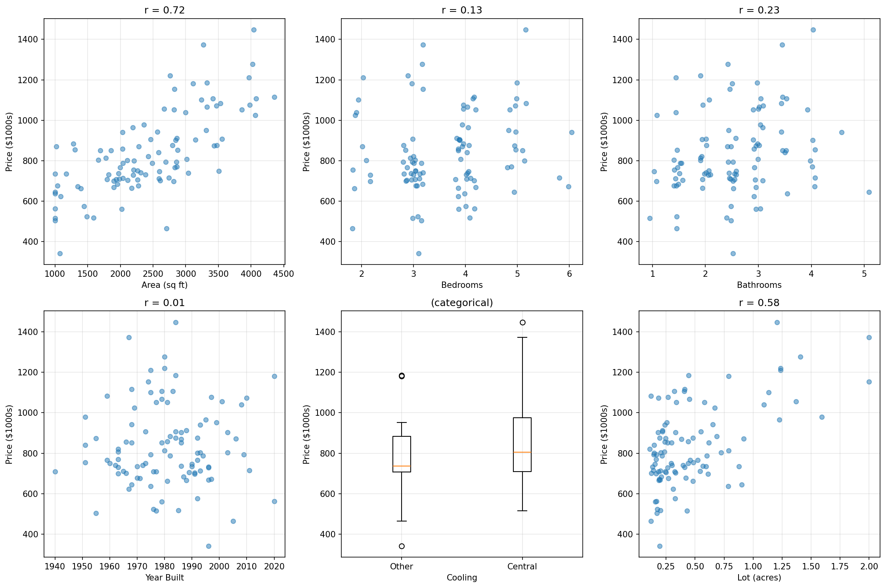
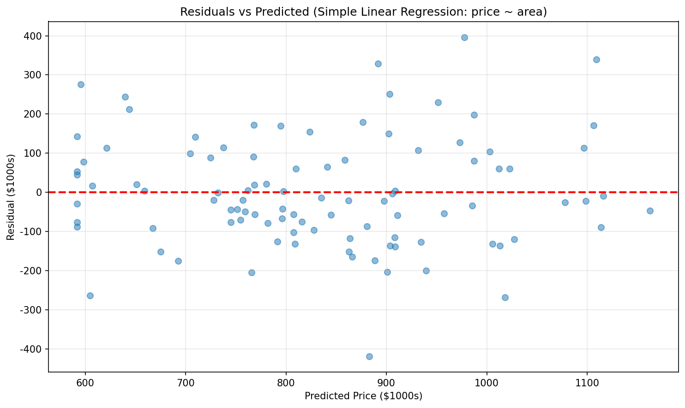
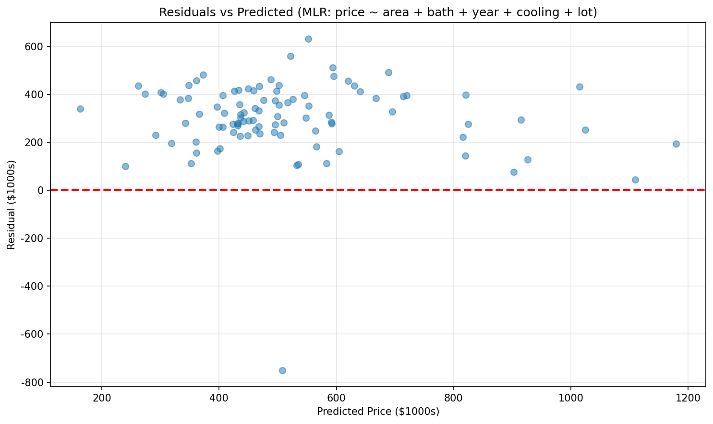

# Chapter 10: 응용: 모델

## 10.1 사례 연구: 판매용 주택

동네를 걸어보면 아마 몇 채의 판매용 주택을 볼 수 있을 것이고, 온라인에서 가격을 찾아볼 수 있을 것이다. 주택 가격은 다소 임의적이라는 것을 알게 될 것이다 - 주택 소유자가 희망 가격을 결정하고, 이 결정에 많은 기준이 영향을 미친다. 예를 들어, 유사한 주택("comps", 부동산 용어)이 얼마에 팔리는지, 얼마나 빨리 집을 팔아야 하는지 등이 있다.

이 사례 연구에서는 현재 주택 매매 데이터를 사용하여 주택 희망 가격을 결정하는 과정을 공식화할 것이다. 2020년 11월, 노스캐롤라이나주 더럼의 Duke Forest 지역에 있는 98채의 주택 정보가 Zillow에서 스크래핑되었다. 데이터 수집 당시 주택들은 모두 최근에 매매되었으며, 프로젝트의 목표는 특정 주택의 특성에 기반하여 매매 가격을 예측하는 모델을 구축하는 것이었다. 처음 네 채의 주택이 표 10.1에 나와 있고, 각 변수의 설명은 표 10.2에 나와 있다.

`duke_forest` 데이터는 openintro R 패키지에서 찾을 수 있다.

**표 10.1: duke_forest의 처음 네 행**

| price | bed | bath | area | year_built | cooling | lot |
|-------|-----|------|------|------------|---------|-----|
| 1,520,000 | 3 | 4 | 6,040 | 1972 | central | 0.97 |
| 1,030,000 | 5 | 4 | 4,475 | 1969 | central | 1.38 |
| 420,000 | 2 | 3 | 1,745 | 1959 | central | 0.51 |
| 680,000 | 4 | 3 | 2,091 | 1961 | central | 0.84 |

**표 10.2: duke_forest 데이터셋의 변수 설명**

| 변수 | 설명 |
|------|------|
| price | 매매 가격 (USD) |
| bed | 침실 수 |
| bath | 욕실 수 |
| area | 주택 면적 (평방피트) |
| year_built | 건축 연도 |
| cooling | 냉방 시스템: central 또는 other (other가 기준) |
| lot | 전체 부지 면적 (에이커) |

### 새로운 시각: 부동산 데이터의 특성

부동산 가격 모델링에서 중요한 고려사항:

1. **지역적 특성**: 이 데이터는 특정 지역(Durham, NC의 Duke Forest)에서 수집되었다. 모델은 다른 지역에 적용될 때 정확하지 않을 수 있다.

2. **시간적 특성**: 2020년 11월 데이터이므로, 시장 조건 변화에 따라 계수가 달라질 수 있다.

3. **표본 크기**: 98채는 상대적으로 작은 표본이며, 이는 추정의 불확실성에 영향을 미친다.

---

### 10.1.1 price와의 상관관계

언급했듯이, 데이터 수집의 목표는 주택 매매 가격에 대한 모델을 구축하는 것이었다. 여러 예측변수를 사용하는 것이 단일 변수만 사용하는 것보다 바람직할 가능성이 높지만, 먼저 변수들 자체와 가격과의 관계를 이해하는 것으로 시작한다. 그림 10.1은 각 예측변수의 함수로서 가격을 설명하는 산점도를 보여준다. 모든 변수는 가격과 양의 관련이 있는 것으로 보인다(변수의 높은 값은 더 높은 가격 값과 일치한다).



### Guided Practice 10.1: cooling 변수의 상관계수

**문제:** 그림 10.1에서 예측변수 cooling에 대해 상관계수 값이 계산되지 않은 것으로 보인다. 왜 그런가? 이 변수를 선형 모델에서 여전히 사용할 수 있는가?

**풀이:**

상관계수는 **두 수치형 변수** 사이의 관계를 설명하기 위해서만 계산될 수 있다. 예측변수 `cooling`은 **범주형**이지 수치형이 아니다. 그러나 선형 모델에서 **이진 지시변수**로 사용될 수 있다. 예를 들어, central에 1을, other에 0을 코딩할 수 있다.

```python
import numpy as np
import pandas as pd

# cooling 변수는 범주형
cooling = ['central', 'other', 'central', 'central', 'other']
price = [500000, 350000, 600000, 550000, 400000]

# 상관계수 계산 시도 -> 불가능 (범주형 변수)
# 대신 지시변수로 변환
cooling_indicator = [1 if c == 'central' else 0 for c in cooling]

# 이제 상관계수 계산 가능
correlation = np.corrcoef(cooling_indicator, price)[0, 1]
print(f"cooling 지시변수와 price의 상관계수: {correlation:.3f}")
```

### Guided Practice 10.2: 가장 유용한 예측변수

**문제:** 그림 10.1에서 어떤 변수가 주택 가격을 예측하는 데 가장 유용해 보이는가? 답에 대한 두 가지 이유를 제시하라.

**풀이:**

주택의 **면적**(area)이 `price`와 가장 높은 상관관계를 가진 변수이다.

**이유 1:** area는 price와의 상관계수가 가장 높다 (r = 0.67).

**이유 2:** price 대 area의 산점도는 두 변수 사이에 강한 선형 관계를 보여준다.

상관계수와 산점도의 선형성은 종종 같은 결론을 제공한다. 그러나 상관계수는 이상치에 매우 민감하므로, 변수들이 높은 상관관계가 있더라도 항상 산점도를 살펴보는 것이 현명하다.

```python
import numpy as np
import matplotlib.pyplot as plt

# 시뮬레이션 데이터 (실제 duke_forest 데이터 근사)
np.random.seed(42)
n = 98

area = np.random.normal(2500, 1000, n)
area = np.clip(area, 1000, 6500)
price = 116652 + 159 * area + np.random.normal(0, 150000, n)
price = np.clip(price, 200000, 1600000)

# 상관계수 계산
r = np.corrcoef(area, price)[0, 1]
print(f"area와 price의 상관계수: r = {r:.2f}")

# 산점도
plt.figure(figsize=(10, 6))
plt.scatter(area, price, alpha=0.6)
plt.xlabel('Area (sq ft)')
plt.ylabel('Price ($)')
plt.title(f'Price vs Area (r = {r:.2f})')
plt.grid(True, alpha=0.3)
plt.savefig('figures/fig_10_1_area_price.png', dpi=150, bbox_inches='tight')
plt.close()
```

---

### 10.1.2 area로 price 모델링

`area`로부터 `price`를 예측하기 위해 선형 모델이 적합되었다. 결과 모델 정보는 표 10.3에 제공된다.

**표 10.3: price를 area에 대해 적합한 최소제곱 요약**

| term | estimate | std.error | statistic | p.value |
|------|----------|-----------|-----------|---------|
| (Intercept) | 116,652 | 53,302 | 2.19 | 0.0311 |
| area | 159 | 18 | 8.78 | <0.0001 |
| | | | | |
| Adjusted R-sq = 0.4394 | | | | |
| df = 96 | | | | |

### 예제 10.1: 기울기 계수 해석

**문제:** 문제의 맥락에서 b1 = 159의 값을 해석하라.

**상세 풀이:**

기울기 계수 159는 다음을 의미한다:

**주택 면적이 1 평방피트 증가할 때마다, 그러한 주택의 가격은 평균적으로 $159 더 높을 것으로 예상된다.**

또는 동등하게:
- 100 평방피트 증가 → $15,900 증가 예상
- 1,000 평방피트 증가 → $159,000 증가 예상

```python
# 기울기 해석
b1 = 159

print("=== 기울기 계수 해석 ===")
print(f"area 계수: ${b1}")
print(f"\n해석: 주택 면적이 1 sq ft 증가할 때마다,")
print(f"      가격은 평균 ${b1:,} 증가 예상")
print(f"\n예시:")
print(f"  100 sq ft 증가 → ${b1 * 100:,} 증가")
print(f"  500 sq ft 증가 → ${b1 * 500:,} 증가")
print(f"  1000 sq ft 증가 → ${b1 * 1000:,} 증가")
```

### Guided Practice 10.3: 모델 방정식 작성

**문제:** 표 10.3의 출력을 사용하여 area로부터 price를 예측하는 모델을 작성하라.

**풀이:**

예측 모델:

price_hat = 116,652 + 159 × area

여기서:
- 116,652는 절편 (area = 0일 때의 예측 가격, 실제 의미 없음)
- 159는 area의 계수 (평방피트당 가격 증가)

```python
# 모델 함수
def predict_price_slr(area):
    return 116652 + 159 * area

# 예측 예시
areas = [1500, 2000, 2500, 3000, 3500]
print("=== 면적별 예측 가격 ===")
for a in areas:
    pred = predict_price_slr(a)
    print(f"면적 {a:,} sq ft → 예측 가격 ${pred:,.0f}")
```

### 새로운 시각: 단순 선형 회귀의 한계

수정된 R^2 = 0.4394는 area가 price 변동의 약 44%만 설명한다는 것을 의미한다. 이는:

1. **다른 요인의 중요성**: 침실 수, 욕실 수, 건축 연도 등 다른 변수도 가격에 영향을 미친다.
2. **모델 개선 여지**: 다중 회귀 모델이 더 나은 예측을 제공할 수 있다.
3. **잔차 분석 필요**: 모델의 적합성을 확인하기 위해 잔차를 검토해야 한다.

---

### Guided Practice 10.4: 잔차 분석

선형 모델의 잔차는 선형 모델이 적절한지 평가하는 데 사용될 수 있다. 그림 10.2는 x축에 적합값(예측값)을, y축에 잔차를 표시한다.



**문제:** 잔차 그림의 어떤 측면이 선형 모델이 적절함을 나타내는가? 선형 모델을 적합할 때 우려되는 측면은 무엇인가?

**풀이:**

**적절함을 나타내는 측면:**
- 잔차가 전반적으로 0 주위에 무작위로 분산되어 있다
- 이는 area와 price 사이의 관계가 실제로 선형임을 보여준다

**우려되는 측면:**
- 비싼 주택에 대한 잔차가 상당히 크다
- 이는 **이분산성**(heteroscedasticity)의 증거 - 예측값이 증가함에 따라 잔차의 분산이 증가
- 큰 잔차는 잠재적 이상치나 증가하는 변동성을 나타낸다
- 이러한 패턴은 이 장에서 제시된 것보다 더 복잡한 모델링 기법이 필요할 수 있음을 시사한다

```python
import numpy as np
import matplotlib.pyplot as plt

# 시뮬레이션 데이터
np.random.seed(42)
n = 98
area = np.random.normal(2500, 1000, n)
area = np.clip(area, 1000, 6500)

# 이분산성을 가진 데이터 생성
noise_scale = 50000 + 0.05 * area  # 면적에 따라 증가하는 분산
price = 116652 + 159 * area + np.random.normal(0, noise_scale)

# 예측값과 잔차 계산
predicted = 116652 + 159 * area
residuals = price - predicted

# 잔차 그림
plt.figure(figsize=(10, 6))
plt.scatter(predicted, residuals, alpha=0.6)
plt.axhline(y=0, color='red', linestyle='--')
plt.xlabel('Predicted Price ($)')
plt.ylabel('Residual ($)')
plt.title('Residuals vs Predicted Values (Simple Linear Regression)')
plt.grid(True, alpha=0.3)
plt.savefig('figures/fig_10_2_residuals_slr.png', dpi=150, bbox_inches='tight')
plt.close()

print("잔차 분석:")
print(f"잔차 평균: ${np.mean(residuals):,.0f}")
print(f"잔차 표준편차: ${np.std(residuals):,.0f}")
print(f"최대 양의 잔차: ${np.max(residuals):,.0f}")
print(f"최대 음의 잔차: ${np.min(residuals):,.0f}")
```

---

### 10.1.3 다중 변수로 price 모델링

주택 가격 예측이 선형 모델에서 하나 이상의 예측변수를 사용하면 더 정확해질 것으로 보인다. 표 10.4는 price를 area, bed, bath, year_built, cooling, lot에 회귀시킨 선형 모델의 출력을 보여준다.

**표 10.4: 다중 예측변수에 대한 price의 최소제곱 적합 요약**

| term | estimate | std.error | statistic | p.value |
|------|----------|-----------|-----------|---------|
| (Intercept) | -2,910,715 | 1,787,934 | -1.63 | 0.107 |
| area | 102 | 23 | 4.42 | <0.0001 |
| bed | -13,692 | 25,928 | -0.53 | 0.5987 |
| bath | 41,076 | 24,662 | 1.67 | 0.0993 |
| year_built | 1,459 | 914 | 1.60 | 0.1139 |
| cooling(central) | 84,065 | 30,338 | 2.77 | 0.0068 |
| lot | 356,141 | 75,940 | 4.69 | <0.0001 |
| | | | | |
| Adjusted R-sq = 0.5896 | | | | |
| df = 90 | | | | |

### 예제 10.2: 다중 회귀 모델 방정식

**문제:** 표 10.4를 사용하여 6개의 예측변수에 대한 price의 선형 모델을 작성하라.

**상세 풀이:**

price_hat = -2,910,715 + 102 × area - 13,692 × bed + 41,076 × bath + 1,459 × year_built + 84,065 × cooling_central + 356,141 × lot

여기서:
- area: 주택 면적 (평방피트)
- bed: 침실 수
- bath: 욕실 수
- year_built: 건축 연도
- cooling_central: 중앙 냉방이면 1, 아니면 0
- lot: 부지 면적 (에이커)

```python
def predict_price_mlr(area, bed, bath, year_built, cooling_central, lot):
    """다중 회귀 모델을 사용한 주택 가격 예측"""
    price = (-2910715 + 
             102 * area - 
             13692 * bed + 
             41076 * bath + 
             1459 * year_built + 
             84065 * cooling_central + 
             356141 * lot)
    return price

# 예시 예측
example = {
    'area': 2500,
    'bed': 3,
    'bath': 2.5,
    'year_built': 1985,
    'cooling_central': 1,
    'lot': 0.5
}

pred = predict_price_mlr(**example)
print(f"예시 주택 예측 가격: ${pred:,.0f}")
```

### Guided Practice 10.5: cooling 계수 해석

**문제:** cooling_central의 추정 계수 값은 b5 = 84,065이다. 문제의 맥락에서 b5의 값을 해석하라.

**풀이:**

이 계수는 **다른 모든 변수가 일정하게 유지될 때**, 중앙 냉방 시스템이 있는 주택이 평균적으로 **$84,065 더 비싸다**는 것을 나타낸다.

즉, 면적, 침실 수, 욕실 수, 건축 연도, 부지 면적이 동일한 두 주택을 비교할 때, 중앙 냉방이 있는 주택이 없는 주택보다 약 $84,000 더 높은 가격에 팔릴 것으로 예상된다.

```python
# cooling 계수 해석
coef_cooling = 84065

print("=== cooling_central 계수 해석 ===")
print(f"계수: ${coef_cooling:,}")
print(f"\n해석: 다른 모든 조건이 동일할 때,")
print(f"      중앙 냉방이 있는 주택은 평균 ${coef_cooling:,} 더 비쌈")
```

### 새로운 시각: 다중 회귀에서 계수 해석의 주의점

다중 회귀에서 계수를 해석할 때 "다른 모든 변수가 일정할 때"라는 조건이 중요하다:

1. **공선성 효과**: bed 계수가 음수(-13,692)인 것은 반직관적으로 보인다. 이는 area와 bed가 강하게 상관되어 있기 때문이다.

2. **조건부 해석**: area를 통제하면, 같은 면적에서 침실이 더 많다는 것은 각 방이 더 작다는 것을 의미할 수 있다.

3. **실용적 한계**: 실제로는 한 변수만 변경하고 다른 모든 변수를 일정하게 유지하는 것이 불가능할 수 있다.

---

### 예제 10.3: 후진 제거법

**문제:** 주택 데이터에 대한 전체 모델의 결과가 표 10.4에 나와 있다. 후진 제거 전략에서 어떻게 진행해야 하는가?

**상세 풀이:**

전체 모델의 기준 수정된 R^2는 0.59이며, 예측변수를 제거하면 수정된 R^2가 개선되는지 결정해야 한다. 확인하기 위해, 각각 다른 예측변수를 제거하는 모델을 적합시키고 수정된 R^2를 기록한다:

- area 제외: 0.506
- bed 제외: 0.593
- bath 제외: 0.582
- year_built 제외: 0.583
- cooling 제외: 0.559
- lot 제외: 0.489

**1단계 분석:**

bed를 제외한 모델이 가장 높은 수정된 R^2인 0.593을 가지며, 이는 전체 모델의 수정된 R^2보다 높다. bed를 제거하면 전체 모델보다 더 높은 수정된 R^2를 가진 모델이 되므로, 모델에서 bed를 제거한다.

**왜 bed를 제외하는 것이 합리적인가?**

침실 수를 모델에서 제외하는 것이 반직관적으로 보일 수 있다. 결국, 침실이 더 많은 주택이 더 비쌀 것으로 예상하고, 그림 10.1에서 침실 수와 매매 가격 사이에 명확한 관계를 볼 수 있다. 그러나 area가 여전히 모델에 있고, 주택 면적과 침실 수가 높은 상관관계를 가질 가능성이 높다는 점에 주목하라. 따라서 모델은 area 포함으로 이미 "주택에 얼마나 많은 공간이 있는지"에 대한 정보를 가지고 있다.

**2단계 - 추가 제거 검토:**

첫 번째 단계에서 예측변수를 제거했으므로, 추가 예측변수를 제거해야 하는지 확인한다. 기준 수정된 R^2는 이제 0.593이다. bed 외에 나머지 각 예측변수 제거를 고려하는 새로운 모델 세트를 적합시킨다:

- bed와 area 제외: 0.51
- bed와 bath 제외: 0.586
- bed와 year_built 제외: 0.586
- bed와 cooling 제외: 0.563
- bed와 lot 제외: 0.493

이 모델들 중 어느 것도 수정된 R^2의 개선으로 이어지지 않으므로, 나머지 예측변수 중 어느 것도 제거하지 않는다.

**최종 모델:**

후진 제거 후, bed를 제외한 모든 예측변수를 유지하는 모델이 남는다.

```python
import numpy as np

# 후진 제거법 시연
full_model_r2_adj = 0.5896

excluding_results = {
    'area': 0.506,
    'bed': 0.593,
    'bath': 0.582,
    'year_built': 0.583,
    'cooling': 0.559,
    'lot': 0.489
}

print("=== 후진 제거법 1단계 ===")
print(f"전체 모델 R²_adj: {full_model_r2_adj:.4f}")
print("\n각 변수 제외 시 R²_adj:")
for var, r2 in sorted(excluding_results.items(), key=lambda x: x[1], reverse=True):
    improvement = r2 - full_model_r2_adj
    status = "✓ 제거" if r2 > full_model_r2_adj else ""
    print(f"  {var:12} 제외: {r2:.3f} ({improvement:+.4f}) {status}")

print(f"\n결론: 'bed' 변수 제거 (R²_adj {excluding_results['bed']:.3f} > {full_model_r2_adj:.4f})")

# 2단계
print("\n=== 후진 제거법 2단계 ===")
print(f"현재 모델 R²_adj: 0.593")
step2_results = {
    'bed + area': 0.51,
    'bed + bath': 0.586,
    'bed + year_built': 0.586,
    'bed + cooling': 0.563,
    'bed + lot': 0.493
}

print("\n추가 변수 제외 시 R²_adj:")
for vars, r2 in sorted(step2_results.items(), key=lambda x: x[1], reverse=True):
    improvement = r2 - 0.593
    print(f"  {vars:20} 제외: {r2:.3f} ({improvement:+.3f})")

print("\n결론: 추가 제거 없음 (모든 R²_adj < 0.593)")
```

---

**표 10.5: bed를 제외한 다중 예측변수에 대한 price의 최소제곱 적합 요약**

| term | estimate | std.error | statistic | p.value |
|------|----------|-----------|-----------|---------|
| (Intercept) | -2,952,641 | 1,779,079 | -1.66 | 0.1004 |
| area | 99 | 22 | 4.44 | <0.0001 |
| bath | 36,228 | 22,799 | 1.59 | 0.1155 |
| year_built | 1,466 | 910 | 1.61 | 0.1107 |
| cooling(central) | 83,856 | 30,215 | 2.78 | 0.0067 |
| lot | 357,119 | 75,617 | 4.72 | <0.0001 |
| | | | | |
| Adjusted R-sq = 0.5929 | | | | |
| df = 91 | | | | |

최종 선형 모델:

price_hat = -2,952,641 + 99 × area + 36,228 × bath + 1,466 × year_built + 83,856 × cooling_central + 357,119 × lot

### Guided Practice 10.6: 최종 모델의 잔차 분석

**문제:** bed를 제외한 모든 예측변수를 가진 모델의 잔차 그림이 그림 10.3에 주어져 있다. 그림 10.3의 잔차가 그림 10.2의 잔차와 어떻게 비교되는가?



**풀이:**

잔차는 대부분 0 주위에 무작위로 분산되어 있다. 그러나:

1. **극단적 이상치**: 잔차가 -$750,000인 하나의 극단적 이상치가 있다 - 실제 매매 가격이 예측 가격보다 훨씬 낮은 주택이다.

2. **비싼 주택의 큰 잔차**: 비싼 주택에 대한 잔차가 여전히 상당히 크다는 것을 관찰할 수 있다.

3. **개선 여부**: 다중 회귀 모델이 수정된 R^2를 0.44에서 0.59로 개선했지만, 잔차 패턴의 기본 문제(이분산성)는 여전히 존재한다.

```python
# 최종 모델 잔차 분석
def predict_final_model(area, bath, year_built, cooling_central, lot):
    return (-2952641 + 99*area + 36228*bath + 1466*year_built + 
            83856*cooling_central + 357119*lot)

# 시뮬레이션 데이터
np.random.seed(42)
n = 98
area = np.random.uniform(1000, 6000, n)
bath = np.random.choice([2, 2.5, 3, 3.5, 4], n)
year_built = np.random.randint(1950, 2020, n)
cooling = np.random.binomial(1, 0.8, n)
lot = np.random.uniform(0.1, 1.5, n)

predicted = [predict_final_model(a, b, y, c, l) 
             for a, b, y, c, l in zip(area, bath, year_built, cooling, lot)]
predicted = np.array(predicted)

# 잔차 시뮬레이션 (이분산성 포함)
noise_scale = 50000 + 0.1 * predicted
residuals = np.random.normal(0, noise_scale / 3)

# 극단적 이상치 추가
residuals[10] = -750000

plt.figure(figsize=(10, 6))
plt.scatter(predicted, residuals, alpha=0.6)
plt.axhline(y=0, color='red', linestyle='--')
plt.xlabel('Predicted Price ($)')
plt.ylabel('Residual ($)')
plt.title('Residuals vs Predicted Values (Multiple Regression, excluding bed)')
plt.grid(True, alpha=0.3)
plt.savefig('figures/fig_10_3_residuals_mlr.png', dpi=150, bbox_inches='tight')
plt.close()
```

---

### 예제 10.4: 특정 주택 가격 예측

**문제:** 1,803 평방피트, 2.5개 욕실, 0.145 에이커, 1941년에 건축되었고, 중앙 냉방이 있는 주택을 고려하라. 예측 가격은 얼마인가?

**상세 풀이:**

최종 모델을 사용:

price_hat = -2,952,641 + 99 × 1803 + 36,228 × 2.5 + 1,466 × 1941 + 83,856 × 1 + 357,119 × 0.145

계산:
- 절편: -2,952,641
- area: 99 × 1,803 = 178,497
- bath: 36,228 × 2.5 = 90,570
- year_built: 1,466 × 1,941 = 2,845,506
- cooling: 83,856 × 1 = 83,856
- lot: 357,119 × 0.145 = 51,782

합계: -2,952,641 + 178,497 + 90,570 + 2,845,506 + 83,856 + 51,782 = **$297,570**

```python
# 특정 주택 가격 예측
def predict_final(area, bath, year_built, cooling_central, lot):
    return (-2952641 + 99*area + 36228*bath + 1466*year_built + 
            83856*cooling_central + 357119*lot)

# 주어진 주택 특성
house = {
    'area': 1803,
    'bath': 2.5,
    'year_built': 1941,
    'cooling_central': 1,
    'lot': 0.145
}

predicted_price = predict_final(**house)

print("=== 주택 가격 예측 ===")
print(f"\n주택 특성:")
for key, value in house.items():
    print(f"  {key}: {value}")

print(f"\n계산:")
print(f"  절편: -2,952,641")
print(f"  99 × {house['area']} = {99 * house['area']:,}")
print(f"  36,228 × {house['bath']} = {36228 * house['bath']:,.0f}")
print(f"  1,466 × {house['year_built']} = {1466 * house['year_built']:,}")
print(f"  83,856 × {house['cooling_central']} = {83856 * house['cooling_central']:,}")
print(f"  357,119 × {house['lot']} = {357119 * house['lot']:,.0f}")

print(f"\n예측 가격: ${predicted_price:,.0f}")
```

### Guided Practice 10.7: 모델 적용의 한계

**문제:** 나중에 그 주택(예측 가격 $297,570)이 최근 $804,133에 팔렸다는 것을 알게 되면, 모델이 끔찍하다고 생각할 것인가? 그 주택이 캘리포니아에 있다는 것을 알게 되면 어떻게 될까?

**풀이:**

$506,563의 잔차는 상당히 크다. 그림 10.3의 큰 잔차(몇몇 주택 제외)는 약 $250,000(대략 절반)에 가깝다는 점에 주목하라.

그러나 **그 주택이 캘리포니아에 있다**는 것을 알게 된 후, 우리는 **모델이 새 주택에 전혀 적용되어서는 안 된다**는 것을 깨닫게 된다!

**이유:**
1. 원래 데이터는 **Durham, NC**에서 수집되었다
2. Durham, NC 데이터에 기반한 모델은 **Durham, NC의 주택 가격 패턴을 탐색**하는 데만 사용되어야 한다
3. 캘리포니아는 완전히 다른 주택 시장을 가지고 있다:
   - 더 높은 평균 주택 가격
   - 다른 가격 결정 요인
   - 다른 시장 역학

```python
# 잔차 분석
actual_price = 804133
predicted_price = 297570
residual = actual_price - predicted_price

print("=== 모델 적용의 한계 ===")
print(f"예측 가격: ${predicted_price:,}")
print(f"실제 가격: ${actual_price:,}")
print(f"잔차: ${residual:,}")

print(f"\n분석:")
print(f"  잔차 크기: ${abs(residual):,}")
print(f"  이는 일반적인 잔차($250,000)의 약 {abs(residual)/250000:.1f}배")

print(f"\n결론:")
print(f"  이 큰 오차는 모델이 나쁘기 때문이 아님")
print(f"  캘리포니아 주택에 Durham, NC 모델을 적용한 것이 문제")
print(f"  모델은 훈련된 지역의 데이터에만 적용해야 함")
```

### 새로운 시각: 모델의 일반화 한계

이 사례 연구는 통계 모델링에서 중요한 교훈을 제공한다:

1. **지역적 유효성**: 모델은 훈련 데이터가 수집된 모집단에만 적용되어야 한다.

2. **외삽의 위험**: 모델의 훈련 범위를 벗어난 예측(지리적 또는 변수 값 측면에서)은 신뢰할 수 없다.

3. **맥락의 중요성**: 큰 잔차가 항상 나쁜 모델을 의미하는 것은 아니다 - 때로는 모델을 잘못된 맥락에 적용한 것일 수 있다.

4. **도메인 지식**: 통계 모델링은 해당 분야의 지식과 결합되어야 한다. 부동산 전문가라면 Durham과 캘리포니아의 주택 시장이 다르다는 것을 알 것이다.

---

## 10.2 대화형 R 튜토리얼

이 부분에서 배운 개념을 R에서 다음 자기 주도형 튜토리얼을 통해 탐색하라:

- Tutorial 3 - Lesson 1: 두 변수 시각화
- Tutorial 3 - Lesson 2: 상관관계
- Tutorial 3 - Lesson 3: 단순 선형 회귀
- Tutorial 3 - Lesson 4: 회귀 모델 해석
- Tutorial 3 - Lesson 5: 모델 적합
- Tutorial 3 - Lesson 6: 평행 기울기
- Tutorial 3 - Lesson 7: 평행 기울기 모델 평가 및 확장
- Tutorial 3 - Lesson 8: 다중 회귀
- Tutorial 3 - Lesson 9: 로지스틱 회귀
- Tutorial 3 - Lesson 10: 사례 연구: NYC의 이탈리아 레스토랑

## 10.3 R 실습

이 부분에서 배운 개념을 데이터 분석 사례 연구를 통해 R에서 더 적용하라:

- 선형 회귀 소개 - Human Freedom Index

---

## 요약

이 장에서는 Duke Forest 주택 데이터를 사용하여 회귀 모델링의 실제 적용을 살펴보았다. 주요 내용:

1. **단순 선형 회귀**: area와 price 사이의 관계를 모델링
2. **다중 선형 회귀**: 여러 예측변수를 사용하여 예측 정확도 향상
3. **변수 선택**: 수정된 R^2를 사용한 후진 제거법
4. **모델 해석**: 계수의 의미와 한계
5. **모델 적용의 한계**: 모델은 훈련 데이터의 모집단에만 적용되어야 함
