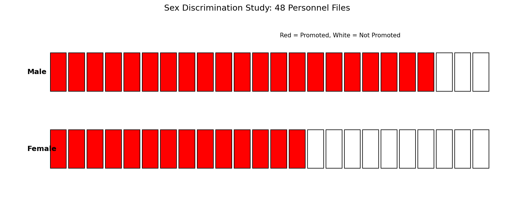
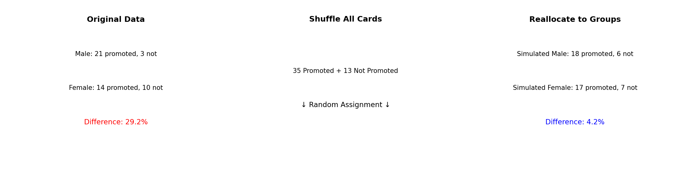
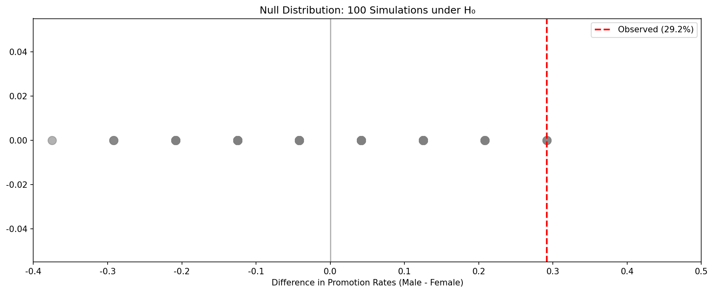
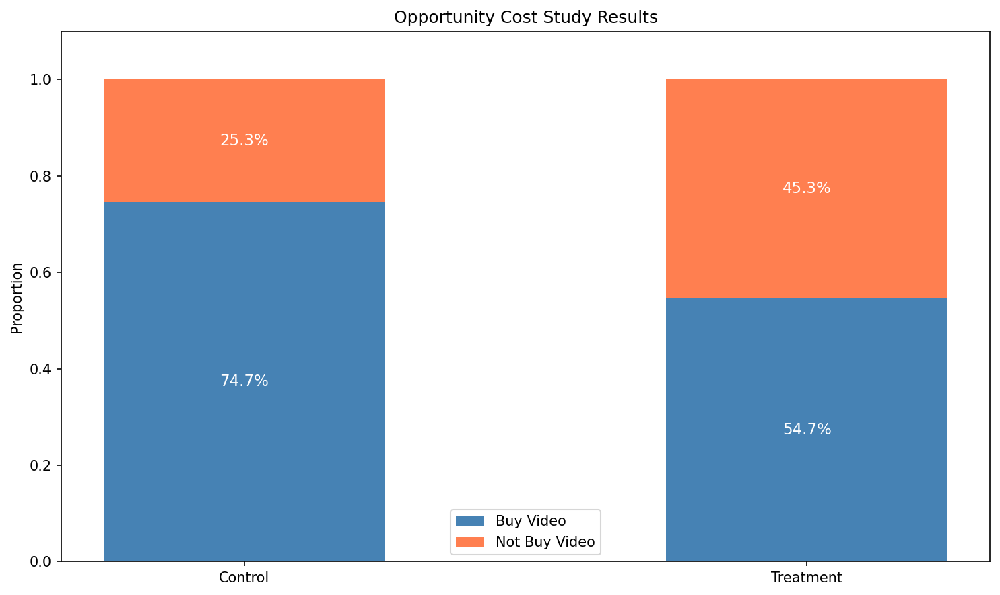
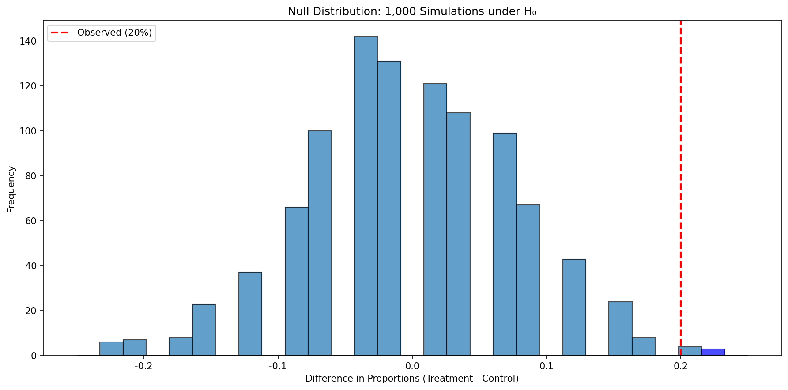
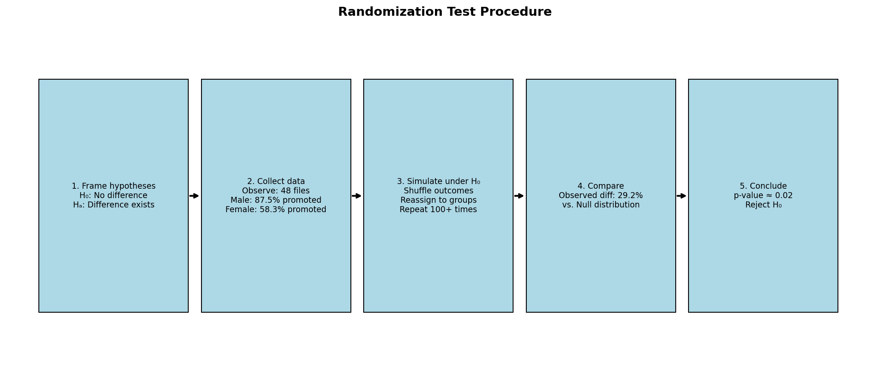

# Chapter 11: 무작위화를 이용한 가설 검정

통계적 추론은 주로 모수 추정의 불확실성을 이해하고 정량화하는 것에 관심이 있다. 방정식과 세부 사항은 설정에 따라 변하지만, 추론의 기초는 모든 통계학에서 동일하다.

우리는 연구 주장에 대한 결정을 내리는 과정에 동기를 부여하기 위해 설계된 두 가지 사례 연구로 시작한다. **가설 검정 프레임워크**(hypothesis testing framework)의 도입을 통해 과정을 공식화하며, 이를 통해 모집단에 대한 주장을 공식적으로 평가할 수 있다.

먼저, 표기법에 대한 노트이다. 일반적으로 모집단 비율을 나타내기 위해 p를, 표본 비율을 나타내기 위해 p-hat을 사용한다. 마찬가지로, 일반적으로 모집단 평균을 나타내기 위해 μ를, 표본 평균을 나타내기 위해 x-bar를 사용한다.

---

## 11.1 성별 차별 사례 연구

우리는 1970년대 성별 차별을 조사한 연구를 고려하며, 이는 은행 내 인사 결정의 맥락에서 설정되었다. 우리가 답하고자 하는 연구 질문은 "남성으로 식별되는 관리자가 내리는 승진 결정에서 여성으로 식별되는 개인이 차별받는가?"이다 (Rosen and Jerdee 1974).

### 11.1.1 관측 데이터

이 연구의 참가자는 1972년 노스캐롤라이나 대학의 경영 연수원에 참석한 48명의 남성으로 식별되는 은행 감독관이었다. 그들은 은행의 인사 담당 이사 역할을 맡도록 요청받았고, 그 사람이 지점장 직위로 승진해야 하는지 판단하기 위한 인사 파일을 받았다. 참가자들에게 주어진 파일은 동일했으나, 절반은 후보자가 남성으로 식별됨을, 나머지 절반은 후보자가 여성으로 식별됨을 나타냈다. 이 파일들은 은행 관리자들에게 무작위로 할당되었다.

### Guided Practice 11.1: 연구 유형 식별

**문제:** 이것은 관측 연구인가 실험인가? 연구 유형이 결과에서 추론할 수 있는 것에 어떤 영향을 미치는가?

**풀이:**

이 연구는 **실험**(experiment)이다. 피험자들에게 "남성" 파일 또는 "여성" 파일이 무작위로 할당되었기 때문이다. 이것이 실험이므로, 결과를 사용하여 후보자의 성별과 승진 결정 사이의 **인과 관계**를 평가할 수 있다.

```python
print("=== 연구 유형 분석 ===")
print("연구 특성:")
print("  - 처치(성별 표시)가 무작위로 할당됨")
print("  - 파일 내용은 동일, 성별 표시만 다름")
print("  - 48명의 참가자")
print("\n결론: 실험 (Experiment)")
print("\n추론 가능성:")
print("  - 인과 관계 추론 가능")
```

**표 11.1: 성별 차별 연구의 요약 결과**

| 성별 | 승진 | 미승진 | 합계 |
|------|------|------|------|
| 남성 | 21 | 3 | 24 |
| 여성 | 14 | 10 | 24 |
| 합계 | 35 | 13 | 48 |



### 새로운 시각: 무작위화 실험의 핵심 원리

이 실험의 핵심 설계 요소는 **무작위 할당**(random assignment)이다:

1. **통제**: 파일 내용이 동일하므로, 관찰된 차이는 성별 표시에만 기인할 수 있다
2. **무작위화**: 성별 표시가 무작위로 할당되어 편향 제거
3. **복제**: 48개의 관측치가 통계적 분석을 가능하게 함

---

### 예제 11.1: 증거의 강도 평가

**문제:** 이 연구의 승진률을 볼 때, 왜 여성으로 식별되는 개인이 차별받는다고 즉시 결론짓고 싶을 수 있는가?

**풀이:**

승진률의 큰 차이 (여성 58.3% 대 남성 87.5%)는 승진 결정에서 여성에 대한 차별이 있을 수 있음을 시사한다. 그러나 관측된 차이가 차별을 나타내는지 아니면 무작위 우연에 의한 것인지 아직 확신할 수 없다.

```python
male_promoted, male_total = 21, 24
female_promoted, female_total = 14, 24

male_rate = male_promoted / male_total
female_rate = female_promoted / female_total
observed_diff = male_rate - female_rate

print("=== 성별 차별 연구: 관측 데이터 분석 ===")
print(f"남성 승진률: {male_rate:.3f} ({male_rate*100:.1f}%)")
print(f"여성 승진률: {female_rate:.3f} ({female_rate*100:.1f}%)")
print(f"관측된 차이: {observed_diff:.3f} ({observed_diff*100:.1f}%p)")
```

표 11.1은 여성 인사에 대한 승진이 남성 인사보다 7건 적었음을 보여주며, 승진률 차이는 29.2%이다. 이 관측된 차이를 참된 차이의 **점 추정치**(point estimate)라고 부른다.

우리는 이 두 경쟁하는 주장을 H0와 HA로 라벨링한다:

* **H0: 귀무가설**(Null hypothesis). 변수 sex와 decision은 독립적이다. 29.2%의 승진률 차이는 모집단에 내재된 자연적 변동성에 의한 것이었다.
* **HA: 대립가설**(Alternative hypothesis). 변수 sex와 decision은 독립적이지 않다. 동등하게 자격이 있는 여성 인사가 남성 인사보다 승진될 가능성이 낮다.

---

### 11.1.2 통계량의 변동성

표 11.1은 35명의 은행 감독관이 승진을 추천했고 13명은 그렇지 않았음을 보여준다. 은행원들의 결정이 후보자의 성별과 독립적이었다고 가정하자. 그러면, 파일에 성별을 다르게 무작위 할당하여 실험을 다시 수행했다면, 승진률의 차이는 승진 결정의 무작위 변동에만 기반할 것이다.

**시뮬레이션**에서, 우리는 promoted로 라벨링된 35개와 not promoted로 라벨링된 13개의 48개 인사 파일을 철저히 섞고 두 개의 새로운 더미로 파일을 나눈다.



**표 11.2: 시뮬레이션 결과**

| 성별 | 승진 | 미승진 | 합계 |
|------|------|------|------|
| 남성 | 18 | 6 | 24 |
| 여성 | 17 | 7 | 24 |
| 합계 | 35 | 13 | 48 |

### Guided Practice 11.2: 시뮬레이션 결과 분석

**문제:** 표 11.2의 두 시뮬레이션 그룹 간의 승진률 차이는 얼마인가?

**풀이:**

시뮬레이션 차이: 18/24 - 17/24 = 0.042 (4.2%)

우연에 의한 이 차이(4.2%)는 실제 그룹에서 관측된 차이(29.2%)보다 훨씬 작다.

```python
sim_male_rate = 18/24
sim_female_rate = 17/24
sim_diff = sim_male_rate - sim_female_rate

print(f"시뮬레이션 차이: {sim_diff:.3f} ({sim_diff*100:.1f}%)")
print(f"관측된 차이: 0.292 (29.2%)")
print(f"결론: 시뮬레이션 차이가 훨씬 작음")
```

### 새로운 시각: 귀무 분포의 개념

**귀무 분포**(null distribution)는 귀무가설이 참일 때 검정 통계량이 따르는 분포이다. 무작위화 검정에서 이 분포는 데이터를 여러 번 섞어서 경험적으로 구축한다.

---

### 11.1.3 관측 통계량 vs 귀무 통계량

컴퓨터에서 시뮬레이션을 반복하면, 같은 가정 하에서 우연에 의한 또 다른 차이를 얻는다. 그림 11.4는 100번의 시뮬레이션에서 발견된 차이의 그림을 보여준다.



### 예제 11.2: 귀무 분포에서 관측값의 희귀성

**문제:** 그림 11.4에 따르면 적어도 29.2%의 차이를 얼마나 자주 관측하겠는가?

**풀이:**

귀무가설 하에서 적어도 29.2%의 차이는 약 **2%의 시간**에만 발생할 것으로 보인다. 100번의 시뮬레이션 중 단 2번만 관측된 차이만큼 크거나 더 큰 차이가 나타났다.

```python
import numpy as np

np.random.seed(42)
n_simulations = 100
n_male, n_female = 24, 24
n_promoted, n_not = 35, 13

simulated_diffs = []
for _ in range(n_simulations):
    outcomes = np.array(['promoted']*n_promoted + ['not']*n_not)
    np.random.shuffle(outcomes)
    male_promoted = np.sum(outcomes[:n_male] == 'promoted')
    female_promoted = np.sum(outcomes[n_male:] == 'promoted')
    diff = male_promoted/n_male - female_promoted/n_female
    simulated_diffs.append(diff)

observed_diff = 0.292
extreme_count = np.sum(np.array(simulated_diffs) >= observed_diff)
p_value = extreme_count / n_simulations

print(f"관측값 이상: {extreme_count}번")
print(f"p-value: {p_value:.2f} ({p_value*100:.0f}%)")
```

실제로 후보자의 파일에 성별을 나열하는 것이 영향이 없다면 29.2%의 차이는 드문 사건이며, 이는 연구 결과에 대한 두 가지 가능한 해석을 제공한다:

* **H0 참인 경우**: 성별은 승진 결정에 영향이 없으며, 우리는 드물게만 발생할 정도로 큰 차이를 관측했다.
* **HA 참인 경우**: 성별은 승진 결정에 영향이 있으며, 여성 후보자가 차별받았기 때문에 큰 차이가 발생했다.

우리 분석에서, 귀무가설 하에서 29.2% 이상의 차이를 얻을 확률이 약 2%에 불과하다고 결정했으므로, 대립가설을 지지하여 귀무가설을 기각한다.

---

## 11.2 기회비용 사례 연구

전형적인 미국 대학생의 행동은 얼마나 합리적이고 일관적인가? 이 섹션에서, 우리는 대학생 소비자들이 항상 다음을 고려하는지 탐구할 것이다: 지금 쓰지 않은 돈은 나중에 쓸 수 있다.

* **H0: 귀무가설**. 학생들에게 나중 구매를 위해 돈을 저축할 수 있다고 상기시키는 것은 학생들의 지출 결정에 어떤 영향도 미치지 않을 것이다.
* **HA: 대립가설**. 학생들에게 나중 구매를 위해 돈을 저축할 수 있다고 상기시키는 것은 구매를 계속할 가능성을 줄일 것이다.

### 11.2.1 관측 데이터

150명의 학생이 연구를 위해 모집되었다.

**표 11.3: 기회비용 연구의 요약 결과**

| 그룹 | 구매 | 미구매 | 합계 |
|------|------|------|------|
| 통제 | 56 | 19 | 75 |
| 처치 | 41 | 34 | 75 |
| 합계 | 97 | 53 | 150 |



### 새로운 시각: 기회비용의 심리학

이 연구는 **행동 경제학**(behavioral economics)의 중요한 개념을 테스트한다. **기회비용**(opportunity cost)은 한 선택을 함으로써 포기해야 하는 다음 최선의 대안의 가치이다.

비디오를 구매하지 않기로 선택한 학생을 **성공**(success)으로 정의한다:

p_T - p_C = 34/75 - 19/75 = 0.453 - 0.253 = 0.200 (20%p)

---

### 예제 11.3: 기회비용 연구 분석

**문제:** 두 그룹 사이의 이 20% 차이가 우연만으로 발생했을 가능성이 낮을 정도로 두드러진가?

**풀이:**

무작위화 검정을 수행한다.

```python
import numpy as np

np.random.seed(123)
n_simulations = 1000
n_per_group = 75
n_not_buy, n_buy = 53, 97

simulated_diffs = []
for _ in range(n_simulations):
    outcomes = np.array([1]*n_not_buy + [0]*n_buy)
    np.random.shuffle(outcomes)
    treatment_rate = np.mean(outcomes[:n_per_group])
    control_rate = np.mean(outcomes[n_per_group:])
    simulated_diffs.append(treatment_rate - control_rate)

observed_diff = 0.20
p_value = np.mean(np.array(simulated_diffs) >= observed_diff)

print(f"관측된 차이: {observed_diff:.2f}")
print(f"p-value: {p_value:.4f}")
```

### Guided Practice 11.3: 귀무가설 하에서의 기대값

**문제:** 카드를 시뮬레이션된 처치 및 통제 그룹에 무작위로 할당한다면, 각 시뮬레이션 그룹에서 얼마나 많은 "미구매" 카드가 끝날 것으로 기대하는가?

**풀이:**

시뮬레이션 그룹이 동일한 크기이므로, 각 그룹에서 53/2 = 26.5개의 "미구매" 카드가 있을 것으로 기대하며, 비율 차이의 기대값은 0%이다.



---

### 예제 11.4: 기회비용 연구의 p-value

**문제:** 귀무가설 하에서 적어도 +20%의 차이를 얼마나 자주 관측하겠는가?

**풀이:**

귀무가설 하에서 적어도 +20%의 차이를 관측할 확률은 약 0.6%이다. 1,000번의 시뮬레이션 중 6번만 20% 이상의 차이가 있었다.

p-value는 0.006이었다. p-value가 0.05보다 작으므로, 데이터는 처치 효과가 있다는 통계적으로 식별 가능한 증거를 제공한다.

---

## 11.3 가설 검정

### 귀무가설과 대립가설

**귀무가설**(Null hypothesis, H0)은 종종 회의적 관점이나 "차이 없음"의 주장을 나타낸다.

**대립가설**(Alternative hypothesis, HA)은 고려 중인 대안 주장을 나타낸다.

### 11.3.1 미국 법원 시스템

미국 법원 시스템에서, 배심원들은 피고인이 유죄임을 설득력 있게 보여주는지 증거를 평가한다. 피고인은 달리 증명될 때까지 무죄로 간주된다.

### Guided Practice 11.4: 법적 가설

**문제:** 법원의 주장을 가설 프레임워크로 설정한다면, 어느 것이 귀무가설이고 어느 것이 대립가설인가?

**풀이:**

* H0: 피고인은 무죄이다
* HA: 피고인은 유죄이다

"귀무가설을 기각하지 못함"은 "귀무가설이 참"과 다르다.

### 새로운 시각: "기각 실패"의 의미

중요한 점: "귀무가설을 기각하지 못함"은 "귀무가설이 참"과 다르다.

예: 새로운 약 효과 테스트에서 p-value = 0.15이면:
- "귀무가설을 기각할 충분한 증거가 없다"
- 이것은 "약이 효과가 없다고 증명됨"을 의미하지 않는다

---

### 11.3.2 p-value와 통계적 식별 가능성

**p-value**는 귀무가설이 참이라면 현재 데이터셋만큼 또는 더 대립가설에 유리한 데이터를 관측할 확률이다.

### Guided Practice 11.5: 검정 통계량 식별

**문제:** 기회비용 연구에서 검정 통계량은 무엇이었나?

**풀이:**

기회비용 연구에서 검정 통계량은 처치 그룹과 통제 그룹에서 비디오 구매에 반대하기로 결정한 학생의 비율 차이였다.

### 통계적 식별 가능성

p-value가 미리 정해진 임계값(예: 0.05)보다 작으면 데이터가 귀무가설에 반하는 **통계적으로 식별 가능한**(statistically discernible) 증거를 제공한다고 말한다.

### 예제 11.5: 기회비용 연구의 결론

**문제:** 이 연구의 p-value는 무엇인가? 결과를 "통계적으로 식별 가능"으로 분류하겠는가?

**풀이:**

p-value는 0.006이었다. p-value < 0.05이므로, 통계적으로 식별 가능하다.

```python
p_value = 0.006
alpha = 0.05
print(f"p-value: {p_value}")
print(f"α: {alpha}")
print(f"결론: 통계적으로 식별 가능 (p < α)")
```

---

## 11.4 장 요약



### 무작위화 검정 절차 요약:

1. **연구 질문을 가설의 관점에서 프레이밍한다**
2. **관측 연구 또는 실험으로 데이터를 수집한다**
3. **귀무가설이 참이라면 발생할 무작위성을 모델링한다**
4. **데이터를 분석한다** - p-value 계산
5. **결론을 형성한다**

### 용어

| 한글 | 영문 |
|------|------|
| **대립가설** | alternative hypothesis |
| **식별 가능성 수준** | discernibility level |
| **가설 검정** | hypothesis test |
| **독립** | independent |
| **귀무가설** | null hypothesis |
| **p-value** | p-value |
| **점 추정치** | point estimate |
| **무작위화 검정** | randomization test |
| **통계적 추론** | statistical inference |
| **검정 통계량** | test statistic |

---

## 11.5 연습문제

### 연습문제 11.1: 모수 식별, I

**문제:** 다음 각 상황에 대해, 관심 모수가 평균인지 비율인지 명시하라.

(a) 100명 대학생에게 주당 인터넷 사용 시간을 물음
(b) 100명 대학생에게 수업 관련 인터넷 사용 비율을 물음  
(c) 100명 대학생에게 위키피디아 인용 여부를 물음
(d) 100명 대학생에게 알코올 지출 비율을 물음
(e) 100명 졸업생 중 85%가 1년 내 취업 기대

**풀이:**

(a) **평균** - 수치형 응답 (시간)
(b) **평균** - 수치형 응답 (개인별 퍼센트)
(c) **비율** - 범주형 응답 (예/아니오)
(d) **평균** - 수치형 응답 (퍼센트)
(e) **비율** - 범주형 응답 (기대함/안함)

```python
print("=== 연습문제 11.1 ===")
answers = [("(a)", "평균", "시간(수치)"),
           ("(b)", "평균", "%(수치)"),
           ("(c)", "비율", "예/아니오"),
           ("(d)", "평균", "%(수치)"),
           ("(e)", "비율", "기대/안함")]
for q, a, reason in answers:
    print(f"{q}: {a} - {reason}")
```

---

### 연습문제 11.3: 가설

**문제:** 아래 각 연구 진술이 귀무가설인지 대립가설인지 명시하라.

(a) 숙제 시간이 표준화 시험 성공을 예측한다
(b) 킹 치타 = 점박이 치타 속도
(c) 정답률 > 0.2
(d) 상아 길이가 변했다
(e) 엽산 복용자 = 미복용자 위험
(f) 카페인이 출생 체중에 영향
(g) 휴대폰 사용 = 미사용 사고율

**풀이:**

(a) **대립가설** - 관계가 있다
(b) **귀무가설** - 같다
(c) **대립가설** - 다르다
(d) **대립가설** - 변했다
(e) **귀무가설** - 같다
(f) **대립가설** - 영향 있다
(g) **귀무가설** - 같다

---

### 연습문제 11.5: 가설 식별, I

**문제:** 다음 상황에 대해 귀무가설과 대립가설을 작성하라.

(a) 뉴요커가 평균 8시간 미만 수면하는지 테스트
(b) March Madness 기간 비업무 시간이 15분보다 큰지 테스트

**풀이:**

(a) **뉴요커 수면:**
- H0: μ = 8 (평균 수면 8시간)
- HA: μ < 8 (8시간 미만)

(b) **March Madness:**
- H0: μ = 15 (비업무 시간 15분)
- HA: μ > 15 (15분 초과)

```python
print("(a) H0: μ = 8, HA: μ < 8 (단측)")
print("(b) H0: μ = 15, HA: μ > 15 (단측)")
```

---

### 연습문제 11.7: Avandia의 부작용

**문제:** 당뇨병 약 Rosiglitazone과 Pioglitazone의 심혈관 문제 비교

| 치료 | 문제없음 | 문제있음 | 합계 |
|------|---------|---------|------|
| Pioglitazone | 154,592 | 5,386 | 159,978 |
| Rosiglitazone | 65,000 | 2,593 | 67,593 |
| 합계 | 219,592 | 7,979 | 227,571 |

(a) 진술 평가
(b) 전체 문제 비율
(c) 독립 가정 하 기대값
(d) 무작위화 검정 해석

**풀이:**

(a) **진술 평가:**
- i. **거짓** - 비율 비교 필요 (Piog 3.37% vs Rosi 3.84%)
- ii. **참** - 비율이 다름
- iii. **거짓** - 관측 연구이므로 인과 불가
- iv. **참** - 검정 없이 판단 불가

(b) **전체 비율:** 7,979/227,571 = 0.0351 (3.51%)

(c) **기대값:** 67,593 × 0.0351 = 2,370

(d) 시뮬레이션에서 관측된 차이가 극단적이면 관계가 있음을 시사

```python
piog_rate = 5386/159978
rosi_rate = 2593/67593
overall = 7979/227571
expected = 67593 * overall

print(f"Pioglitazone 비율: {piog_rate:.4f}")
print(f"Rosiglitazone 비율: {rosi_rate:.4f}")
print(f"전체 비율: {overall:.4f}")
print(f"기대값: {expected:.1f}")
```

---

이상으로 Chapter 11 연습문제의 홀수 번호 문제 풀이를 완료한다.
