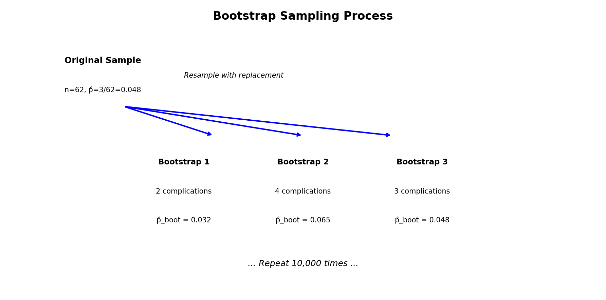
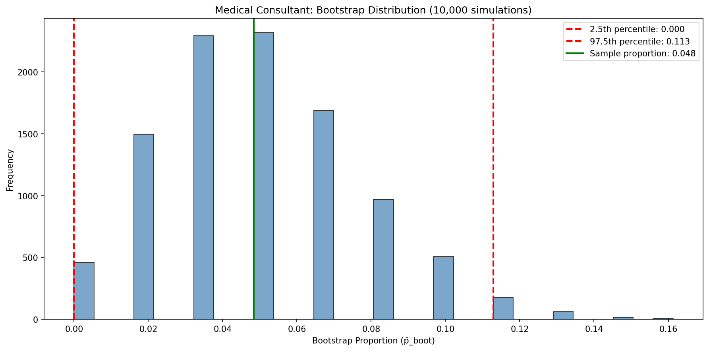
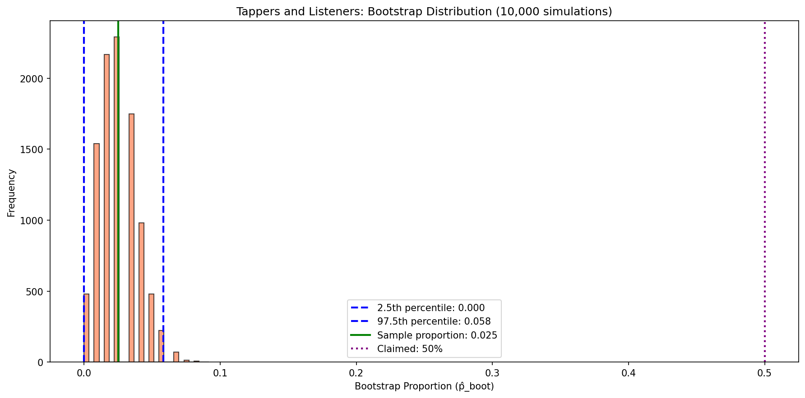
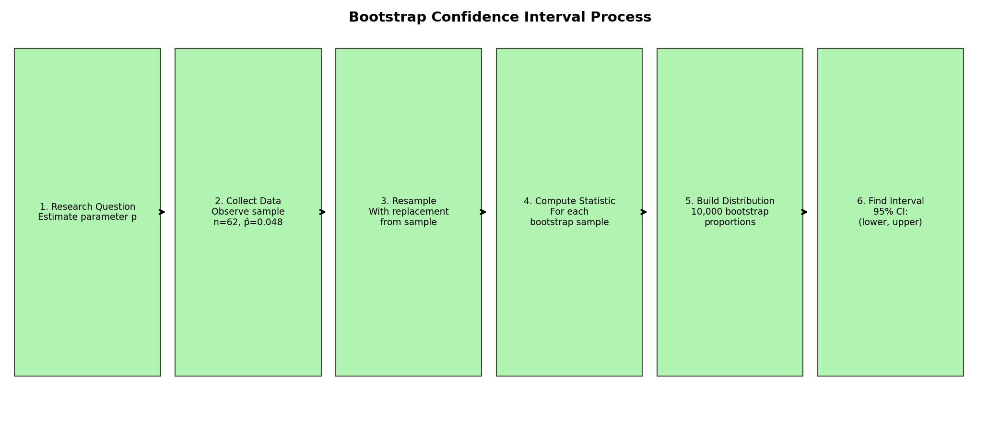

# Chapter 12: 부트스트래핑을 이용한 신뢰구간

이 장에서는 표본 비율을 사용하여 모집단 비율을 추정하는 익숙한 아이디어를 확장한다. 즉, **신뢰구간**(confidence interval)이라고 불리는 것을 만드는데, 이는 참된 모집단 값을 찾을 수 있는 그럴듯한 값의 범위이다. 신뢰구간을 만드는 과정은 많은 다른 표본에서 많은 다른 통계량이 계산될 때 통계량(여기서 표본 비율)이 모수(여기서 모집단 비율) 주위에서 어떻게 *변하는지* 이해하는 것에 기반한다.

가능하다면, 모집단에서 반복적으로 표본 데이터를 취하고 표본 비율을 계산하여 통계량의 변동성을 측정할 것이다. 그런 다음 다시 할 수 있다. 그리고 또 다시. 원래 추정치의 변동성에 대한 좋은 감각을 가질 때까지 계속할 것이다.

표본 간 변동성이 클 때, 원래 통계량이 관심 있는 참된 모집단 모수에서 멀리 떨어져 있을 수 있다고 가정한다(그리고 구간 추정치가 넓을 것이다). 표본 간 변동성이 작을 때, 표본 통계량이 관심 있는 참된 모수에 가까울 것으로 예상한다(그리고 구간 추정치가 좁을 것이다).

표본 데이터가 무료이거나 극히 저렴한 이상적인 세계는 거의 없으며, 모집단에서 반복적으로 표본을 취하는 것은 대개 불가능하다. 따라서 "모집단에서 재표본 추출" 접근법 대신, 부트스트래핑은 "표본에서 재표본 추출" 접근법을 사용한다. 이 장에서 부트스트래핑 과정에 대해 자세히 논의한다.

Chapter 11에서 보았듯이, 무작위화는 표본 비율의 차이가 우연에 의한 것인지 평가하는 데 적합한 통계 기법이다.

**무작위화 검정**은 처치(설명변수)가 관측 단위에 무작위로 할당되고 단순한 예/아니오 연구 질문에 답하려는 시도가 있는 실험을 모델링하는 데 가장 적합하다.

그러나 이 장에서 우리는 모집단 모수를 이해하기 위한 다른 접근법에 관심이 있다. 주장을 검정하는 대신, 이제 목표는 모집단 모수의 알려지지 않은 값을 추정하는 것이다.

예를 들어:
* 백신을 맞으면 말라리아에 걸릴 가능성이 얼마나 줄어드는가?
* 카페인을 먼저 마시면 평균적으로 손가락을 얼마나 빠르게(또는 느리게) 두드릴 수 있는가?
* 후보자 A에게 얼마나 많은 비율의 투표가 갈 것인가?

여기서, 우리는 단일 비율에 초점을 맞추는 상황을 탐구하고, 새로운 시뮬레이션 방법인 **부트스트래핑**(bootstrapping)을 소개한다.

부트스트래핑은 데이터가 모집단에서 무작위 표본 추출을 통해 생성된 연구를 모델링하는 데 가장 적합하다. 무작위화 검정과 마찬가지로, 부트스트래핑의 목표는 통계량의 변동성을 이해하는 것이다. 무작위화 검정과 달리(처치가 다르게 할당되었다면 통계량이 어떻게 변할지 모델링함), 부트스트랩은 모집단에서 취한 한 표본에서 다른 표본으로 통계량이 어떻게 변하는지 모델링할 것이다.

부트스트래핑의 목표는 모집단 모수에 대한 구간 추정치(그럴듯한 값의 범위)를 생성하는 것이다.

---

## 12.1 의료 컨설턴트 사례 연구

장기 기증을 하는 사람들은 때때로 특별한 의료 컨설턴트의 도움을 받는다. 이 컨설턴트들은 의료 절차와 회복 중 합병증 가능성을 줄이는 것을 목표로 수술의 모든 측면에서 환자를 보조한다. 환자들은 부분적으로 컨설턴트 고객의 역사적 합병증 비율에 기반하여 컨설턴트를 선택할 수 있다.

### 12.1.1 관측 데이터

한 컨설턴트는 미국의 간 기증자 수술 평균 합병증 비율이 약 10%이지만, 그녀가 도운 62건의 간 기증자 수술에서 고객들은 단 3건의 합병증만 있었다고 언급하며 환자들을 유치하려 했다. 그녀는 이것이 그녀의 일이 합병증을 줄이는 데 의미 있게 기여한다는 강한 증거라고 주장한다(따라서 고용되어야 한다!).

우리는 이 컨설턴트와 일하는 간 기증자의 참된 합병증 비율을 p로 나타낼 것이다. ("참된" 합병증 비율은 **모수**(parameter)라고 불릴 것이다.) 우리는 데이터를 사용하여 p를 추정하고, 추정치를 p-hat으로 라벨링한다.

합병증 비율의 표본 비율은 3건의 합병증을 컨설턴트가 다룬 62건의 수술로 나눈 것이다: p-hat = 3/62 = 0.048.

### Guided Practice 12.1: 주장 평가 가능성

**문제:** 데이터를 사용하여 컨설턴트의 주장(합병증 감소가 그녀의 일 때문이라는 것)을 평가할 수 있는가?

**풀이:**

아니오. 주장은 인과 관계가 있다는 것이지만, 데이터는 관측적이므로 **교란변수**를 주의해야 한다. 예를 들어, 의료 컨설턴트를 고용할 수 있는 환자는 더 나은 의료 서비스를 받을 수 있고, 이것도 더 낮은 합병증 비율로 이어질 수 있다. 인과적 주장을 평가하는 것은 불가능하지만, 컨설턴트의 참된 합병증 비율을 이해하는 것은 여전히 가능하다.

```python
# 관측 데이터
complications = 3
total_surgeries = 62
p_hat = complications / total_surgeries

print("=== 의료 컨설턴트 사례 연구 ===")
print(f"합병증 수: {complications}")
print(f"총 수술 수: {total_surgeries}")
print(f"표본 비율 (p̂): {p_hat:.4f} ({p_hat*100:.2f}%)")
print(f"미국 평균: 10%")
print(f"\n주의: 관측 연구이므로 인과 관계 주장 불가")
```

### 모수와 통계량

**모수**(parameter)는 관심 있는 "참된" 값이다.

우리는 일반적으로 표본 데이터의 점 추정치를 사용하여 모수를 추정한다. 점 추정치는 **통계량**(statistic)으로도 알려져 있다.

예를 들어, 의료 컨설턴트 고객의 합병증 확률 p를 그녀 고객의 과거 합병증 비율을 조사하여 추정한다:

p-hat = 3/62 = 0.048은 p를 추정하는 데 사용된다

### 새로운 시각: 점 추정치의 한계

점 추정치 p-hat = 0.048은 우리의 "최선의 추측"이지만:

1. **불확실성 미반영**: 단일 숫자는 추정치가 얼마나 정확한지 알려주지 않는다
2. **표본 의존성**: 다른 62명의 환자를 선택했다면 다른 값을 얻었을 것이다
3. **범위 필요**: 참된 모수가 있을 수 있는 값의 범위가 더 유용하다

---

### 12.1.2 통계량의 변동성

의료 컨설턴트 사례 연구에서, 모수는 p, 의료 컨설턴트 고객의 참된 합병증 확률이다. p가 정확히 p-hat = 3/62라고 믿을 이유가 없지만, p가 p-hat = 3/62에서 특별히 멀리 있다고 믿을 이유도 없다. 데이터셋에서 복원 추출하여(부트스트래핑이라는 과정), 가능한 p-hat 값의 변동성을 근사할 수 있다.

이 텍스트에서 다루는 대부분의 추론 절차는 하나의 데이터셋이 둘 다 같은 모집단에서 취해질 때 다른 데이터셋과 어떻게 다를지 정량화하는 것에 기반한다.


그림 12.1은 알려지지 않은 원래 모집단이 성공과 실패의 비율(우리 경우, 의료 컨설턴트의 합병증과 무합병증 비율)을 근사하기 위해 표본을 사용하여 어떻게 추정될 수 있는지 보여준다.

추정된 모집단에서 반복적으로 표본을 추출함으로써, 표본에서 표본으로의 변동성을 관찰할 수 있다. 그림 12.2에서 반복된 부트스트랩 표본은 명백히 서로 다르고 원래 모집단과도 다르다. 부트스트랩 표본이 같은 (추정된) 모집단에서 추출되었으므로, 차이는 전적으로 표본 추출 절차의 자연적 변동성 때문이라는 것을 기억하라.



각 부트스트랩 표본을 요약(여기서 표본 비율을 사용)함으로써, 표본에서 표본으로 표본 비율 p-hat의 변동성을 직접 볼 수 있다.

### 예제 12.1: 부트스트랩 표본의 기대값

**문제:** 62명 환자의 시뮬레이션에서, 합병증이 있는 환자 수의 기대값은 얼마인가?

**상세 풀이:**

시뮬레이션에서 약 4.8%의 환자(평균 3명)가 합병증을 가질 것이다. 이것은 표본에서 관측된 것이기 때문이다. 그러나 한 시뮬레이션에서 다음 시뮬레이션으로 약간의 변동을 볼 것이다.

기대 합병증 수 = 62 × 0.048 ≈ 3

```python
import numpy as np

# 기대값 계산
n = 62
p_hat = 3/62
expected_complications = n * p_hat

print(f"표본 크기: {n}")
print(f"관측된 합병증 비율: {p_hat:.4f}")
print(f"기대 합병증 수: {expected_complications:.1f}")
```

### 새로운 시각: 복원 추출의 원리

**복원 추출**(sampling with replacement)이 부트스트래핑에서 핵심인 이유:

1. **모집단 시뮬레이션**: 원래 표본을 무한히 복제한 것처럼 작동
2. **독립성 유지**: 각 추출이 이전 추출에 영향받지 않음
3. **계산 효율성**: 실제로 무한한 모집단을 만들 필요 없음

실제로, 부트스트랩 표본은 다음과 같이 만들어진다:
- 62개의 원래 관측치가 있는 "가방"에서
- 62번 복원 추출
- 일부 관측치는 여러 번 선택되고, 일부는 선택되지 않을 수 있음

---

하나의 시뮬레이션만으로는 한 부트스트랩 비율에서 다른 부트스트랩 비율로의 변동성 감각을 얻기에 충분하지 않으므로, 컴퓨터를 사용하여 10,000번 시뮬레이션을 반복한다.

그림 12.6은 10,000번의 부트스트랩 시뮬레이션에서 분포를 보여준다. 부트스트랩된 비율은 약 0%에서 11.3%까지 변한다. 부트스트랩된 비율의 변동성은 합병증의 참된 확률(모수, p)이 0%와 11.3% 사이 어딘가에 있을 가능성이 높다고 믿게 한다. 이 숫자들이 부트스트랩 재표본 값의 95%를 포착하기 때문이다.

참된 비율에 대한 값의 범위는 **부트스트랩 백분위수 신뢰구간**(bootstrap percentile confidence interval)이라고 하며, 다음 몇 섹션과 장에서 다시 볼 것이다.



### 예제 12.2: 신뢰구간 해석

**문제:** 원래 주장은 컨설턴트의 참된 합병증 비율이 국가 비율인 10% 미만이라는 것이었다. 합병증의 참된 확률에 대한 0%에서 11.3%의 구간 추정치가 수술 컨설턴트가 국가 평균보다 낮은 합병증 비율을 가지고 있음을 나타내는가?

**상세 풀이:**

아니오. 구간이 10%와 겹치기 때문에, 컨설턴트의 일이 합병증의 더 낮은 위험과 관련될 수도 있고, 또는 컨설턴트의 일이 더 높은 위험(즉, 10% 초과)의 합병증과 관련될 수도 있다!

또한, 이전에 언급했듯이, 이것은 관측 연구이므로, 연관성을 측정할 수 있더라도, 컨설턴트의 일이 합병증 비율(높거나 낮음)의 원인이라는 증거는 없다.

```python
import numpy as np

# 부트스트랩 시뮬레이션
np.random.seed(42)
n_bootstrap = 10000
n = 62
p_hat = 3/62

bootstrap_proportions = []
for _ in range(n_bootstrap):
    # 복원 추출로 62개 샘플링
    sample = np.random.binomial(1, p_hat, n)
    bootstrap_proportions.append(np.mean(sample))

bootstrap_proportions = np.array(bootstrap_proportions)

# 95% 신뢰구간
lower = np.percentile(bootstrap_proportions, 2.5)
upper = np.percentile(bootstrap_proportions, 97.5)

print("=== 의료 컨설턴트: 부트스트랩 신뢰구간 ===")
print(f"부트스트랩 반복 횟수: {n_bootstrap}")
print(f"95% 신뢰구간: ({lower:.3f}, {upper:.3f})")
print(f"                ({lower*100:.1f}%, {upper*100:.1f}%)")
print(f"\n국가 평균(10%)이 구간에 포함됨: {'예' if lower <= 0.10 <= upper else '아니오'}")
print(f"결론: 컨설턴트가 국가 평균보다 낮다는 결정적 증거 없음")
```

---

## 12.2 두드리는 사람과 듣는 사람 사례 연구

친구나 가족과 함께 시도할 수 있는 게임이 있다: 단순하고 잘 알려진 노래를 선택하고, 책상에서 그 곡을 두드리고, 다른 사람이 노래를 맞출 수 있는지 본다. 이 간단한 게임에서, 당신은 두드리는 사람이고, 다른 사람은 듣는 사람이다.

### 12.2.1 관측 데이터

Elizabeth Newton이라는 스탠포드 대학 대학원생이 두드리는 사람-듣는 사람 게임을 사용하여 실험을 수행했다. 그녀의 연구에서, 120명의 두드리는 사람과 120명의 듣는 사람을 모집했다. 약 50%의 두드리는 사람은 듣는 사람이 노래를 맞출 수 있을 것으로 기대했다. Newton은 50%가 합리적인 기대인지 궁금해했다.

Newton의 연구에서, 120명의 듣는 사람 중 단 3명(p-hat = 0.025)만이 곡을 맞출 수 있었다! 그것은 상당히 낮은 숫자로 보이며, 연구자는 질문을 하게 된다: 곡을 맞출 수 있는 사람의 참된 비율은 얼마인가?

### 12.2.2 통계량의 변동성

질문에 답하기 위해, 다시 시뮬레이션을 사용할 것이다. 120게임을 시뮬레이션하기 위해, 이번에는 120개의 구슬 가방을 사용하는데 3개는 빨간색(정확하게 맞춘 사람)이고 117개는 흰색(노래를 맞추지 못한 사람)이다. 가방에서 120번 샘플링(빨간색의 모집단 비율을 일정하게 유지하기 위해 매번 구슬을 다시 가방에 넣는 것을 기억)하면 하나의 부트스트랩 표본이 생성된다.

### 예제 12.3: 두드리는 사람-듣는 사람 부트스트랩

**문제:** 10,000번의 부트스트랩 시뮬레이션에서 p-hat_boot의 95% 범위는 무엇인가?

**상세 풀이:**

그림 12.7에서 보듯이, p-hat_boot의 재표본 값 95%의 범위는 0.000에서 0.0583이다. 즉, 0%에서 5.83%의 사람들이 진정으로 두드리는 사람의 곡을 맞출 수 있을 것으로 기대한다.

```python
import numpy as np

# 두드리는 사람-듣는 사람 부트스트랩
np.random.seed(123)
n_bootstrap = 10000
n = 120
correct = 3
p_hat = correct / n

bootstrap_proportions = []
for _ in range(n_bootstrap):
    sample = np.random.binomial(1, p_hat, n)
    bootstrap_proportions.append(np.mean(sample))

bootstrap_proportions = np.array(bootstrap_proportions)

lower = np.percentile(bootstrap_proportions, 2.5)
upper = np.percentile(bootstrap_proportions, 97.5)

print("=== 두드리는 사람-듣는 사람: 부트스트랩 결과 ===")
print(f"관측된 비율: {p_hat:.4f} ({p_hat*100:.2f}%)")
print(f"95% 신뢰구간: ({lower:.4f}, {upper:.4f})")
print(f"                ({lower*100:.2f}%, {upper*100:.2f}%)")
```



### Guided Practice 12.2: 50% 주장 평가

**문제:** 데이터가 50%의 듣는 사람이 두드리는 사람의 곡을 맞출 수 있다는 주장에 반하는 설득력 있는 증거를 제공하는가?

**풀이:**

50%가 참된 모수의 구간 추정치에 없기 때문에, 50%의 듣는 사람이 곡을 맞출 수 있다는 가설에 반하는 설득력 있는 증거가 있다고 말할 수 있다. 더구나, 50%는 가장 큰 재표본 통계량에서 상당한 거리에 있어, 이 가설에 반하는 **매우** 설득력 있는 증거가 있음을 시사한다.

```python
# 50% 가설 평가
claimed_proportion = 0.50
ci_lower, ci_upper = 0.0, 0.0583

print("=== 50% 주장 평가 ===")
print(f"주장된 비율: {claimed_proportion*100:.0f}%")
print(f"95% 신뢰구간: ({ci_lower*100:.1f}%, {ci_upper*100:.1f}%)")
print(f"\n50%가 구간에 포함됨: {'예' if ci_lower <= claimed_proportion <= ci_upper else '아니오'}")
print(f"\n결론: 50% 주장에 반하는 매우 강한 증거")
print(f"      (50%는 구간에서 매우 멀리 떨어져 있음)")
```

### 새로운 시각: 지식의 저주

이 연구는 **지식의 저주**(curse of knowledge)라는 심리학적 현상을 보여준다:

1. 두드리는 사람은 노래를 알고 있어서 듣는 사람도 쉽게 알아맞출 것으로 생각
2. 그러나 듣는 사람에게는 단지 두드리는 소리일 뿐
3. 두드리는 사람의 50% 예상과 실제 2.5%의 엄청난 차이

이것은 전문가가 초보자의 어려움을 이해하지 못하는 것, 선생님이 학생의 혼란을 이해하지 못하는 것과 같은 많은 상황에서 나타난다.

---

## 12.3 신뢰구간

점 추정치는 모수에 대한 단일 그럴듯한 값을 제공한다. 그러나 점 추정치는 거의 완벽하지 않다; 보통 추정치에 어떤 오차가 있다. 모수의 점 추정치를 제공하는 것 외에, 다음 논리적 단계는 모수에 대한 그럴듯한 *값의 범위*를 제공하는 것이다.

### 12.3.1 모집단 모수에 대한 그럴듯한 값의 범위

모집단 모수에 대한 그럴듯한 값의 범위를 **신뢰구간**(confidence interval)이라고 한다. 단일 점 추정치만 사용하는 것은 흐린 호수에서 창으로 낚시하는 것과 같고, 신뢰구간을 사용하는 것은 그물로 낚시하는 것과 같다. 물고기를 본 곳에 창을 던질 수 있지만, 아마 빗나갈 것이다. 반면에, 그 지역에 그물을 던지면, 물고기를 잡을 좋은 기회가 있다.

점 추정치를 보고하면, 아마 정확한 모집단 모수를 맞추지 못할 것이다. 반면에, 그럴듯한 값의 범위 – 신뢰구간 –를 보고하면, 모수를 포착할 좋은 기회가 있다.

### Guided Practice 12.3: 구간 너비와 신뢰

**문제:** 모집단 모수를 포착할 것을 매우 확신하고 싶다면, 더 넓은 구간(예: 99%)을 사용해야 하는가 아니면 더 좁은 구간(예: 80%)을 사용해야 하는가?

**풀이:**

물고기를 잡을 것을 더 확신하고 싶다면, 더 넓은 그물을 사용할 수 있다. 마찬가지로, 모수를 포착할 것을 더 확신하고 싶다면 **더 넓은 신뢰구간**을 사용한다.

```python
import numpy as np

# 다양한 신뢰 수준의 구간 비교
np.random.seed(42)
n_bootstrap = 10000
data = np.array([1]*3 + [0]*59)  # 3/62 합병증

bootstrap_props = []
for _ in range(n_bootstrap):
    sample = np.random.choice(data, size=len(data), replace=True)
    bootstrap_props.append(np.mean(sample))

bootstrap_props = np.array(bootstrap_props)

print("=== 신뢰 수준에 따른 구간 너비 ===")
for conf_level in [80, 90, 95, 99]:
    alpha = (100 - conf_level) / 2
    lower = np.percentile(bootstrap_props, alpha)
    upper = np.percentile(bootstrap_props, 100 - alpha)
    width = upper - lower
    print(f"{conf_level}% CI: ({lower:.3f}, {upper:.3f}) - 너비: {width:.3f}")
```

### 새로운 시각: 신뢰구간의 트레이드오프

신뢰구간 선택의 트레이드오프:

| 신뢰 수준 | 장점 | 단점 |
|-----------|------|------|
| 낮음 (예: 80%) | 좁고 정밀한 구간 | 모수를 놓칠 확률 높음 |
| 높음 (예: 99%) | 모수 포착 확률 높음 | 넓어서 정보가 적음 |
| 중간 (95%) | 균형 잡힌 선택 | 관례적으로 가장 많이 사용 |

---

### 12.3.2 부트스트랩 신뢰구간

위에서 보았듯이, **부트스트랩 표본**(bootstrap sample)은 원래 표본의 표본이다. 의료 합병증 데이터의 경우, 다음과 같이 진행한다:

* 62명의 환자에서 하나의 관측치를 무작위로 추출한다(모집단을 일정하게 유지하기 위해 구슬을 다시 가방에 넣는다).
* 62명의 환자에서 두 번째 관측치를 무작위로 추출한다. 복원 추출하므로(즉, 실제로 가방에서 구슬을 제거하지 않음), 두 번째 관측치가 첫 번째 단계에서 추출된 것과 같을 확률이 1/62이다!
* 한 번에 하나의 관측치를 추출하며 계속한다...
* 62명의 환자에서 62번째 관측치를 무작위로 추출한다.

부트스트랩 표본 추출은 종종 **복원 추출**(sampling with replacement)이라고 불린다.

### 95% 부트스트랩 백분위수 신뢰구간

모수 p에 대한 95% 부트스트랩 신뢰구간은 정렬된 p-hat_boot 값을 직접 사용하여 얻을 수 있다.

정렬된 p-hat_boot 값을 고려하라. 2.5% 부트스트랩된 비율 값을 "하한"이라 하고, 97.5% 부트스트랩된 비율 값을 "상한"이라 하라.

95% 신뢰구간: (하한, 상한)

### 예제 12.4: 부트스트랩 신뢰구간 계산

**문제:** 의료 컨설턴트 데이터에 대한 95% 부트스트랩 백분위수 신뢰구간을 계산하라.

**상세 풀이:**

```python
import numpy as np

# 부트스트랩 신뢰구간 계산
np.random.seed(42)
n_bootstrap = 10000
n = 62
complications = 3
p_hat = complications / n

# 원본 데이터 생성 (1 = 합병증, 0 = 합병증 없음)
original_data = np.array([1]*complications + [0]*(n-complications))

# 부트스트랩 표본 추출
bootstrap_proportions = []
for _ in range(n_bootstrap):
    # 복원 추출로 n개 샘플링
    bootstrap_sample = np.random.choice(original_data, size=n, replace=True)
    bootstrap_proportions.append(np.mean(bootstrap_sample))

bootstrap_proportions = np.array(bootstrap_proportions)

# 95% 신뢰구간 (2.5번째와 97.5번째 백분위수)
ci_lower = np.percentile(bootstrap_proportions, 2.5)
ci_upper = np.percentile(bootstrap_proportions, 97.5)

print("=== 95% 부트스트랩 백분위수 신뢰구간 ===")
print(f"표본 비율 (p̂): {p_hat:.4f}")
print(f"부트스트랩 반복: {n_bootstrap}")
print(f"\n2.5번째 백분위수 (하한): {ci_lower:.4f}")
print(f"97.5번째 백분위수 (상한): {ci_upper:.4f}")
print(f"\n95% 신뢰구간: ({ci_lower:.3f}, {ci_upper:.3f})")
print(f"해석: 참된 합병증 비율이 {ci_lower*100:.1f}%와 {ci_upper*100:.1f}% 사이에")
print(f"      있다고 95% 신뢰한다.")
```

---

## 12.4 장 요약

### 12.4.1 요약



부트스트랩 과정을 다음과 같이 요약할 수 있다:

* **추정할 모수의 관점에서 연구 질문을 프레이밍한다.** 신뢰구간은 모집단에서 숫자(모수라고 함)를 추정하려는 연구 질문에 적합하다.

* **관측 연구 또는 실험으로 데이터를 수집한다.** 연구 질문이 모수에 대한 쿼리로 형성될 수 있다면, 모수 값에 대한 최선의 추측인 통계량을 계산하기 위해 데이터를 수집할 수 있다. 그러나 자연적 변동성으로 인해 통계량이 정확히 모수와 같지 않을 것임을 안다.

* **데이터 값을 모집단의 대리로 사용하여 무작위성을 모델링한다.** 통계량이 모수에서 얼마나 떨어져 있을 수 있는지 평가하기 위해, 데이터셋에서 반복적으로 재표본을 추출하여 부트스트랩된 통계량의 변동성을 측정한다.

* **구간을 만든다.** 특정 신뢰 수준을 선택한 후, 부트스트랩된 통계량의 변동성을 사용하여 참된 모수를 포착하기를 희망하는 구간 추정치를 만든다.

* **결론을 형성한다.** 분석의 신뢰구간을 사용하여, 관심 모수에 대한 구간 추정치를 보고한다.

### 12.4.2 용어

**표 12.2: 이 장에서 소개된 용어**

| 한글 | 영문 |
|------|------|
| **부트스트랩 백분위수 신뢰구간** | bootstrap percentile confidence interval |
| **부트스트랩 표본** | bootstrap sample |
| **부트스트래핑** | bootstrapping |
| **신뢰구간** | confidence interval |
| **모수** | parameter |
| **점 추정치** | point estimate |
| **복원 추출** | sampling with replacement |
| **통계량** | statistic |

---

## 12.5 연습문제

### 연습문제 12.1: 야외 YouTube 동영상

**문제:** YouTube 동영상 중 야외에서 촬영된(동영상의 일부라도 야외에서 촬영된 경우 "야외"로 정의) 비율을 추정하고 싶다. 128개의 YouTube 동영상을 무작위로 추출하고 그 중 37개가 야외에서 촬영되었다고 결정한다. 모든 YouTube 동영상 중 야외에서 촬영된 비율을 추정하려고 하므로, 128개 동영상의 원래 표본에서 부트스트랩 구간을 만들기로 결정한다.

(a) 이 문제에 대한 관련 통계량과 모수를 말로 설명하라. 둘 중 하나의 수치 값을 알고 있다면 제공하라. 수치 값을 모른다면 값을 알 수 없는 이유를 설명하라.

(b) 각각 통계량과 모수를 설명하는 데 어떤 표기법이 사용되는가?

(c) 소프트웨어를 사용하여 원래 데이터셋을 부트스트랩할 때, 각 부트스트랩 표본에서 계산되는 통계량은 무엇인가?

(d) 부트스트랩된 표본 비율의 부트스트랩 표본 분포(히스토그램)를 만들 때, 히스토그램의 중심은 어디에 있어야 하는가?

(e) 히스토그램은 표본 비율에 대한 부트스트랩 표본 분포(1000번의 부트스트랩 반복)를 제공한다. 히스토그램을 사용하여, 야외에서 촬영된 YouTube 동영상 비율에 대한 90% 신뢰구간을 추정하라.

(f) 데이터의 맥락에서 신뢰구간을 해석하라.

**상세 풀이:**

**(a) 통계량과 모수**

**통계량**: 표본에서 야외 동영상의 비율
- 값: p-hat = 37/128 = 0.289 (28.9%)

**모수**: 모든 YouTube 동영상 중 야외 동영상의 참된 비율
- 값: 알 수 없음 (모든 YouTube 동영상을 조사할 수 없기 때문)

**(b) 표기법**
- 통계량: p-hat (표본 비율)
- 모수: p (모집단 비율)

**(c) 각 부트스트랩 표본에서 계산되는 통계량**
각 부트스트랩 표본에서 야외 동영상의 비율 (p-hat_boot)

**(d) 히스토그램 중심 위치**
히스토그램의 중심은 원래 표본 비율 p-hat = 0.289 (28.9%) 주위에 있어야 한다.

**(e) 90% 신뢰구간 추정**

```python
import numpy as np

np.random.seed(42)
n = 128
outdoor = 37
p_hat = outdoor / n

# 부트스트랩
bootstrap_props = []
original_data = np.array([1]*outdoor + [0]*(n-outdoor))

for _ in range(1000):
    sample = np.random.choice(original_data, size=n, replace=True)
    bootstrap_props.append(np.mean(sample))

bootstrap_props = np.array(bootstrap_props)

# 90% 신뢰구간 (5번째와 95번째 백분위수)
ci_lower = np.percentile(bootstrap_props, 5)
ci_upper = np.percentile(bootstrap_props, 95)

print("=== 연습문제 12.1: YouTube 동영상 ===")
print(f"표본 비율: {p_hat:.3f}")
print(f"90% 신뢰구간: ({ci_lower:.3f}, {ci_upper:.3f})")
print(f"              ({ci_lower*100:.1f}%, {ci_upper*100:.1f}%)")
```

히스토그램에서 90% 신뢰구간은 약 (0.22, 0.36) 또는 22%에서 36%이다.

**(f) 신뢰구간 해석**
"야외에서 촬영된 YouTube 동영상의 참된 비율이 22%와 36% 사이에 있다고 90% 신뢰한다."

---

### 연습문제 12.3: 소셜 미디어 사용자와 뉴스

**문제:** 2022년에 실시된 설문조사에서 미국 성인의 50%가 소셜 미디어에서 가끔 또는 자주 뉴스를 얻는다고 밝혔다. 그러나 이 값은 표본에 기반했으므로, 그 자체로 관심 있는 모집단 모수에 대한 완벽한 추정치가 아닐 수 있다. 연구는 12,147명의 성인 표본에 기반했다. 아래는 Pew 데이터셋에서 1,000개의 부트스트랩된 표본 비율의 분포이다.

1,000개의 부트스트랩된 비율의 분포를 사용하여, 소셜 미디어에서 뉴스를 얻는 미국 성인 소셜 미디어 사용자(2022년)의 참된 비율에 대한 98% 신뢰구간을 근사하라. 문제의 맥락에서 구간을 해석하라.

**상세 풀이:**

```python
import numpy as np

np.random.seed(42)
n = 12147
p_hat = 0.50

# 부트스트랩 시뮬레이션
bootstrap_props = []
for _ in range(1000):
    sample = np.random.binomial(1, p_hat, n)
    bootstrap_props.append(np.mean(sample))

bootstrap_props = np.array(bootstrap_props)

# 98% 신뢰구간 (1번째와 99번째 백분위수)
ci_lower = np.percentile(bootstrap_props, 1)
ci_upper = np.percentile(bootstrap_props, 99)

print("=== 연습문제 12.3: 소셜 미디어와 뉴스 ===")
print(f"표본 크기: {n}")
print(f"표본 비율: {p_hat}")
print(f"98% 신뢰구간: ({ci_lower:.3f}, {ci_upper:.3f})")
print(f"              ({ci_lower*100:.1f}%, {ci_upper*100:.1f}%)")
```

**98% 신뢰구간**: 약 (0.488, 0.512) 또는 48.8%에서 51.2%

**해석**: "2022년에 소셜 미디어에서 뉴스를 얻는 미국 성인 소셜 미디어 사용자의 참된 비율이 48.8%와 51.2% 사이에 있다고 98% 신뢰한다."

참고: 표본 크기가 매우 크므로(n = 12,147), 신뢰구간이 매우 좁다. 이는 큰 표본이 더 정밀한 추정치를 제공한다는 것을 보여준다.

---

### 연습문제 12.5: p-hat의 부트스트랩 분포, II

**문제:** 다음 네 분포 각각은 다른 데이터셋을 사용하여 만들어졌다. 각 데이터셋은 n=23 관측치에 기반했다. 데이터셋 A, B, C, D는 1000번 부트스트랩되었다.

참된 모집단 p(성공의 비율) 값 각각에 대해, 그 모집단에서 그럴듯하게 나올 수 있는 데이터셋을 나열하라. (힌트: 각 모수 값에 대해 하나 이상의 데이터셋이 있을 수 있다.)

(a) p = 0.05
(b) p = 0.25
(c) p = 0.45
(d) p = 0.55
(e) p = 0.75

**상세 풀이:**

부트스트랩 분포의 중심이 관측된 표본 비율 p-hat 주위에 있다는 것을 기억하라. 모수 p가 신뢰구간에 포함되면, 그 데이터셋이 해당 모집단에서 나올 수 있다.

```python
# 부트스트랩 분포 분석
# 각 분포의 대략적인 95% 범위 추정

print("=== 연습문제 12.5: 부트스트랩 분포 매칭 ===")
print("\n각 모수 값에 대해 가능한 데이터셋:")

# 가상의 분포 중심과 범위 (히스토그램에서 읽음)
# 실제로는 주어진 히스토그램을 보고 판단해야 함

results = {
    "p = 0.05": "A (중심이 0.05 근처이고 0.05를 포함하는 분포)",
    "p = 0.25": "B 또는 C (중심이 0.25 근처이거나 구간이 0.25를 포함)",
    "p = 0.45": "C 또는 D (중심이 0.45 근처이거나 구간이 0.45를 포함)",
    "p = 0.55": "C 또는 D (중심이 0.55 근처이거나 구간이 0.55를 포함)",
    "p = 0.75": "D (중심이 0.75 근처이고 0.75를 포함하는 분포)"
}

for param, datasets in results.items():
    print(f"{param}: {datasets}")

print("\n참고: 실제 답은 주어진 히스토그램의")
print("      중심과 퍼짐을 관찰하여 결정해야 함")
```

**(a) p = 0.05**: 분포 A (중심이 매우 낮은 값에 있고 0.05를 포함)

**(b) p = 0.25**: 분포 B (중심이 약 0.25 근처)

**(c) p = 0.45**: 분포 C (중심이 약 0.45 근처) 또는 분포 D (구간이 0.45를 포함하면)

**(d) p = 0.55**: 분포 C 또는 D (구간이 0.55를 포함하면)

**(e) p = 0.75**: 분포 D (중심이 높은 값에 있고 0.75를 포함)

---

### 연습문제 12.7: 사이버 괴롭힘 비율

**문제:** 10대들이 사이버 괴롭힘에 대해 설문조사를 받았고, 54%에서 64%가 사이버 괴롭힘을 경험했다고 보고했다(95% 신뢰구간). 이 구간에 기반하여 다음 질문에 답하라.

(a) 한 신문은 대다수의 10대가 사이버 괴롭힘을 경험했다고 주장한다. 이 주장이 신뢰구간에 의해 뒷받침되는가? 추론을 설명하라.

(b) 한 연구자는 10대의 70%가 사이버 괴롭힘을 경험했다고 추측했다. 이 주장이 신뢰구간에 의해 뒷받침되는가? 추론을 설명하라.

(c) 실제로 구간을 계산하지 않고, (b)의 연구자 주장이 90% 신뢰구간에 기반하여 뒷받침될지 결정하라.

**상세 풀이:**

**(a) "대다수" 주장 평가**

"대다수"는 50% 초과를 의미한다.

95% 신뢰구간: (54%, 64%)

전체 구간이 50%보다 크므로, **예, 이 주장은 뒷받침된다**.

구간의 하한(54%)조차 50%를 초과하므로, 대다수의 10대가 사이버 괴롭힘을 경험했다는 강한 증거가 있다.

**(b) 70% 주장 평가**

연구자 주장: 70%

95% 신뢰구간: (54%, 64%)

70%는 구간에 포함되지 않으므로, **아니오, 이 주장은 뒷받침되지 않는다**.

구간의 상한(64%)도 70%에 미치지 못하므로, 데이터는 70%라는 주장과 일치하지 않는다.

**(c) 90% 신뢰구간에서의 평가**

90% 신뢰구간은 95% 신뢰구간보다 **좁다**.

95% 구간이 (54%, 64%)이므로, 90% 구간은 이보다 좁아 대략 (55%, 63%) 정도일 것이다.

70%는 여전히 구간 밖에 있으므로, **아니오, 90% 신뢰구간에서도 70% 주장은 뒷받침되지 않는다**.

```python
print("=== 연습문제 12.7: 사이버 괴롭힘 ===")
print("\n95% 신뢰구간: (54%, 64%)")

print("\n(a) '대다수'(>50%) 주장:")
print("    구간 전체가 50% 초과 → 주장 뒷받침됨")

print("\n(b) 70% 주장:")
print("    70%는 구간 (54%, 64%) 밖 → 주장 뒷받침 안 됨")

print("\n(c) 90% 신뢰구간에서:")
print("    90% CI는 95% CI보다 좁음")
print("    70%는 여전히 구간 밖 → 주장 뒷받침 안 됨")
```

---

이상으로 Chapter 12 연습문제의 홀수 번호 문제 풀이를 완료한다.
