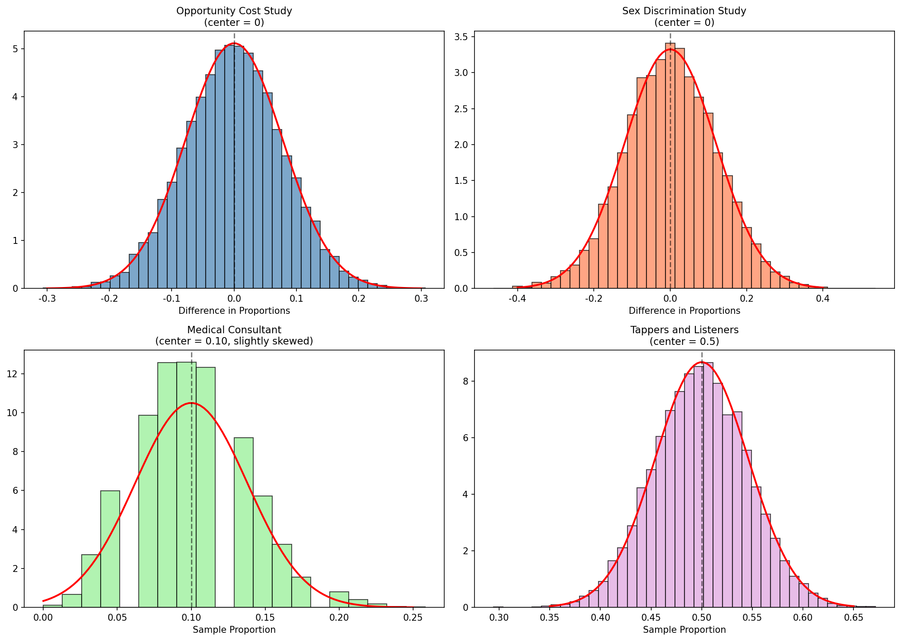
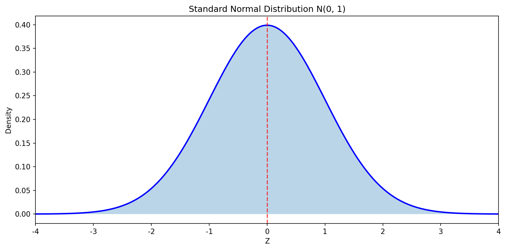
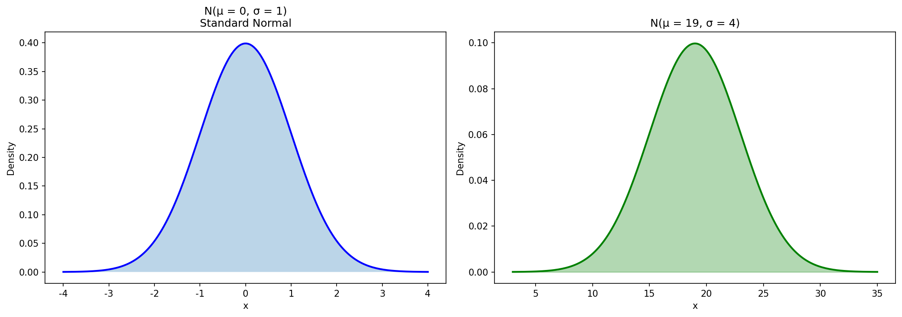
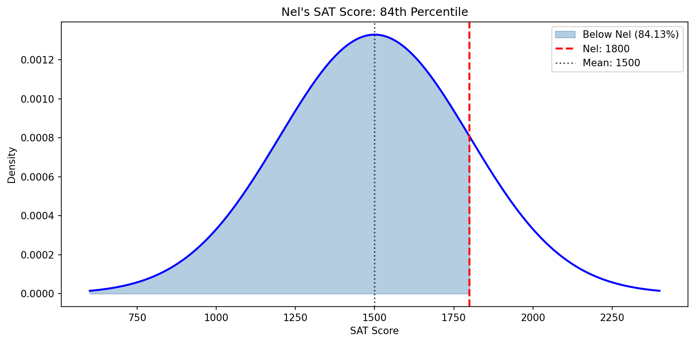
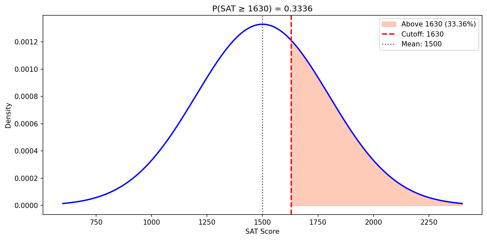
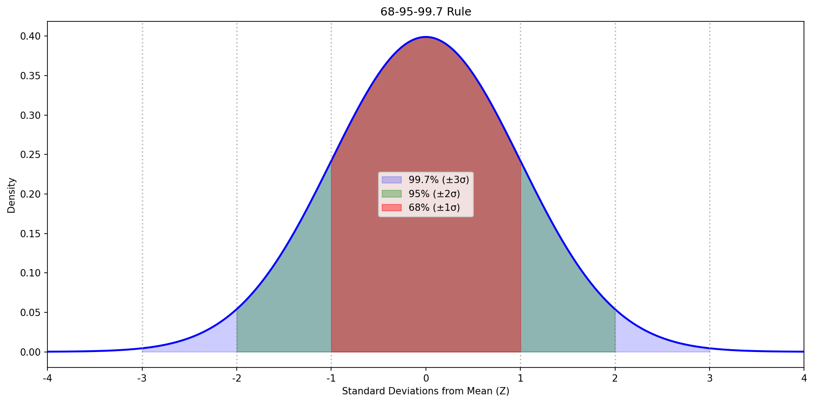
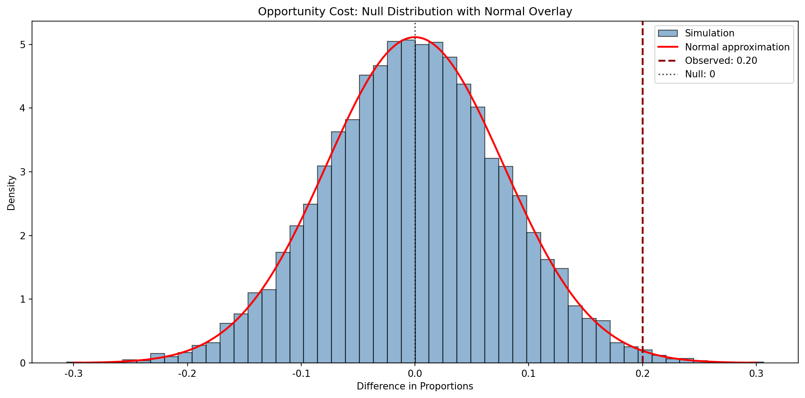
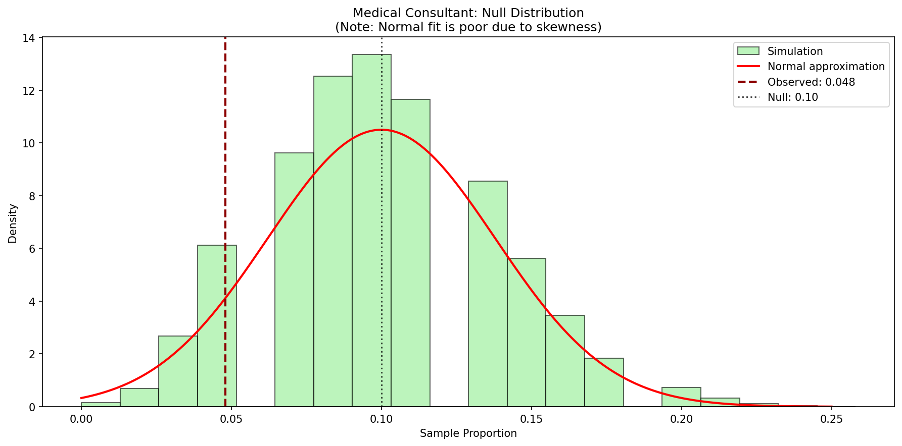

# Chapter 13: 수학적 모델을 이용한 추론

Chapter 11과 Chapter 12에서 모집단 모수에 대한 질문은 계산적 기법을 사용하여 다루어졌다. 무작위화 검정에서는 귀무가설을 가정하여 데이터가 순열되었다. 부트스트래핑에서는 변동성을 측정하기 위해 데이터가 재표본 추출되었다. 많은 경우(실제로 표본 비율의 경우), 통계량의 변동성은 계산적 방법(이전 장에서처럼) 또는 수학 공식(이 장에서처럼)으로 설명할 수 있다.

**정규분포**(normal distribution)는 반복 표본 또는 반복 실험에서 취한 표본 비율과 관련된 변동성을 설명하기 위해 여기서 제시된다. 정규분포는 많은 다른 통계량의 변동성을 설명한다는 점에서 상당히 강력하며, 이 책의 나머지 부분 전체에서 정규분포를 만나게 될 것이다.

---

## 13.1 중심극한정리

최근 장들에서, 우리는 네 가지 사례 연구를 만났다. 설정, 결과, 데이터 분석에 사용한 기법은 다르지만, 모두 공통점이 있다: 통계량 분포(**표본분포**(sampling distribution)라고 불림)의 일반적인 형태이다.

### 표본분포

**표본분포**(sampling distribution)는 주어진 모집단에서 주어진 표본 크기의 표본들로부터 나온 *표본 통계량*의 모든 가능한 값의 분포이다. 표본분포를 표본 통계량(예: 표본 비율 p-hat 또는 표본 평균 x-bar)이 한 연구에서 다른 연구로 어떻게 변하는지 설명하는 것으로 생각할 수 있다.



### Guided Practice 13.1: 분포의 형태 설명

**문제:** 분포의 형태를 설명하고 흥미로운 점을 언급하라.

**풀이:**

일반적으로, 분포는 상당히 대칭적이다. 의료 컨설턴트 사례 연구만 명백한 비대칭성(오른쪽으로 치우침)이 있는 유일한 분포이다. 모두 종 모양 곡선을 닮았다.

```python
print("=== 귀무 분포의 특성 ===")
print("1. 기회비용 연구: 대칭, 종 모양, 중심 = 0")
print("2. 성별 차별 연구: 대칭, 종 모양, 중심 = 0")
print("3. 의료 컨설턴트: 약간 오른쪽 치우침, 중심 = 0.1")
print("4. 두드리는 사람-듣는 사람: 대칭, 종 모양, 중심 = 0.5")
```

### 새로운 시각: 왜 모든 분포가 비슷한 모양인가?

종 모양 곡선의 유사성은 우연이 아니라, 수학적 이론에 의해 보장된다. 이것이 바로 **중심극한정리**(Central Limit Theorem)의 핵심이다.

---

### 비율에 대한 중심극한정리

**비율에 대한 중심극한정리**(Central Limit Theorem for proportions):

비율(또는 비율의 차이)을 보고 시나리오가 특정 조건을 만족하면, 표본 비율(또는 비율의 차이)은 *정규분포*라는 종 모양 곡선을 따르는 것처럼 보일 것이다.



조건:
1. 표본의 관측치가 **독립적**(independent)이다
2. 표본이 **충분히 크다**: 비율의 경우, 적어도 10개의 기대 성공과 10개의 기대 실패

---

## 13.2 정규분포

통계학에서 보는 모든 분포 중에서, 하나가 압도적으로 가장 일반적이다. 대칭적이고 단봉인 종 곡선은 통계학 전체에서 편재한다. **정규 곡선**(normal curve), **정규 모델**(normal model), 또는 **정규분포**(normal distribution)라고 불린다.

### 13.2.1 정규분포 모델

정규분포는 항상 대칭적이고, 단봉이며, 종 모양 곡선을 설명한다. 정규 모델은 두 가지 **모수**(parameter)를 사용하여 조정할 수 있다: 평균과 표준편차.

정규분포가 평균 μ와 표준편차 σ를 가지면, 분포를 N(μ, σ)로 쓸 수 있다.



### Guided Practice 13.2: 정규분포 표기

**문제:** 다음 모수를 가진 정규분포의 약식을 적어라.

**풀이:**

```python
print("1. 평균 5, 표준편차 3: N(μ = 5, σ = 3)")
print("2. 평균 -100, 표준편차 10: N(μ = -100, σ = 10)")
print("3. 평균 2, 표준편차 9: N(μ = 2, σ = 9)")
```

### 새로운 시각: 정규분포의 역사

정규분포는 **가우스 분포**(Gaussian distribution)라고도 불리는데, 그 수학적 표현을 처음으로 공식화한 프레드릭 가우스의 이름을 따서 명명되었다.

---

### 13.2.2 Z 점수를 이용한 표준화

**Z 점수**(Z score)는 관측값이 평균에서 몇 표준편차 위 또는 아래에 있는지를 나타낸다:

$$Z = \frac{x - \mu}{\sigma}$$

### 예제 13.1: SAT와 ACT 점수 비교

**문제:** SAT 점수는 평균 1500점, 표준편차 300점을 따른다. ACT 점수는 평균 21점, 표준편차 5점을 따른다. Nel이 SAT에서 1800점을, Sian이 ACT에서 24점을 받았다. 누가 더 잘했는가?

**상세 풀이:**

```python
# Nel의 SAT Z 점수
mu_sat, sigma_sat = 1500, 300
x_nel = 1800
z_nel = (x_nel - mu_sat) / sigma_sat

# Sian의 ACT Z 점수
mu_act, sigma_act = 21, 5
x_sian = 24
z_sian = (x_sian - mu_act) / sigma_act

print("=== SAT vs ACT 비교 ===")
print(f"Nel의 SAT: {x_nel}점")
print(f"  Z = ({x_nel} - {mu_sat}) / {sigma_sat} = {z_nel:.2f}")
print(f"\nSian의 ACT: {x_sian}점")
print(f"  Z = ({x_sian} - {mu_act}) / {sigma_act} = {z_sian:.2f}")
print(f"\n결론: Nel의 Z 점수({z_nel})가 Sian의 Z 점수({z_sian})보다 높으므로")
print(f"      Nel이 상대적으로 더 잘함")
```

### Guided Practice 13.3: 붓꼬리주머니쥐 머리 길이

**문제:** 붓꼬리주머니쥐의 머리 길이는 평균 92.6mm, 표준편차 3.6mm의 거의 정규분포를 따른다. 머리 길이가 95.4mm와 85.8mm인 주머니쥐의 Z 점수를 계산하라.

**풀이:**

```python
mu, sigma = 92.6, 3.6

x1 = 95.4
z1 = (x1 - mu) / sigma

x2 = 85.8
z2 = (x2 - mu) / sigma

print(f"x1 = {x1}mm: Z1 = {z1:.2f} (평균보다 위)")
print(f"x2 = {x2}mm: Z2 = {z2:.2f} (평균보다 아래)")
print(f"더 이례적인 관측값: x2 (|Z2| = {abs(z2):.2f} > |Z1| = {abs(z1):.2f})")
```

### 새로운 시각: Z 점수의 실용적 의미

- |Z| < 1: 평균에 가까움 (일반적)
- |Z| ≈ 2: 상당히 드묾 (약 5%만 이보다 더 극단적)
- |Z| ≈ 3: 매우 드묾 (약 0.3%만)
- |Z| > 4: 극히 드묾 (약 30,000분의 1)

---

### 13.2.3 정규 확률 계산

### 예제 13.2: Nel의 백분위수

**문제:** Nel이 SAT에서 1800점(Z=1)을 받았다. 몇 번째 **백분위수**(percentile)에 해당하는가?

**상세 풀이:**

백분위수는 Nel보다 낮은 SAT 점수를 받은 사람들의 백분율이다.

```python
from scipy import stats

z_nel = 1.0
percentile = stats.norm.cdf(z_nel)

print(f"Nel의 Z 점수: {z_nel}")
print(f"백분위수: {percentile:.4f}")
print(f"해석: Nel은 {percentile*100:.2f}번째 백분위수")
```

Nel은 SAT 응시자의 84번째 백분위수에 있다.



### 13.2.4 정규 확률 예제

### 예제 13.3: Shannon의 SAT 확률

**문제:** SAT 점수가 N(μ=1500, σ=300)을 따른다. Shannon이 적어도 1630점을 받을 확률은?

**상세 풀이:**

```python
from scipy import stats

mu, sigma = 1500, 300
x = 1630

# Z 점수 계산
z = (x - mu) / sigma

# P(X >= 1630) = 1 - P(X < 1630)
prob_above = 1 - stats.norm.cdf(z)

print(f"=== Shannon의 SAT 확률 ===")
print(f"컷오프: x = {x}")
print(f"Z 점수: ({x} - {mu}) / {sigma} = {z:.2f}")
print(f"P(Z >= {z:.2f}) = {prob_above:.4f} ({prob_above*100:.2f}%)")
```

Shannon이 SAT에서 적어도 1630점을 받을 확률은 **0.3336** (33.36%)이다.



### 예제 13.4: Edward의 백분위수

**문제:** Edward가 SAT에서 1400점을 받았다. 백분위수는?

**상세 풀이:**

```python
from scipy import stats

x = 1400
mu, sigma = 1500, 300
z = (x - mu) / sigma

percentile = stats.norm.cdf(z)

print(f"Edward의 점수: {x}")
print(f"Z 점수: {z:.2f}")
print(f"백분위수: {percentile:.4f} ({percentile*100:.2f}번째)")
```

Edward는 37번째 백분위수에 있다.

### 예제 13.5: Yousef의 키

**문제:** 미국 성인 남성의 키는 평균 70.0인치, 표준편차 3.3인치의 정규분포를 따른다. Yousef의 키가 40번째 백분위수에 있다. 키가 얼마인가?

**상세 풀이:**

```python
from scipy import stats

# 40번째 백분위수의 Z 점수
z = stats.norm.ppf(0.40)
print(f"40번째 백분위수의 Z 점수: {z:.3f}")

# 키 계산
mu, sigma = 70.0, 3.3
height = mu + z * sigma
print(f"Yousef의 키: {height:.1f} 인치 (약 5'9\")")
```

---

## 13.3 통계량의 변동성 정량화

### 13.3.1 68-95-99.7 규칙

정규분포에서 평균의 1, 2, 3 표준편차 내에 있을 확률에 대한 유용한 규칙이다.



### Guided Practice 13.4: 68-95-99.7 규칙 확인

**문제:** 정규분포에서 평균의 1, 2, 3 표준편차 내에 각각 약 68%, 95%, 99.7%의 관측치가 있음을 확인하라.

**풀이:**

```python
from scipy import stats

for k in [1, 2, 3]:
    prob = stats.norm.cdf(k) - stats.norm.cdf(-k)
    print(f"평균 ± {k}σ 내의 확률: {prob:.4f} ({prob*100:.2f}%)")
```

### 새로운 시각: 68-95-99.7 규칙의 실용적 응용

이 규칙은 품질 관리, 공정 모니터링 등 다양한 분야에서 사용된다:
- **1σ 규칙**: 일상적인 변동
- **2σ 규칙**: 주의가 필요한 수준
- **3σ 규칙**: 심각한 이상 신호

### 13.3.2 표준오차

**표준오차**(standard error, SE)는 통계량과 관련된 표준편차이다. 점 추정치가 표본마다 얼마나 다른지를 정량화한다.

### 13.3.3 오차한계

**오차한계**(margin of error)는 관측치가 평균에서 얼마나 떨어져 있는지 설명한다.

$$\text{오차한계} = z^* \times SE$$

가장 일반적인 $z^*$ 값은 1.96으로, 95% 신뢰와 관련된다.

---

## 13.4 사례 연구 (검정): 기회비용

### 13.4.1 관측 데이터

Section 11.2의 기회비용 연구를 정규분포 맥락에서 다시 분석해 보자.

### 13.4.2 통계량의 변동성

귀무 분포에 가장 잘 맞는 정규분포는 평균이 0이다. 표준오차는 SE = 0.078이다.



### 13.4.3 관측 통계량 vs 귀무 통계량

### 예제 13.6: 기회비용 연구의 p-value

**문제:** 관측된 차이 0.20과 SE = 0.078을 사용하여 p-value를 계산하라.

**상세 풀이:**

```python
from scipy import stats

observed_diff = 0.20
se = 0.078
null_value = 0

z = (observed_diff - null_value) / se
p_value = 1 - stats.norm.cdf(z)

print(f"=== 기회비용 연구: 정규 모델 접근 ===")
print(f"관측된 차이: {observed_diff}")
print(f"표준오차: {se}")
print(f"Z 점수: {z:.2f}")
print(f"p-value (오른쪽 꼬리): {p_value:.4f}")
print(f"\n결론: p-value({p_value:.4f}) < 0.05이므로")
print(f"      처치가 학생들의 지출에 영향을 미쳤다는 증거")
```

### 가설 검정에서의 Z 점수

$$Z = \frac{\text{점 추정치} - \text{귀무값}}{SE}$$

### 새로운 시각: 무작위화와 수학적 모델의 연결

기회비용 연구에서:
- 무작위화 접근법: p-value ≈ 0.006
- 정규 모델 접근법: p-value ≈ 0.0052

두 방법이 거의 동일한 결과를 제공하는 이유는 중심극한정리 때문이다.

---

## 13.5 사례 연구 (검정): 의료 컨설턴트

### 13.5.1 관측 데이터

62명의 고객 중 3명만 합병증(p-hat = 0.048)이 있었고, 일반적인 비율은 0.10이다.

### 13.5.2-13.5.3 통계량의 변동성과 비교



```python
from scipy import stats

p_hat = 0.048
p_0 = 0.10
se = 0.038

z = (p_hat - p_0) / se
p_value = stats.norm.cdf(z)

print(f"=== 의료 컨설턴트: 정규 모델 접근 ===")
print(f"관측된 비율: {p_hat}")
print(f"귀무 비율: {p_0}")
print(f"Z 점수: {z:.2f}")
print(f"p-value: {p_value:.4f}")
```

**문제점**: 정규 모델 p-value(0.0853)가 시뮬레이션 p-value(0.1222)와 상당히 다르다.

### 13.5.4 정규 모델 적용 조건

**문제의 원인**: 
- n = 62로 작음
- 기대 성공 = 62 × 0.10 = 6.2 (10보다 작음!)

### 새로운 시각: 조건 확인의 중요성

통계 기법은 목수의 도구와 같다. 책임감 있게 사용하면 좋은 결과를 얻지만, 부적절한 조건에서 적용하면 신뢰할 수 없는 결과가 나온다.

---

## 13.6 사례 연구 (구간): 스텐트

### 95% 신뢰구간 구축

$$\text{점 추정치} \pm 1.96 \times SE$$

### 예제 13.7: 기회비용 연구의 신뢰구간

**문제:** 점 추정치 0.20, SE = 0.078에 대한 95% 신뢰구간을 구축하라.

**상세 풀이:**

```python
point_estimate = 0.20
se = 0.078
z_star = 1.96

margin_of_error = z_star * se
ci_lower = point_estimate - margin_of_error
ci_upper = point_estimate + margin_of_error

print(f"=== 기회비용 연구: 95% 신뢰구간 ===")
print(f"점 추정치: {point_estimate}")
print(f"오차한계: {z_star} × {se} = {margin_of_error:.3f}")
print(f"95% CI: ({ci_lower:.3f}, {ci_upper:.3f})")
```

95% CI: (0.047, 0.353)

### 13.6.1 관측 데이터: 스텐트 연구

**표 13.1: 스텐트 연구의 30일 결과**

| 그룹 | 사건 없음 | 뇌졸중 | 합계 |
|------|----------|--------|------|
| 통제 | 214 | 13 | 227 |
| 처치 | 191 | 33 | 224 |
| 합계 | 405 | 46 | 451 |

점 추정치: p_trmt - p_ctrl = 0.090

### 예제 13.8: 스텐트 연구의 신뢰구간

**문제:** 점 추정치 0.090, SE = 0.028에 대한 95% 신뢰구간을 구축하라.

**상세 풀이:**

```python
point_estimate = 0.090
se = 0.028
z_star = 1.96

margin_of_error = z_star * se
ci_lower = point_estimate - margin_of_error
ci_upper = point_estimate + margin_of_error

print(f"=== 스텐트 연구: 95% 신뢰구간 ===")
print(f"점 추정치: {point_estimate}")
print(f"95% CI: ({ci_lower:.3f}, {ci_upper:.3f})")
print(f"\n해석: 스텐트가 30일 내 뇌졸중 위험을")
print(f"      3.5%에서 14.5% 증가시킨다고 95% 신뢰")
```

95% CI: (0.035, 0.145)

구간이 0을 포함하지 않으므로, 스텐트가 뇌졸중 위험을 변화시켰다는 증거가 있다.


### 13.6.3 신뢰구간 해석

**올바른 해석**: 모집단 모수가 하한과 상한 사이에 있다고 XX% 신뢰한다.

### 새로운 시각: 신뢰구간과 가설 검정의 관계

- 95% CI가 0을 포함하지 않음 ↔ α = 0.05에서 귀무가설 기각
- 두 방법은 같은 결론에 도달

---

## 13.7 장 요약

### 13.7.1 요약

1. **연구 질문을 프레이밍한다**
2. **데이터를 수집한다**
3. **통계량의 무작위성을 모델링한다** (중심극한정리)
4. **통계량의 변동성을 계산한다** (표준오차)
5. **정규분포로 변동성을 정량화한다**
6. **결론을 형성한다**

### 13.7.2 용어

| 한글 | 영문 |
|------|------|
| **95% 신뢰구간** | 95% confidence interval |
| **중심극한정리** | Central Limit Theorem |
| **오차한계** | margin of error |
| **정규분포** | normal distribution |
| **귀무 분포** | null distribution |
| **백분위수** | percentile |
| **표본분포** | sampling distribution |
| **표준오차** | standard error |
| **표준정규분포** | standard normal distribution |
| **Z 점수** | Z score |

---

## 13.8 연습문제

### 연습문제 13.1: 곡선 아래 면적, Part I

**문제:** 표준정규분포 N(μ=0, σ=1)의 몇 퍼센트가 각 영역에서 발견되는가?

(a) Z < -1.35
(b) Z > 1.48
(c) -0.4 < Z < 1.5
(d) |Z| > 2

**상세 풀이:**

```python
from scipy import stats

print("=== 연습문제 13.1 ===\n")

# (a) Z < -1.35
prob_a = stats.norm.cdf(-1.35)
print(f"(a) P(Z < -1.35) = {prob_a:.4f} ({prob_a*100:.2f}%)")

# (b) Z > 1.48
prob_b = 1 - stats.norm.cdf(1.48)
print(f"(b) P(Z > 1.48) = {prob_b:.4f} ({prob_b*100:.2f}%)")

# (c) -0.4 < Z < 1.5
prob_c = stats.norm.cdf(1.5) - stats.norm.cdf(-0.4)
print(f"(c) P(-0.4 < Z < 1.5) = {prob_c:.4f} ({prob_c*100:.2f}%)")

# (d) |Z| > 2
prob_d = stats.norm.cdf(-2) + (1 - stats.norm.cdf(2))
print(f"(d) P(|Z| > 2) = {prob_d:.4f} ({prob_d*100:.2f}%)")
```

**답:**
- (a) 8.85%
- (b) 6.94%
- (c) 58.86%
- (d) 4.55%

---

### 연습문제 13.3: GRE 점수, Z 점수

**문제:** Sophia가 GRE에서 언어 추론 160점, 정량적 추론 157점을 받았다. 언어 추론: N(151, 7), 정량적 추론: N(153, 7.67).

(a) 두 정규분포의 약식
(b) 각 섹션의 Z 점수
(c) Z 점수의 의미
(d) 어느 섹션을 더 잘했는가?
(e) 각 시험의 백분위수
(f) 각 섹션에서 Sophia보다 잘한 비율

**상세 풀이:**

```python
from scipy import stats

print("=== 연습문제 13.3 ===\n")

verbal_mean, verbal_sd = 151, 7
quant_mean, quant_sd = 153, 7.67
sophia_verbal = 160
sophia_quant = 157

# (a)
print("(a) 정규분포 약식:")
print(f"    언어: N(μ = {verbal_mean}, σ = {verbal_sd})")
print(f"    정량: N(μ = {quant_mean}, σ = {quant_sd})")

# (b)
z_verbal = (sophia_verbal - verbal_mean) / verbal_sd
z_quant = (sophia_quant - quant_mean) / quant_sd
print(f"\n(b) Z 점수:")
print(f"    언어: Z = {z_verbal:.2f}")
print(f"    정량: Z = {z_quant:.2f}")

# (c)
print(f"\n(c) Z 점수 해석:")
print(f"    언어: 평균보다 {z_verbal:.2f} 표준편차 위")
print(f"    정량: 평균보다 {z_quant:.2f} 표준편차 위")

# (d)
print(f"\n(d) Sophia는 언어 섹션을 더 잘함 (Z_언어 > Z_정량)")

# (e)
percentile_verbal = stats.norm.cdf(z_verbal) * 100
percentile_quant = stats.norm.cdf(z_quant) * 100
print(f"\n(e) 백분위수:")
print(f"    언어: {percentile_verbal:.2f}번째")
print(f"    정량: {percentile_quant:.2f}번째")

# (f)
better_verbal = 100 - percentile_verbal
better_quant = 100 - percentile_quant
print(f"\n(f) Sophia보다 잘한 비율:")
print(f"    언어: {better_verbal:.2f}%")
print(f"    정량: {better_quant:.2f}%")
```

---

### 연습문제 13.5: GRE 점수, 컷오프

**문제:** 
(a) 정량적 추론 80번째 백분위수 점수
(b) 언어 추론에서 70%보다 못한 점수

**상세 풀이:**

```python
from scipy import stats

print("=== 연습문제 13.5 ===\n")

# (a) 정량적 추론 80번째 백분위수
quant_mean, quant_sd = 153, 7.67
z_80 = stats.norm.ppf(0.80)
score_80 = quant_mean + z_80 * quant_sd
print(f"(a) 정량적 추론 80번째 백분위수:")
print(f"    Z = {z_80:.3f}")
print(f"    점수 = {score_80:.1f}")

# (b) 언어 추론 30번째 백분위수
verbal_mean, verbal_sd = 151, 7
z_30 = stats.norm.ppf(0.30)
score_30 = verbal_mean + z_30 * verbal_sd
print(f"\n(b) 언어 추론 30번째 백분위수:")
print(f"    Z = {z_30:.3f}")
print(f"    점수 = {score_30:.1f}")
```

---

### 연습문제 13.7: LA 날씨, 화씨

**문제:** 6월 LA의 최고 기온은 N(77, 5)를 따른다.
(a) 83°F 이상의 확률
(b) 가장 추운 10%의 날의 기온

**상세 풀이:**

```python
from scipy import stats

print("=== 연습문제 13.7 ===\n")

mu, sigma = 77, 5

# (a) P(X >= 83)
x_a = 83
z_a = (x_a - mu) / sigma
prob_a = 1 - stats.norm.cdf(z_a)
print(f"(a) P(X >= {x_a}°F):")
print(f"    Z = {z_a:.1f}")
print(f"    확률 = {prob_a:.4f} ({prob_a*100:.2f}%)")

# (b) 하위 10% 컷오프
z_10 = stats.norm.ppf(0.10)
temp_10 = mu + z_10 * sigma
print(f"\n(b) 가장 추운 10%:")
print(f"    Z = {z_10:.3f}")
print(f"    기온 = {temp_10:.1f}°F")
```

---

### 연습문제 13.9: LA 날씨, 섭씨

**문제:** C = (F - 32) × 5/9 사용
(a) °C 온도 분포 모델
(b) 28°C 이상 확률
(c) (b)와 13.7(a) 비교
(d) °C의 IQR

**상세 풀이:**

```python
from scipy import stats

print("=== 연습문제 13.9 ===\n")

mu_f, sigma_f = 77, 5
mu_c = (mu_f - 32) * 5/9
sigma_c = sigma_f * 5/9

# (a)
print(f"(a) 섭씨 분포: N(μ = {mu_c:.1f}°C, σ = {sigma_c:.2f}°C)")

# (b)
x_c = 28
z = (x_c - mu_c) / sigma_c
prob = 1 - stats.norm.cdf(z)
print(f"\n(b) P(C >= {x_c}°C) = {prob:.4f}")

# (c)
print(f"\n(c) 화씨와 섭씨 결과가 거의 같음")
print(f"    단위 변환은 확률에 영향을 미치지 않음")

# (d)
q1 = stats.norm.ppf(0.25, mu_c, sigma_c)
q3 = stats.norm.ppf(0.75, mu_c, sigma_c)
iqr = q3 - q1
print(f"\n(d) IQR:")
print(f"    Q1 = {q1:.1f}°C, Q3 = {q3:.1f}°C")
print(f"    IQR = {iqr:.2f}°C")
```

---

### 연습문제 13.11: 만성 질환

**문제:** 2013년 Pew 연구: 미국 성인의 45%가 만성 질환. SE = 1.2%.

(a) 95% 신뢰구간 구축 및 해석
(b) 진술의 참/거짓 판별

**상세 풀이:**

```python
print("=== 연습문제 13.11 ===\n")

p_hat = 0.45
se = 0.012
z_star = 1.96

margin = z_star * se
ci_lower = p_hat - margin
ci_upper = p_hat + margin

print("(a) 95% 신뢰구간:")
print(f"    {p_hat} ± {z_star} × {se}")
print(f"    ({ci_lower:.3f}, {ci_upper:.3f})")
print(f"    = ({ci_lower*100:.1f}%, {ci_upper*100:.1f}%)")
print(f"\n    해석: 미국 성인 중 만성 질환을 가진 비율이")
print(f"    42.6%와 47.4% 사이에 있다고 95% 신뢰한다.")

print("\n(b) 진술 판별:")
print("    i. 거짓 - 구간이 참값을 포함한다고 확신할 수 없음")
print("    ii. 참 - 95% CI의 정의")
print("    iii. 참 - 구간 전체가 50% 미만")
print("    iv. 거짓 - SE는 추정치의 정밀도를 측정")
```

---

### 연습문제 13.13: Z 점수 해석

**문제:** 가설 검정에서 Z 점수가 0.47이다. 다음 중 가장 좋은 해석은?

(a) 귀무가설이 참일 확률이 0.47
(b) 귀무가설이 참이면, 관측된 것만큼 멀리 표본 비율을 얻을 확률이 0.47
(c) 표본 비율이 가설화된 값보다 0.47 표준오차 위
(d) 표본 비율이 표준오차의 0.47배
(e) 표본 비율이 가설화된 값에서 0.47 떨어짐
(f) 표본 비율이 0.47

**상세 풀이:**

```python
print("=== 연습문제 13.13 ===\n")

print("정답: (c)")
print("\nZ 점수의 정의:")
print("  Z = (표본 비율 - 귀무값) / SE")
print("\nZ = 0.47의 의미:")
print("  표본 비율이 가설화된 모집단 비율보다")
print("  0.47 표준오차 위에 있다.")

print("\n다른 선택지 분석:")
print("  (a) - p-value와 관련됨, Z 점수 자체가 아님")
print("  (b) - p-value의 설명")
print("  (d) - 틀린 해석")
print("  (e) - 단위가 빠짐 (표준오차)")
print("  (f) - Z 점수는 표본 비율 자체가 아님")
```

---

### 연습문제 13.15: 반복 물 샘플

**문제:** 800가구 무작위 표본에서 납 수치를 측정하고 1000번 반복한다.

(a) 이 분포의 이름
(b) 분포의 형태 예상
(c) 변동성의 이름
(d) 250 관측치로 줄이면 변동성 비교

**상세 풀이:**

```python
print("=== 연습문제 13.15 ===\n")

print("(a) 분포 이름: 표본분포 (sampling distribution)")

print("\n(b) 형태 예상: 대칭 (종 모양)")
print("    이유: 중심극한정리에 의해, n=800은 충분히 크므로")
print("    표본 비율의 분포가 정규분포에 근사")

print("\n(c) 변동성 이름: 표준오차 (standard error)")

print("\n(d) n=250으로 줄이면:")
print("    SE는 증가한다 (더 큰 변동성)")
print("    이유: SE ∝ 1/√n")
print("    √800 ≈ 28.3, √250 ≈ 15.8")
print("    따라서 SE가 약 1.8배 증가")
```

---

이상으로 Chapter 13 연습문제의 홀수 번호 문제 풀이를 완료한다.
