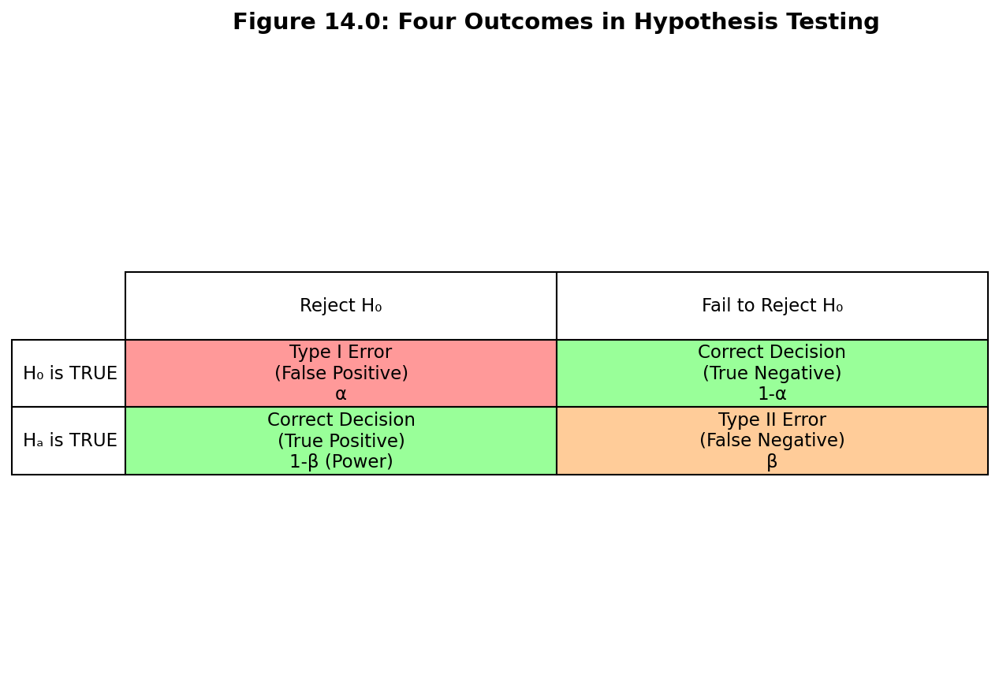
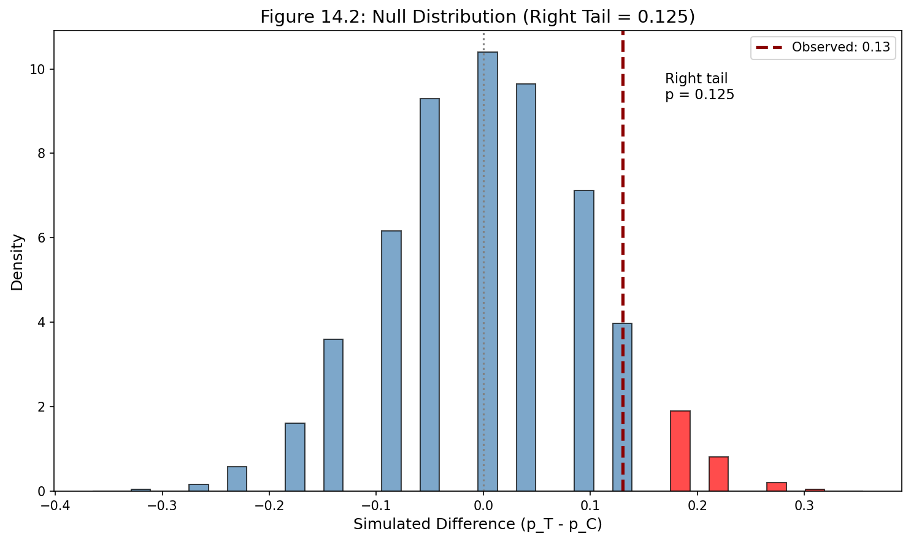
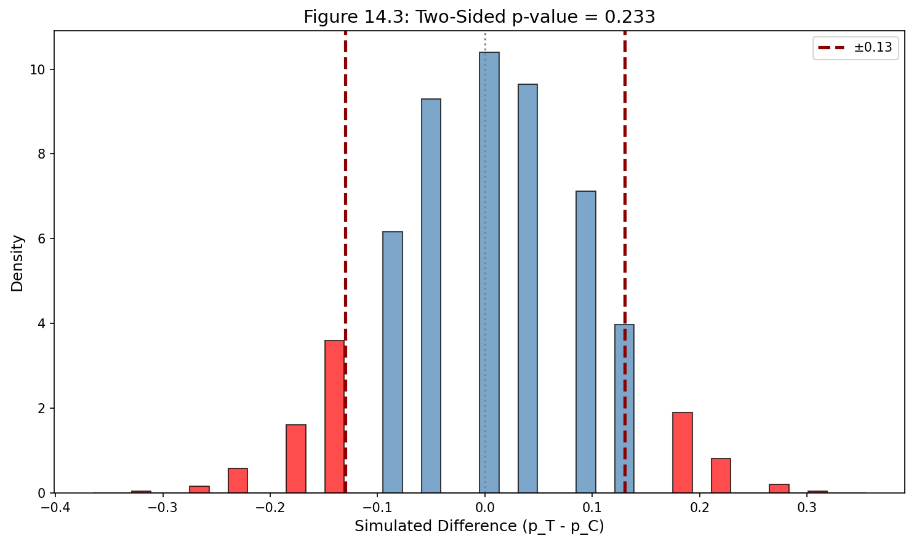
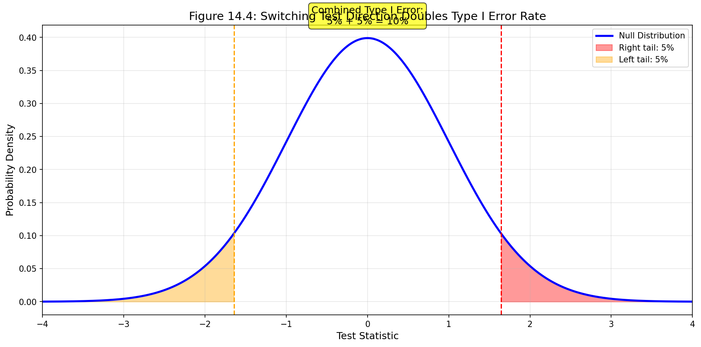
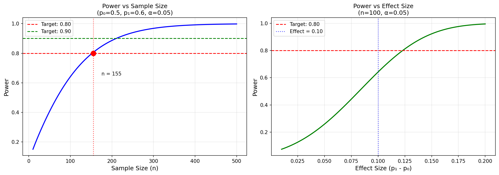

# Chapter 14: 의사결정 오류 (Decision Errors)

## 학습 목표

이 장을 학습한 후, 다음을 할 수 있어야 한다:

1. 가설 검정에서 발생할 수 있는 두 가지 유형의 오류(제1종 오류와 제2종 오류)를 정의하고 구별할 수 있다.
2. 다양한 맥락에서 각 유형의 오류가 의미하는 바를 설명할 수 있다.
3. 유의수준(discernibility level)의 선택이 오류율에 미치는 영향을 이해할 수 있다.
4. 단측 검정과 양측 검정의 차이를 이해하고 적절한 상황에서 사용할 수 있다.
5. 검정력(power)의 개념과 그 중요성을 이해할 수 있다.

---

## 서론

데이터를 사용하여 더 큰 모집단에 대한 추론적 결정을 내리는 것은 완벽한 과정이 아니다. 11장에서 살펴본 바와 같이, 작은 p-값은 일반적으로 연구자가 귀무 주장이나 가설을 기각하는 결정으로 이어진다. 그러나 때로는 귀무가설이 실제로 참이고 데이터가 단지 본질적으로 변동성이 있을 때에도 작은 p-값이 나타날 수 있다. 여기서는 가설 검정에서 발생할 수 있는 오류, 다양한 오류를 정의하고 정량화하는 방법, 그리고 가능하다면 오류를 완화하기 위한 제안을 설명한다.

가설 검정은 완벽하지 않다. 법원 시스템을 생각해 보라: 무고한 사람이 때때로 잘못 유죄 판결을 받고, 유죄인 사람이 때때로 풀려난다. 마찬가지로, 데이터가 잘못된 결론을 가리킬 수 있다. 그러나 통계적 가설 검정이 법원 시스템과 다른 점은 우리의 프레임워크가 데이터가 얼마나 자주 잘못된 결론으로 이끄는지를 정량화하고 제어할 수 있게 해준다는 것이다.

가설 검정에서는 두 가지 경쟁하는 가설이 있다: 귀무가설과 대립가설. 우리는 어느 것이 참일 수 있는지에 대한 진술을 하지만, 잘못 선택할 수 있다. 가설 검정에서 가능한 네 가지 시나리오가 있으며, 이는 표 14.1에 요약되어 있다.

**표 14.1: 가설 검정의 네 가지 시나리오**

|  | 검정 결론 | |
|---|---|---|
| **실제 상태** | **귀무가설 기각** | **귀무가설 기각 실패** |
| 귀무가설이 참 | 제1종 오류 (Type I error) | 올바른 결정 |
| 대립가설이 참 | 올바른 결정 | 제2종 오류 (Type II error) |



**제1종 오류**(Type I error)는 $H_0$이 실제로 참일 때 귀무가설을 기각하는 것이다. 성차별 연구와 기회비용 연구에서 귀무가설을 기각했으므로, 이 연구들 중 하나 또는 둘 모두에서 제1종 오류를 범했을 가능성이 있다. **제2종 오류**(Type II error)는 대립가설이 실제로 참일 때 귀무가설을 기각하지 못하는 것이다.

---

### 예제 14.1: 미국 법원 시스템의 오류

미국 법원에서 피고는 무죄$(H_0)$이거나 유죄$(H_A)$이다. 이 맥락에서 제1종 오류는 무엇을 나타내는가? 제2종 오류는 무엇을 나타내는가?

**풀이:**

법원이 **제1종 오류**를 범하면, 이는 피고가 무죄$(H_0$이 참)이지만 잘못 유죄 판결을 받는다는 것을 의미한다. 

**제2종 오류**는 피고가 실제로 유죄$(H_A$가 참)일 때 법원이 $H_0$을 기각하지 못한(즉, 유죄 판결을 내리지 못한) 것을 의미한다.

```python
import numpy as np
import pandas as pd

# 가설 검정 결과의 가능한 시나리오 표 생성
scenarios = pd.DataFrame({
    '실제 상태': ['귀무가설(H₀)이 참', '귀무가설(H₀)이 참', 
                '대립가설(Hₐ)이 참', '대립가설(Hₐ)이 참'],
    '검정 결론': ['H₀ 기각', 'H₀ 기각 실패', 'H₀ 기각', 'H₀ 기각 실패'],
    '결과': ['제1종 오류 (α)', '올바른 결정', 
            '올바른 결정 (1-β, 검정력)', '제2종 오류 (β)'],
    '법원 비유': ['무고한 사람 유죄 판결', '무고한 사람 무죄 판결', 
                '유죄인 사람 유죄 판결', '유죄인 사람 무죄 판결']
})

print("=== 가설 검정의 네 가지 시나리오 ===")
print(scenarios.to_string(index=False))
print()

# 오류 확률 표기
print("=== 오류 확률 ===")
print("α = P(제1종 오류) = P(H₀ 기각 | H₀이 참)")
print("β = P(제2종 오류) = P(H₀ 기각 실패 | Hₐ이 참)")
print("검정력(Power) = 1 - β = P(H₀ 기각 | Hₐ이 참)")
```

---

### Guided Practice 14.1: 기회비용 연구의 오류

기회비용 연구에서 우리는 현재 돈을 쓰지 않으면 나중에 쓸 수 있다는 것을 학생들에게 상기시키면 학생들이 DVD를 구매할 가능성이 낮아진다고 결론지었다. 이 맥락에서 제1종 오류는 무엇을 나타내는가?

**풀이:**

이 맥락에서 **제1종 오류**를 범한다는 것은 현재 돈을 쓰지 않으면 나중에 쓸 수 있다는 것을 학생들에게 상기시키는 것이 그들의 구매 습관에 영향을 미치지 않는다는 것을 의미한다. 그러나 실험에서 발견된 강력한 증거(데이터가 반대를 시사함)에도 불구하고 말이다. 

이것은 데이터에 문제가 있었거나 계산 실수를 했다는 것을 반드시 의미하지는 않는다는 점에 주목하라. 때때로 데이터는 단순히 잘못된 결론을 가리키며, 이것이 과학적 연구가 종종 초기 발견을 확인하기 위해 반복되는 이유이다.

---

### Guided Practice 14.2: 제1종 오류율 낮추기

미국 법원에서 제1종 오류율을 낮추려면 어떻게 해야 하는가? 이것이 제2종 오류율에 어떤 영향을 미치는가?

**풀이:**

제1종 오류율을 낮추려면, 유죄 판결 기준을 "합리적 의심을 넘어서"에서 **"상상 가능한 의심을 넘어서"**로 높일 수 있다. 그러면 잘못 유죄 판결을 받는 사람이 줄어들 것이다. 그러나 이것은 또한 실제로 유죄인 사람들을 유죄 판결하기 더 어렵게 만들어, **제2종 오류를 더 많이 범하게** 된다.

---

### Guided Practice 14.3: 제2종 오류율 낮추기

미국 법원에서 제2종 오류율을 낮추려면 어떻게 해야 하는가? 이것이 제1종 오류율에 어떤 영향을 미치는가?

**풀이:**

제2종 오류율을 낮추려면, 더 많은 유죄인 사람들을 유죄 판결해야 한다. 유죄 판결 기준을 "합리적 의심을 넘어서"에서 **"약간의 의심을 넘어서"**로 낮출 수 있다. 유죄에 대한 기준을 낮추면 또한 더 많은 잘못된 유죄 판결을 초래하여, **제1종 오류율이 높아진다**.

위의 예제와 Guided Practice는 중요한 교훈을 제공한다: **한 유형의 오류를 줄이면, 일반적으로 다른 유형의 오류를 더 많이 범하게 된다.**

---

### 새로운 시각: 오류의 비대칭성과 실제 세계의 의사결정

통계적 가설 검정에서 제1종 오류와 제2종 오류는 대칭적으로 취급되지 않는다. 이는 실제 세계의 의사결정 상황을 반영한다.

**법률 시스템의 원칙:**
"10명의 유죄인 사람을 풀어주는 것이 1명의 무고한 사람을 유죄 판결하는 것보다 낫다."

이 원칙은 제1종 오류(무고한 사람 유죄 판결)가 제2종 오류(유죄인 사람을 풀어주는 것)보다 더 심각한 결과를 초래한다고 간주하기 때문이다.

**의료 진단의 맥락:**
- 암 검사에서 **위양성**(제1종 오류): 암이 없는데 암이 있다고 진단 → 불필요한 추가 검사, 심리적 고통
- 암 검사에서 **위음성**(제2종 오류): 암이 있는데 없다고 진단 → 치료 지연, 생명 위협

이 경우, 제2종 오류가 더 심각하므로 선별 검사는 종종 민감도(sensitivity)를 높여 위음성을 줄이도록 설계된다.

**핵심 통찰:**
어떤 오류가 더 심각한지는 맥락에 따라 다르다. 통계학자의 역할은 각 상황에서 적절한 오류율의 균형을 찾는 것이다.
## 14.1 유의수준 (Discernibility Level)

**유의수준**(discernibility level, 또는 significance level)은 "귀무가설 기각" 결정으로 이어지는 p-값의 기준점(cutoff)을 제공한다. 검정을 위한 유의수준 선택은 많은 맥락에서 중요하며, 전통적인 수준은 0.05이다. 그러나 때로는 응용 분야에 따라 유의수준을 조정하는 것이 도움이 된다. 검정에서 도달한 결론의 결과에 따라 0.05보다 작거나 큰 수준을 선택할 수 있다.

**제1종 오류**를 범하는 것이 위험하거나 특히 비용이 많이 드는 경우, 작은 유의수준(예: 0.01 또는 0.001)을 선택해야 한다. 귀무가설을 기각하는 것에 대해 매우 신중하고 싶다면, $H_0$을 기각하기 전에 대립가설 $H_A$를 지지하는 매우 강력한 증거를 요구한다.

**제2종 오류**가 제1종 오류보다 상대적으로 더 위험하거나 비용이 훨씬 많이 드는 경우, 더 높은 유의수준(예: 0.10)을 선택해야 한다. 여기서는 귀무가설이 실제로 거짓일 때 $H_0$을 기각하지 못하는 것에 대해 신중하고 싶다.

> **유의수준은 오류의 결과를 반영해야 한다.**
>
> 검정을 위해 선택된 유의수준은 제1종 또는 제2종 오류를 범하는 것과 관련된 실제 세계의 결과를 반영해야 한다.

---

### 예제 14.2: 유의수준 선택의 예

**상황 1: 신약 안전성 검정**

새로운 약물이 심각한 부작용을 일으키는지 검정하고 있다.
- $H_0$: 약물은 부작용을 일으키지 않는다
- $H_A$: 약물은 부작용을 일으킨다

이 경우, **제1종 오류**(실제로 안전한 약물을 위험하다고 판정)는 유용한 치료법을 막는 것이고, **제2종 오류**(실제로 위험한 약물을 안전하다고 판정)는 환자에게 해를 끼칠 수 있다. 제2종 오류가 더 심각하므로, 더 높은 유의수준(예: α = 0.10)이 적절할 수 있다.

**상황 2: 히그스 입자 발견**

물리학에서 새로운 입자의 존재를 주장하려면 매우 강력한 증거가 필요하다. 전통적으로 "5시그마" 기준이 사용되며, 이는 α ≈ 0.0000003에 해당한다. 제1종 오류(존재하지 않는 입자를 발견했다고 주장)의 결과가 과학적 신뢰성에 심각한 영향을 미치기 때문이다.

```python
import numpy as np
from scipy import stats

# 다양한 유의수준과 그에 대응하는 기각역
print("=== 다양한 유의수준과 기각역 (양측 검정, 표준정규분포 기준) ===")
alphas = [0.10, 0.05, 0.01, 0.001, 0.0000003]
names = ['일반적 탐색', '전통적', '보수적', '매우 보수적', '물리학 5시그마']

for alpha, name in zip(alphas, names):
    z_crit = stats.norm.ppf(1 - alpha/2)
    print(f"α = {alpha:12.7f} ({name}): z* = ±{z_crit:.4f}")

print()

# 다양한 시그마 수준의 의미
print("=== 시그마 수준과 p-값 ===")
sigmas = [1, 2, 3, 4, 5]
for sigma in sigmas:
    p_one_sided = 1 - stats.norm.cdf(sigma)
    p_two_sided = 2 * p_one_sided
    print(f"{sigma}σ: 단측 p-값 = {p_one_sided:.2e}, 양측 p-값 = {p_two_sided:.2e}")
```

---

### 새로운 시각: α = 0.05의 역사적 기원과 현대적 비판

α = 0.05라는 유의수준은 로널드 피셔(Ronald Fisher)에 의해 제안되었다. 그는 1925년 저서에서 다음과 같이 썼다:

> "결과가 오직 1/20 이하의 확률로 발생한다면, 실제로 그것은 유의하다고 말할 수 있다."

그러나 피셔 자신도 이것이 절대적인 기준이 아니라 **대략적인 지침**이라고 강조했다. 현대 통계학에서는 다음과 같은 비판이 제기된다:

1. **임의성**: 0.05라는 수치에 특별한 수학적 근거가 없다.
2. **맥락 무시**: 모든 상황에 같은 기준을 적용하는 것은 부적절하다.
3. **이분법적 사고**: p < 0.05는 "유의", p ≥ 0.05는 "비유의"라는 흑백논리를 조장한다.
4. **p-해킹**: 연구자들이 p < 0.05를 얻기 위해 데이터를 조작하는 유인을 제공한다.

**현대적 권고사항:**
- p-값을 연속적인 증거의 척도로 해석한다
- 효과 크기와 신뢰구간도 함께 보고한다
- 연구 맥락에 따라 적절한 α를 선택한다
- 결과의 재현성을 강조한다

```python
# 다양한 맥락에서의 오류 비용 비교
contexts = {
    '형사 재판': {'Type I': '무고한 사람 수감', 'Type II': '범인 석방', 
                  'Type I 비용': '매우 높음', 'Type II 비용': '높음'},
    '암 선별검사': {'Type I': '불필요한 추가검사', 'Type II': '암 놓침', 
                   'Type I 비용': '중간', 'Type II 비용': '매우 높음'},
    '스팸 필터': {'Type I': '정상 메일 삭제', 'Type II': '스팸 통과', 
                 'Type I 비용': '중간', 'Type II 비용': '낮음'},
    '신약 승인': {'Type I': '효과없는 약 승인', 'Type II': '효과있는 약 거부', 
                 'Type I 비용': '매우 높음', 'Type II 비용': '높음'}
}

print("=== 다양한 맥락에서의 오류 비용 ===")
for context, errors in contexts.items():
    print(f"\n{context}:")
    print(f"  제1종 오류: {errors['Type I']} (비용: {errors['Type I 비용']})")
    print(f"  제2종 오류: {errors['Type II']} (비용: {errors['Type II 비용']})")
```
## 14.2 양측 가설 (Two-Sided Hypotheses)

11장에서 우리는 여성이 차별을 받았는지, 그리고 간단한 트릭이 학생들을 조금 더 절약하게 만들 수 있는지를 탐구했다. 이 두 사례 연구에서, 우리는 실제로 몇 가지 가능성을 무시했다:

- 만약 *남성*이 실제로 차별을 받고 있다면?
- 만약 돈 트릭이 실제로 학생들이 *더 많이 쓰게* 만든다면?

이러한 가능성들은 우리의 원래 가설이나 분석에서 고려되지 않았다. 데이터가 우리가 문제를 설정한 방향을 가리켰기 때문에 추가 대안의 무시가 자연스러워 보였을 수 있다. 그러나 우리의 데이터와 일치하지 않거나 우리의 세계관과 충돌하는 가능성을 무시하면 두 가지 위험이 있다:

1. 데이터가 가리키는 방향과 단순히 일치하도록 대립가설을 설정하면 일반적으로 **제1종 오류율이 증가**한다. 가설 검정에서 오류율을 엄격하게 제어하기 위해 수행한(그리고 계속 수행할) 모든 작업 후에, 대립가설의 부주의한 구성은 그 노력을 방해할 수 있다.

2. 우리의 세계관과 일치하는 대립가설만 사용한다면, **확증 편향**(confirmation bias)에 빠지게 되며, 이는 우리의 아이디어를 지지하는 데이터를 찾고 있다는 것을 의미한다. 그것은 과학적이지 않으며, 우리는 더 잘할 수 있다!

우리가 본 원래의 가설들은 가능성의 한 방향만 탐구했기 때문에 **단측 가설 검정**(one-sided hypothesis tests)이라고 불린다. 이러한 가설은 단일 방향에만 관심이 있을 때 적절하지만, 보통 우리는 모든 가능성을 고려하고 싶다. 그렇게 하기 위해, CPR을 받은 환자에게 혈액 희석제를 사용하는 영향을 조사하는 새로운 연구의 맥락에서 **양측 가설 검정**(two-sided hypothesis tests)에 대해 배워보자.

---

### 예제 14.3: CPR 연구의 양측 검정

**심폐소생술**(CPR, Cardiopulmonary Resuscitation)은 다른 응급 자원이 이용 가능하지 않을 때 심장마비를 겪고 있는 개인에게 사용되는 절차이다. 이 절차는 사람을 살아있게 유지하기 위해 약간의 혈액 순환을 제공하는 데 도움이 되지만, CPR 흉부 압박은 또한 내부 부상을 일으킬 수 있다. CPR로 인한 내부 출혈 및 기타 부상은 추가 치료 노력을 복잡하게 만든다. 예를 들어, 환자가 병원에 도착하면 심장마비를 일으키는 혈전을 풀기 위해 혈액 희석제가 사용될 수 있다. 그러나 혈액 희석제는 내부 부상에 부정적인 영향을 미친다.

여기서 우리는 심장마비로 CPR을 받고 이후 병원에 입원한 환자들을 대상으로 한 실험을 고려한다. 각 환자는 혈액 희석제를 받거나(처리군) 혈액 희석제를 받지 않도록(대조군) 무작위 배정되었다. 관심 있는 결과 변수는 환자가 최소 24시간 동안 생존했는지 여부이다.

**가설 설정:**

$p_C$를 혈액 희석제를 받지 않는 사람들(대조군에 해당)의 진정한 생존율로, $p_T$를 혈액 희석제를 받는 사람들(처리군에 해당)의 생존율로 나타내자.

혈액 희석제가 도움이 되는지 해로운지 이해하고 싶다. 양측 가설 검정을 사용하여 이 두 가능성을 모두 고려할 것이다.

- $H_0$: 혈액 희석제는 전반적인 생존 효과가 없다. 즉, 각 그룹의 생존 비율이 같다. $p_T - p_C = 0$
- $H_A$: 혈액 희석제는 생존에 영향을 미친다, 긍정적이든 부정적이든, 그러나 0은 아니다. $p_T - p_C \neq 0$

만약 단측 가설 검정을 했다면, 결과 가설은 다음과 같았을 것이다:

- $H_0$: 혈액 희석제는 긍정적인 전반적 생존 효과가 없다. $p_T - p_C \leq 0$
- $H_A$: 혈액 희석제는 생존에 긍정적인 영향을 미친다. $p_T - p_C > 0$

**데이터:**

실험에서 혈액 희석제를 받지 않은 환자 50명과 받은 환자 40명이 있었다.

**표 14.2: CPR 연구 결과**

| 그룹 | 사망 | 생존 | 합계 |
|---|---|---|---|
| 대조군 | 39 | 11 | 50 |
| 처리군 | 26 | 14 | 40 |
| 합계 | 65 | 25 | 90 |

**풀이:**

```python
import numpy as np
from scipy import stats

# CPR 연구 데이터
control_survived = 11
control_died = 39
control_total = 50

treatment_survived = 14
treatment_died = 26
treatment_total = 40

# 생존율 계산
p_control = control_survived / control_total
p_treatment = treatment_survived / treatment_total
observed_diff = p_treatment - p_control

print("=== CPR 연구 기초 통계 ===")
print(f"대조군 생존율: {p_control:.3f} ({control_survived}/{control_total})")
print(f"처리군 생존율: {p_treatment:.3f} ({treatment_survived}/{treatment_total})")
print(f"관측된 차이 (p_T - p_C): {observed_diff:.3f}")
print()

# 귀무가설 하에서 무작위화 검정 시뮬레이션
def randomization_test(survived, total_control, total_treatment, n_simulations=10000):
    """
    귀무가설 하에서 무작위화를 통한 영분포 생성
    """
    total_patients = total_control + total_treatment
    null_diffs = []
    
    for _ in range(n_simulations):
        shuffled = np.random.permutation(
            [1]*survived + [0]*(total_patients - survived)
        )
        sim_p_control = np.mean(shuffled[:total_control])
        sim_p_treatment = np.mean(shuffled[total_control:])
        null_diffs.append(sim_p_treatment - sim_p_control)
    
    return np.array(null_diffs)

np.random.seed(42)
total_survived = control_survived + treatment_survived
null_distribution = randomization_test(total_survived, control_total, treatment_total)

# 단측 p-값 (오른쪽 꼬리)
right_tail_p = np.mean(null_distribution >= observed_diff)

# 양측 p-값
two_sided_p = np.mean(np.abs(null_distribution) >= abs(observed_diff))

print("=== 가설 검정 결과 ===")
print(f"오른쪽 꼬리 영역 (단측): {right_tail_p:.4f}")
print(f"양측 p-값: {two_sided_p:.4f}")
print()

if two_sided_p < 0.05:
    print("결론: p-값 < 0.05이므로, 귀무가설을 기각한다.")
else:
    print("결론: p-값 ≥ 0.05이므로, 귀무가설을 기각하지 못한다.")
    print("혈액 희석제가 생존에 영향을 미친다는 유의한 증거가 없다.")
```

점 추정값에 따르면, 병원 밖에서 CPR을 받은 환자의 경우 혈액 희석제로 치료받을 때 추가 13%가 생존한다. 그러나 이 차이가 치료가 생존에 영향을 미치지 않는다면 단지 우연으로 설명될 수 있는지 확인해야 한다.



오른쪽 꼬리 영역은 약 0.135이다. 그러나 **양측 검정**의 p-값은 이 값이 아니다!

p-값은 대립가설에 유리한 결과를 관측된 차이만큼 또는 그보다 더 유리하게 관측할 확률로 정의된다. 이 경우, -0.13 이하의 어떤 차이도 +0.13의 차이만큼 대립가설을 지지하는 동등하게 강력한 증거를 제공한다.



양측 검정의 경우, 단일 꼬리(이 경우 0.131)를 취하고 **두 배**로 하여 p-값을 얻는다: 0.262. 이 p-값이 0.05보다 크므로 귀무가설을 기각하지 않는다.

> **양측 검정을 기본으로 사용하라.**
>
> 데이터를 분석하고 증거를 평가할 때 엄격하고 열린 마음을 유지하고 싶다. 진정으로 한 방향에만 관심이 있는 경우에만 단측 가설 검정을 사용하라.

> **양측 검정의 p-값 계산하기**
>
> 먼저 분포의 한 꼬리에 대한 p-값을 계산한 다음, 그 값을 두 배로 하여 양측 p-값을 얻는다.

---

### Guided Practice 14.4: 의료 컨설턴트 연구 재고

의료 컨설턴트의 상황을 고려하라. 이제 단측 검정과 양측 검정에 대해 알았으니, 어떤 유형의 검정이 더 적절하다고 생각하는가?

**풀이:**

설정은 컨설턴트가 도움이 된다는 맥락에서 설정되었다(이것이 원래 단측 검정으로 이끌었다). 그러나 컨설턴트가 실제로 평균보다 *더 나쁜* 성과를 보였다면? 그것에 관심이 있겠는가? 그 어느 때보다도! 

어느 방향으로든 발견에 관심이 있으므로 **양측 검정**을 실행해야 한다. 양측 검정의 p-값은 단측 검정의 두 배이다.

---

### 새로운 시각: 양측 검정의 철학적 기초

양측 검정이 기본이 되어야 하는 이유는 **과학적 객관성**과 **지적 정직성**에 있다.

**사전 vs 사후 가설:**
- **사전 가설**(a priori hypothesis): 데이터를 보기 전에 설정된 가설
- **사후 가설**(post hoc hypothesis): 데이터를 본 후에 설정된 가설

데이터를 본 후에 단측 검정으로 전환하는 것은 사후 가설을 만드는 것이며, 이는 "데이터 드레지징"(data dredging) 또는 "p-해킹"(p-hacking)의 한 형태이다.

**카를 포퍼의 반증주의:**
과학적 가설은 반증 가능해야 한다. 양측 검정은 두 방향 모두에서 반증의 가능성을 열어둠으로써 더 엄격한 과학적 검증을 가능하게 한다.

**실제 연구에서의 함의:**
- 연구 계획서(protocol)에 가설을 미리 등록하라
- 탐색적 분석과 확인적 분석을 구분하라
- 단측 검정을 사용할 때는 명확한 사전 정당화를 제시하라
## 14.3 제1종 오류율 제어하기

이제 단측 검정과 양측 검정의 차이를 이해했으므로, 각 유형의 검정을 언제 사용해야 하는지 인식해야 한다. 오류율 증가의 결과 때문에, 데이터를 관찰한 후에 양측 검정을 단측 검정으로 변경하는 것은 절대 허용되지 않는다.

---

### 예제 14.4: 검정 전환의 위험

$\alpha = 0.05$를 사용하여, 양측 검정에서 단측 검정으로 자유롭게 전환하면 의도한 것보다 두 배나 많은 제1종 오류를 범하게 된다는 것을 보여준다.

**풀이:**

0으로부터의 어떤 차이에도 관심이 있다고 가정하자. 아래에서 우연으로 인한 차이를 나타내는 매끄러운 **영분포**를 만들었다.

먼저, 표본 차이가 0보다 크다고 가정하자. 단측 검정에서, $H_A$: 차이 $> 0$으로 설정할 것이다. 관측된 차이가 분포의 상위 5%에 속하면, $H_0$을 기각할 것이다. 따라서, $H_0$이 참이면, 표본 평균이 귀무값보다 클 때 약 5%의 시간 동안 $H_0$을 잘못 기각한다.

그런 다음, 표본 차이가 0보다 작다고 가정하자. 단측 검정에서, $H_A$: 차이 $< 0$으로 설정할 것이다. 관측된 차이가 그림의 하위 5%에 속하면, $H_0$을 기각할 것이다.

이 두 시나리오를 검토하면, 데이터에 대해 "최선의" 단측 검정으로 전환하는 것이 허용되면 $5\% + 5\% = 10\%$의 시간 동안 제1종 오류를 범한다는 것을 알 수 있다. 이는 유의수준으로 규정한 오류율의 **두 배**이다!



```python
import matplotlib.pyplot as plt
import numpy as np
from scipy import stats

# 검정 전환의 위험 시각화
fig, ax = plt.subplots(figsize=(12, 6))

x = np.linspace(-4, 4, 1000)
y = stats.norm.pdf(x, 0, 1)

# 정규분포 그리기
ax.plot(x, y, 'b-', linewidth=2, label='영분포 (H₀이 참)')

# α = 0.05의 기각역
z_crit = stats.norm.ppf(0.95)  # 1.645

# 오른쪽 꼬리 5% 영역
x_right = x[x >= z_crit]
ax.fill_between(x_right, stats.norm.pdf(x_right, 0, 1), alpha=0.4, color='red',
                label='단측 오른쪽: α = 0.05')

# 왼쪽 꼬리 5% 영역
x_left = x[x <= -z_crit]
ax.fill_between(x_left, stats.norm.pdf(x_left, 0, 1), alpha=0.4, color='orange',
                label='단측 왼쪽: α = 0.05')

ax.set_xlabel('검정 통계량')
ax.set_ylabel('확률 밀도')
ax.set_title('데이터에 따라 검정 방향을 바꾸면 α가 두 배가 된다')
ax.legend()
ax.text(0, 0.42, '결합된 제1종 오류율:\n5% + 5% = 10%', fontsize=11, ha='center',
        bbox=dict(boxstyle='round', facecolor='yellow', alpha=0.5))
ax.grid(True, alpha=0.3)

plt.tight_layout()
plt.savefig('figures/fig_14_3_type1_doubling.png', dpi=150, bbox_inches='tight')
plt.close()

print("결론: 데이터를 본 후 검정 방향을 바꾸면 제1종 오류율이 2배가 된다!")
```

> **가설 검정은 데이터를 보기 *전에* 설정해야 한다.**
>
> 데이터를 관찰한 후, 양측 검정을 단측 검정으로 바꾸고 싶은 유혹이 있다. 이 유혹을 피하라. 가설은 데이터를 관찰하기 *전에* 설정해야 한다.

---

### 새로운 시각: 다중 검정 문제와 보정 방법

데이터에 따라 검정 방향을 바꾸는 것은 **다중 검정 문제**(multiple testing problem)의 한 형태이다. 여러 검정을 수행하면 전체 제1종 오류율이 증가한다.

**본페로니 보정 (Bonferroni correction):**
$m$개의 검정을 수행할 때, 각 검정의 유의수준을 $\alpha/m$으로 조정한다.

**거짓 발견률 (False Discovery Rate, FDR):**
벤자미니-호흐버그(Benjamini-Hochberg) 절차는 예상되는 거짓 발견의 비율을 제어한다.

```python
import numpy as np

# 다중 검정의 영향 시뮬레이션
def simulate_multiple_testing(n_tests=20, alpha=0.05, n_sims=10000):
    """
    귀무가설이 모두 참일 때 적어도 하나의 유의한 결과를 얻을 확률
    """
    false_positives = 0
    for _ in range(n_sims):
        # 귀무가설 하에서 p-값 생성
        p_values = np.random.uniform(0, 1, n_tests)
        # 적어도 하나가 유의하면 거짓 양성
        if np.any(p_values < alpha):
            false_positives += 1
    return false_positives / n_sims

# 다양한 검정 수에 대한 가족별 오류율
print("=== 다중 검정과 가족별 오류율 ===")
test_numbers = [1, 5, 10, 20, 50, 100]
for n in test_numbers:
    fwer = simulate_multiple_testing(n_tests=n)
    theoretical = 1 - (1 - 0.05)**n
    print(f"검정 수 = {n:3d}: 시뮬레이션 FWER = {fwer:.3f}, 이론적 = {theoretical:.3f}")
```

---

## 14.4 검정력 (Power)

여기서 자세히 다루지는 않겠지만, 검정력은 가설 검정의 기초를 이해한 후 후속 고려를 위한 중요한 주제이다. 좋은 검정력 분석은 연구의 필수적인 예비 단계이며, 수집하는 데이터가 연구를 광범위하게 결론짓기에 충분한지 여부를 알려줄 것이다.

실험 계획에서 종종 두 가지 경쟁하는 고려사항이 있다:

- 중요한 효과를 탐지할 수 있을 만큼 충분한 데이터를 수집하고 싶다.
- 데이터 수집은 비용이 많이 들 수 있으며, 사람을 포함하는 실험에서는 환자에게 일부 위험이 있을 수 있다.

연구를 계획할 때, 우리가 관심 있는 효과를 탐지할 가능성이 얼마나 되는지 알고 싶다.

> **검정력 **(Power)
>
> 검정의 검정력은 대립 주장이 참일 때 귀무 주장을 기각할 확률이다.
>
> $$\text{검정력} = 1 - \beta = P(\text{H}_0 \text{ 기각} | \text{H}_A \text{가 참})$$

효과를 탐지하기가 얼마나 쉬운지는 **효과가 얼마나 큰지**와 **표본 크기** 모두에 달려 있다.

---

### 예제 14.5: 검정력 계산

단일 모비율에 대한 가설 검정에서 검정력을 계산해 보자.

**상황:** 새로운 약물이 환자의 50% 이상에서 효과가 있는지 검정하고 싶다.

- $H_0$: $p = 0.50$ (기존 치료와 같음)
- $H_A$: $p > 0.50$ (새 치료가 더 좋음)
- 유의수준: $\alpha = 0.05$
- 표본 크기: $n = 100$
- 진정한 모비율: $p = 0.60$ (실제로 60% 효과가 있다고 가정)

**풀이:**

```python
import numpy as np
from scipy import stats

def calculate_power_proportion(p0, p1, n, alpha=0.05, alternative='greater'):
    """
    단일 비율에 대한 검정력 계산
    """
    se_null = np.sqrt(p0 * (1 - p0) / n)
    
    if alternative == 'greater':
        z_crit = stats.norm.ppf(1 - alpha)
        p_crit = p0 + z_crit * se_null
    elif alternative == 'less':
        z_crit = stats.norm.ppf(alpha)
        p_crit = p0 + z_crit * se_null
    else:
        z_crit = stats.norm.ppf(1 - alpha/2)
        p_crit_upper = p0 + z_crit * se_null
        p_crit_lower = p0 - z_crit * se_null
    
    se_alt = np.sqrt(p1 * (1 - p1) / n)
    
    if alternative == 'greater':
        z_power = (p_crit - p1) / se_alt
        power = 1 - stats.norm.cdf(z_power)
    elif alternative == 'less':
        z_power = (p_crit - p1) / se_alt
        power = stats.norm.cdf(z_power)
    else:
        z_upper = (p_crit_upper - p1) / se_alt
        z_lower = (p_crit_lower - p1) / se_alt
        power = 1 - stats.norm.cdf(z_upper) + stats.norm.cdf(z_lower)
    
    return power

# 예제 계산
p0 = 0.50
p1 = 0.60
n = 100
alpha = 0.05

power = calculate_power_proportion(p0, p1, n, alpha, 'greater')
print("=== 검정력 계산 예제 ===")
print(f"귀무가설: p = {p0}")
print(f"실제 비율: p = {p1}")
print(f"표본 크기: n = {n}")
print(f"유의수준: α = {alpha}")
print(f"검정력: {power:.4f} ({power*100:.1f}%)")
print()

# 다양한 표본 크기에 대한 검정력
print("=== 표본 크기에 따른 검정력 ===")
sample_sizes = [25, 50, 75, 100, 150, 200, 300, 500]
for n in sample_sizes:
    pwr = calculate_power_proportion(p0, p1, n, alpha, 'greater')
    print(f"n = {n:3d}: 검정력 = {pwr:.4f}")
```



---

### 새로운 시각: 검정력과 표본 크기 결정의 실제

검정력 분석은 연구 계획의 핵심 단계이다. 적절한 표본 크기를 결정하지 않으면:

1. **과소 검정력 연구**: 실제 효과를 탐지하지 못하고 자원을 낭비한다.
2. **과대 검정력 연구**: 필요 이상으로 많은 참가자를 모집하여 윤리적, 경제적 문제가 발생한다.

**검정력 분석의 네 가지 요소:**
1. **표본 크기 **(n): 연구에 필요한 참가자 수
2. **효과 크기**: 탐지하고자 하는 최소 의미 있는 효과
3. **유의수준 (α)**: 제1종 오류의 허용 확률
4. **검정력 (1-β)**: 효과가 존재할 때 탐지할 확률

이 네 요소 중 세 개를 알면 나머지 하나를 계산할 수 있다.

```python
# 필요 표본 크기 계산
def required_sample_size(p0, p1, alpha=0.05, power=0.80, alternative='greater'):
    """목표 검정력을 달성하기 위한 필요 표본 크기"""
    for n in range(10, 10001):
        current_power = calculate_power_proportion(p0, p1, n, alpha, alternative)
        if current_power >= power:
            return n
    return None

print("=== 80% 검정력을 위한 필요 표본 크기 ===")
scenarios = [
    (0.50, 0.55, "작은 효과 (5%p)"),
    (0.50, 0.60, "중간 효과 (10%p)"),
    (0.50, 0.65, "큰 효과 (15%p)"),
]

for p0, p1, desc in scenarios:
    n = required_sample_size(p0, p1, power=0.80)
    print(f"{desc}: n = {n}")
```
## 14.5 장 요약

### 14.5.1 요약

가설 검정은 데이터를 기반으로 결정을 내리기 위한 강력한 프레임워크를 제공하지만, 분석가로서 이 과정이 언제 어떻게 잘못될 수 있는지 이해해야 한다. 즉, 가설 검정의 결론이 옳지 않을 수 있다는 것을 항상 명심해야 한다! 때때로 귀무가설이 참일 때 실수로 기각하여 제1종 오류를 범하고; 때때로 대립가설이 참일 때 귀무가설을 기각하지 못하여 제2종 오류를 범한다. 검정의 검정력은 대립가설이 실제로 참일 때 귀무가설을 기각하는 데이터를 얻을 가능성을 정량화한다; 검정력은 더 큰 표본 크기를 취할 때 증가한다.

### 14.5.2 용어

이 장에서 소개된 용어들은 표 14.3에 제시되어 있다.

**표 14.3: 이 장에서 소개된 용어**

| 한글 | 영문 |
|------|------|
| **확증 편향** | confirmation bias |
| **유의수준** | discernibility level (significance level) |
| **영분포** | null distribution |
| **단측 가설 검정** | one-sided hypothesis test |
| **검정력** | power |
| **양측 가설 검정** | two-sided hypothesis test |
| **제1종 오류** | Type I error |
| **제2종 오류** | Type II error |

---

## 14.6 연습문제

홀수 번호 연습문제의 답은 부록 A.14에서 찾을 수 있다.

---

### 연습문제 14.1: 섬유근육통 검정

Diana라는 환자가 신체 통증의 장기 증후군인 섬유근육통 진단을 받았고, 항우울제가 처방되었다. 회의적인 그녀는 처음에 항우울제가 증상에 도움이 될 것이라고 믿지 않았다. 그러나 약을 복용한 지 몇 달 후 그녀는 증상이 실제로 나아지고 있다고 느끼기 때문에 항우울제가 효과가 있다고 결론 내렸다.

**(a)** Diana가 항우울제를 복용하기 시작했을 때 그녀의 회의적인 입장에 대한 가설을 말로 작성하라.

**(b)** 이 맥락에서 제1종 오류는 무엇인가?

**(c)** 이 맥락에서 제2종 오류는 무엇인가?

**상세 풀이:**

**(a) 가설 설정:**
- $H_0$: 항우울제는 섬유근육통 증상을 개선하지 않는다.
- $H_A$: 항우울제는 섬유근육통 증상을 개선한다.

**(b) 제1종 오류:**
제1종 오류는 $H_0$이 참일 때 기각하는 것이다. 이 맥락에서, **항우울제가 실제로 효과가 없는데 효과가 있다고 결론 내리는 것**이다. Diana가 증상 개선을 느끼지만 이것이 약 때문이 아니라 위약 효과나 자연적 변동 때문일 수 있다.

**(c) 제2종 오류:**
제2종 오류는 $H_A$가 참일 때 $H_0$을 기각하지 못하는 것이다. 이 맥락에서, **항우울제가 실제로 효과가 있는데 효과가 없다고 결론 내리는 것**이다. Diana가 개선을 느끼지 못하거나 무시하여 효과적인 치료를 포기하는 경우이다.

```python
# 연습문제 14.1 개념 정리
print("=== 연습문제 14.1: 섬유근육통 검정 ===")
print()
print("(a) 가설:")
print("  H₀: 항우울제는 섬유근육통 증상을 개선하지 않는다")
print("  Hₐ: 항우울제는 섬유근육통 증상을 개선한다")
print()
print("(b) 제1종 오류 (α):")
print("  실제: 항우울제가 효과 없음")
print("  결론: 효과 있다고 판단")
print("  결과: 불필요한 약물 복용 지속")
print()
print("(c) 제2종 오류 (β):")
print("  실제: 항우울제가 효과 있음")
print("  결론: 효과 없다고 판단")
print("  결과: 효과적인 치료 중단")
```

---

### 연습문제 14.3: 어느 쪽이 더 큰가?

아래 각 부분에서 관심 값과 두 시나리오 (i)과 (ii)가 있다. 각 부분에 대해, 관심 값이 시나리오 (i)에서 더 큰지, 시나리오 (ii)에서 더 큰지, 또는 두 시나리오에서 같은지 보고하라.

**(a)** $\hat{p}$의 표준오차가 (i) $n = 125$일 때와 (ii) $n = 500$일 때

**(b)** 신뢰수준이 (i) 90%일 때와 (ii) 80%일 때 신뢰구간의 오차한계

**(c)** (i) $n = 500$인 표본 기반의 Z-통계량 2.5에 대한 p-값과 (ii) $n = 1000$인 표본 기반의 p-값

**(d)** 대립가설이 참이고 유의수준이 (i) 0.05일 때와 (ii) 0.10일 때 제2종 오류를 범할 확률

**상세 풀이:**

**(a)** $SE(\hat{p}) = \sqrt{\frac{p(1-p)}{n}}$

$n$이 증가하면 표준오차가 감소한다.

**답: 시나리오 (i)에서 더 크다** (n = 125 < 500)

**(b)** 오차한계 = $z^* \times SE$

신뢰수준이 높을수록 $z^*$가 크다 (90%: 1.645, 80%: 1.28).

**답: 시나리오 (i)에서 더 크다** (90% > 80%)

**(c)** p-값은 검정 통계량에만 의존하고 표본 크기에는 직접 의존하지 않는다.

Z = 2.5에 대한 p-값은 동일하다.

**답: 두 시나리오에서 같다**

**(d)** $\alpha$가 증가하면 기각역이 넓어지고, 기각할 확률이 높아진다.

따라서 $\beta$(제2종 오류 확률)는 감소한다.

**답: 시나리오 (i)에서 더 크다** (α = 0.05일 때 β가 더 큼)

```python
import numpy as np
from scipy import stats

print("=== 연습문제 14.3: 어느 쪽이 더 큰가? ===")
print()

# (a) 표준오차
p = 0.5  # 예시 비율
se_125 = np.sqrt(p*(1-p)/125)
se_500 = np.sqrt(p*(1-p)/500)
print(f"(a) 표준오차:")
print(f"  n=125: SE = {se_125:.4f}")
print(f"  n=500: SE = {se_500:.4f}")
print(f"  답: (i)에서 더 크다")
print()

# (b) 오차한계
z_90 = stats.norm.ppf(0.95)
z_80 = stats.norm.ppf(0.90)
print(f"(b) z* 값:")
print(f"  90% 신뢰수준: z* = {z_90:.4f}")
print(f"  80% 신뢰수준: z* = {z_80:.4f}")
print(f"  답: (i)에서 더 크다")
print()

# (c) p-값
p_value = 2 * (1 - stats.norm.cdf(2.5))
print(f"(c) Z=2.5에 대한 p-값: {p_value:.4f}")
print(f"  (표본 크기에 무관)")
print(f"  답: 두 시나리오에서 같다")
print()

# (d) 제2종 오류
print(f"(d) α가 증가하면 β가 감소한다")
print(f"  α=0.05일 때 β가 더 크다")
print(f"  답: (i)에서 더 크다")
```

---

### 연습문제 14.5: 온라인 커뮤니케이션

한 연구에 따르면 대학생의 60%가 주당 10시간 이상 온라인으로 다른 사람들과 소통한다고 한다. 당신은 이것이 잘못되었다고 생각하고 가설 검정을 위해 자신의 표본을 수집하기로 결정한다. 당신의 기숙사에서 160명의 학생을 무작위로 추출하여 70%가 주당 10시간 이상 온라인으로 소통했다는 것을 발견한다. 가설 검정을 도와주겠다고 제안한 친구가 다음 가설을 제시한다. 오류가 있는지 지적하라.

$$H_0: \hat{p} < 0.6 \quad \quad H_A: \hat{p} > 0.7$$

**상세 풀이:**

이 가설에는 여러 오류가 있다:

**오류 1:** 가설은 **모수**($p$)에 대한 것이어야 하지, 통계량($\hat{p}$)에 대한 것이 아니다.

**오류 2:** 귀무가설은 등호(=)를 포함해야 한다. 부등호(<)만 있으면 안 된다.

**오류 3:** $H_0$과 $H_A$의 값이 일치하지 않는다 (0.6과 0.7).

**올바른 가설:**
- $H_0: p = 0.60$ (모집단 비율이 60%이다)
- $H_A: p \neq 0.60$ (모집단 비율이 60%가 아니다) - 양측 검정

또는 연구 목적에 따라:
- $H_A: p > 0.60$ (모집단 비율이 60%보다 크다) - 단측 검정

```python
print("=== 연습문제 14.5: 온라인 커뮤니케이션 ===")
print()
print("잘못된 가설:")
print("  H₀: p̂ < 0.6")
print("  Hₐ: p̂ > 0.7")
print()
print("오류:")
print("  1. 가설은 모수(p)에 대한 것이어야 함, 통계량(p̂)이 아님")
print("  2. H₀은 등호를 포함해야 함")
print("  3. H₀과 Hₐ의 기준값이 일치해야 함 (0.6 vs 0.7)")
print()
print("올바른 가설 (양측):")
print("  H₀: p = 0.60")
print("  Hₐ: p ≠ 0.60")
print()
print("또는 (단측):")
print("  H₀: p = 0.60")
print("  Hₐ: p > 0.60")
```

---

### 연습문제 14.7: π 추정하기

수업 활동에서 100명의 학생이 각각 π의 값을 10번씩 실험적으로 추정한다. 10개의 π 측정값을 사용하여 각 학생은 π에 대한 신뢰구간을 계산한다. 100개의 학생 과제를 채점하면서 교수는 7개의 과제를 틀렸다고 표시하며, 이 7명의 학생이 π의 알려진 참값인 약 3.14159를 포착하지 못한 신뢰구간을 보고했기 때문에 실험이나 분석을 잘못했음에 틀림없다고 지적한다. 교수가 3.14159의 값을 포착하지 못한 CI를 가진 과제에 틀렸다고 표시한 것이 옳았는가? 설명하라.

**상세 풀이:**

**교수의 판단은 틀렸다.**

95% 신뢰구간의 정의에 따르면, 100개의 신뢰구간 중 **약 5개는 참값을 포착하지 못할 것으로 예상**된다. 이는 오류가 아니라 신뢰구간의 본질적인 특성이다.

100명 중 7명이 참값을 포착하지 못한 것은:
- 예상 범위 내 (5개 예상, 실제 7개)
- 표본 변동성의 정상적인 결과
- 학생들이 실수를 했다는 증거가 아님

**수학적 설명:**
$$P(\text{CI가 } \pi \text{를 포착하지 못함}) = 1 - 0.95 = 0.05$$

100명 × 0.05 = 5명 (예상)

7명은 이 예상과 크게 다르지 않다.

```python
import numpy as np
from scipy import stats

print("=== 연습문제 14.7: π 추정하기 ===")
print()

# 95% 신뢰구간에서 예상되는 '실패' 수
n_students = 100
confidence_level = 0.95
expected_misses = n_students * (1 - confidence_level)

print(f"학생 수: {n_students}")
print(f"신뢰수준: {confidence_level*100}%")
print(f"예상되는 '실패' 수: {expected_misses}")
print(f"실제 '실패' 수: 7")
print()

# 이항분포로 확률 계산
# 7명 이상이 참값을 포착하지 못할 확률
prob = 1 - stats.binom.cdf(6, n_students, 0.05)
print(f"7명 이상이 참값을 포착하지 못할 확률: {prob:.4f}")
print()

print("결론: 7명이 참값을 포착하지 못한 것은 정상적인 변동 범위 내이다.")
print("교수의 판단은 틀렸다.")
```

---

### 연습문제 14.9: 실제적 중요성 vs. 통계적 유의성

다음 진술이 참인지 거짓인지 판단하고 이유를 설명하라: "표본 크기가 크면, 귀무값과 관측된 점 추정값 사이의 작은 차이도 통계적으로 유의할 수 있다."

**상세 풀이:**

**이 진술은 참이다.**

표본 크기가 증가하면:
1. **표준오차가 감소한다**: $SE = \frac{\sigma}{\sqrt{n}}$
2. **검정 통계량이 커진다**: $z = \frac{\bar{x} - \mu_0}{SE}$
3. **p-값이 작아진다**

따라서 매우 작은 차이도 "통계적으로 유의"할 수 있다.

**중요한 구분:**
- **통계적 유의성**: 표본 크기에 민감, p < α
- **실제적 중요성**: 효과의 크기가 실제로 의미 있는지

예: 새 약물이 혈압을 0.5 mmHg 낮춘다면
- n = 1,000,000이면 통계적으로 유의할 수 있음
- 그러나 0.5 mmHg 차이는 임상적으로 의미 없음

```python
import numpy as np
from scipy import stats

print("=== 연습문제 14.9: 통계적 유의성 vs 실제적 중요성 ===")
print()

# 작은 효과 크기로 다양한 표본 크기에서 p-값 계산
effect_size = 0.1  # 작은 효과 (표준편차의 0.1)
sample_sizes = [30, 100, 500, 1000, 5000, 10000]

print(f"효과 크기: {effect_size}σ (매우 작은 차이)")
print()
print("표본 크기 | z-통계량 | p-값    | 유의? (α=0.05)")
print("-" * 50)

for n in sample_sizes:
    # z = (효과 크기) / (1/sqrt(n)) = 효과 크기 * sqrt(n)
    z = effect_size * np.sqrt(n)
    p_value = 2 * (1 - stats.norm.cdf(abs(z)))
    significant = "예" if p_value < 0.05 else "아니오"
    print(f"{n:8d} | {z:8.3f} | {p_value:.6f} | {significant}")

print()
print("결론: 동일한 작은 효과도 표본 크기가 크면 유의해진다.")
print("이것이 '실제적 중요성'과 '통계적 유의성'을 구분해야 하는 이유이다.")
```

---

## 부록: Python 코드 모음

```python
"""
Chapter 14: 의사결정 오류
완전한 Python 분석 코드
"""

import numpy as np
from scipy import stats
import matplotlib.pyplot as plt
import matplotlib.font_manager as fm

# 한글 폰트 설정 (시스템에 따라 조정 필요)
plt.rcParams['font.family'] = 'DejaVu Sans'
plt.rcParams['axes.unicode_minus'] = False

#%% 1. 가설 검정의 네 가지 결과
def plot_hypothesis_outcomes():
    """가설 검정 결과 매트릭스 시각화"""
    fig, ax = plt.subplots(figsize=(10, 6))
    
    # 매트릭스 데이터
    data = np.array([[1, 0], [0, 1]])  # 1: 오류, 0: 올바른 결정
    
    ax.imshow(data, cmap='RdYlGn_r', alpha=0.6)
    
    # 레이블
    ax.set_xticks([0, 1])
    ax.set_xticklabels(['Reject H0', 'Fail to Reject H0'])
    ax.set_yticks([0, 1])
    ax.set_yticklabels(['H0 True', 'H0 False'])
    
    # 텍스트
    ax.text(0, 0, 'Type I Error\n(α)', ha='center', va='center', fontsize=12)
    ax.text(1, 0, 'Correct\nDecision', ha='center', va='center', fontsize=12)
    ax.text(0, 1, 'Correct\nDecision\n(Power)', ha='center', va='center', fontsize=12)
    ax.text(1, 1, 'Type II Error\n(β)', ha='center', va='center', fontsize=12)
    
    ax.set_xlabel('Test Decision')
    ax.set_ylabel('Reality')
    ax.set_title('Four Outcomes of Hypothesis Testing')
    
    plt.tight_layout()
    plt.savefig('figures/fig_14_0_decision_matrix.png', dpi=150)
    plt.close()

#%% 2. 제1종/제2종 오류 트레이드오프
def plot_error_tradeoff():
    """오류 트레이드오프 시각화"""
    fig, ax = plt.subplots(figsize=(12, 6))
    
    x = np.linspace(-4, 8, 1000)
    null_dist = stats.norm(0, 1)
    alt_dist = stats.norm(3, 1)
    
    ax.plot(x, null_dist.pdf(x), 'b-', lw=2, label='H₀: μ=0')
    ax.plot(x, alt_dist.pdf(x), 'r-', lw=2, label='Hₐ: μ=3')
    
    critical = 1.645
    
    # Type I Error
    x_type1 = x[x >= critical]
    ax.fill_between(x_type1, null_dist.pdf(x_type1), alpha=0.3, color='blue',
                    label=f'Type I (α={1-null_dist.cdf(critical):.3f})')
    
    # Type II Error
    x_type2 = x[x < critical]
    ax.fill_between(x_type2, alt_dist.pdf(x_type2), alpha=0.3, color='red',
                    label=f'Type II (β={alt_dist.cdf(critical):.3f})')
    
    ax.axvline(critical, color='green', ls='--', lw=2, label=f'Critical: {critical}')
    ax.set_xlabel('Test Statistic')
    ax.set_ylabel('Density')
    ax.set_title('Type I and Type II Error Trade-off')
    ax.legend()
    ax.grid(True, alpha=0.3)
    
    plt.tight_layout()
    plt.savefig('figures/fig_14_1_error_tradeoff.png', dpi=150)
    plt.close()

#%% 3. 검정력 곡선
def plot_power_curves():
    """검정력 곡선 시각화"""
    fig, axes = plt.subplots(1, 2, figsize=(14, 5))
    
    # 표본 크기 vs 검정력
    sample_sizes = np.arange(10, 501, 5)
    powers = []
    for n in sample_sizes:
        se_null = np.sqrt(0.5 * 0.5 / n)
        critical_p = 0.5 + 1.645 * se_null
        se_alt = np.sqrt(0.6 * 0.4 / n)
        z_power = (critical_p - 0.6) / se_alt
        power = 1 - stats.norm.cdf(z_power)
        powers.append(power)
    
    axes[0].plot(sample_sizes, powers, 'b-', lw=2)
    axes[0].axhline(0.80, color='red', ls='--', label='Target: 0.80')
    axes[0].set_xlabel('Sample Size')
    axes[0].set_ylabel('Power')
    axes[0].set_title('Power vs Sample Size\n(p₀=0.5, p₁=0.6, α=0.05)')
    axes[0].legend()
    axes[0].grid(True, alpha=0.3)
    
    # 효과 크기 vs 검정력
    effect_sizes = np.linspace(0.51, 0.70, 100)
    powers_effect = []
    n = 100
    for p1 in effect_sizes:
        se_null = np.sqrt(0.5 * 0.5 / n)
        critical_p = 0.5 + 1.645 * se_null
        se_alt = np.sqrt(p1 * (1-p1) / n)
        z_power = (critical_p - p1) / se_alt
        power = 1 - stats.norm.cdf(z_power)
        powers_effect.append(power)
    
    axes[1].plot(effect_sizes - 0.5, powers_effect, 'g-', lw=2)
    axes[1].axhline(0.80, color='red', ls='--', label='Target: 0.80')
    axes[1].set_xlabel('Effect Size (p₁ - p₀)')
    axes[1].set_ylabel('Power')
    axes[1].set_title('Power vs Effect Size\n(n=100, α=0.05)')
    axes[1].legend()
    axes[1].grid(True, alpha=0.3)
    
    plt.tight_layout()
    plt.savefig('figures/fig_14_4_power_curve.png', dpi=150)
    plt.close()

#%% 실행
if __name__ == "__main__":
    import os
    os.makedirs('figures', exist_ok=True)
    
    print("Creating figures...")
    plot_hypothesis_outcomes()
    plot_error_tradeoff()
    plot_power_curves()
    print("Done!")
```
